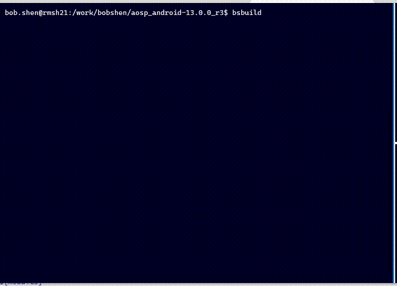

# bsbuild ver:0.9

自 SDM8250 项目开始，编译方法越来越繁琐，需要在正式开始编译前配置一系列的环境变量，因此导致开发者对编译方法的困惑。于此，推出了 bsbuild 0.1 版本，其目的在于为开发者提供集成化的编译环境，屏蔽一系列的预先配置，顺利完成想要的编译。

bsbuild 0.1 版本是纯shell脚本的，当新项目启动时，需要修改代码以适配各个项目，于是推出0.9版本，该版本从shell迁移到python，通过配置文件实现对不同项目的编译支持。同时提供 UI 操作界面，更易于操作。

## 实现原理

### 模块图

下图每个大模块对应到代码中的一个目录，主要分四个部分：

* core：核心模块，处理数据加载，页面调度，按键传达等事务
* ui：提供操作界面
* res：系统配置文件，为每个项目提供独立配置
* util：系统层面的库，功能的集合

<pre>
<img src="data:image/svg+xml;base64,PHN2ZyB4bWxucz0iaHR0cDovL3d3dy53My5vcmcvMjAwMC9zdmciIHhtbG5zOnhsaW5rPSJodHRwOi8vd3d3LnczLm9yZy8xOTk5L3hsaW5rIiB2ZXJzaW9uPSIxLjEiIHdpZHRoPSI3MjciIGhlaWdodD0iMzA3IiB2aWV3Qm94PSItMC41IC0wLjUgNzI3IDMwNyIgY29udGVudD0iJmx0O214ZmlsZSBob3N0PSZxdW90O2FwcC5kaWFncmFtcy5uZXQmcXVvdDsgbW9kaWZpZWQ9JnF1b3Q7MjAyMS0wNy0xNVQxMTo0MDo0Ny45ODdaJnF1b3Q7IGFnZW50PSZxdW90OzUuMCAoV2luZG93cyBOVCAxMC4wOyBXaW42NDsgeDY0KSBBcHBsZVdlYktpdC81MzcuMzYgKEtIVE1MLCBsaWtlIEdlY2tvKSBDaHJvbWUvOTEuMC40NDcyLjEyNCBTYWZhcmkvNTM3LjM2JnF1b3Q7IGV0YWc9JnF1b3Q7ZlBLdUNqUWlHRlZLS09KWnM1QjYmcXVvdDsgdmVyc2lvbj0mcXVvdDsxNC44LjUmcXVvdDsgdHlwZT0mcXVvdDticm93c2VyJnF1b3Q7Jmd0OyZsdDtkaWFncmFtIGlkPSZxdW90O1dCRGxoel8xQmdzelBGWG9BSFl5JnF1b3Q7IG5hbWU9JnF1b3Q7UGFnZS0xJnF1b3Q7Jmd0OzNabFpiOXM0RU1jL2pSKzNrS2pUajRsenRHZ0xCSENCVFI5cGFTeXpvVVdCcHEvOTlFdEt0SFdRTWR5dUpUdXI1SUVjM3YvZmNEeXlSOTVrdVh2bXVGaDhaeW5RRVhMUzNjaDdHQ0hrK2dpTjFMK1Q3aXRMNUlhVkllTWsxWjFxdzVUOEE5cm9hT3VhcExCcWRSU01VVUdLdGpGaGVRNkphTmt3NTJ5cnUrbnA1b3kyVnkxd0JvWmhtbUJxV3Y4bXFWaG9xeHVPNjRiUFFMS0ZYanBHVWRVd3c4bGJ4dGs2MSt2bExJZXFaWWtQMCtoTnJSWTRaZHZHZXQ3anlKdHd4a1JWWXJOZjZtaklvWGdtNVMzN1ZTTVBFanJIVWN2ZEJLaEU4RlJWWlVHUGJyVTZIZTFYWW44NDhPRllISExSM09YVE96UGs3dXZERC83MmZKZVRyNFR0NHBmTmxQK0ZOT1FOcG1zOTc1b1lTNVhxZ0pySEdYbjMyd1VSTUMxd29scTMwcHVrYlNHVzZyeXVMRzZBQ3lLNTNGR1M1ZEltbU9vd0o1Uk9HR1c4bk5HYnp5Rk1FbWxmQ2M3ZW9OR1NSdU9abzViUkc1T3p3YTZEdUQ2eTI5RHpHZGdTQk4vTExucEFvTGxwbC9aMWRWdjdSM1JBdTJpNmhyWmg3WkxaY1dMVTVLVVYvZzIxM2JHcHRpQjBDTDBEOVdmVE95d2ZOWUxsb21Hdm5zdHc4T00yQ05kQ0FvMHRKSkRUR3dxREJKZlI2eitCVUFJKzRTV2g2cFNmZ1c1QWNkRU5PbUM2VXFWN3JFa2xVajdnTmlneG1ua1ZsRGJHTklBNDlkK0ZmdmtyY3dUUUlPWEdGbEpIcEJjbjVSdWtFc2JoWmxETjRzQVBITXVOaXhNb0kxeHZxTHFzckxmS0hmUldSUVlXU09XbnRLNHlMaFlzWXptbWo3WDF2ZzJ1N3ZPTkthRktYTDlBaUwzR2d0ZUN0V0hDam9qWFJ2bW5tdXBUb0dzUE96MXpXZGtmS3JrODdtdmRVVlYvTnR2cVlXWHRNSzQ2bnpyVWFXaFNBN2JtQ1p6UUt0QkpFdVlaaUZPUkN0bTlnQVBGZ216YUc3RVIxVU5mR01sRnczdkN6azFIUVh1S2FtTjZWTWN2anR2NGMxY0pqR3Q5djVxdENVM3Zpb0xLK3lJSXl6OFYreFAzM0Qzam5uZkNKNFo0YnMwNndpU0cyYnlYRUdxN2x0WVEybHNFalEycGNhTGtIU2lHZGhJTHAzek9pcTNIcmtiMnFKN0wwUExDb0kwck5uRU5TdXNRc1J1NFJpaWtRZ2xVWUFrdHpGUjVJbFdGblRnMHlhV2FyWmROS1pja1RjdFkzWVBla3ZLVjlUWlRRYW50U21BZDl6NkdpbGYzV21Tb3VNUzVmT2ZtUFlsNGxkQ08vakJZOUpjZHUyWjZiSXNXQ2N2bkpCczJXRnlGMEJuUnhmV0RJUytHbWVqWUFLMFNUb3FQRjgzUENFTUR5eDNab3JuMGZabWhGTUJQWjVSWEZqTndPaW01TFhPMHZkRDFwNmFaT2o0UkN0UDlTc0R5QXlnYW9qTVU5WVpVRkpuWjNUZVc5U2RpSndpRG13WVEyWUx3T0l3OEhGNUlkci96Q21RTEM0TTZNaktUdk1wOUg0QkNoZ1VNUm1Db2Q5QXpDQXpyK0dhQytCMlQvRVdtaVA4ejdhTzI5SkZGK1hCUTViMTNQaEw3MWY0Q1NpTC8xcVEwcysyNzhxdVVtNWZTUjdjbXBaa1gvNENkK0pJWGEzSHphZ2Jqd2RTVTFmb0g1dXJMMS9vSGZPL3hYdz09Jmx0Oy9kaWFncmFtJmd0OyZsdDsvbXhmaWxlJmd0OyI+PGRlZnM+PGZpbHRlciBpZD0iZHJvcFNoYWRvdyI+PGZlR2F1c3NpYW5CbHVyIGluPSJTb3VyY2VBbHBoYSIgc3RkRGV2aWF0aW9uPSIxLjciIHJlc3VsdD0iYmx1ciIvPjxmZU9mZnNldCBpbj0iYmx1ciIgZHg9IjMiIGR5PSIzIiByZXN1bHQ9Im9mZnNldEJsdXIiLz48ZmVGbG9vZCBmbG9vZC1jb2xvcj0iIzNENDU3NCIgZmxvb2Qtb3BhY2l0eT0iMC40IiByZXN1bHQ9Im9mZnNldENvbG9yIi8+PGZlQ29tcG9zaXRlIGluPSJvZmZzZXRDb2xvciIgaW4yPSJvZmZzZXRCbHVyIiBvcGVyYXRvcj0iaW4iIHJlc3VsdD0ib2Zmc2V0Qmx1ciIvPjxmZUJsZW5kIGluPSJTb3VyY2VHcmFwaGljIiBpbjI9Im9mZnNldEJsdXIiLz48L2ZpbHRlcj48L2RlZnM+PGcgZmlsdGVyPSJ1cmwoI2Ryb3BTaGFkb3cpIj48cmVjdCB4PSIwIiB5PSIwIiB3aWR0aD0iNzIwIiBoZWlnaHQ9IjgwIiBmaWxsPSIjZmZlNmNjIiBzdHJva2U9IiNkNzliMDAiIHBvaW50ZXItZXZlbnRzPSJhbGwiLz48ZyB0cmFuc2Zvcm09InRyYW5zbGF0ZSgtMC41IC0wLjUpIj48c3dpdGNoPjxmb3JlaWduT2JqZWN0IHN0eWxlPSJvdmVyZmxvdzogdmlzaWJsZTsgdGV4dC1hbGlnbjogbGVmdDsiIHBvaW50ZXItZXZlbnRzPSJub25lIiB3aWR0aD0iMTAwJSIgaGVpZ2h0PSIxMDAlIiByZXF1aXJlZEZlYXR1cmVzPSJodHRwOi8vd3d3LnczLm9yZy9UUi9TVkcxMS9mZWF0dXJlI0V4dGVuc2liaWxpdHkiPjxkaXYgeG1sbnM9Imh0dHA6Ly93d3cudzMub3JnLzE5OTkveGh0bWwiIHN0eWxlPSJkaXNwbGF5OiBmbGV4OyBhbGlnbi1pdGVtczogdW5zYWZlIGZsZXgtc3RhcnQ7IGp1c3RpZnktY29udGVudDogdW5zYWZlIGNlbnRlcjsgd2lkdGg6IDcxOHB4OyBoZWlnaHQ6IDFweDsgcGFkZGluZy10b3A6IDdweDsgbWFyZ2luLWxlZnQ6IDFweDsiPjxkaXYgc3R5bGU9ImJveC1zaXppbmc6IGJvcmRlci1ib3g7IGZvbnQtc2l6ZTogMDsgdGV4dC1hbGlnbjogY2VudGVyOyAiPjxkaXYgc3R5bGU9ImRpc3BsYXk6IGlubGluZS1ibG9jazsgZm9udC1zaXplOiAxMnB4OyBmb250LWZhbWlseTogSGVsdmV0aWNhOyBjb2xvcjogIzAwMDAwMDsgbGluZS1oZWlnaHQ6IDEuMjsgcG9pbnRlci1ldmVudHM6IGFsbDsgd2hpdGUtc3BhY2U6IG5vcm1hbDsgd29yZC13cmFwOiBub3JtYWw7ICI+dWk8L2Rpdj48L2Rpdj48L2Rpdj48L2ZvcmVpZ25PYmplY3Q+PHRleHQgeD0iMzYwIiB5PSIxOSIgZmlsbD0iIzAwMDAwMCIgZm9udC1mYW1pbHk9IkhlbHZldGljYSIgZm9udC1zaXplPSIxMnB4IiB0ZXh0LWFuY2hvcj0ibWlkZGxlIj51aTwvdGV4dD48L3N3aXRjaD48L2c+PHJlY3QgeD0iNDMwIiB5PSIxMDAiIHdpZHRoPSIyOTAiIGhlaWdodD0iMjAwIiBmaWxsPSIjZjVmNWY1IiBzdHJva2U9IiM2NjY2NjYiIHBvaW50ZXItZXZlbnRzPSJhbGwiLz48ZyB0cmFuc2Zvcm09InRyYW5zbGF0ZSgtMC41IC0wLjUpIj48c3dpdGNoPjxmb3JlaWduT2JqZWN0IHN0eWxlPSJvdmVyZmxvdzogdmlzaWJsZTsgdGV4dC1hbGlnbjogbGVmdDsiIHBvaW50ZXItZXZlbnRzPSJub25lIiB3aWR0aD0iMTAwJSIgaGVpZ2h0PSIxMDAlIiByZXF1aXJlZEZlYXR1cmVzPSJodHRwOi8vd3d3LnczLm9yZy9UUi9TVkcxMS9mZWF0dXJlI0V4dGVuc2liaWxpdHkiPjxkaXYgeG1sbnM9Imh0dHA6Ly93d3cudzMub3JnLzE5OTkveGh0bWwiIHN0eWxlPSJkaXNwbGF5OiBmbGV4OyBhbGlnbi1pdGVtczogdW5zYWZlIGZsZXgtc3RhcnQ7IGp1c3RpZnktY29udGVudDogdW5zYWZlIGNlbnRlcjsgd2lkdGg6IDI4OHB4OyBoZWlnaHQ6IDFweDsgcGFkZGluZy10b3A6IDEwN3B4OyBtYXJnaW4tbGVmdDogNDMxcHg7Ij48ZGl2IHN0eWxlPSJib3gtc2l6aW5nOiBib3JkZXItYm94OyBmb250LXNpemU6IDA7IHRleHQtYWxpZ246IGNlbnRlcjsgIj48ZGl2IHN0eWxlPSJkaXNwbGF5OiBpbmxpbmUtYmxvY2s7IGZvbnQtc2l6ZTogMTJweDsgZm9udC1mYW1pbHk6IEhlbHZldGljYTsgY29sb3I6ICMzMzMzMzM7IGxpbmUtaGVpZ2h0OiAxLjI7IHBvaW50ZXItZXZlbnRzOiBhbGw7IHdoaXRlLXNwYWNlOiBub3JtYWw7IHdvcmQtd3JhcDogbm9ybWFsOyAiPnV0aWw8L2Rpdj48L2Rpdj48L2Rpdj48L2ZvcmVpZ25PYmplY3Q+PHRleHQgeD0iNTc1IiB5PSIxMTkiIGZpbGw9IiMzMzMzMzMiIGZvbnQtZmFtaWx5PSJIZWx2ZXRpY2EiIGZvbnQtc2l6ZT0iMTJweCIgdGV4dC1hbmNob3I9Im1pZGRsZSI+dXRpbDwvdGV4dD48L3N3aXRjaD48L2c+PHJlY3QgeD0iMCIgeT0iMTYwIiB3aWR0aD0iMTgwIiBoZWlnaHQ9IjE0MCIgZmlsbD0iI2Q1ZThkNCIgc3Ryb2tlPSIjODJiMzY2IiBwb2ludGVyLWV2ZW50cz0iYWxsIi8+PGcgdHJhbnNmb3JtPSJ0cmFuc2xhdGUoLTAuNSAtMC41KSI+PHN3aXRjaD48Zm9yZWlnbk9iamVjdCBzdHlsZT0ib3ZlcmZsb3c6IHZpc2libGU7IHRleHQtYWxpZ246IGxlZnQ7IiBwb2ludGVyLWV2ZW50cz0ibm9uZSIgd2lkdGg9IjEwMCUiIGhlaWdodD0iMTAwJSIgcmVxdWlyZWRGZWF0dXJlcz0iaHR0cDovL3d3dy53My5vcmcvVFIvU1ZHMTEvZmVhdHVyZSNFeHRlbnNpYmlsaXR5Ij48ZGl2IHhtbG5zPSJodHRwOi8vd3d3LnczLm9yZy8xOTk5L3hodG1sIiBzdHlsZT0iZGlzcGxheTogZmxleDsgYWxpZ24taXRlbXM6IHVuc2FmZSBmbGV4LXN0YXJ0OyBqdXN0aWZ5LWNvbnRlbnQ6IHVuc2FmZSBjZW50ZXI7IHdpZHRoOiAxNzhweDsgaGVpZ2h0OiAxcHg7IHBhZGRpbmctdG9wOiAxNjdweDsgbWFyZ2luLWxlZnQ6IDFweDsiPjxkaXYgc3R5bGU9ImJveC1zaXppbmc6IGJvcmRlci1ib3g7IGZvbnQtc2l6ZTogMDsgdGV4dC1hbGlnbjogY2VudGVyOyAiPjxkaXYgc3R5bGU9ImRpc3BsYXk6IGlubGluZS1ibG9jazsgZm9udC1zaXplOiAxMnB4OyBmb250LWZhbWlseTogSGVsdmV0aWNhOyBjb2xvcjogIzAwMDAwMDsgbGluZS1oZWlnaHQ6IDEuMjsgcG9pbnRlci1ldmVudHM6IGFsbDsgd2hpdGUtc3BhY2U6IG5vcm1hbDsgd29yZC13cmFwOiBub3JtYWw7ICI+cmVzPC9kaXY+PC9kaXY+PC9kaXY+PC9mb3JlaWduT2JqZWN0Pjx0ZXh0IHg9IjkwIiB5PSIxNzkiIGZpbGw9IiMwMDAwMDAiIGZvbnQtZmFtaWx5PSJIZWx2ZXRpY2EiIGZvbnQtc2l6ZT0iMTJweCIgdGV4dC1hbmNob3I9Im1pZGRsZSI+cmVzPC90ZXh0Pjwvc3dpdGNoPjwvZz48cmVjdCB4PSIyMDAiIHk9IjEwMCIgd2lkdGg9IjIxMCIgaGVpZ2h0PSIyMDAiIGZpbGw9IiNmOGNlY2MiIHN0cm9rZT0iI2I4NTQ1MCIgcG9pbnRlci1ldmVudHM9ImFsbCIvPjxnIHRyYW5zZm9ybT0idHJhbnNsYXRlKC0wLjUgLTAuNSkiPjxzd2l0Y2g+PGZvcmVpZ25PYmplY3Qgc3R5bGU9Im92ZXJmbG93OiB2aXNpYmxlOyB0ZXh0LWFsaWduOiBsZWZ0OyIgcG9pbnRlci1ldmVudHM9Im5vbmUiIHdpZHRoPSIxMDAlIiBoZWlnaHQ9IjEwMCUiIHJlcXVpcmVkRmVhdHVyZXM9Imh0dHA6Ly93d3cudzMub3JnL1RSL1NWRzExL2ZlYXR1cmUjRXh0ZW5zaWJpbGl0eSI+PGRpdiB4bWxucz0iaHR0cDovL3d3dy53My5vcmcvMTk5OS94aHRtbCIgc3R5bGU9ImRpc3BsYXk6IGZsZXg7IGFsaWduLWl0ZW1zOiB1bnNhZmUgZmxleC1zdGFydDsganVzdGlmeS1jb250ZW50OiB1bnNhZmUgY2VudGVyOyB3aWR0aDogMjA4cHg7IGhlaWdodDogMXB4OyBwYWRkaW5nLXRvcDogMTA3cHg7IG1hcmdpbi1sZWZ0OiAyMDFweDsiPjxkaXYgc3R5bGU9ImJveC1zaXppbmc6IGJvcmRlci1ib3g7IGZvbnQtc2l6ZTogMDsgdGV4dC1hbGlnbjogY2VudGVyOyAiPjxkaXYgc3R5bGU9ImRpc3BsYXk6IGlubGluZS1ibG9jazsgZm9udC1zaXplOiAxMnB4OyBmb250LWZhbWlseTogSGVsdmV0aWNhOyBjb2xvcjogIzAwMDAwMDsgbGluZS1oZWlnaHQ6IDEuMjsgcG9pbnRlci1ldmVudHM6IGFsbDsgd2hpdGUtc3BhY2U6IG5vcm1hbDsgd29yZC13cmFwOiBub3JtYWw7ICI+Y29yZTwvZGl2PjwvZGl2PjwvZGl2PjwvZm9yZWlnbk9iamVjdD48dGV4dCB4PSIzMDUiIHk9IjExOSIgZmlsbD0iIzAwMDAwMCIgZm9udC1mYW1pbHk9IkhlbHZldGljYSIgZm9udC1zaXplPSIxMnB4IiB0ZXh0LWFuY2hvcj0ibWlkZGxlIj5jb3JlPC90ZXh0Pjwvc3dpdGNoPjwvZz48cGF0aCBkPSJNIDE4MCAxMjAgTCAyNTUgMTIwIEwgMjU1IDEzMy42MyIgZmlsbD0ibm9uZSIgc3Ryb2tlPSIjMDAwMDAwIiBzdHJva2UtbWl0ZXJsaW1pdD0iMTAiIHBvaW50ZXItZXZlbnRzPSJzdHJva2UiLz48cGF0aCBkPSJNIDI1NSAxMzguODggTCAyNTEuNSAxMzEuODggTCAyNTUgMTMzLjYzIEwgMjU4LjUgMTMxLjg4IFoiIGZpbGw9IiMwMDAwMDAiIHN0cm9rZT0iIzAwMDAwMCIgc3Ryb2tlLW1pdGVybGltaXQ9IjEwIiBwb2ludGVyLWV2ZW50cz0iYWxsIi8+PHJlY3QgeD0iMCIgeT0iMTAwIiB3aWR0aD0iMTgwIiBoZWlnaHQ9IjQwIiByeD0iNiIgcnk9IjYiIGZpbGw9IiNkYWU4ZmMiIHN0cm9rZT0iIzZjOGViZiIgcG9pbnRlci1ldmVudHM9ImFsbCIvPjxnIHRyYW5zZm9ybT0idHJhbnNsYXRlKC0wLjUgLTAuNSkiPjxzd2l0Y2g+PGZvcmVpZ25PYmplY3Qgc3R5bGU9Im92ZXJmbG93OiB2aXNpYmxlOyB0ZXh0LWFsaWduOiBsZWZ0OyIgcG9pbnRlci1ldmVudHM9Im5vbmUiIHdpZHRoPSIxMDAlIiBoZWlnaHQ9IjEwMCUiIHJlcXVpcmVkRmVhdHVyZXM9Imh0dHA6Ly93d3cudzMub3JnL1RSL1NWRzExL2ZlYXR1cmUjRXh0ZW5zaWJpbGl0eSI+PGRpdiB4bWxucz0iaHR0cDovL3d3dy53My5vcmcvMTk5OS94aHRtbCIgc3R5bGU9ImRpc3BsYXk6IGZsZXg7IGFsaWduLWl0ZW1zOiB1bnNhZmUgY2VudGVyOyBqdXN0aWZ5LWNvbnRlbnQ6IHVuc2FmZSBjZW50ZXI7IHdpZHRoOiAxNzhweDsgaGVpZ2h0OiAxcHg7IHBhZGRpbmctdG9wOiAxMjBweDsgbWFyZ2luLWxlZnQ6IDFweDsiPjxkaXYgc3R5bGU9ImJveC1zaXppbmc6IGJvcmRlci1ib3g7IGZvbnQtc2l6ZTogMDsgdGV4dC1hbGlnbjogY2VudGVyOyAiPjxkaXYgc3R5bGU9ImRpc3BsYXk6IGlubGluZS1ibG9jazsgZm9udC1zaXplOiAxMnB4OyBmb250LWZhbWlseTogSGVsdmV0aWNhOyBjb2xvcjogIzAwMDAwMDsgbGluZS1oZWlnaHQ6IDEuMjsgcG9pbnRlci1ldmVudHM6IGFsbDsgd2hpdGUtc3BhY2U6IG5vcm1hbDsgd29yZC13cmFwOiBub3JtYWw7ICI+QnNidWlsZEFwcGxpY2F0aW9uLnB5PC9kaXY+PC9kaXY+PC9kaXY+PC9mb3JlaWduT2JqZWN0Pjx0ZXh0IHg9IjkwIiB5PSIxMjQiIGZpbGw9IiMwMDAwMDAiIGZvbnQtZmFtaWx5PSJIZWx2ZXRpY2EiIGZvbnQtc2l6ZT0iMTJweCIgdGV4dC1hbmNob3I9Im1pZGRsZSI+QnNidWlsZEFwcGxpY2F0aW9uLnB5PC90ZXh0Pjwvc3dpdGNoPjwvZz48cmVjdCB4PSIzMTUiIHk9IjE0MCIgd2lkdGg9IjgwIiBoZWlnaHQ9IjQwIiBmaWxsPSIjZmZmZmZmIiBzdHJva2U9IiMwMDAwMDAiIHBvaW50ZXItZXZlbnRzPSJhbGwiLz48ZyB0cmFuc2Zvcm09InRyYW5zbGF0ZSgtMC41IC0wLjUpIj48c3dpdGNoPjxmb3JlaWduT2JqZWN0IHN0eWxlPSJvdmVyZmxvdzogdmlzaWJsZTsgdGV4dC1hbGlnbjogbGVmdDsiIHBvaW50ZXItZXZlbnRzPSJub25lIiB3aWR0aD0iMTAwJSIgaGVpZ2h0PSIxMDAlIiByZXF1aXJlZEZlYXR1cmVzPSJodHRwOi8vd3d3LnczLm9yZy9UUi9TVkcxMS9mZWF0dXJlI0V4dGVuc2liaWxpdHkiPjxkaXYgeG1sbnM9Imh0dHA6Ly93d3cudzMub3JnLzE5OTkveGh0bWwiIHN0eWxlPSJkaXNwbGF5OiBmbGV4OyBhbGlnbi1pdGVtczogdW5zYWZlIGNlbnRlcjsganVzdGlmeS1jb250ZW50OiB1bnNhZmUgY2VudGVyOyB3aWR0aDogNzhweDsgaGVpZ2h0OiAxcHg7IHBhZGRpbmctdG9wOiAxNjBweDsgbWFyZ2luLWxlZnQ6IDMxNnB4OyI+PGRpdiBzdHlsZT0iYm94LXNpemluZzogYm9yZGVyLWJveDsgZm9udC1zaXplOiAwOyB0ZXh0LWFsaWduOiBjZW50ZXI7ICI+PGRpdiBzdHlsZT0iZGlzcGxheTogaW5saW5lLWJsb2NrOyBmb250LXNpemU6IDEycHg7IGZvbnQtZmFtaWx5OiBIZWx2ZXRpY2E7IGNvbG9yOiAjMDAwMDAwOyBsaW5lLWhlaWdodDogMS4yOyBwb2ludGVyLWV2ZW50czogYWxsOyB3aGl0ZS1zcGFjZTogbm9ybWFsOyB3b3JkLXdyYXA6IG5vcm1hbDsgIj5hY3Rpb248L2Rpdj48L2Rpdj48L2Rpdj48L2ZvcmVpZ25PYmplY3Q+PHRleHQgeD0iMzU1IiB5PSIxNjQiIGZpbGw9IiMwMDAwMDAiIGZvbnQtZmFtaWx5PSJIZWx2ZXRpY2EiIGZvbnQtc2l6ZT0iMTJweCIgdGV4dC1hbmNob3I9Im1pZGRsZSI+YWN0aW9uPC90ZXh0Pjwvc3dpdGNoPjwvZz48cmVjdCB4PSIzMTUiIHk9IjE5MCIgd2lkdGg9IjgwIiBoZWlnaHQ9IjQwIiBmaWxsPSIjZmZmZmZmIiBzdHJva2U9IiMwMDAwMDAiIHBvaW50ZXItZXZlbnRzPSJhbGwiLz48ZyB0cmFuc2Zvcm09InRyYW5zbGF0ZSgtMC41IC0wLjUpIj48c3dpdGNoPjxmb3JlaWduT2JqZWN0IHN0eWxlPSJvdmVyZmxvdzogdmlzaWJsZTsgdGV4dC1hbGlnbjogbGVmdDsiIHBvaW50ZXItZXZlbnRzPSJub25lIiB3aWR0aD0iMTAwJSIgaGVpZ2h0PSIxMDAlIiByZXF1aXJlZEZlYXR1cmVzPSJodHRwOi8vd3d3LnczLm9yZy9UUi9TVkcxMS9mZWF0dXJlI0V4dGVuc2liaWxpdHkiPjxkaXYgeG1sbnM9Imh0dHA6Ly93d3cudzMub3JnLzE5OTkveGh0bWwiIHN0eWxlPSJkaXNwbGF5OiBmbGV4OyBhbGlnbi1pdGVtczogdW5zYWZlIGNlbnRlcjsganVzdGlmeS1jb250ZW50OiB1bnNhZmUgY2VudGVyOyB3aWR0aDogNzhweDsgaGVpZ2h0OiAxcHg7IHBhZGRpbmctdG9wOiAyMTBweDsgbWFyZ2luLWxlZnQ6IDMxNnB4OyI+PGRpdiBzdHlsZT0iYm94LXNpemluZzogYm9yZGVyLWJveDsgZm9udC1zaXplOiAwOyB0ZXh0LWFsaWduOiBjZW50ZXI7ICI+PGRpdiBzdHlsZT0iZGlzcGxheTogaW5saW5lLWJsb2NrOyBmb250LXNpemU6IDEycHg7IGZvbnQtZmFtaWx5OiBIZWx2ZXRpY2E7IGNvbG9yOiAjMDAwMDAwOyBsaW5lLWhlaWdodDogMS4yOyBwb2ludGVyLWV2ZW50czogYWxsOyB3aGl0ZS1zcGFjZTogbm9ybWFsOyB3b3JkLXdyYXA6IG5vcm1hbDsgIj48c3Bhbj5Db250ZXh0PC9zcGFuPjwvZGl2PjwvZGl2PjwvZGl2PjwvZm9yZWlnbk9iamVjdD48dGV4dCB4PSIzNTUiIHk9IjIxNCIgZmlsbD0iIzAwMDAwMCIgZm9udC1mYW1pbHk9IkhlbHZldGljYSIgZm9udC1zaXplPSIxMnB4IiB0ZXh0LWFuY2hvcj0ibWlkZGxlIj5Db250ZXh0PC90ZXh0Pjwvc3dpdGNoPjwvZz48cmVjdCB4PSIzMTUiIHk9IjI0MCIgd2lkdGg9IjgwIiBoZWlnaHQ9IjQwIiBmaWxsPSIjZmZmZmZmIiBzdHJva2U9IiMwMDAwMDAiIHBvaW50ZXItZXZlbnRzPSJhbGwiLz48ZyB0cmFuc2Zvcm09InRyYW5zbGF0ZSgtMC41IC0wLjUpIj48c3dpdGNoPjxmb3JlaWduT2JqZWN0IHN0eWxlPSJvdmVyZmxvdzogdmlzaWJsZTsgdGV4dC1hbGlnbjogbGVmdDsiIHBvaW50ZXItZXZlbnRzPSJub25lIiB3aWR0aD0iMTAwJSIgaGVpZ2h0PSIxMDAlIiByZXF1aXJlZEZlYXR1cmVzPSJodHRwOi8vd3d3LnczLm9yZy9UUi9TVkcxMS9mZWF0dXJlI0V4dGVuc2liaWxpdHkiPjxkaXYgeG1sbnM9Imh0dHA6Ly93d3cudzMub3JnLzE5OTkveGh0bWwiIHN0eWxlPSJkaXNwbGF5OiBmbGV4OyBhbGlnbi1pdGVtczogdW5zYWZlIGNlbnRlcjsganVzdGlmeS1jb250ZW50OiB1bnNhZmUgY2VudGVyOyB3aWR0aDogNzhweDsgaGVpZ2h0OiAxcHg7IHBhZGRpbmctdG9wOiAyNjBweDsgbWFyZ2luLWxlZnQ6IDMxNnB4OyI+PGRpdiBzdHlsZT0iYm94LXNpemluZzogYm9yZGVyLWJveDsgZm9udC1zaXplOiAwOyB0ZXh0LWFsaWduOiBjZW50ZXI7ICI+PGRpdiBzdHlsZT0iZGlzcGxheTogaW5saW5lLWJsb2NrOyBmb250LXNpemU6IDEycHg7IGZvbnQtZmFtaWx5OiBIZWx2ZXRpY2E7IGNvbG9yOiAjMDAwMDAwOyBsaW5lLWhlaWdodDogMS4yOyBwb2ludGVyLWV2ZW50czogYWxsOyB3aGl0ZS1zcGFjZTogbm9ybWFsOyB3b3JkLXdyYXA6IG5vcm1hbDsgIj5Db25zdGFudDwvZGl2PjwvZGl2PjwvZGl2PjwvZm9yZWlnbk9iamVjdD48dGV4dCB4PSIzNTUiIHk9IjI2NCIgZmlsbD0iIzAwMDAwMCIgZm9udC1mYW1pbHk9IkhlbHZldGljYSIgZm9udC1zaXplPSIxMnB4IiB0ZXh0LWFuY2hvcj0ibWlkZGxlIj5Db25zdGFudDwvdGV4dD48L3N3aXRjaD48L2c+PHJlY3QgeD0iMjE1IiB5PSIxNDAiIHdpZHRoPSI4MCIgaGVpZ2h0PSIxNDAiIGZpbGw9IiNkYWU4ZmMiIHN0cm9rZT0iIzZjOGViZiIgcG9pbnRlci1ldmVudHM9ImFsbCIvPjxnIHRyYW5zZm9ybT0idHJhbnNsYXRlKC0wLjUgLTAuNSkiPjxzd2l0Y2g+PGZvcmVpZ25PYmplY3Qgc3R5bGU9Im92ZXJmbG93OiB2aXNpYmxlOyB0ZXh0LWFsaWduOiBsZWZ0OyIgcG9pbnRlci1ldmVudHM9Im5vbmUiIHdpZHRoPSIxMDAlIiBoZWlnaHQ9IjEwMCUiIHJlcXVpcmVkRmVhdHVyZXM9Imh0dHA6Ly93d3cudzMub3JnL1RSL1NWRzExL2ZlYXR1cmUjRXh0ZW5zaWJpbGl0eSI+PGRpdiB4bWxucz0iaHR0cDovL3d3dy53My5vcmcvMTk5OS94aHRtbCIgc3R5bGU9ImRpc3BsYXk6IGZsZXg7IGFsaWduLWl0ZW1zOiB1bnNhZmUgY2VudGVyOyBqdXN0aWZ5LWNvbnRlbnQ6IHVuc2FmZSBjZW50ZXI7IHdpZHRoOiA3OHB4OyBoZWlnaHQ6IDFweDsgcGFkZGluZy10b3A6IDIxMHB4OyBtYXJnaW4tbGVmdDogMjE2cHg7Ij48ZGl2IHN0eWxlPSJib3gtc2l6aW5nOiBib3JkZXItYm94OyBmb250LXNpemU6IDA7IHRleHQtYWxpZ246IGNlbnRlcjsgIj48ZGl2IHN0eWxlPSJkaXNwbGF5OiBpbmxpbmUtYmxvY2s7IGZvbnQtc2l6ZTogMTJweDsgZm9udC1mYW1pbHk6IEhlbHZldGljYTsgY29sb3I6ICMwMDAwMDA7IGxpbmUtaGVpZ2h0OiAxLjI7IHBvaW50ZXItZXZlbnRzOiBhbGw7IHdoaXRlLXNwYWNlOiBub3JtYWw7IHdvcmQtd3JhcDogbm9ybWFsOyAiPm1hbmFnZXI8L2Rpdj48L2Rpdj48L2Rpdj48L2ZvcmVpZ25PYmplY3Q+PHRleHQgeD0iMjU1IiB5PSIyMTQiIGZpbGw9IiMwMDAwMDAiIGZvbnQtZmFtaWx5PSJIZWx2ZXRpY2EiIGZvbnQtc2l6ZT0iMTJweCIgdGV4dC1hbmNob3I9Im1pZGRsZSI+bWFuYWdlcjwvdGV4dD48L3N3aXRjaD48L2c+PHJlY3QgeD0iMTUiIHk9IjE5MCIgd2lkdGg9IjE0NSIgaGVpZ2h0PSI0MCIgZmlsbD0iI2RhZThmYyIgc3Ryb2tlPSIjNmM4ZWJmIiBwb2ludGVyLWV2ZW50cz0iYWxsIi8+PGcgdHJhbnNmb3JtPSJ0cmFuc2xhdGUoLTAuNSAtMC41KSI+PHN3aXRjaD48Zm9yZWlnbk9iamVjdCBzdHlsZT0ib3ZlcmZsb3c6IHZpc2libGU7IHRleHQtYWxpZ246IGxlZnQ7IiBwb2ludGVyLWV2ZW50cz0ibm9uZSIgd2lkdGg9IjEwMCUiIGhlaWdodD0iMTAwJSIgcmVxdWlyZWRGZWF0dXJlcz0iaHR0cDovL3d3dy53My5vcmcvVFIvU1ZHMTEvZmVhdHVyZSNFeHRlbnNpYmlsaXR5Ij48ZGl2IHhtbG5zPSJodHRwOi8vd3d3LnczLm9yZy8xOTk5L3hodG1sIiBzdHlsZT0iZGlzcGxheTogZmxleDsgYWxpZ24taXRlbXM6IHVuc2FmZSBjZW50ZXI7IGp1c3RpZnktY29udGVudDogdW5zYWZlIGNlbnRlcjsgd2lkdGg6IDE0M3B4OyBoZWlnaHQ6IDFweDsgcGFkZGluZy10b3A6IDIxMHB4OyBtYXJnaW4tbGVmdDogMTZweDsiPjxkaXYgc3R5bGU9ImJveC1zaXppbmc6IGJvcmRlci1ib3g7IGZvbnQtc2l6ZTogMDsgdGV4dC1hbGlnbjogY2VudGVyOyAiPjxkaXYgc3R5bGU9ImRpc3BsYXk6IGlubGluZS1ibG9jazsgZm9udC1zaXplOiAxMnB4OyBmb250LWZhbWlseTogSGVsdmV0aWNhOyBjb2xvcjogIzAwMDAwMDsgbGluZS1oZWlnaHQ6IDEuMjsgcG9pbnRlci1ldmVudHM6IGFsbDsgd2hpdGUtc3BhY2U6IG5vcm1hbDsgd29yZC13cmFwOiBub3JtYWw7ICI+PHNwYW4+Y29uZmlnPC9zcGFuPjwvZGl2PjwvZGl2PjwvZGl2PjwvZm9yZWlnbk9iamVjdD48dGV4dCB4PSI4OCIgeT0iMjE0IiBmaWxsPSIjMDAwMDAwIiBmb250LWZhbWlseT0iSGVsdmV0aWNhIiBmb250LXNpemU9IjEycHgiIHRleHQtYW5jaG9yPSJtaWRkbGUiPmNvbmZpZzwvdGV4dD48L3N3aXRjaD48L2c+PHJlY3QgeD0iMTUiIHk9IjI0MCIgd2lkdGg9IjE0NSIgaGVpZ2h0PSI0MCIgZmlsbD0iI2ZmZmZmZiIgc3Ryb2tlPSIjMDAwMDAwIiBwb2ludGVyLWV2ZW50cz0iYWxsIi8+PGcgdHJhbnNmb3JtPSJ0cmFuc2xhdGUoLTAuNSAtMC41KSI+PHN3aXRjaD48Zm9yZWlnbk9iamVjdCBzdHlsZT0ib3ZlcmZsb3c6IHZpc2libGU7IHRleHQtYWxpZ246IGxlZnQ7IiBwb2ludGVyLWV2ZW50cz0ibm9uZSIgd2lkdGg9IjEwMCUiIGhlaWdodD0iMTAwJSIgcmVxdWlyZWRGZWF0dXJlcz0iaHR0cDovL3d3dy53My5vcmcvVFIvU1ZHMTEvZmVhdHVyZSNFeHRlbnNpYmlsaXR5Ij48ZGl2IHhtbG5zPSJodHRwOi8vd3d3LnczLm9yZy8xOTk5L3hodG1sIiBzdHlsZT0iZGlzcGxheTogZmxleDsgYWxpZ24taXRlbXM6IHVuc2FmZSBjZW50ZXI7IGp1c3RpZnktY29udGVudDogdW5zYWZlIGNlbnRlcjsgd2lkdGg6IDE0M3B4OyBoZWlnaHQ6IDFweDsgcGFkZGluZy10b3A6IDI2MHB4OyBtYXJnaW4tbGVmdDogMTZweDsiPjxkaXYgc3R5bGU9ImJveC1zaXppbmc6IGJvcmRlci1ib3g7IGZvbnQtc2l6ZTogMDsgdGV4dC1hbGlnbjogY2VudGVyOyAiPjxkaXYgc3R5bGU9ImRpc3BsYXk6IGlubGluZS1ibG9jazsgZm9udC1zaXplOiAxMnB4OyBmb250LWZhbWlseTogSGVsdmV0aWNhOyBjb2xvcjogIzAwMDAwMDsgbGluZS1oZWlnaHQ6IDEuMjsgcG9pbnRlci1ldmVudHM6IGFsbDsgd2hpdGUtc3BhY2U6IG5vcm1hbDsgd29yZC13cmFwOiBub3JtYWw7ICI+PHNwYW4+c2NyaXB0PC9zcGFuPjwvZGl2PjwvZGl2PjwvZGl2PjwvZm9yZWlnbk9iamVjdD48dGV4dCB4PSI4OCIgeT0iMjY0IiBmaWxsPSIjMDAwMDAwIiBmb250LWZhbWlseT0iSGVsdmV0aWNhIiBmb250LXNpemU9IjEycHgiIHRleHQtYW5jaG9yPSJtaWRkbGUiPnNjcmlwdDwvdGV4dD48L3N3aXRjaD48L2c+PHJlY3QgeD0iNDUwIiB5PSIyMDAiIHdpZHRoPSIxMTAiIGhlaWdodD0iNDAiIGZpbGw9IiNmZmZmZmYiIHN0cm9rZT0iIzAwMDAwMCIgcG9pbnRlci1ldmVudHM9ImFsbCIvPjxnIHRyYW5zZm9ybT0idHJhbnNsYXRlKC0wLjUgLTAuNSkiPjxzd2l0Y2g+PGZvcmVpZ25PYmplY3Qgc3R5bGU9Im92ZXJmbG93OiB2aXNpYmxlOyB0ZXh0LWFsaWduOiBsZWZ0OyIgcG9pbnRlci1ldmVudHM9Im5vbmUiIHdpZHRoPSIxMDAlIiBoZWlnaHQ9IjEwMCUiIHJlcXVpcmVkRmVhdHVyZXM9Imh0dHA6Ly93d3cudzMub3JnL1RSL1NWRzExL2ZlYXR1cmUjRXh0ZW5zaWJpbGl0eSI+PGRpdiB4bWxucz0iaHR0cDovL3d3dy53My5vcmcvMTk5OS94aHRtbCIgc3R5bGU9ImRpc3BsYXk6IGZsZXg7IGFsaWduLWl0ZW1zOiB1bnNhZmUgY2VudGVyOyBqdXN0aWZ5LWNvbnRlbnQ6IHVuc2FmZSBjZW50ZXI7IHdpZHRoOiAxMDhweDsgaGVpZ2h0OiAxcHg7IHBhZGRpbmctdG9wOiAyMjBweDsgbWFyZ2luLWxlZnQ6IDQ1MXB4OyI+PGRpdiBzdHlsZT0iYm94LXNpemluZzogYm9yZGVyLWJveDsgZm9udC1zaXplOiAwOyB0ZXh0LWFsaWduOiBjZW50ZXI7ICI+PGRpdiBzdHlsZT0iZGlzcGxheTogaW5saW5lLWJsb2NrOyBmb250LXNpemU6IDEycHg7IGZvbnQtZmFtaWx5OiBIZWx2ZXRpY2E7IGNvbG9yOiAjMDAwMDAwOyBsaW5lLWhlaWdodDogMS4yOyBwb2ludGVyLWV2ZW50czogYWxsOyB3aGl0ZS1zcGFjZTogbm9ybWFsOyB3b3JkLXdyYXA6IG5vcm1hbDsgIj5Db25maWdIZWxwZXIucHk8L2Rpdj48L2Rpdj48L2Rpdj48L2ZvcmVpZ25PYmplY3Q+PHRleHQgeD0iNTA1IiB5PSIyMjQiIGZpbGw9IiMwMDAwMDAiIGZvbnQtZmFtaWx5PSJIZWx2ZXRpY2EiIGZvbnQtc2l6ZT0iMTJweCIgdGV4dC1hbmNob3I9Im1pZGRsZSI+Q29uZmlnSGVscGVyLnB5PC90ZXh0Pjwvc3dpdGNoPjwvZz48cmVjdCB4PSI1NzAiIHk9IjIwMCIgd2lkdGg9IjEzMCIgaGVpZ2h0PSI0MCIgZmlsbD0iI2ZmZmZmZiIgc3Ryb2tlPSIjMDAwMDAwIiBwb2ludGVyLWV2ZW50cz0iYWxsIi8+PGcgdHJhbnNmb3JtPSJ0cmFuc2xhdGUoLTAuNSAtMC41KSI+PHN3aXRjaD48Zm9yZWlnbk9iamVjdCBzdHlsZT0ib3ZlcmZsb3c6IHZpc2libGU7IHRleHQtYWxpZ246IGxlZnQ7IiBwb2ludGVyLWV2ZW50cz0ibm9uZSIgd2lkdGg9IjEwMCUiIGhlaWdodD0iMTAwJSIgcmVxdWlyZWRGZWF0dXJlcz0iaHR0cDovL3d3dy53My5vcmcvVFIvU1ZHMTEvZmVhdHVyZSNFeHRlbnNpYmlsaXR5Ij48ZGl2IHhtbG5zPSJodHRwOi8vd3d3LnczLm9yZy8xOTk5L3hodG1sIiBzdHlsZT0iZGlzcGxheTogZmxleDsgYWxpZ24taXRlbXM6IHVuc2FmZSBjZW50ZXI7IGp1c3RpZnktY29udGVudDogdW5zYWZlIGNlbnRlcjsgd2lkdGg6IDEyOHB4OyBoZWlnaHQ6IDFweDsgcGFkZGluZy10b3A6IDIyMHB4OyBtYXJnaW4tbGVmdDogNTcxcHg7Ij48ZGl2IHN0eWxlPSJib3gtc2l6aW5nOiBib3JkZXItYm94OyBmb250LXNpemU6IDA7IHRleHQtYWxpZ246IGNlbnRlcjsgIj48ZGl2IHN0eWxlPSJkaXNwbGF5OiBpbmxpbmUtYmxvY2s7IGZvbnQtc2l6ZTogMTJweDsgZm9udC1mYW1pbHk6IEhlbHZldGljYTsgY29sb3I6ICMwMDAwMDA7IGxpbmUtaGVpZ2h0OiAxLjI7IHBvaW50ZXItZXZlbnRzOiBhbGw7IHdoaXRlLXNwYWNlOiBub3JtYWw7IHdvcmQtd3JhcDogbm9ybWFsOyAiPkZpbGVTeXN0ZW1IZWxwZXIucHk8L2Rpdj48L2Rpdj48L2Rpdj48L2ZvcmVpZ25PYmplY3Q+PHRleHQgeD0iNjM1IiB5PSIyMjQiIGZpbGw9IiMwMDAwMDAiIGZvbnQtZmFtaWx5PSJIZWx2ZXRpY2EiIGZvbnQtc2l6ZT0iMTJweCIgdGV4dC1hbmNob3I9Im1pZGRsZSI+RmlsZVN5c3RlbUhlbHBlci5weTwvdGV4dD48L3N3aXRjaD48L2c+PHJlY3QgeD0iNTkwIiB5PSIxNDAiIHdpZHRoPSIxMTAiIGhlaWdodD0iNDAiIGZpbGw9IiNlMWQ1ZTciIHN0cm9rZT0iIzk2NzNhNiIgcG9pbnRlci1ldmVudHM9ImFsbCIvPjxnIHRyYW5zZm9ybT0idHJhbnNsYXRlKC0wLjUgLTAuNSkiPjxzd2l0Y2g+PGZvcmVpZ25PYmplY3Qgc3R5bGU9Im92ZXJmbG93OiB2aXNpYmxlOyB0ZXh0LWFsaWduOiBsZWZ0OyIgcG9pbnRlci1ldmVudHM9Im5vbmUiIHdpZHRoPSIxMDAlIiBoZWlnaHQ9IjEwMCUiIHJlcXVpcmVkRmVhdHVyZXM9Imh0dHA6Ly93d3cudzMub3JnL1RSL1NWRzExL2ZlYXR1cmUjRXh0ZW5zaWJpbGl0eSI+PGRpdiB4bWxucz0iaHR0cDovL3d3dy53My5vcmcvMTk5OS94aHRtbCIgc3R5bGU9ImRpc3BsYXk6IGZsZXg7IGFsaWduLWl0ZW1zOiB1bnNhZmUgY2VudGVyOyBqdXN0aWZ5LWNvbnRlbnQ6IHVuc2FmZSBjZW50ZXI7IHdpZHRoOiAxMDhweDsgaGVpZ2h0OiAxcHg7IHBhZGRpbmctdG9wOiAxNjBweDsgbWFyZ2luLWxlZnQ6IDU5MXB4OyI+PGRpdiBzdHlsZT0iYm94LXNpemluZzogYm9yZGVyLWJveDsgZm9udC1zaXplOiAwOyB0ZXh0LWFsaWduOiBjZW50ZXI7ICI+PGRpdiBzdHlsZT0iZGlzcGxheTogaW5saW5lLWJsb2NrOyBmb250LXNpemU6IDEycHg7IGZvbnQtZmFtaWx5OiBIZWx2ZXRpY2E7IGNvbG9yOiAjMDAwMDAwOyBsaW5lLWhlaWdodDogMS4yOyBwb2ludGVyLWV2ZW50czogYWxsOyB3aGl0ZS1zcGFjZTogbm9ybWFsOyB3b3JkLXdyYXA6IG5vcm1hbDsgIj5Mb2cucHk8L2Rpdj48L2Rpdj48L2Rpdj48L2ZvcmVpZ25PYmplY3Q+PHRleHQgeD0iNjQ1IiB5PSIxNjQiIGZpbGw9IiMwMDAwMDAiIGZvbnQtZmFtaWx5PSJIZWx2ZXRpY2EiIGZvbnQtc2l6ZT0iMTJweCIgdGV4dC1hbmNob3I9Im1pZGRsZSI+TG9nLnB5PC90ZXh0Pjwvc3dpdGNoPjwvZz48cmVjdCB4PSI0NTAiIHk9IjE0MCIgd2lkdGg9IjEzMCIgaGVpZ2h0PSI0MCIgZmlsbD0iI2RhZThmYyIgc3Ryb2tlPSIjNmM4ZWJmIiBwb2ludGVyLWV2ZW50cz0iYWxsIi8+PGcgdHJhbnNmb3JtPSJ0cmFuc2xhdGUoLTAuNSAtMC41KSI+PHN3aXRjaD48Zm9yZWlnbk9iamVjdCBzdHlsZT0ib3ZlcmZsb3c6IHZpc2libGU7IHRleHQtYWxpZ246IGxlZnQ7IiBwb2ludGVyLWV2ZW50cz0ibm9uZSIgd2lkdGg9IjEwMCUiIGhlaWdodD0iMTAwJSIgcmVxdWlyZWRGZWF0dXJlcz0iaHR0cDovL3d3dy53My5vcmcvVFIvU1ZHMTEvZmVhdHVyZSNFeHRlbnNpYmlsaXR5Ij48ZGl2IHhtbG5zPSJodHRwOi8vd3d3LnczLm9yZy8xOTk5L3hodG1sIiBzdHlsZT0iZGlzcGxheTogZmxleDsgYWxpZ24taXRlbXM6IHVuc2FmZSBjZW50ZXI7IGp1c3RpZnktY29udGVudDogdW5zYWZlIGNlbnRlcjsgd2lkdGg6IDEyOHB4OyBoZWlnaHQ6IDFweDsgcGFkZGluZy10b3A6IDE2MHB4OyBtYXJnaW4tbGVmdDogNDUxcHg7Ij48ZGl2IHN0eWxlPSJib3gtc2l6aW5nOiBib3JkZXItYm94OyBmb250LXNpemU6IDA7IHRleHQtYWxpZ246IGNlbnRlcjsgIj48ZGl2IHN0eWxlPSJkaXNwbGF5OiBpbmxpbmUtYmxvY2s7IGZvbnQtc2l6ZTogMTJweDsgZm9udC1mYW1pbHk6IEhlbHZldGljYTsgY29sb3I6ICMwMDAwMDA7IGxpbmUtaGVpZ2h0OiAxLjI7IHBvaW50ZXItZXZlbnRzOiBhbGw7IHdoaXRlLXNwYWNlOiBub3JtYWw7IHdvcmQtd3JhcDogbm9ybWFsOyAiPkhlbHBlckRlbGVnYXRlLnB5PC9kaXY+PC9kaXY+PC9kaXY+PC9mb3JlaWduT2JqZWN0Pjx0ZXh0IHg9IjUxNSIgeT0iMTY0IiBmaWxsPSIjMDAwMDAwIiBmb250LWZhbWlseT0iSGVsdmV0aWNhIiBmb250LXNpemU9IjEycHgiIHRleHQtYW5jaG9yPSJtaWRkbGUiPkhlbHBlckRlbGVnYXRlLnB5PC90ZXh0Pjwvc3dpdGNoPjwvZz48cmVjdCB4PSIyMCIgeT0iMzAiIHdpZHRoPSIxNjAiIGhlaWdodD0iNDAiIGZpbGw9IiNkYWU4ZmMiIHN0cm9rZT0iIzZjOGViZiIgcG9pbnRlci1ldmVudHM9ImFsbCIvPjxnIHRyYW5zZm9ybT0idHJhbnNsYXRlKC0wLjUgLTAuNSkiPjxzd2l0Y2g+PGZvcmVpZ25PYmplY3Qgc3R5bGU9Im92ZXJmbG93OiB2aXNpYmxlOyB0ZXh0LWFsaWduOiBsZWZ0OyIgcG9pbnRlci1ldmVudHM9Im5vbmUiIHdpZHRoPSIxMDAlIiBoZWlnaHQ9IjEwMCUiIHJlcXVpcmVkRmVhdHVyZXM9Imh0dHA6Ly93d3cudzMub3JnL1RSL1NWRzExL2ZlYXR1cmUjRXh0ZW5zaWJpbGl0eSI+PGRpdiB4bWxucz0iaHR0cDovL3d3dy53My5vcmcvMTk5OS94aHRtbCIgc3R5bGU9ImRpc3BsYXk6IGZsZXg7IGFsaWduLWl0ZW1zOiB1bnNhZmUgY2VudGVyOyBqdXN0aWZ5LWNvbnRlbnQ6IHVuc2FmZSBjZW50ZXI7IHdpZHRoOiAxNThweDsgaGVpZ2h0OiAxcHg7IHBhZGRpbmctdG9wOiA1MHB4OyBtYXJnaW4tbGVmdDogMjFweDsiPjxkaXYgc3R5bGU9ImJveC1zaXppbmc6IGJvcmRlci1ib3g7IGZvbnQtc2l6ZTogMDsgdGV4dC1hbGlnbjogY2VudGVyOyAiPjxkaXYgc3R5bGU9ImRpc3BsYXk6IGlubGluZS1ibG9jazsgZm9udC1zaXplOiAxMnB4OyBmb250LWZhbWlseTogSGVsdmV0aWNhOyBjb2xvcjogIzAwMDAwMDsgbGluZS1oZWlnaHQ6IDEuMjsgcG9pbnRlci1ldmVudHM6IGFsbDsgd2hpdGUtc3BhY2U6IG5vcm1hbDsgd29yZC13cmFwOiBub3JtYWw7ICI+TWFpblBhZ2UucHk8L2Rpdj48L2Rpdj48L2Rpdj48L2ZvcmVpZ25PYmplY3Q+PHRleHQgeD0iMTAwIiB5PSI1NCIgZmlsbD0iIzAwMDAwMCIgZm9udC1mYW1pbHk9IkhlbHZldGljYSIgZm9udC1zaXplPSIxMnB4IiB0ZXh0LWFuY2hvcj0ibWlkZGxlIj5NYWluUGFnZS5weTwvdGV4dD48L3N3aXRjaD48L2c+PHJlY3QgeD0iMTkwIiB5PSIzMCIgd2lkdGg9IjE2MCIgaGVpZ2h0PSI0MCIgZmlsbD0iI2ZmZmZmZiIgc3Ryb2tlPSIjMDAwMDAwIiBwb2ludGVyLWV2ZW50cz0iYWxsIi8+PGcgdHJhbnNmb3JtPSJ0cmFuc2xhdGUoLTAuNSAtMC41KSI+PHN3aXRjaD48Zm9yZWlnbk9iamVjdCBzdHlsZT0ib3ZlcmZsb3c6IHZpc2libGU7IHRleHQtYWxpZ246IGxlZnQ7IiBwb2ludGVyLWV2ZW50cz0ibm9uZSIgd2lkdGg9IjEwMCUiIGhlaWdodD0iMTAwJSIgcmVxdWlyZWRGZWF0dXJlcz0iaHR0cDovL3d3dy53My5vcmcvVFIvU1ZHMTEvZmVhdHVyZSNFeHRlbnNpYmlsaXR5Ij48ZGl2IHhtbG5zPSJodHRwOi8vd3d3LnczLm9yZy8xOTk5L3hodG1sIiBzdHlsZT0iZGlzcGxheTogZmxleDsgYWxpZ24taXRlbXM6IHVuc2FmZSBjZW50ZXI7IGp1c3RpZnktY29udGVudDogdW5zYWZlIGNlbnRlcjsgd2lkdGg6IDE1OHB4OyBoZWlnaHQ6IDFweDsgcGFkZGluZy10b3A6IDUwcHg7IG1hcmdpbi1sZWZ0OiAxOTFweDsiPjxkaXYgc3R5bGU9ImJveC1zaXppbmc6IGJvcmRlci1ib3g7IGZvbnQtc2l6ZTogMDsgdGV4dC1hbGlnbjogY2VudGVyOyAiPjxkaXYgc3R5bGU9ImRpc3BsYXk6IGlubGluZS1ibG9jazsgZm9udC1zaXplOiAxMnB4OyBmb250LWZhbWlseTogSGVsdmV0aWNhOyBjb2xvcjogIzAwMDAwMDsgbGluZS1oZWlnaHQ6IDEuMjsgcG9pbnRlci1ldmVudHM6IGFsbDsgd2hpdGUtc3BhY2U6IG5vcm1hbDsgd29yZC13cmFwOiBub3JtYWw7ICI+Q29uZmlnUGFnZS5weTwvZGl2PjwvZGl2PjwvZGl2PjwvZm9yZWlnbk9iamVjdD48dGV4dCB4PSIyNzAiIHk9IjU0IiBmaWxsPSIjMDAwMDAwIiBmb250LWZhbWlseT0iSGVsdmV0aWNhIiBmb250LXNpemU9IjEycHgiIHRleHQtYW5jaG9yPSJtaWRkbGUiPkNvbmZpZ1BhZ2UucHk8L3RleHQ+PC9zd2l0Y2g+PC9nPjxyZWN0IHg9IjM3MCIgeT0iMzAiIHdpZHRoPSIxNjAiIGhlaWdodD0iNDAiIGZpbGw9IiNmZmZmZmYiIHN0cm9rZT0iIzAwMDAwMCIgcG9pbnRlci1ldmVudHM9ImFsbCIvPjxnIHRyYW5zZm9ybT0idHJhbnNsYXRlKC0wLjUgLTAuNSkiPjxzd2l0Y2g+PGZvcmVpZ25PYmplY3Qgc3R5bGU9Im92ZXJmbG93OiB2aXNpYmxlOyB0ZXh0LWFsaWduOiBsZWZ0OyIgcG9pbnRlci1ldmVudHM9Im5vbmUiIHdpZHRoPSIxMDAlIiBoZWlnaHQ9IjEwMCUiIHJlcXVpcmVkRmVhdHVyZXM9Imh0dHA6Ly93d3cudzMub3JnL1RSL1NWRzExL2ZlYXR1cmUjRXh0ZW5zaWJpbGl0eSI+PGRpdiB4bWxucz0iaHR0cDovL3d3dy53My5vcmcvMTk5OS94aHRtbCIgc3R5bGU9ImRpc3BsYXk6IGZsZXg7IGFsaWduLWl0ZW1zOiB1bnNhZmUgY2VudGVyOyBqdXN0aWZ5LWNvbnRlbnQ6IHVuc2FmZSBjZW50ZXI7IHdpZHRoOiAxNThweDsgaGVpZ2h0OiAxcHg7IHBhZGRpbmctdG9wOiA1MHB4OyBtYXJnaW4tbGVmdDogMzcxcHg7Ij48ZGl2IHN0eWxlPSJib3gtc2l6aW5nOiBib3JkZXItYm94OyBmb250LXNpemU6IDA7IHRleHQtYWxpZ246IGNlbnRlcjsgIj48ZGl2IHN0eWxlPSJkaXNwbGF5OiBpbmxpbmUtYmxvY2s7IGZvbnQtc2l6ZTogMTJweDsgZm9udC1mYW1pbHk6IEhlbHZldGljYTsgY29sb3I6ICMwMDAwMDA7IGxpbmUtaGVpZ2h0OiAxLjI7IHBvaW50ZXItZXZlbnRzOiBhbGw7IHdoaXRlLXNwYWNlOiBub3JtYWw7IHdvcmQtd3JhcDogbm9ybWFsOyAiPkFjdGlvblBhZ2UucHk8L2Rpdj48L2Rpdj48L2Rpdj48L2ZvcmVpZ25PYmplY3Q+PHRleHQgeD0iNDUwIiB5PSI1NCIgZmlsbD0iIzAwMDAwMCIgZm9udC1mYW1pbHk9IkhlbHZldGljYSIgZm9udC1zaXplPSIxMnB4IiB0ZXh0LWFuY2hvcj0ibWlkZGxlIj5BY3Rpb25QYWdlLnB5PC90ZXh0Pjwvc3dpdGNoPjwvZz48cmVjdCB4PSI1NDAiIHk9IjMwIiB3aWR0aD0iMTYwIiBoZWlnaHQ9IjQwIiBmaWxsPSIjZmZmZmZmIiBzdHJva2U9IiMwMDAwMDAiIHBvaW50ZXItZXZlbnRzPSJhbGwiLz48ZyB0cmFuc2Zvcm09InRyYW5zbGF0ZSgtMC41IC0wLjUpIj48c3dpdGNoPjxmb3JlaWduT2JqZWN0IHN0eWxlPSJvdmVyZmxvdzogdmlzaWJsZTsgdGV4dC1hbGlnbjogbGVmdDsiIHBvaW50ZXItZXZlbnRzPSJub25lIiB3aWR0aD0iMTAwJSIgaGVpZ2h0PSIxMDAlIiByZXF1aXJlZEZlYXR1cmVzPSJodHRwOi8vd3d3LnczLm9yZy9UUi9TVkcxMS9mZWF0dXJlI0V4dGVuc2liaWxpdHkiPjxkaXYgeG1sbnM9Imh0dHA6Ly93d3cudzMub3JnLzE5OTkveGh0bWwiIHN0eWxlPSJkaXNwbGF5OiBmbGV4OyBhbGlnbi1pdGVtczogdW5zYWZlIGNlbnRlcjsganVzdGlmeS1jb250ZW50OiB1bnNhZmUgY2VudGVyOyB3aWR0aDogMTU4cHg7IGhlaWdodDogMXB4OyBwYWRkaW5nLXRvcDogNTBweDsgbWFyZ2luLWxlZnQ6IDU0MXB4OyI+PGRpdiBzdHlsZT0iYm94LXNpemluZzogYm9yZGVyLWJveDsgZm9udC1zaXplOiAwOyB0ZXh0LWFsaWduOiBjZW50ZXI7ICI+PGRpdiBzdHlsZT0iZGlzcGxheTogaW5saW5lLWJsb2NrOyBmb250LXNpemU6IDEycHg7IGZvbnQtZmFtaWx5OiBIZWx2ZXRpY2E7IGNvbG9yOiAjMDAwMDAwOyBsaW5lLWhlaWdodDogMS4yOyBwb2ludGVyLWV2ZW50czogYWxsOyB3aGl0ZS1zcGFjZTogbm9ybWFsOyB3b3JkLXdyYXA6IG5vcm1hbDsgIj5UZXh0SW5wdXRQYWdlLnB5PC9kaXY+PC9kaXY+PC9kaXY+PC9mb3JlaWduT2JqZWN0Pjx0ZXh0IHg9IjYyMCIgeT0iNTQiIGZpbGw9IiMwMDAwMDAiIGZvbnQtZmFtaWx5PSJIZWx2ZXRpY2EiIGZvbnQtc2l6ZT0iMTJweCIgdGV4dC1hbmNob3I9Im1pZGRsZSI+VGV4dElucHV0UGFnZS5weTwvdGV4dD48L3N3aXRjaD48L2c+PC9nPjxzd2l0Y2g+PGcgcmVxdWlyZWRGZWF0dXJlcz0iaHR0cDovL3d3dy53My5vcmcvVFIvU1ZHMTEvZmVhdHVyZSNFeHRlbnNpYmlsaXR5Ii8+PGEgdHJhbnNmb3JtPSJ0cmFuc2xhdGUoMCwtNSkiIHhsaW5rOmhyZWY9Imh0dHBzOi8vd3d3LmRpYWdyYW1zLm5ldC9kb2MvZmFxL3N2Zy1leHBvcnQtdGV4dC1wcm9ibGVtcyIgdGFyZ2V0PSJfYmxhbmsiPjx0ZXh0IHRleHQtYW5jaG9yPSJtaWRkbGUiIGZvbnQtc2l6ZT0iMTBweCIgeD0iNTAlIiB5PSIxMDAlIj5WaWV3ZXIgZG9lcyBub3Qgc3VwcG9ydCBmdWxsIFNWRyAxLjE8L3RleHQ+PC9hPjwvc3dpdGNoPjwvc3ZnPg==" style="cursor:pointer;max-width:100%;"onclick="(function(img){if(img.wnd!=null&&!img.wnd.closed){img.wnd.focus();}else{var r=function(evt){if(evt.data=='ready'&&evt.source==img.wnd){img.wnd.postMessage(decodeURIComponent(img.getAttribute('src')),'*');window.removeEventListener('message',r);}};window.addEventListener('message',r);img.wnd=window.open('https://viewer.diagrams.net/?client=1&edit=_blank');}})(this);"/>
</pre>

### 主线时序图

下图描述了bsbuild 0.9的启动过程：

<pre>
<img src="data:image/svg+xml;base64,PHN2ZyB4bWxucz0iaHR0cDovL3d3dy53My5vcmcvMjAwMC9zdmciIHhtbG5zOnhsaW5rPSJodHRwOi8vd3d3LnczLm9yZy8xOTk5L3hsaW5rIiB2ZXJzaW9uPSIxLjEiIHdpZHRoPSIxOTczIiBoZWlnaHQ9IjEzOTciIHZpZXdCb3g9Ii0wLjUgLTAuNSAxOTczIDEzOTciIGNvbnRlbnQ9IiZsdDtteGZpbGUgaG9zdD0mcXVvdDthcHAuZGlhZ3JhbXMubmV0JnF1b3Q7IG1vZGlmaWVkPSZxdW90OzIwMjEtMDctMTVUMTM6MDM6MTAuNTE4WiZxdW90OyBhZ2VudD0mcXVvdDs1LjAgKFdpbmRvd3MgTlQgMTAuMDsgV2luNjQ7IHg2NCkgQXBwbGVXZWJLaXQvNTM3LjM2IChLSFRNTCwgbGlrZSBHZWNrbykgQ2hyb21lLzkxLjAuNDQ3Mi4xMjQgU2FmYXJpLzUzNy4zNiZxdW90OyBldGFnPSZxdW90Oy1GejZHeVlDdUg1cGluTWctOF8tJnF1b3Q7IHZlcnNpb249JnF1b3Q7MTQuOC41JnF1b3Q7Jmd0OyZsdDtkaWFncmFtIGlkPSZxdW90O1dCRGxoel8xQmdzelBGWG9BSFl5JnF1b3Q7IG5hbWU9JnF1b3Q7UGFnZS0xJnF1b3Q7Jmd0OzdWMWJrNXU0RXY0MVZHVWZQTVhGM0I2eHgwN08yYVEybGNrNXlUNU5ZU1BiWkREeXdmTE1lSC85a1FUWVhNVEZEaGZObU5tdFhTeEFnTDd1VDkydHBoR1U2ZmIxWTJEdk5sK2dBenhCRnAxWFFia1haRmxXVFFuL2o3UWN3eFpkMHNLR2RlQTZZWk4wYm5ody93RlJveGkxSGx3SDdGTUhJZ2c5NU83U2pVdm8rMkNKVW0xMkVNQ1g2TENvdXhYMDBsZmQyV3VRYTNoWTJsNis5WWZyb0UzVUttbm1lY2NuNEs0MzBhVU5XUTkzTE96bDB6cUFCeis2bmc5OUVPN1oybkUzMFUzdE43WURYeExYVTJhQ01nMGdST0VXWFB3aWp5YUxucjNBdzB1UEM4K01oMUE4bmJWOW5RSVBRekFQZitLTjZPelVYakV6OW50MGpCODRmcXdBK0NoNWwvT0NIcmE3clRXVy9kVng4dVgxaDJlSy8zMzhxWTNpSjN1MnZVUFU3K1BqMW5iOXgwZEIxanpjOFdRUjRLMDEyV0sxWkc0S2o5Q09iQjYyM21kM0JUd1hqNlV5MllIQTNRSUVBcnpIaTVxL250c21MeHNYZ1llZHZTU252bUQ1eEcwYnRDVWpLT0ZOTERJSTN4STlQZnp0ZWZadTd5N29WVVhjRW9EbElkaTd6K0FiMkllU1NWcmhBWkVyVFU4U1J4cWZRWUJjTERhVzU2NTkzSVlndVpvZC9mTEFpanpYSHQrTDY2OC8wMS8zRWprdjZsY3hUbytkSFBvSUh0STVlTTBLQ05ZNUFQR3pCa2Q4U0x3M0h2bGpMS2dSb0M4SjRSV2pZellKdVpVVTJZaTBKdEtZOWFsek9TbE9rUUJjSUF5Nm1oT0dITUM0RzZ6Um9CbzBlNzhMQjMzbHZnSjgxY2tLb3ppRkhneG9SMHI0bHg5Nk5qNTdGTUFua0RoZG8zK2tXOWZ6RXUwcmxmekR4S2hjQVdvak4wNERaeG81M0dRR2JIRmI0NkJKNG5oQTdXTFVKS1U3MkpUSjA4dmZ1dTM4KzZNdDZvKy9ScU5QUC9jaktRZmFaTDg0dUo1ajdYWWVIa25rUXI4T0F6OURmQmxaaFA0MEFEWUNILzRvUE1TRGNFZDIzeHBqNitKSnJuTGl3aUR4UWduS2lSQ0xzVmt5MUNKam0rOWI5MHMxcDdicXE1eXB2cEhERE1zN2ZoWjA1L3A3WlB0THBoWVBxdCtmNml0R1Z2WEZlcXB2amh2UWZLWVF5UnEzbWwrazM4V01VQXVpWWwwcXhHMWtwbkZUeG5uY09qWFd0UGVIV2oySUx1SHJrWnoxall5K1lkTzVoYTIxYWZaaTJMTFRiSWVnc2UyRXZJa2RUNUI0eHZCVDZHbi9PNUFZRG9WaUZFNGVGajVBa25hdjU1M3hwRm84VytQN0RMc3VpSTRBWncwZW9wOHdRQnU0aHI3dHpjNnRFeHFISWxJUnpvbW5ZejVEZ2phVm4xOEFvV01VZjdNUENLYWxDN3k2NkdkaSsyL1MxWjBhL2JwL2pYcW1QNDd4RHgrUDk4L2tqOFJaNU9mNU5Qb3JQaTk4UHZKUVY1QTJIaGg0Q0phZ0Jsc2lPMWlETW5jdzFNKzhaQWJBdzQ3VWMvcjJHaGMwOWYyeFEvTlRjWVlkOUw0cDNaUUwyY0Z4bjVua1FKUitGQTA3WVljbEhnOFE1UGtoelRLbk5udExFUEdTUitUNEluOGlKUnNmZmJGOWUwMHZWdmZFMHhYWE5hNkltK2xUaDYxYjlrVnIrQ0w3NHg2QjdUZGdPOGNiOXpkK0t6aXM1b0xEREg5RFk0WWFsTGFtVTRYZlVFTkxEa2NKYjVUWXJrb2FPclZEbDRPTkc3OHVSMHV6MHpXNDZieWh4bHFLYWNKNHpURDBZTGVlWlNocGo1WlNZTkllTGRXNXE2V3ljY09WdlhTVWowUnV2NUpWZFdRdm53cG5iL3hReUxXOWI1Z0liSC90MVdDTkJVUUlicU1mUWFROVpOdUxwbEJpWEZFNUVUTzZUOWZpcVhRaFBPTk9xY0ZGQUIrRklHZHBKYjVRRTNQd1NNb0UvUXlHeWNxY2hJMjJiRllwVCtWZnNPbERJQ3REeS9ZODRNRjFZRzh6MWxacTN3VW1GeVgvU0pPbHMvV2pOR1Q5aktRTUc1dWlsaC81Y1pmZWdzeUtKZFN6Ym9tMkxGM01yaWpjWnkwUkVlMit6TjZDbVRnMGFiOVRKVlMwSXZPNEFYQ3ppMmcxSjFwSkVkdkNWdWZYc0cxdi9idytickhEM3JPL0hwdlZhWU9JNFZNWG1rZDEzWGRDcDVYdU5zTzFQanZEVzBZWDVWbFVpY0JEbVQvTmN0WkxUc1oyQ2lLM2N2bXBqb3VmRnkwMzk0SDljdjNaZjRMajdCbVA4dVU5ckZ6ZjNXOHVPSzk0VUxPbjNscE1RbXBxV2phMGpJL0VNSWQwSm5XYmJYbEpjdDZBZmV2VWZZMXZxNGlsd01WcGZjZDRCdTdadHgzek8rRjJHVW1xUUcya1pxeGdYZXNidC9lWEh0cSt0dldQR2l2K04wU1MrbzBramV0R2ttS2R1MW9xdTFrQzFZYUorSEpxa01TK284dzYwNmxxZ0JzSy9ZZGJJb2VNMklyMHI1ZzBha3BYRFhhSlgzbXFaQmV0WU0yK0k5SXd1U1VObnUzQVRtbURmY2NLaXpZU3NaaEUvT011c2FCUUkyb1NIM2xOektRd25CQmQxMS9zcWVmc09IV0NJblZERlFIWXdtZHdZWmpseXZoSy9jREt6VVU1NUlhaUhKS1l5VlJpMk84RllZNG0xbjNZQ1dZMVZoOXV3YnBTTHJHdXhrcmZMSmwzbDgrcmRZMjgzYkdBMEFQVVRJTitta2tZM2N4cFNCVTRWUjBsdVdWZ2tXdFpKTHZPeFdJUm8xc1dZV1k4OHNFaW5acGJhcm01cFlnWkw2M0xwUzgyY0N4eml3L2dPcVgvQ3VBa2lUdmdXSUh1SnQxcnBoMTRTeTYyY0dYOExlYkNTZzg1MXIycnBiTWJWOXJrTnpUUEU3Zm5LRUpoSkZaM1N4RkRkbTRONExLdjMvWVBHK3VWbnlhWVBXRi9QNEhqUU9zWDBycGFsOWJySnVoMlJ1dnNOQzJXeVI1S0JKRW1nVlRUaXRYd0xFbktpdjRsbXhqaWVDNTdOWW82SVZJWnJCY2ZzTkxnZi9FZGk0bXRQeGdMZ0J2NkNOaklFUmRoN1pLRXVJYjNWeUN1Q2JFcVRPRUZ2bU9Sc21Da3pZUExwekxIclBKTlFwMngzbFphQWlramUza0JTREJQekU2MVpTTHE3U3QwS1lic04rUk92K01ld29lTVRqb0xWcTRmU2Fub0tCeUVYRWRVUWs5UGVMM1FNcU5WeWVqd0Q5ZDM0TXM1UDY0OEtwdzkrc3BYMFFxT2NnTDc1UUhaNkxDZjJNRXRoanpNaGlJZXVwaVdPcE1SOEdDbGJFdEtWanlieTN4Z3JXN2VubTJsbGdPWHllclQrbjV0Zjh4dnNMdExWNllDTlR4TXZPRldiS3NNZVVhOTVSbkZsVmdyODR6RTM1VExidUljQnI4eGJINHBYVHFWcHVxdlJpVXIxU1BVNUYwQW1OeVFmVjJERG42MFBpTXVZT0NBeUdVUkNXbEU3VnNzNTY0L29vZ1U3SXNkak5QdVhQbUdtU1pNZEdHQ04xVEJzQVJMUEMzYmtRWkRtSWpuVElYWldKZ1lnblV2ek9iQ1pDb1lVM0tNT1JVc2cyNklnakVUWnJRejY1NVVZVXVjb09LT0JFTWpsek54b3luTVRNR1NoSWxLTnN4N3daSnBGeEs1Sk80Q2Q0U1BKM2VBdTdQb1dmZ1lOVUdJZENRTCtCQUZiczJYTllrU3pPMnQ2eEhwK1FTOFowQ0UvV3hEZm92a2hRNXJyQm5SUzUwWlVyV0RaY1NlS3JVNG53QmFicUo5cDFMS0JhOThacFZzNnpvT3ZmMmNucG4wcnhrcmRwU1pWYzNZY1V4VjVXVllzYTFsNkxVMHFlYVhsWWNaOWRyZ3dxa0NiMlYwSVZ3UTZtdnlsUExyaUs3dnNoYjZFNWpzU0ppQTNvazZFZFQ3alBON0JqbnAvbGJNbDJkVlRubWxpYlgzM3lyV09GYlNRWDZGa1FqQzB1SDJDcEVWTHdOeVZXcklXcEtpdzkxV0dtSmVzMFowSjVmRWw0Ly9BRlJ4eEsxV1JaV2EwalJwWENQTGhmMDJkMnRaTG93YUNlL2NRNmdvSlpVdGdkcDNVZ1NqNklnUFhnWnpvN1pQTCtsNWE2TkVGZnF5TnVTOHRYRzdPRmVDR3JOVUphanl1RFlEZElRenYyL3o5a0s0ZWliNk1tWVVyK21VY09XOER6a29ZdkZvTVdyT2x0WWU0RVlSSlg3TDBMYTBjRkx4dlE3ZUxKOFlqd0VnTmtDOU02V1NCNGo0WkdCL1I4WWZlNEFmOHQvb3VZUCtsQjd6UUtydDhCUkt5V0FxaXFvSVZpeE1SVkc2bjB5YndqUWRmRkVaU3RkcDhJWHhybUlLc2ZjVy9jb0NvTEZLQjNjS1FINWFlbnowb08xTUlYeHl3ZjdERk5JNit1anVxL1g5MCtQOWJHNzk1L1AzeCtsZmYvMzVyOW5ETzBOSHphTERTcFBwRkoyOE4xNkd6bTJnb3ZjZE1WYmUxSEtwSVZpNllDbDBTWEltbU9JeUZKMW9TZFMwaXBZb09YMmdaK0E3ZUdxVTV3dlBYajd0TjNid1JJTFc0Tm5GcHBnOFh3RWJIY2c5ejA5SnIvTUFQNjA4ajUvN3RIV0hYbEZ4VFB1TkRBYzg0T3ZNNzg0UHkzaTRZZkc1Q1JyS0xqN3JqRG9QblM0K2p3ZVBNZ1dRbVZsWk5CZ2xFTHZOdVdPVlhXb2lQWUFHaUlhOEFLRiszR2hjTnlvL05tdUxYVGR4b3pITDJPQkR5M3NKNEVxS25PYmgzdFU4dmo2SENISEJ3Mk9HRjlVdFFQbkEwUkJpcnhUblNxcFU2MHRHUjJ0ZC9GSWxGeEZjdGNPYU8yekhPYytVZ3lKV2luUDE5Mng0VThUNGhqaFV4SDVzbGpGdm1xanlXN1NHQzZxVXhMNXJHS2hENGthNURuRUFVVnRmZ1J2OCs0dU5WcVd1MGNwYmdwYktiMFlzRjk2ajBidjMyRllVTC8raDhydnpONEYyK0Q4OHZ2d2pYa01DVWlNa2NFMDJybG8zWDB6dDlSdmwyaEJDS2lVQnMyOTdXV05XVFJuZTlPdHZ4dGZxaHFrMG1iTVpQNzRoRHBXZGo0aCsvOW8rZU1mbGRCeC9HNkkzZ0Fibk9LMUNrc3diUW0zNXh2R3JwYndheUZ6UG1YVzlaSTAzTDFuTGU4a0Y3d2UvNlZUSGJIcncrWE1YZmVVNmFzVWxMcmpMaFNPNWpwTzVZSWFsWVZSU2ZtV21rMW92Qm0yWldJSXhqeXE4aE9WakpqUEJzcUxxTGRhY0ZvQVpVdVphVEptVFJOWXI2SjBXYkJrc3UxTExUcEw2dHIzZjRmZmVtelh0T0lDb0xkdHUrQzdoYnhoM2VsM2pUdWZOdU5PSEpaQXFsZS83NVZpZDMxeHpQbUpXSEVEVTFqcFY5dXRsQXgvWDQrTzZTMCt4Ym5IRHgwWnJIMGJLbG5PL1NZRzY4TVBEbFlKbTFKMzQ0L0s4L0FqYTRJMlZaNkhKZmFjNEdYbFRmeG1sTFdCWmUwRE9mb2tWbVd3dk4xd0Y0N2dvcnlESmZZZnZESDVUNG51eDIzTHhEdGFYTURyVnNQajZ3MWNJMzhwOGE5YXQyaDhySHpmemJYem5ITElCSi9OdDcyeFE3TVJ4dU55aUN0Wll3TjdDVEtlMTlMV29scjVweEtYNE5icmNZdEVGbURIWmhWdUdGWlkyVjFna3NlY1ZGdk5ORlVmSlM3Qkd2dkpBdnVrUXkrc2d3ZDFLc05LZUJKTmFNSkJJd0duZlJ3ekc1Z3QwQURuaS93PT0mbHQ7L2RpYWdyYW0mZ3Q7Jmx0Oy9teGZpbGUmZ3Q7Ij48ZGVmcz48ZmlsdGVyIGlkPSJkcm9wU2hhZG93Ij48ZmVHYXVzc2lhbkJsdXIgaW49IlNvdXJjZUFscGhhIiBzdGREZXZpYXRpb249IjEuNyIgcmVzdWx0PSJibHVyIi8+PGZlT2Zmc2V0IGluPSJibHVyIiBkeD0iMyIgZHk9IjMiIHJlc3VsdD0ib2Zmc2V0Qmx1ciIvPjxmZUZsb29kIGZsb29kLWNvbG9yPSIjM0Q0NTc0IiBmbG9vZC1vcGFjaXR5PSIwLjQiIHJlc3VsdD0ib2Zmc2V0Q29sb3IiLz48ZmVDb21wb3NpdGUgaW49Im9mZnNldENvbG9yIiBpbjI9Im9mZnNldEJsdXIiIG9wZXJhdG9yPSJpbiIgcmVzdWx0PSJvZmZzZXRCbHVyIi8+PGZlQmxlbmQgaW49IlNvdXJjZUdyYXBoaWMiIGluMj0ib2Zmc2V0Qmx1ciIvPjwvZmlsdGVyPjwvZGVmcz48ZyBmaWx0ZXI9InVybCgjZHJvcFNoYWRvdykiPjxyZWN0IHg9IjUyNiIgeT0iNjIiIHdpZHRoPSIxMDAiIGhlaWdodD0iMzgiIGZpbGw9IiNmZmZmZmYiIHN0cm9rZT0iIzAwMDAwMCIgcG9pbnRlci1ldmVudHM9ImFsbCIvPjxwYXRoIGQ9Ik0gNTc2IDEwMCBMIDU3NiAxMzkwIiBmaWxsPSJub25lIiBzdHJva2U9IiMwMDAwMDAiIHN0cm9rZS1taXRlcmxpbWl0PSIxMCIgc3Ryb2tlLWRhc2hhcnJheT0iMyAzIiBwb2ludGVyLWV2ZW50cz0iYWxsIi8+PGcgdHJhbnNmb3JtPSJ0cmFuc2xhdGUoLTAuNSAtMC41KSI+PHN3aXRjaD48Zm9yZWlnbk9iamVjdCBzdHlsZT0ib3ZlcmZsb3c6IHZpc2libGU7IHRleHQtYWxpZ246IGxlZnQ7IiBwb2ludGVyLWV2ZW50cz0ibm9uZSIgd2lkdGg9IjEwMCUiIGhlaWdodD0iMTAwJSIgcmVxdWlyZWRGZWF0dXJlcz0iaHR0cDovL3d3dy53My5vcmcvVFIvU1ZHMTEvZmVhdHVyZSNFeHRlbnNpYmlsaXR5Ij48ZGl2IHhtbG5zPSJodHRwOi8vd3d3LnczLm9yZy8xOTk5L3hodG1sIiBzdHlsZT0iZGlzcGxheTogZmxleDsgYWxpZ24taXRlbXM6IHVuc2FmZSBmbGV4LXN0YXJ0OyBqdXN0aWZ5LWNvbnRlbnQ6IHVuc2FmZSBmbGV4LXN0YXJ0OyB3aWR0aDogODhweDsgaGVpZ2h0OiAxcHg7IHBhZGRpbmctdG9wOiA2OXB4OyBtYXJnaW4tbGVmdDogNTM4cHg7Ij48ZGl2IHN0eWxlPSJib3gtc2l6aW5nOiBib3JkZXItYm94OyBmb250LXNpemU6IDA7IHRleHQtYWxpZ246IGxlZnQ7ICI+PGRpdiBzdHlsZT0iZGlzcGxheTogaW5saW5lLWJsb2NrOyBmb250LXNpemU6IDEycHg7IGZvbnQtZmFtaWx5OiBIZWx2ZXRpY2E7IGNvbG9yOiAjMDAwMDAwOyBsaW5lLWhlaWdodDogMS4yOyBwb2ludGVyLWV2ZW50czogYWxsOyB3aGl0ZS1zcGFjZTogbm9ybWFsOyB3b3JkLXdyYXA6IG5vcm1hbDsgIj5fX21haW5fXzxiciAvPjxiciAvPjwvZGl2PjwvZGl2PjwvZGl2PjwvZm9yZWlnbk9iamVjdD48dGV4dCB4PSI1MzgiIHk9IjgxIiBmaWxsPSIjMDAwMDAwIiBmb250LWZhbWlseT0iSGVsdmV0aWNhIiBmb250LXNpemU9IjEycHgiPl9fbWFpbl9fLi4uPC90ZXh0Pjwvc3dpdGNoPjwvZz48ZWxsaXBzZSBjeD0iNTc2IiBjeT0iMTcwIiByeD0iMTAiIHJ5PSIxMCIgZmlsbD0iI2Y1ZjVmNSIgc3Ryb2tlPSIjNjY2NjY2IiBwb2ludGVyLWV2ZW50cz0iYWxsIi8+PGVsbGlwc2UgY3g9IjU3NiIgY3k9IjIxMCIgcng9IjEwIiByeT0iMTAiIGZpbGw9IiNmNWY1ZjUiIHN0cm9rZT0iIzY2NjY2NiIgcG9pbnRlci1ldmVudHM9ImFsbCIvPjxyZWN0IHg9IjY0NiIgeT0iNjIiIHdpZHRoPSIxMjAiIGhlaWdodD0iNzAiIGZpbGw9IiNmZmZmZmYiIHN0cm9rZT0iIzAwMDAwMCIgcG9pbnRlci1ldmVudHM9ImFsbCIvPjxwYXRoIGQ9Ik0gNzA2IDEzMiBMIDcwNiAxMzkwIiBmaWxsPSJub25lIiBzdHJva2U9IiMwMDAwMDAiIHN0cm9rZS1taXRlcmxpbWl0PSIxMCIgc3Ryb2tlLWRhc2hhcnJheT0iMyAzIiBwb2ludGVyLWV2ZW50cz0iYWxsIi8+PGcgdHJhbnNmb3JtPSJ0cmFuc2xhdGUoLTAuNSAtMC41KSI+PHN3aXRjaD48Zm9yZWlnbk9iamVjdCBzdHlsZT0ib3ZlcmZsb3c6IHZpc2libGU7IHRleHQtYWxpZ246IGxlZnQ7IiBwb2ludGVyLWV2ZW50cz0ibm9uZSIgd2lkdGg9IjEwMCUiIGhlaWdodD0iMTAwJSIgcmVxdWlyZWRGZWF0dXJlcz0iaHR0cDovL3d3dy53My5vcmcvVFIvU1ZHMTEvZmVhdHVyZSNFeHRlbnNpYmlsaXR5Ij48ZGl2IHhtbG5zPSJodHRwOi8vd3d3LnczLm9yZy8xOTk5L3hodG1sIiBzdHlsZT0iZGlzcGxheTogZmxleDsgYWxpZ24taXRlbXM6IHVuc2FmZSBmbGV4LXN0YXJ0OyBqdXN0aWZ5LWNvbnRlbnQ6IHVuc2FmZSBmbGV4LXN0YXJ0OyB3aWR0aDogMTA4cHg7IGhlaWdodDogMXB4OyBwYWRkaW5nLXRvcDogNjlweDsgbWFyZ2luLWxlZnQ6IDY1OHB4OyI+PGRpdiBzdHlsZT0iYm94LXNpemluZzogYm9yZGVyLWJveDsgZm9udC1zaXplOiAwOyB0ZXh0LWFsaWduOiBsZWZ0OyAiPjxkaXYgc3R5bGU9ImRpc3BsYXk6IGlubGluZS1ibG9jazsgZm9udC1zaXplOiAxMnB4OyBmb250LWZhbWlseTogSGVsdmV0aWNhOyBjb2xvcjogIzAwMDAwMDsgbGluZS1oZWlnaHQ6IDEuMjsgcG9pbnRlci1ldmVudHM6IGFsbDsgd2hpdGUtc3BhY2U6IG5vcm1hbDsgd29yZC13cmFwOiBub3JtYWw7ICI+QnNidWlsZEFwcGxpY2F0aW9uPGJyIC8+PGJyIC8+dm9pZCBvbkNyZWF0ZSgpPGJyIC8+dm9pZCBsb29wKCk8L2Rpdj48L2Rpdj48L2Rpdj48L2ZvcmVpZ25PYmplY3Q+PHRleHQgeD0iNjU4IiB5PSI4MSIgZmlsbD0iIzAwMDAwMCIgZm9udC1mYW1pbHk9IkhlbHZldGljYSIgZm9udC1zaXplPSIxMnB4Ij5Cc2J1aWxkQXBwbGljYXRpb24uLi48L3RleHQ+PC9zd2l0Y2g+PC9nPjxlbGxpcHNlIGN4PSI3MDYiIGN5PSIyMTAiIHJ4PSIxMCIgcnk9IjEwIiBmaWxsPSIjZjVmNWY1IiBzdHJva2U9IiM2NjY2NjYiIHBvaW50ZXItZXZlbnRzPSJhbGwiLz48cmVjdCB4PSI3ODYiIHk9IjYwIiB3aWR0aD0iMTIwIiBoZWlnaHQ9IjcwIiBmaWxsPSIjZmZmZmZmIiBzdHJva2U9IiMwMDAwMDAiIHBvaW50ZXItZXZlbnRzPSJhbGwiLz48cGF0aCBkPSJNIDg0NiAxMzAgTCA4NDYgMTAwOCIgZmlsbD0ibm9uZSIgc3Ryb2tlPSIjMDAwMDAwIiBzdHJva2UtbWl0ZXJsaW1pdD0iMTAiIHN0cm9rZS1kYXNoYXJyYXk9IjMgMyIgcG9pbnRlci1ldmVudHM9ImFsbCIvPjxnIHRyYW5zZm9ybT0idHJhbnNsYXRlKC0wLjUgLTAuNSkiPjxzd2l0Y2g+PGZvcmVpZ25PYmplY3Qgc3R5bGU9Im92ZXJmbG93OiB2aXNpYmxlOyB0ZXh0LWFsaWduOiBsZWZ0OyIgcG9pbnRlci1ldmVudHM9Im5vbmUiIHdpZHRoPSIxMDAlIiBoZWlnaHQ9IjEwMCUiIHJlcXVpcmVkRmVhdHVyZXM9Imh0dHA6Ly93d3cudzMub3JnL1RSL1NWRzExL2ZlYXR1cmUjRXh0ZW5zaWJpbGl0eSI+PGRpdiB4bWxucz0iaHR0cDovL3d3dy53My5vcmcvMTk5OS94aHRtbCIgc3R5bGU9ImRpc3BsYXk6IGZsZXg7IGFsaWduLWl0ZW1zOiB1bnNhZmUgZmxleC1zdGFydDsganVzdGlmeS1jb250ZW50OiB1bnNhZmUgZmxleC1zdGFydDsgd2lkdGg6IDEwOHB4OyBoZWlnaHQ6IDFweDsgcGFkZGluZy10b3A6IDY3cHg7IG1hcmdpbi1sZWZ0OiA3OThweDsiPjxkaXYgc3R5bGU9ImJveC1zaXppbmc6IGJvcmRlci1ib3g7IGZvbnQtc2l6ZTogMDsgdGV4dC1hbGlnbjogbGVmdDsgIj48ZGl2IHN0eWxlPSJkaXNwbGF5OiBpbmxpbmUtYmxvY2s7IGZvbnQtc2l6ZTogMTJweDsgZm9udC1mYW1pbHk6IEhlbHZldGljYTsgY29sb3I6ICMwMDAwMDA7IGxpbmUtaGVpZ2h0OiAxLjI7IHBvaW50ZXItZXZlbnRzOiBhbGw7IHdoaXRlLXNwYWNlOiBub3JtYWw7IHdvcmQtd3JhcDogbm9ybWFsOyAiPkNvbnRleHQuaW5zdGFuY2UoKTxiciAvPjxiciAvPnZvaWQgb25DcmVhdGUoKTxiciAvPnZvaWQgbG9vcCgpPC9kaXY+PC9kaXY+PC9kaXY+PC9mb3JlaWduT2JqZWN0Pjx0ZXh0IHg9Ijc5OCIgeT0iNzkiIGZpbGw9IiMwMDAwMDAiIGZvbnQtZmFtaWx5PSJIZWx2ZXRpY2EiIGZvbnQtc2l6ZT0iMTJweCI+Q29udGV4dC5pbnN0YW5jZSgpLi4uPC90ZXh0Pjwvc3dpdGNoPjwvZz48ZWxsaXBzZSBjeD0iNzA2IiBjeT0iNDEwIiByeD0iMTAiIHJ5PSIxMCIgZmlsbD0iI2Y1ZjVmNSIgc3Ryb2tlPSIjNjY2NjY2IiBwb2ludGVyLWV2ZW50cz0iYWxsIi8+PGVsbGlwc2UgY3g9IjU3NiIgY3k9IjI1MCIgcng9IjEwIiByeT0iMTAiIGZpbGw9IiNmNWY1ZjUiIHN0cm9rZT0iIzY2NjY2NiIgcG9pbnRlci1ldmVudHM9ImFsbCIvPjxlbGxpcHNlIGN4PSI4NDYiIGN5PSIyNTAiIHJ4PSIxMCIgcnk9IjEwIiBmaWxsPSIjZjVmNWY1IiBzdHJva2U9IiM2NjY2NjYiIHBvaW50ZXItZXZlbnRzPSJhbGwiLz48cGF0aCBkPSJNIDU4NiAyNTAgTCA4MjkuNjMgMjUwIiBmaWxsPSJub25lIiBzdHJva2U9IiMwMDAwMDAiIHN0cm9rZS1taXRlcmxpbWl0PSIxMCIgcG9pbnRlci1ldmVudHM9InN0cm9rZSIvPjxwYXRoIGQ9Ik0gODM0Ljg4IDI1MCBMIDgyNy44OCAyNTMuNSBMIDgyOS42MyAyNTAgTCA4MjcuODggMjQ2LjUgWiIgZmlsbD0iIzAwMDAwMCIgc3Ryb2tlPSIjMDAwMDAwIiBzdHJva2UtbWl0ZXJsaW1pdD0iMTAiIHBvaW50ZXItZXZlbnRzPSJhbGwiLz48ZyB0cmFuc2Zvcm09InRyYW5zbGF0ZSgtMC41IC0wLjUpIj48c3dpdGNoPjxmb3JlaWduT2JqZWN0IHN0eWxlPSJvdmVyZmxvdzogdmlzaWJsZTsgdGV4dC1hbGlnbjogbGVmdDsiIHBvaW50ZXItZXZlbnRzPSJub25lIiB3aWR0aD0iMTAwJSIgaGVpZ2h0PSIxMDAlIiByZXF1aXJlZEZlYXR1cmVzPSJodHRwOi8vd3d3LnczLm9yZy9UUi9TVkcxMS9mZWF0dXJlI0V4dGVuc2liaWxpdHkiPjxkaXYgeG1sbnM9Imh0dHA6Ly93d3cudzMub3JnLzE5OTkveGh0bWwiIHN0eWxlPSJkaXNwbGF5OiBmbGV4OyBhbGlnbi1pdGVtczogdW5zYWZlIGNlbnRlcjsganVzdGlmeS1jb250ZW50OiB1bnNhZmUgY2VudGVyOyB3aWR0aDogMXB4OyBoZWlnaHQ6IDFweDsgcGFkZGluZy10b3A6IDI1MHB4OyBtYXJnaW4tbGVmdDogNzExcHg7Ij48ZGl2IHN0eWxlPSJib3gtc2l6aW5nOiBib3JkZXItYm94OyBmb250LXNpemU6IDA7IHRleHQtYWxpZ246IGNlbnRlcjsgIj48ZGl2IHN0eWxlPSJkaXNwbGF5OiBpbmxpbmUtYmxvY2s7IGZvbnQtc2l6ZTogMTFweDsgZm9udC1mYW1pbHk6IEhlbHZldGljYTsgY29sb3I6ICMwMDAwMDA7IGxpbmUtaGVpZ2h0OiAxLjI7IHBvaW50ZXItZXZlbnRzOiBhbGw7IGJhY2tncm91bmQtY29sb3I6ICNmZmZmZmY7IHdoaXRlLXNwYWNlOiBub3dyYXA7ICI+PHNwYW4gc3R5bGU9ImZvbnQtc2l6ZTogMTFweCI+Q29udGV4dC5pbnN0YW5jZSgpPC9zcGFuPjwvZGl2PjwvZGl2PjwvZGl2PjwvZm9yZWlnbk9iamVjdD48dGV4dCB4PSI3MTEiIHk9IjI1MyIgZmlsbD0iIzAwMDAwMCIgZm9udC1mYW1pbHk9IkhlbHZldGljYSIgZm9udC1zaXplPSIxMXB4IiB0ZXh0LWFuY2hvcj0ibWlkZGxlIj5Db250ZXh0Lmluc3RhbmNlKCk8L3RleHQ+PC9zd2l0Y2g+PC9nPjxlbGxpcHNlIGN4PSI4NDYiIGN5PSI4NTAiIHJ4PSIxMCIgcnk9IjEwIiBmaWxsPSIjZjVmNWY1IiBzdHJva2U9IiM2NjY2NjYiIHBvaW50ZXItZXZlbnRzPSJhbGwiLz48cmVjdCB4PSI5MjYiIHk9IjYwIiB3aWR0aD0iMTYwIiBoZWlnaHQ9IjcwIiBmaWxsPSIjZmZmZmZmIiBzdHJva2U9IiMwMDAwMDAiIHBvaW50ZXItZXZlbnRzPSJhbGwiLz48cGF0aCBkPSJNIDEwMDYgMTMwIEwgMTAwNiAxMzkwIiBmaWxsPSJub25lIiBzdHJva2U9IiMwMDAwMDAiIHN0cm9rZS1taXRlcmxpbWl0PSIxMCIgc3Ryb2tlLWRhc2hhcnJheT0iMyAzIiBwb2ludGVyLWV2ZW50cz0iYWxsIi8+PGcgdHJhbnNmb3JtPSJ0cmFuc2xhdGUoLTAuNSAtMC41KSI+PHN3aXRjaD48Zm9yZWlnbk9iamVjdCBzdHlsZT0ib3ZlcmZsb3c6IHZpc2libGU7IHRleHQtYWxpZ246IGxlZnQ7IiBwb2ludGVyLWV2ZW50cz0ibm9uZSIgd2lkdGg9IjEwMCUiIGhlaWdodD0iMTAwJSIgcmVxdWlyZWRGZWF0dXJlcz0iaHR0cDovL3d3dy53My5vcmcvVFIvU1ZHMTEvZmVhdHVyZSNFeHRlbnNpYmlsaXR5Ij48ZGl2IHhtbG5zPSJodHRwOi8vd3d3LnczLm9yZy8xOTk5L3hodG1sIiBzdHlsZT0iZGlzcGxheTogZmxleDsgYWxpZ24taXRlbXM6IHVuc2FmZSBmbGV4LXN0YXJ0OyBqdXN0aWZ5LWNvbnRlbnQ6IHVuc2FmZSBmbGV4LXN0YXJ0OyB3aWR0aDogMTQ4cHg7IGhlaWdodDogMXB4OyBwYWRkaW5nLXRvcDogNjdweDsgbWFyZ2luLWxlZnQ6IDkzOHB4OyI+PGRpdiBzdHlsZT0iYm94LXNpemluZzogYm9yZGVyLWJveDsgZm9udC1zaXplOiAwOyB0ZXh0LWFsaWduOiBsZWZ0OyAiPjxkaXYgc3R5bGU9ImRpc3BsYXk6IGlubGluZS1ibG9jazsgZm9udC1zaXplOiAxMnB4OyBmb250LWZhbWlseTogSGVsdmV0aWNhOyBjb2xvcjogIzAwMDAwMDsgbGluZS1oZWlnaHQ6IDEuMjsgcG9pbnRlci1ldmVudHM6IGFsbDsgd2hpdGUtc3BhY2U6IG5vcm1hbDsgd29yZC13cmFwOiBub3JtYWw7ICI+PGRpdiBzdHlsZT0idGV4dC1hbGlnbjogY2VudGVyIj48c3Bhbj4mbHQ7PC9zcGFuPjxzcGFuPkNvbnRlbnRNYW5hZ2VyPC9zcGFuPjxzcGFuPiZndDs8L3NwYW4+PC9kaXY+bUNvbnRlbnRNYW5hZ2VyPGJyIC8+PGJyIC8+dm9pZCBzeXN0ZW1SZWFkeSgpPC9kaXY+PC9kaXY+PC9kaXY+PC9mb3JlaWduT2JqZWN0Pjx0ZXh0IHg9IjkzOCIgeT0iNzkiIGZpbGw9IiMwMDAwMDAiIGZvbnQtZmFtaWx5PSJIZWx2ZXRpY2EiIGZvbnQtc2l6ZT0iMTJweCI+Jmx0O0NvbnRlbnRNYW5hZ2VyJmd0O21Db250ZW50TS4uLjwvdGV4dD48L3N3aXRjaD48L2c+PGVsbGlwc2UgY3g9IjcwNiIgY3k9IjYxMCIgcng9IjEwIiByeT0iMTAiIGZpbGw9IiNmNWY1ZjUiIHN0cm9rZT0iIzY2NjY2NiIgcG9pbnRlci1ldmVudHM9ImFsbCIvPjxlbGxpcHNlIGN4PSIxMDA2IiBjeT0iNjEwIiByeD0iMTAiIHJ5PSIxMCIgZmlsbD0iI2Y1ZjVmNSIgc3Ryb2tlPSIjNjY2NjY2IiBwb2ludGVyLWV2ZW50cz0iYWxsIi8+PHBhdGggZD0iTSA3MTYgNjEwIEwgOTg5LjYzIDYxMCIgZmlsbD0ibm9uZSIgc3Ryb2tlPSIjMDAwMDAwIiBzdHJva2UtbWl0ZXJsaW1pdD0iMTAiIHBvaW50ZXItZXZlbnRzPSJzdHJva2UiLz48cGF0aCBkPSJNIDk5NC44OCA2MTAgTCA5ODcuODggNjEzLjUgTCA5ODkuNjMgNjEwIEwgOTg3Ljg4IDYwNi41IFoiIGZpbGw9IiMwMDAwMDAiIHN0cm9rZT0iIzAwMDAwMCIgc3Ryb2tlLW1pdGVybGltaXQ9IjEwIiBwb2ludGVyLWV2ZW50cz0iYWxsIi8+PGcgdHJhbnNmb3JtPSJ0cmFuc2xhdGUoLTAuNSAtMC41KSI+PHN3aXRjaD48Zm9yZWlnbk9iamVjdCBzdHlsZT0ib3ZlcmZsb3c6IHZpc2libGU7IHRleHQtYWxpZ246IGxlZnQ7IiBwb2ludGVyLWV2ZW50cz0ibm9uZSIgd2lkdGg9IjEwMCUiIGhlaWdodD0iMTAwJSIgcmVxdWlyZWRGZWF0dXJlcz0iaHR0cDovL3d3dy53My5vcmcvVFIvU1ZHMTEvZmVhdHVyZSNFeHRlbnNpYmlsaXR5Ij48ZGl2IHhtbG5zPSJodHRwOi8vd3d3LnczLm9yZy8xOTk5L3hodG1sIiBzdHlsZT0iZGlzcGxheTogZmxleDsgYWxpZ24taXRlbXM6IHVuc2FmZSBjZW50ZXI7IGp1c3RpZnktY29udGVudDogdW5zYWZlIGNlbnRlcjsgd2lkdGg6IDFweDsgaGVpZ2h0OiAxcHg7IHBhZGRpbmctdG9wOiA2MTBweDsgbWFyZ2luLWxlZnQ6IDg1NnB4OyI+PGRpdiBzdHlsZT0iYm94LXNpemluZzogYm9yZGVyLWJveDsgZm9udC1zaXplOiAwOyB0ZXh0LWFsaWduOiBjZW50ZXI7ICI+PGRpdiBzdHlsZT0iZGlzcGxheTogaW5saW5lLWJsb2NrOyBmb250LXNpemU6IDExcHg7IGZvbnQtZmFtaWx5OiBIZWx2ZXRpY2E7IGNvbG9yOiAjMDAwMDAwOyBsaW5lLWhlaWdodDogMS4yOyBwb2ludGVyLWV2ZW50czogYWxsOyBiYWNrZ3JvdW5kLWNvbG9yOiAjZmZmZmZmOyB3aGl0ZS1zcGFjZTogbm93cmFwOyAiPjxzcGFuIHN0eWxlPSJmb250LXNpemU6IDExcHgiPnN5c3RlbVJlYWR5KCk8L3NwYW4+PC9kaXY+PC9kaXY+PC9kaXY+PC9mb3JlaWduT2JqZWN0Pjx0ZXh0IHg9Ijg1NiIgeT0iNjEzIiBmaWxsPSIjMDAwMDAwIiBmb250LWZhbWlseT0iSGVsdmV0aWNhIiBmb250LXNpemU9IjExcHgiIHRleHQtYW5jaG9yPSJtaWRkbGUiPnN5c3RlbVJlYWR5KCk8L3RleHQ+PC9zd2l0Y2g+PC9nPjxyZWN0IHg9IjIyNiIgeT0iODMwIiB3aWR0aD0iMTYwIiBoZWlnaHQ9IjgwIiBmaWxsPSJub25lIiBzdHJva2U9Im5vbmUiIHBvaW50ZXItZXZlbnRzPSJhbGwiLz48cGF0aCBkPSJNIDIyNiA4MzAgTSAzODYgODMwIEwgMzg2IDkxMCBMIDIyNiA5MTAgTCAyMjYgODMwIiBmaWxsPSJub25lIiBzdHJva2U9IiMwMDAwMDAiIHN0cm9rZS1taXRlcmxpbWl0PSIxMCIgcG9pbnRlci1ldmVudHM9ImFsbCIvPjxnIHRyYW5zZm9ybT0idHJhbnNsYXRlKC0wLjUgLTAuNSkiPjxzd2l0Y2g+PGZvcmVpZ25PYmplY3Qgc3R5bGU9Im92ZXJmbG93OiB2aXNpYmxlOyB0ZXh0LWFsaWduOiBsZWZ0OyIgcG9pbnRlci1ldmVudHM9Im5vbmUiIHdpZHRoPSIxMDAlIiBoZWlnaHQ9IjEwMCUiIHJlcXVpcmVkRmVhdHVyZXM9Imh0dHA6Ly93d3cudzMub3JnL1RSL1NWRzExL2ZlYXR1cmUjRXh0ZW5zaWJpbGl0eSI+PGRpdiB4bWxucz0iaHR0cDovL3d3dy53My5vcmcvMTk5OS94aHRtbCIgc3R5bGU9ImRpc3BsYXk6IGZsZXg7IGFsaWduLWl0ZW1zOiB1bnNhZmUgZmxleC1lbmQ7IGp1c3RpZnktY29udGVudDogdW5zYWZlIGNlbnRlcjsgd2lkdGg6IDE1OHB4OyBoZWlnaHQ6IDFweDsgcGFkZGluZy10b3A6IDkwN3B4OyBtYXJnaW4tbGVmdDogMjI3cHg7Ij48ZGl2IHN0eWxlPSJib3gtc2l6aW5nOiBib3JkZXItYm94OyBmb250LXNpemU6IDA7IHRleHQtYWxpZ246IGNlbnRlcjsgIj48ZGl2IHN0eWxlPSJkaXNwbGF5OiBpbmxpbmUtYmxvY2s7IGZvbnQtc2l6ZTogMTJweDsgZm9udC1mYW1pbHk6IEhlbHZldGljYTsgY29sb3I6ICMwMDAwMDA7IGxpbmUtaGVpZ2h0OiAxLjI7IHBvaW50ZXItZXZlbnRzOiBhbGw7IHdoaXRlLXNwYWNlOiBub3JtYWw7IHdvcmQtd3JhcDogbm9ybWFsOyAiPm1QYWdlU3RhY2s8L2Rpdj48L2Rpdj48L2Rpdj48L2ZvcmVpZ25PYmplY3Q+PHRleHQgeD0iMzA2IiB5PSI5MDciIGZpbGw9IiMwMDAwMDAiIGZvbnQtZmFtaWx5PSJIZWx2ZXRpY2EiIGZvbnQtc2l6ZT0iMTJweCIgdGV4dC1hbmNob3I9Im1pZGRsZSI+bVBhZ2VTdGFjazwvdGV4dD48L3N3aXRjaD48L2c+PHBhdGggZD0iTSAyMzYgODc2IEwgMjY2IDg1NiBMIDM3NiA4NTYgTCAzNDYgODc2IFoiIGZpbGw9IiNmZmZmZmYiIHN0cm9rZT0iIzAwMDAwMCIgc3Ryb2tlLW1pdGVybGltaXQ9IjEwIiBwb2ludGVyLWV2ZW50cz0iYWxsIi8+PGcgdHJhbnNmb3JtPSJ0cmFuc2xhdGUoLTAuNSAtMC41KSI+PHN3aXRjaD48Zm9yZWlnbk9iamVjdCBzdHlsZT0ib3ZlcmZsb3c6IHZpc2libGU7IHRleHQtYWxpZ246IGxlZnQ7IiBwb2ludGVyLWV2ZW50cz0ibm9uZSIgd2lkdGg9IjEwMCUiIGhlaWdodD0iMTAwJSIgcmVxdWlyZWRGZWF0dXJlcz0iaHR0cDovL3d3dy53My5vcmcvVFIvU1ZHMTEvZmVhdHVyZSNFeHRlbnNpYmlsaXR5Ij48ZGl2IHhtbG5zPSJodHRwOi8vd3d3LnczLm9yZy8xOTk5L3hodG1sIiBzdHlsZT0iZGlzcGxheTogZmxleDsgYWxpZ24taXRlbXM6IHVuc2FmZSBjZW50ZXI7IGp1c3RpZnktY29udGVudDogdW5zYWZlIGNlbnRlcjsgd2lkdGg6IDEzOHB4OyBoZWlnaHQ6IDFweDsgcGFkZGluZy10b3A6IDg2NnB4OyBtYXJnaW4tbGVmdDogMjM3cHg7Ij48ZGl2IHN0eWxlPSJib3gtc2l6aW5nOiBib3JkZXItYm94OyBmb250LXNpemU6IDA7IHRleHQtYWxpZ246IGNlbnRlcjsgIj48ZGl2IHN0eWxlPSJkaXNwbGF5OiBpbmxpbmUtYmxvY2s7IGZvbnQtc2l6ZTogMTJweDsgZm9udC1mYW1pbHk6IEhlbHZldGljYTsgY29sb3I6ICMwMDAwMDA7IGxpbmUtaGVpZ2h0OiAxLjI7IHBvaW50ZXItZXZlbnRzOiBhbGw7IHdoaXRlLXNwYWNlOiBub3JtYWw7IHdvcmQtd3JhcDogbm9ybWFsOyAiPk1haW5QYWdlPC9kaXY+PC9kaXY+PC9kaXY+PC9mb3JlaWduT2JqZWN0Pjx0ZXh0IHg9IjMwNiIgeT0iODcwIiBmaWxsPSIjMDAwMDAwIiBmb250LWZhbWlseT0iSGVsdmV0aWNhIiBmb250LXNpemU9IjEycHgiIHRleHQtYW5jaG9yPSJtaWRkbGUiPk1haW5QYWdlPC90ZXh0Pjwvc3dpdGNoPjwvZz48ZWxsaXBzZSBjeD0iNDU2IiBjeT0iOTUiIHJ4PSI1IiByeT0iNSIgZmlsbD0iI2ZmZmZmZiIgc3Ryb2tlPSIjMDAwMDAwIiBwb2ludGVyLWV2ZW50cz0iYWxsIi8+PHBhdGggZD0iTSA0NTYgMTAwIEwgNDU2IDExNi42NyBNIDQ1NiAxMDMuMzMgTCA0NDYgMTAzLjMzIE0gNDU2IDEwMy4zMyBMIDQ2NiAxMDMuMzMgTSA0NTYgMTE2LjY3IEwgNDQ2IDEzMCBNIDQ1NiAxMTYuNjcgTCA0NjYgMTMwIiBmaWxsPSJub25lIiBzdHJva2U9IiMwMDAwMDAiIHN0cm9rZS1taXRlcmxpbWl0PSIxMCIgcG9pbnRlci1ldmVudHM9ImFsbCIvPjxwYXRoIGQ9Ik0gNDU2IDEzMCBMIDQ1NiAxMzkwIiBmaWxsPSJub25lIiBzdHJva2U9IiMwMDAwMDAiIHN0cm9rZS1taXRlcmxpbWl0PSIxMCIgc3Ryb2tlLWRhc2hhcnJheT0iMyAzIiBwb2ludGVyLWV2ZW50cz0iYWxsIi8+PGVsbGlwc2UgY3g9IjQ1NiIgY3k9IjE3MCIgcng9IjEwIiByeT0iMTAiIGZpbGw9IiNmNWY1ZjUiIHN0cm9rZT0iIzY2NjY2NiIgcG9pbnRlci1ldmVudHM9ImFsbCIvPjxyZWN0IHg9IjEyNjYiIHk9IjAiIHdpZHRoPSIxNzAiIGhlaWdodD0iMTMwIiBmaWxsPSIjZmZmZmZmIiBzdHJva2U9IiMwMDAwMDAiIHBvaW50ZXItZXZlbnRzPSJhbGwiLz48cGF0aCBkPSJNIDEzNTEgMTMwIEwgMTM1MSAxMzkwIiBmaWxsPSJub25lIiBzdHJva2U9IiMwMDAwMDAiIHN0cm9rZS1taXRlcmxpbWl0PSIxMCIgc3Ryb2tlLWRhc2hhcnJheT0iMyAzIiBwb2ludGVyLWV2ZW50cz0iYWxsIi8+PGcgdHJhbnNmb3JtPSJ0cmFuc2xhdGUoLTAuNSAtMC41KSI+PHN3aXRjaD48Zm9yZWlnbk9iamVjdCBzdHlsZT0ib3ZlcmZsb3c6IHZpc2libGU7IHRleHQtYWxpZ246IGxlZnQ7IiBwb2ludGVyLWV2ZW50cz0ibm9uZSIgd2lkdGg9IjEwMCUiIGhlaWdodD0iMTAwJSIgcmVxdWlyZWRGZWF0dXJlcz0iaHR0cDovL3d3dy53My5vcmcvVFIvU1ZHMTEvZmVhdHVyZSNFeHRlbnNpYmlsaXR5Ij48ZGl2IHhtbG5zPSJodHRwOi8vd3d3LnczLm9yZy8xOTk5L3hodG1sIiBzdHlsZT0iZGlzcGxheTogZmxleDsgYWxpZ24taXRlbXM6IHVuc2FmZSBmbGV4LXN0YXJ0OyBqdXN0aWZ5LWNvbnRlbnQ6IHVuc2FmZSBmbGV4LXN0YXJ0OyB3aWR0aDogMTU4cHg7IGhlaWdodDogMXB4OyBwYWRkaW5nLXRvcDogN3B4OyBtYXJnaW4tbGVmdDogMTI3OHB4OyI+PGRpdiBzdHlsZT0iYm94LXNpemluZzogYm9yZGVyLWJveDsgZm9udC1zaXplOiAwOyB0ZXh0LWFsaWduOiBsZWZ0OyAiPjxkaXYgc3R5bGU9ImRpc3BsYXk6IGlubGluZS1ibG9jazsgZm9udC1zaXplOiAxMnB4OyBmb250LWZhbWlseTogSGVsdmV0aWNhOyBjb2xvcjogIzAwMDAwMDsgbGluZS1oZWlnaHQ6IDEuMjsgcG9pbnRlci1ldmVudHM6IGFsbDsgd2hpdGUtc3BhY2U6IG5vcm1hbDsgd29yZC13cmFwOiBub3JtYWw7ICI+Jmx0OzxzcGFuIHN0eWxlPSJ0ZXh0LWFsaWduOiBjZW50ZXIiPlBhZ2VNYW5hZ2VyPC9zcGFuPiZndDs8YnIgLz5tUGFnZU1hbmFnZXI8YnIgLz48YnIgLz48ZGl2PnZvaWQgc3lzdGVtUmVhZHkoKTwvZGl2PjxkaXY+dm9pZCBzdGFydFBhZ2UoKTwvZGl2PjxkaXY+dm9pZCBkaXNwYXRjaERyYXcoKTwvZGl2PjxkaXY+dm9pZCBkaXNwYXRjaEtleUV2ZW50KCk8L2Rpdj48ZGl2PnZvaWQgZmluaXNoKCk8L2Rpdj48ZGl2PjxiciAvPjwvZGl2PjwvZGl2PjwvZGl2PjwvZGl2PjwvZm9yZWlnbk9iamVjdD48dGV4dCB4PSIxMjc4IiB5PSIxOSIgZmlsbD0iIzAwMDAwMCIgZm9udC1mYW1pbHk9IkhlbHZldGljYSIgZm9udC1zaXplPSIxMnB4Ij4mbHQ7UGFnZU1hbmFnZXImZ3Q7Li4uPC90ZXh0Pjwvc3dpdGNoPjwvZz48ZWxsaXBzZSBjeD0iMTM1MSIgY3k9IjQxMCIgcng9IjEwIiByeT0iMTAiIGZpbGw9IiNmNWY1ZjUiIHN0cm9rZT0iIzY2NjY2NiIgcG9pbnRlci1ldmVudHM9ImFsbCIvPjxlbGxpcHNlIGN4PSI3MDYiIGN5PSI3NzAiIHJ4PSIxMCIgcnk9IjEwIiBmaWxsPSIjZjVmNWY1IiBzdHJva2U9IiM2NjY2NjYiIHBvaW50ZXItZXZlbnRzPSJhbGwiLz48ZWxsaXBzZSBjeD0iMTM1MSIgY3k9Ijc3MCIgcng9IjEwIiByeT0iMTAiIGZpbGw9IiNmNWY1ZjUiIHN0cm9rZT0iIzY2NjY2NiIgcG9pbnRlci1ldmVudHM9ImFsbCIvPjxwYXRoIGQ9Ik0gNzE2IDc3MCBMIDEzMzQuNjMgNzcwIiBmaWxsPSJub25lIiBzdHJva2U9IiMwMDAwMDAiIHN0cm9rZS1taXRlcmxpbWl0PSIxMCIgcG9pbnRlci1ldmVudHM9InN0cm9rZSIvPjxwYXRoIGQ9Ik0gMTMzOS44OCA3NzAgTCAxMzMyLjg4IDc3My41IEwgMTMzNC42MyA3NzAgTCAxMzMyLjg4IDc2Ni41IFoiIGZpbGw9IiMwMDAwMDAiIHN0cm9rZT0iIzAwMDAwMCIgc3Ryb2tlLW1pdGVybGltaXQ9IjEwIiBwb2ludGVyLWV2ZW50cz0iYWxsIi8+PGcgdHJhbnNmb3JtPSJ0cmFuc2xhdGUoLTAuNSAtMC41KSI+PHN3aXRjaD48Zm9yZWlnbk9iamVjdCBzdHlsZT0ib3ZlcmZsb3c6IHZpc2libGU7IHRleHQtYWxpZ246IGxlZnQ7IiBwb2ludGVyLWV2ZW50cz0ibm9uZSIgd2lkdGg9IjEwMCUiIGhlaWdodD0iMTAwJSIgcmVxdWlyZWRGZWF0dXJlcz0iaHR0cDovL3d3dy53My5vcmcvVFIvU1ZHMTEvZmVhdHVyZSNFeHRlbnNpYmlsaXR5Ij48ZGl2IHhtbG5zPSJodHRwOi8vd3d3LnczLm9yZy8xOTk5L3hodG1sIiBzdHlsZT0iZGlzcGxheTogZmxleDsgYWxpZ24taXRlbXM6IHVuc2FmZSBjZW50ZXI7IGp1c3RpZnktY29udGVudDogdW5zYWZlIGNlbnRlcjsgd2lkdGg6IDFweDsgaGVpZ2h0OiAxcHg7IHBhZGRpbmctdG9wOiA3NzBweDsgbWFyZ2luLWxlZnQ6IDEwMjlweDsiPjxkaXYgc3R5bGU9ImJveC1zaXppbmc6IGJvcmRlci1ib3g7IGZvbnQtc2l6ZTogMDsgdGV4dC1hbGlnbjogY2VudGVyOyAiPjxkaXYgc3R5bGU9ImRpc3BsYXk6IGlubGluZS1ibG9jazsgZm9udC1zaXplOiAxMXB4OyBmb250LWZhbWlseTogSGVsdmV0aWNhOyBjb2xvcjogIzAwMDAwMDsgbGluZS1oZWlnaHQ6IDEuMjsgcG9pbnRlci1ldmVudHM6IGFsbDsgYmFja2dyb3VuZC1jb2xvcjogI2ZmZmZmZjsgd2hpdGUtc3BhY2U6IG5vd3JhcDsgIj48c3BhbiBzdHlsZT0iZm9udC1zaXplOiAxMXB4Ij5zeXN0ZW1SZWFkeSgpPC9zcGFuPjwvZGl2PjwvZGl2PjwvZGl2PjwvZm9yZWlnbk9iamVjdD48dGV4dCB4PSIxMDI5IiB5PSI3NzMiIGZpbGw9IiMwMDAwMDAiIGZvbnQtZmFtaWx5PSJIZWx2ZXRpY2EiIGZvbnQtc2l6ZT0iMTFweCIgdGV4dC1hbmNob3I9Im1pZGRsZSI+c3lzdGVtUmVhZHkoKTwvdGV4dD48L3N3aXRjaD48L2c+PGVsbGlwc2UgY3g9IjEzNTEiIGN5PSIxMDUwIiByeD0iMTAiIHJ5PSIxMCIgZmlsbD0iI2Y1ZjVmNSIgc3Ryb2tlPSIjNjY2NjY2IiBwb2ludGVyLWV2ZW50cz0iYWxsIi8+PHBhdGggZD0iTSA3MTYgMTA1MCBMIDEzMzQuNjMgMTA1MCIgZmlsbD0ibm9uZSIgc3Ryb2tlPSIjMDAwMDAwIiBzdHJva2UtbWl0ZXJsaW1pdD0iMTAiIHBvaW50ZXItZXZlbnRzPSJzdHJva2UiLz48cGF0aCBkPSJNIDEzMzkuODggMTA1MCBMIDEzMzIuODggMTA1My41IEwgMTMzNC42MyAxMDUwIEwgMTMzMi44OCAxMDQ2LjUgWiIgZmlsbD0iIzAwMDAwMCIgc3Ryb2tlPSIjMDAwMDAwIiBzdHJva2UtbWl0ZXJsaW1pdD0iMTAiIHBvaW50ZXItZXZlbnRzPSJhbGwiLz48ZyB0cmFuc2Zvcm09InRyYW5zbGF0ZSgtMC41IC0wLjUpIj48c3dpdGNoPjxmb3JlaWduT2JqZWN0IHN0eWxlPSJvdmVyZmxvdzogdmlzaWJsZTsgdGV4dC1hbGlnbjogbGVmdDsiIHBvaW50ZXItZXZlbnRzPSJub25lIiB3aWR0aD0iMTAwJSIgaGVpZ2h0PSIxMDAlIiByZXF1aXJlZEZlYXR1cmVzPSJodHRwOi8vd3d3LnczLm9yZy9UUi9TVkcxMS9mZWF0dXJlI0V4dGVuc2liaWxpdHkiPjxkaXYgeG1sbnM9Imh0dHA6Ly93d3cudzMub3JnLzE5OTkveGh0bWwiIHN0eWxlPSJkaXNwbGF5OiBmbGV4OyBhbGlnbi1pdGVtczogdW5zYWZlIGNlbnRlcjsganVzdGlmeS1jb250ZW50OiB1bnNhZmUgY2VudGVyOyB3aWR0aDogMXB4OyBoZWlnaHQ6IDFweDsgcGFkZGluZy10b3A6IDEwNTBweDsgbWFyZ2luLWxlZnQ6IDEwMjlweDsiPjxkaXYgc3R5bGU9ImJveC1zaXppbmc6IGJvcmRlci1ib3g7IGZvbnQtc2l6ZTogMDsgdGV4dC1hbGlnbjogY2VudGVyOyAiPjxkaXYgc3R5bGU9ImRpc3BsYXk6IGlubGluZS1ibG9jazsgZm9udC1zaXplOiAxMXB4OyBmb250LWZhbWlseTogSGVsdmV0aWNhOyBjb2xvcjogIzAwMDAwMDsgbGluZS1oZWlnaHQ6IDEuMjsgcG9pbnRlci1ldmVudHM6IGFsbDsgYmFja2dyb3VuZC1jb2xvcjogI2ZmZmZmZjsgd2hpdGUtc3BhY2U6IG5vd3JhcDsgIj48c3BhbiBzdHlsZT0iZm9udC1zaXplOiAxMXB4Ij5kaXNwYXRjaERyYXcoKTwvc3Bhbj48L2Rpdj48L2Rpdj48L2Rpdj48L2ZvcmVpZ25PYmplY3Q+PHRleHQgeD0iMTAyOSIgeT0iMTA1MyIgZmlsbD0iIzAwMDAwMCIgZm9udC1mYW1pbHk9IkhlbHZldGljYSIgZm9udC1zaXplPSIxMXB4IiB0ZXh0LWFuY2hvcj0ibWlkZGxlIj5kaXNwYXRjaERyYXcoKTwvdGV4dD48L3N3aXRjaD48L2c+PGVsbGlwc2UgY3g9IjcwNiIgY3k9IjEwNTAiIHJ4PSIxMCIgcnk9IjEwIiBmaWxsPSIjZjVmNWY1IiBzdHJva2U9IiM2NjY2NjYiIHBvaW50ZXItZXZlbnRzPSJhbGwiLz48cmVjdCB4PSIxNDU2IiB5PSIxMCIgd2lkdGg9IjE3MCIgaGVpZ2h0PSIxMjAiIGZpbGw9IiNmZmZmZmYiIHN0cm9rZT0iIzAwMDAwMCIgcG9pbnRlci1ldmVudHM9ImFsbCIvPjxwYXRoIGQ9Ik0gMTU0MSAxMzAgTCAxNTQxIDEzOTAiIGZpbGw9Im5vbmUiIHN0cm9rZT0iIzAwMDAwMCIgc3Ryb2tlLW1pdGVybGltaXQ9IjEwIiBzdHJva2UtZGFzaGFycmF5PSIzIDMiIHBvaW50ZXItZXZlbnRzPSJhbGwiLz48ZyB0cmFuc2Zvcm09InRyYW5zbGF0ZSgtMC41IC0wLjUpIj48c3dpdGNoPjxmb3JlaWduT2JqZWN0IHN0eWxlPSJvdmVyZmxvdzogdmlzaWJsZTsgdGV4dC1hbGlnbjogbGVmdDsiIHBvaW50ZXItZXZlbnRzPSJub25lIiB3aWR0aD0iMTAwJSIgaGVpZ2h0PSIxMDAlIiByZXF1aXJlZEZlYXR1cmVzPSJodHRwOi8vd3d3LnczLm9yZy9UUi9TVkcxMS9mZWF0dXJlI0V4dGVuc2liaWxpdHkiPjxkaXYgeG1sbnM9Imh0dHA6Ly93d3cudzMub3JnLzE5OTkveGh0bWwiIHN0eWxlPSJkaXNwbGF5OiBmbGV4OyBhbGlnbi1pdGVtczogdW5zYWZlIGZsZXgtc3RhcnQ7IGp1c3RpZnktY29udGVudDogdW5zYWZlIGZsZXgtc3RhcnQ7IHdpZHRoOiAxNThweDsgaGVpZ2h0OiAxcHg7IHBhZGRpbmctdG9wOiAxN3B4OyBtYXJnaW4tbGVmdDogMTQ2OHB4OyI+PGRpdiBzdHlsZT0iYm94LXNpemluZzogYm9yZGVyLWJveDsgZm9udC1zaXplOiAwOyB0ZXh0LWFsaWduOiBsZWZ0OyAiPjxkaXYgc3R5bGU9ImRpc3BsYXk6IGlubGluZS1ibG9jazsgZm9udC1zaXplOiAxMnB4OyBmb250LWZhbWlseTogSGVsdmV0aWNhOyBjb2xvcjogIzAwMDAwMDsgbGluZS1oZWlnaHQ6IDEuMjsgcG9pbnRlci1ldmVudHM6IGFsbDsgd2hpdGUtc3BhY2U6IG5vcm1hbDsgd29yZC13cmFwOiBub3JtYWw7ICI+Jmx0O1BhZ2VNYW5hZ2VyLlBhZ2VTdGFjayZndDs8YnIgLz5tUGFnZVN0YWNrPGJyIC8+PGJyIC8+PGRpdj48ZGl2PnZvaWTCoGFkZFBhZ2UoKTwvZGl2PjwvZGl2PjxkaXY+dm9pZCByZW1vdmVQYWdlKCk8L2Rpdj48ZGl2PmRpc3BhdGNoRHJhdygpPC9kaXY+PGRpdj5kaXNwYXRjaEtleUV2ZW50KCk8L2Rpdj48L2Rpdj48L2Rpdj48L2Rpdj48L2ZvcmVpZ25PYmplY3Q+PHRleHQgeD0iMTQ2OCIgeT0iMjkiIGZpbGw9IiMwMDAwMDAiIGZvbnQtZmFtaWx5PSJIZWx2ZXRpY2EiIGZvbnQtc2l6ZT0iMTJweCI+Jmx0O1BhZ2VNYW5hZ2VyLlBhZ2VTdGFjayZndDsuLi48L3RleHQ+PC9zd2l0Y2g+PC9nPjxlbGxpcHNlIGN4PSIxNTQxIiBjeT0iNDUwIiByeD0iMTAiIHJ5PSIxMCIgZmlsbD0iI2Y1ZjVmNSIgc3Ryb2tlPSIjNjY2NjY2IiBwb2ludGVyLWV2ZW50cz0iYWxsIi8+PHJlY3QgeD0iMTY0NiIgeT0iMTAiIHdpZHRoPSIxODAiIGhlaWdodD0iMTIwIiBmaWxsPSIjZmZmZmZmIiBzdHJva2U9IiMwMDAwMDAiIHBvaW50ZXItZXZlbnRzPSJhbGwiLz48cGF0aCBkPSJNIDE3MzYgMTMwIEwgMTczNiAxMzkwIiBmaWxsPSJub25lIiBzdHJva2U9IiMwMDAwMDAiIHN0cm9rZS1taXRlcmxpbWl0PSIxMCIgc3Ryb2tlLWRhc2hhcnJheT0iMyAzIiBwb2ludGVyLWV2ZW50cz0iYWxsIi8+PGcgdHJhbnNmb3JtPSJ0cmFuc2xhdGUoLTAuNSAtMC41KSI+PHN3aXRjaD48Zm9yZWlnbk9iamVjdCBzdHlsZT0ib3ZlcmZsb3c6IHZpc2libGU7IHRleHQtYWxpZ246IGxlZnQ7IiBwb2ludGVyLWV2ZW50cz0ibm9uZSIgd2lkdGg9IjEwMCUiIGhlaWdodD0iMTAwJSIgcmVxdWlyZWRGZWF0dXJlcz0iaHR0cDovL3d3dy53My5vcmcvVFIvU1ZHMTEvZmVhdHVyZSNFeHRlbnNpYmlsaXR5Ij48ZGl2IHhtbG5zPSJodHRwOi8vd3d3LnczLm9yZy8xOTk5L3hodG1sIiBzdHlsZT0iZGlzcGxheTogZmxleDsgYWxpZ24taXRlbXM6IHVuc2FmZSBmbGV4LXN0YXJ0OyBqdXN0aWZ5LWNvbnRlbnQ6IHVuc2FmZSBmbGV4LXN0YXJ0OyB3aWR0aDogMTY4cHg7IGhlaWdodDogMXB4OyBwYWRkaW5nLXRvcDogMTdweDsgbWFyZ2luLWxlZnQ6IDE2NThweDsiPjxkaXYgc3R5bGU9ImJveC1zaXppbmc6IGJvcmRlci1ib3g7IGZvbnQtc2l6ZTogMDsgdGV4dC1hbGlnbjogbGVmdDsgIj48ZGl2IHN0eWxlPSJkaXNwbGF5OiBpbmxpbmUtYmxvY2s7IGZvbnQtc2l6ZTogMTJweDsgZm9udC1mYW1pbHk6IEhlbHZldGljYTsgY29sb3I6ICMwMDAwMDA7IGxpbmUtaGVpZ2h0OiAxLjI7IHBvaW50ZXItZXZlbnRzOiBhbGw7IHdoaXRlLXNwYWNlOiBub3JtYWw7IHdvcmQtd3JhcDogbm9ybWFsOyAiPk1haW5QYWdlPGJyIC8+PGJyIC8+dm9pZCBvbkNyZWF0ZSgpPGJyIC8+Ym9vbGVhbiBvbkRyYXcoKTxiciAvPnZvaWQgb25GaW5pc2hlZCgpPGJyIC8+Ym9vbGVhbiBvbktleUV2ZW50KCk8L2Rpdj48L2Rpdj48L2Rpdj48L2ZvcmVpZ25PYmplY3Q+PHRleHQgeD0iMTY1OCIgeT0iMjkiIGZpbGw9IiMwMDAwMDAiIGZvbnQtZmFtaWx5PSJIZWx2ZXRpY2EiIGZvbnQtc2l6ZT0iMTJweCI+TWFpblBhZ2UuLi48L3RleHQ+PC9zd2l0Y2g+PC9nPjxlbGxpcHNlIGN4PSIxMzUxIiBjeT0iMTI5MCIgcng9IjEwIiByeT0iMTAiIGZpbGw9IiNmNWY1ZjUiIHN0cm9rZT0iIzY2NjY2NiIgcG9pbnRlci1ldmVudHM9ImFsbCIvPjxlbGxpcHNlIGN4PSIxNTQxIiBjeT0iMTI5MCIgcng9IjEwIiByeT0iMTAiIGZpbGw9IiNmNWY1ZjUiIHN0cm9rZT0iIzY2NjY2NiIgcG9pbnRlci1ldmVudHM9ImFsbCIvPjxwYXRoIGQ9Ik0gMTM2MSAxMjkwIEwgMTUyNC42MyAxMjkwIiBmaWxsPSJub25lIiBzdHJva2U9IiMwMDAwMDAiIHN0cm9rZS1taXRlcmxpbWl0PSIxMCIgcG9pbnRlci1ldmVudHM9InN0cm9rZSIvPjxwYXRoIGQ9Ik0gMTUyOS44OCAxMjkwIEwgMTUyMi44OCAxMjkzLjUgTCAxNTI0LjYzIDEyOTAgTCAxNTIyLjg4IDEyODYuNSBaIiBmaWxsPSIjMDAwMDAwIiBzdHJva2U9IiMwMDAwMDAiIHN0cm9rZS1taXRlcmxpbWl0PSIxMCIgcG9pbnRlci1ldmVudHM9ImFsbCIvPjxnIHRyYW5zZm9ybT0idHJhbnNsYXRlKC0wLjUgLTAuNSkiPjxzd2l0Y2g+PGZvcmVpZ25PYmplY3Qgc3R5bGU9Im92ZXJmbG93OiB2aXNpYmxlOyB0ZXh0LWFsaWduOiBsZWZ0OyIgcG9pbnRlci1ldmVudHM9Im5vbmUiIHdpZHRoPSIxMDAlIiBoZWlnaHQ9IjEwMCUiIHJlcXVpcmVkRmVhdHVyZXM9Imh0dHA6Ly93d3cudzMub3JnL1RSL1NWRzExL2ZlYXR1cmUjRXh0ZW5zaWJpbGl0eSI+PGRpdiB4bWxucz0iaHR0cDovL3d3dy53My5vcmcvMTk5OS94aHRtbCIgc3R5bGU9ImRpc3BsYXk6IGZsZXg7IGFsaWduLWl0ZW1zOiB1bnNhZmUgY2VudGVyOyBqdXN0aWZ5LWNvbnRlbnQ6IHVuc2FmZSBjZW50ZXI7IHdpZHRoOiAxcHg7IGhlaWdodDogMXB4OyBwYWRkaW5nLXRvcDogMTI5MHB4OyBtYXJnaW4tbGVmdDogMTQ0NnB4OyI+PGRpdiBzdHlsZT0iYm94LXNpemluZzogYm9yZGVyLWJveDsgZm9udC1zaXplOiAwOyB0ZXh0LWFsaWduOiBjZW50ZXI7ICI+PGRpdiBzdHlsZT0iZGlzcGxheTogaW5saW5lLWJsb2NrOyBmb250LXNpemU6IDExcHg7IGZvbnQtZmFtaWx5OiBIZWx2ZXRpY2E7IGNvbG9yOiAjMDAwMDAwOyBsaW5lLWhlaWdodDogMS4yOyBwb2ludGVyLWV2ZW50czogYWxsOyBiYWNrZ3JvdW5kLWNvbG9yOiAjZmZmZmZmOyB3aGl0ZS1zcGFjZTogbm93cmFwOyAiPjxzcGFuIHN0eWxlPSJmb250LXNpemU6IDExcHgiPmRpc3BhdGNoS2V5RXZlbnQoKTwvc3Bhbj48L2Rpdj48L2Rpdj48L2Rpdj48L2ZvcmVpZ25PYmplY3Q+PHRleHQgeD0iMTQ0NiIgeT0iMTI5MyIgZmlsbD0iIzAwMDAwMCIgZm9udC1mYW1pbHk9IkhlbHZldGljYSIgZm9udC1zaXplPSIxMXB4IiB0ZXh0LWFuY2hvcj0ibWlkZGxlIj5kaXNwYXRjaEtleUV2ZW50KCk8L3RleHQ+PC9zd2l0Y2g+PC9nPjxlbGxpcHNlIGN4PSIxNTQxIiBjeT0iMTMzMCIgcng9IjEwIiByeT0iMTAiIGZpbGw9IiNmNWY1ZjUiIHN0cm9rZT0iIzY2NjY2NiIgcG9pbnRlci1ldmVudHM9ImFsbCIvPjxlbGxpcHNlIGN4PSIxNzM2IiBjeT0iMTMzMCIgcng9IjEwIiByeT0iMTAiIGZpbGw9IiNmNWY1ZjUiIHN0cm9rZT0iIzY2NjY2NiIgcG9pbnRlci1ldmVudHM9ImFsbCIvPjxwYXRoIGQ9Ik0gMTU1MSAxMzMwIEwgMTcxOS42MyAxMzMwIiBmaWxsPSJub25lIiBzdHJva2U9IiMwMDAwMDAiIHN0cm9rZS1taXRlcmxpbWl0PSIxMCIgcG9pbnRlci1ldmVudHM9InN0cm9rZSIvPjxwYXRoIGQ9Ik0gMTcyNC44OCAxMzMwIEwgMTcxNy44OCAxMzMzLjUgTCAxNzE5LjYzIDEzMzAgTCAxNzE3Ljg4IDEzMjYuNSBaIiBmaWxsPSIjMDAwMDAwIiBzdHJva2U9IiMwMDAwMDAiIHN0cm9rZS1taXRlcmxpbWl0PSIxMCIgcG9pbnRlci1ldmVudHM9ImFsbCIvPjxnIHRyYW5zZm9ybT0idHJhbnNsYXRlKC0wLjUgLTAuNSkiPjxzd2l0Y2g+PGZvcmVpZ25PYmplY3Qgc3R5bGU9Im92ZXJmbG93OiB2aXNpYmxlOyB0ZXh0LWFsaWduOiBsZWZ0OyIgcG9pbnRlci1ldmVudHM9Im5vbmUiIHdpZHRoPSIxMDAlIiBoZWlnaHQ9IjEwMCUiIHJlcXVpcmVkRmVhdHVyZXM9Imh0dHA6Ly93d3cudzMub3JnL1RSL1NWRzExL2ZlYXR1cmUjRXh0ZW5zaWJpbGl0eSI+PGRpdiB4bWxucz0iaHR0cDovL3d3dy53My5vcmcvMTk5OS94aHRtbCIgc3R5bGU9ImRpc3BsYXk6IGZsZXg7IGFsaWduLWl0ZW1zOiB1bnNhZmUgY2VudGVyOyBqdXN0aWZ5LWNvbnRlbnQ6IHVuc2FmZSBjZW50ZXI7IHdpZHRoOiAxcHg7IGhlaWdodDogMXB4OyBwYWRkaW5nLXRvcDogMTMzMHB4OyBtYXJnaW4tbGVmdDogMTYzOXB4OyI+PGRpdiBzdHlsZT0iYm94LXNpemluZzogYm9yZGVyLWJveDsgZm9udC1zaXplOiAwOyB0ZXh0LWFsaWduOiBjZW50ZXI7ICI+PGRpdiBzdHlsZT0iZGlzcGxheTogaW5saW5lLWJsb2NrOyBmb250LXNpemU6IDExcHg7IGZvbnQtZmFtaWx5OiBIZWx2ZXRpY2E7IGNvbG9yOiAjMDAwMDAwOyBsaW5lLWhlaWdodDogMS4yOyBwb2ludGVyLWV2ZW50czogYWxsOyBiYWNrZ3JvdW5kLWNvbG9yOiAjZmZmZmZmOyB3aGl0ZS1zcGFjZTogbm93cmFwOyAiPjxzcGFuIHN0eWxlPSJmb250LXNpemU6IDExcHgiPm9uS2V5RXZlbnQoa2V5KTwvc3Bhbj48L2Rpdj48L2Rpdj48L2Rpdj48L2ZvcmVpZ25PYmplY3Q+PHRleHQgeD0iMTYzOSIgeT0iMTMzMyIgZmlsbD0iIzAwMDAwMCIgZm9udC1mYW1pbHk9IkhlbHZldGljYSIgZm9udC1zaXplPSIxMXB4IiB0ZXh0LWFuY2hvcj0ibWlkZGxlIj5vbktleUV2ZW50KGtleSk8L3RleHQ+PC9zd2l0Y2g+PC9nPjxwYXRoIGQ9Ik0gNDY2IDE3MCBMIDU1Ny44OCAxNzAiIGZpbGw9Im5vbmUiIHN0cm9rZT0iIzAwMDAwMCIgc3Ryb2tlLW1pdGVybGltaXQ9IjEwIiBwb2ludGVyLWV2ZW50cz0ic3Ryb2tlIi8+PHBhdGggZD0iTSA1NjQuODggMTcwIEwgNTU3Ljg4IDE3My41IEwgNTU3Ljg4IDE2Ni41IFoiIGZpbGw9IiMwMDAwMDAiIHN0cm9rZT0iIzAwMDAwMCIgc3Ryb2tlLW1pdGVybGltaXQ9IjEwIiBwb2ludGVyLWV2ZW50cz0iYWxsIi8+PGcgdHJhbnNmb3JtPSJ0cmFuc2xhdGUoLTAuNSAtMC41KSI+PHN3aXRjaD48Zm9yZWlnbk9iamVjdCBzdHlsZT0ib3ZlcmZsb3c6IHZpc2libGU7IHRleHQtYWxpZ246IGxlZnQ7IiBwb2ludGVyLWV2ZW50cz0ibm9uZSIgd2lkdGg9IjEwMCUiIGhlaWdodD0iMTAwJSIgcmVxdWlyZWRGZWF0dXJlcz0iaHR0cDovL3d3dy53My5vcmcvVFIvU1ZHMTEvZmVhdHVyZSNFeHRlbnNpYmlsaXR5Ij48ZGl2IHhtbG5zPSJodHRwOi8vd3d3LnczLm9yZy8xOTk5L3hodG1sIiBzdHlsZT0iZGlzcGxheTogZmxleDsgYWxpZ24taXRlbXM6IHVuc2FmZSBmbGV4LWVuZDsganVzdGlmeS1jb250ZW50OiB1bnNhZmUgY2VudGVyOyB3aWR0aDogMXB4OyBoZWlnaHQ6IDFweDsgcGFkZGluZy10b3A6IDE2N3B4OyBtYXJnaW4tbGVmdDogNTE2cHg7Ij48ZGl2IHN0eWxlPSJib3gtc2l6aW5nOiBib3JkZXItYm94OyBmb250LXNpemU6IDA7IHRleHQtYWxpZ246IGNlbnRlcjsgIj48ZGl2IHN0eWxlPSJkaXNwbGF5OiBpbmxpbmUtYmxvY2s7IGZvbnQtc2l6ZTogMTFweDsgZm9udC1mYW1pbHk6IEhlbHZldGljYTsgY29sb3I6ICMwMDAwMDA7IGxpbmUtaGVpZ2h0OiAxLjI7IHBvaW50ZXItZXZlbnRzOiBhbGw7IGJhY2tncm91bmQtY29sb3I6ICNmZmZmZmY7IHdoaXRlLXNwYWNlOiBub3dyYXA7ICI+PGZvbnQgY29sb3I9IiNmZmZmZmYiIHN0eWxlPSJiYWNrZ3JvdW5kLWNvbG9yOiByZ2IoMCAsIDAgLCAwKSI+c2hlbGwkIGJzYnVpbGQ8L2ZvbnQ+PC9kaXY+PC9kaXY+PC9kaXY+PC9mb3JlaWduT2JqZWN0Pjx0ZXh0IHg9IjUxNiIgeT0iMTY3IiBmaWxsPSIjMDAwMDAwIiBmb250LWZhbWlseT0iSGVsdmV0aWNhIiBmb250LXNpemU9IjExcHgiIHRleHQtYW5jaG9yPSJtaWRkbGUiPnNoZWxsJCBic2J1aWxkPC90ZXh0Pjwvc3dpdGNoPjwvZz48cmVjdCB4PSIxMTA2IiB5PSI0MCIgd2lkdGg9IjE0MCIgaGVpZ2h0PSI5MCIgZmlsbD0iI2ZmZmZmZiIgc3Ryb2tlPSIjMDAwMDAwIiBwb2ludGVyLWV2ZW50cz0iYWxsIi8+PHBhdGggZD0iTSAxMTc2IDEzMCBMIDExNzYgMTM5MCIgZmlsbD0ibm9uZSIgc3Ryb2tlPSIjMDAwMDAwIiBzdHJva2UtbWl0ZXJsaW1pdD0iMTAiIHN0cm9rZS1kYXNoYXJyYXk9IjMgMyIgcG9pbnRlci1ldmVudHM9ImFsbCIvPjxnIHRyYW5zZm9ybT0idHJhbnNsYXRlKC0wLjUgLTAuNSkiPjxzd2l0Y2g+PGZvcmVpZ25PYmplY3Qgc3R5bGU9Im92ZXJmbG93OiB2aXNpYmxlOyB0ZXh0LWFsaWduOiBsZWZ0OyIgcG9pbnRlci1ldmVudHM9Im5vbmUiIHdpZHRoPSIxMDAlIiBoZWlnaHQ9IjEwMCUiIHJlcXVpcmVkRmVhdHVyZXM9Imh0dHA6Ly93d3cudzMub3JnL1RSL1NWRzExL2ZlYXR1cmUjRXh0ZW5zaWJpbGl0eSI+PGRpdiB4bWxucz0iaHR0cDovL3d3dy53My5vcmcvMTk5OS94aHRtbCIgc3R5bGU9ImRpc3BsYXk6IGZsZXg7IGFsaWduLWl0ZW1zOiB1bnNhZmUgZmxleC1zdGFydDsganVzdGlmeS1jb250ZW50OiB1bnNhZmUgZmxleC1zdGFydDsgd2lkdGg6IDEyOHB4OyBoZWlnaHQ6IDFweDsgcGFkZGluZy10b3A6IDQ3cHg7IG1hcmdpbi1sZWZ0OiAxMTE4cHg7Ij48ZGl2IHN0eWxlPSJib3gtc2l6aW5nOiBib3JkZXItYm94OyBmb250LXNpemU6IDA7IHRleHQtYWxpZ246IGxlZnQ7ICI+PGRpdiBzdHlsZT0iZGlzcGxheTogaW5saW5lLWJsb2NrOyBmb250LXNpemU6IDEycHg7IGZvbnQtZmFtaWx5OiBIZWx2ZXRpY2E7IGNvbG9yOiAjMDAwMDAwOyBsaW5lLWhlaWdodDogMS4yOyBwb2ludGVyLWV2ZW50czogYWxsOyB3aGl0ZS1zcGFjZTogbm9ybWFsOyB3b3JkLXdyYXA6IG5vcm1hbDsgIj4mbHQ7V2luZG93TWFuYWdlciZndDs8YnIgLz5tV2luZG93TWFuYWdlcjxiciAvPjxiciAvPnZvaWQgc3lzdGVtUmVhZHkoKTxiciAvPnZvaWQgZHJhd1N0YXR1c0JhcigpPC9kaXY+PC9kaXY+PC9kaXY+PC9mb3JlaWduT2JqZWN0Pjx0ZXh0IHg9IjExMTgiIHk9IjU5IiBmaWxsPSIjMDAwMDAwIiBmb250LWZhbWlseT0iSGVsdmV0aWNhIiBmb250LXNpemU9IjEycHgiPiZsdDtXaW5kb3dNYW5hZ2VyJmd0Oy4uLjwvdGV4dD48L3N3aXRjaD48L2c+PGVsbGlwc2UgY3g9IjExNzYiIGN5PSI3MzAiIHJ4PSIxMCIgcnk9IjEwIiBmaWxsPSIjZjVmNWY1IiBzdHJva2U9IiM2NjY2NjYiIHBvaW50ZXItZXZlbnRzPSJhbGwiLz48ZWxsaXBzZSBjeD0iNzA2IiBjeT0iNzMwIiByeD0iMTAiIHJ5PSIxMCIgZmlsbD0iI2Y1ZjVmNSIgc3Ryb2tlPSIjNjY2NjY2IiBwb2ludGVyLWV2ZW50cz0iYWxsIi8+PHBhdGggZD0iTSA3MTYgNzMwIEwgMTE1OS42MyA3MzAiIGZpbGw9Im5vbmUiIHN0cm9rZT0iIzAwMDAwMCIgc3Ryb2tlLW1pdGVybGltaXQ9IjEwIiBwb2ludGVyLWV2ZW50cz0ic3Ryb2tlIi8+PHBhdGggZD0iTSAxMTY0Ljg4IDczMCBMIDExNTcuODggNzMzLjUgTCAxMTU5LjYzIDczMCBMIDExNTcuODggNzI2LjUgWiIgZmlsbD0iIzAwMDAwMCIgc3Ryb2tlPSIjMDAwMDAwIiBzdHJva2UtbWl0ZXJsaW1pdD0iMTAiIHBvaW50ZXItZXZlbnRzPSJhbGwiLz48ZyB0cmFuc2Zvcm09InRyYW5zbGF0ZSgtMC41IC0wLjUpIj48c3dpdGNoPjxmb3JlaWduT2JqZWN0IHN0eWxlPSJvdmVyZmxvdzogdmlzaWJsZTsgdGV4dC1hbGlnbjogbGVmdDsiIHBvaW50ZXItZXZlbnRzPSJub25lIiB3aWR0aD0iMTAwJSIgaGVpZ2h0PSIxMDAlIiByZXF1aXJlZEZlYXR1cmVzPSJodHRwOi8vd3d3LnczLm9yZy9UUi9TVkcxMS9mZWF0dXJlI0V4dGVuc2liaWxpdHkiPjxkaXYgeG1sbnM9Imh0dHA6Ly93d3cudzMub3JnLzE5OTkveGh0bWwiIHN0eWxlPSJkaXNwbGF5OiBmbGV4OyBhbGlnbi1pdGVtczogdW5zYWZlIGNlbnRlcjsganVzdGlmeS1jb250ZW50OiB1bnNhZmUgY2VudGVyOyB3aWR0aDogMXB4OyBoZWlnaHQ6IDFweDsgcGFkZGluZy10b3A6IDczMHB4OyBtYXJnaW4tbGVmdDogOTQxcHg7Ij48ZGl2IHN0eWxlPSJib3gtc2l6aW5nOiBib3JkZXItYm94OyBmb250LXNpemU6IDA7IHRleHQtYWxpZ246IGNlbnRlcjsgIj48ZGl2IHN0eWxlPSJkaXNwbGF5OiBpbmxpbmUtYmxvY2s7IGZvbnQtc2l6ZTogMTFweDsgZm9udC1mYW1pbHk6IEhlbHZldGljYTsgY29sb3I6ICMwMDAwMDA7IGxpbmUtaGVpZ2h0OiAxLjI7IHBvaW50ZXItZXZlbnRzOiBhbGw7IGJhY2tncm91bmQtY29sb3I6ICNmZmZmZmY7IHdoaXRlLXNwYWNlOiBub3dyYXA7ICI+PHNwYW4gc3R5bGU9ImZvbnQtc2l6ZTogMTFweCI+c3lzdGVtUmVhZHkoKTwvc3Bhbj48L2Rpdj48L2Rpdj48L2Rpdj48L2ZvcmVpZ25PYmplY3Q+PHRleHQgeD0iOTQxIiB5PSI3MzMiIGZpbGw9IiMwMDAwMDAiIGZvbnQtZmFtaWx5PSJIZWx2ZXRpY2EiIGZvbnQtc2l6ZT0iMTFweCIgdGV4dC1hbmNob3I9Im1pZGRsZSI+c3lzdGVtUmVhZHkoKTwvdGV4dD48L3N3aXRjaD48L2c+PGVsbGlwc2UgY3g9IjExNzYiIGN5PSIxMTcwIiByeD0iMTAiIHJ5PSIxMCIgZmlsbD0iI2Y1ZjVmNSIgc3Ryb2tlPSIjNjY2NjY2IiBwb2ludGVyLWV2ZW50cz0iYWxsIi8+PHBhdGggZD0iTSAzOTYgOTI0IEwgNDA2IDkyOSBMIDM5NiA5MzQgWiIgZmlsbD0ibm9uZSIgc3Ryb2tlPSIjOTk5OTk5IiBzdHJva2UtbWl0ZXJsaW1pdD0iMTAiIHBvaW50ZXItZXZlbnRzPSJhbGwiLz48ZyB0cmFuc2Zvcm09InRyYW5zbGF0ZSgtMC41IC0wLjUpIj48c3dpdGNoPjxmb3JlaWduT2JqZWN0IHN0eWxlPSJvdmVyZmxvdzogdmlzaWJsZTsgdGV4dC1hbGlnbjogbGVmdDsiIHBvaW50ZXItZXZlbnRzPSJub25lIiB3aWR0aD0iMTAwJSIgaGVpZ2h0PSIxMDAlIiByZXF1aXJlZEZlYXR1cmVzPSJodHRwOi8vd3d3LnczLm9yZy9UUi9TVkcxMS9mZWF0dXJlI0V4dGVuc2liaWxpdHkiPjxkaXYgeG1sbnM9Imh0dHA6Ly93d3cudzMub3JnLzE5OTkveGh0bWwiIHN0eWxlPSJkaXNwbGF5OiBmbGV4OyBhbGlnbi1pdGVtczogdW5zYWZlIGNlbnRlcjsganVzdGlmeS1jb250ZW50OiB1bnNhZmUgZmxleC1lbmQ7IHdpZHRoOiAycHg7IGhlaWdodDogMXB4OyBwYWRkaW5nLXRvcDogOTI5cHg7IG1hcmdpbi1sZWZ0OiAzODJweDsiPjxkaXYgc3R5bGU9ImJveC1zaXppbmc6IGJvcmRlci1ib3g7IGZvbnQtc2l6ZTogMDsgdGV4dC1hbGlnbjogcmlnaHQ7ICI+PGRpdiBzdHlsZT0iZGlzcGxheTogaW5saW5lLWJsb2NrOyBmb250LXNpemU6IDEycHg7IGZvbnQtZmFtaWx5OiBIZWx2ZXRpY2E7IGNvbG9yOiAjMDAwMDAwOyBsaW5lLWhlaWdodDogMS4yOyBwb2ludGVyLWV2ZW50czogYWxsOyB3aGl0ZS1zcGFjZTogbm9ybWFsOyB3b3JkLXdyYXA6IG5vcm1hbDsgIj48cHJlIHN0eWxlPSJ0ZXh0LWFsaWduOiBsZWZ0IDsgYm9yZGVyOiAwcHggOyBtYXJnaW4tdG9wOiAwcHggOyBtYXJnaW4tYm90dG9tOiAwcHgiPua3u+WKoE1haW5QYWdl5YiwUGFnZVN0YWNr5Lit77yM5Zyo5ZCO57utbG9vcOS4reWwhuaUuemhtemdouWRiOeOsOWHuuadpTwvcHJlPjwvZGl2PjwvZGl2PjwvZGl2PjwvZm9yZWlnbk9iamVjdD48dGV4dCB4PSIzODQiIHk9IjkzMyIgZmlsbD0iIzAwMDAwMCIgZm9udC1mYW1pbHk9IkhlbHZldGljYSIgZm9udC1zaXplPSIxMnB4IiB0ZXh0LWFuY2hvcj0iZW5kIj7mt7vliqBNYWluUGFnZeWIsFBhZ2VTdGFja+S4re+8jOWcqOWQjue7rWxvb3DkuK3lsIbmlLnpobXpnaLlkYjnjrDlh7rmnaU8L3RleHQ+PC9zd2l0Y2g+PC9nPjxwYXRoIGQ9Ik0gNTg2IDIxMCBMIDY4OS42MyAyMTAiIGZpbGw9Im5vbmUiIHN0cm9rZT0iIzAwMDAwMCIgc3Ryb2tlLW1pdGVybGltaXQ9IjEwIiBwb2ludGVyLWV2ZW50cz0ic3Ryb2tlIi8+PHBhdGggZD0iTSA2OTQuODggMjEwIEwgNjg3Ljg4IDIxMy41IEwgNjg5LjYzIDIxMCBMIDY4Ny44OCAyMDYuNSBaIiBmaWxsPSIjMDAwMDAwIiBzdHJva2U9IiMwMDAwMDAiIHN0cm9rZS1taXRlcmxpbWl0PSIxMCIgcG9pbnRlci1ldmVudHM9ImFsbCIvPjxnIHRyYW5zZm9ybT0idHJhbnNsYXRlKC0wLjUgLTAuNSkiPjxzd2l0Y2g+PGZvcmVpZ25PYmplY3Qgc3R5bGU9Im92ZXJmbG93OiB2aXNpYmxlOyB0ZXh0LWFsaWduOiBsZWZ0OyIgcG9pbnRlci1ldmVudHM9Im5vbmUiIHdpZHRoPSIxMDAlIiBoZWlnaHQ9IjEwMCUiIHJlcXVpcmVkRmVhdHVyZXM9Imh0dHA6Ly93d3cudzMub3JnL1RSL1NWRzExL2ZlYXR1cmUjRXh0ZW5zaWJpbGl0eSI+PGRpdiB4bWxucz0iaHR0cDovL3d3dy53My5vcmcvMTk5OS94aHRtbCIgc3R5bGU9ImRpc3BsYXk6IGZsZXg7IGFsaWduLWl0ZW1zOiB1bnNhZmUgY2VudGVyOyBqdXN0aWZ5LWNvbnRlbnQ6IHVuc2FmZSBjZW50ZXI7IHdpZHRoOiAxcHg7IGhlaWdodDogMXB4OyBwYWRkaW5nLXRvcDogMjEwcHg7IG1hcmdpbi1sZWZ0OiA2NDFweDsiPjxkaXYgc3R5bGU9ImJveC1zaXppbmc6IGJvcmRlci1ib3g7IGZvbnQtc2l6ZTogMDsgdGV4dC1hbGlnbjogY2VudGVyOyAiPjxkaXYgc3R5bGU9ImRpc3BsYXk6IGlubGluZS1ibG9jazsgZm9udC1zaXplOiAxMXB4OyBmb250LWZhbWlseTogSGVsdmV0aWNhOyBjb2xvcjogIzAwMDAwMDsgbGluZS1oZWlnaHQ6IDEuMjsgcG9pbnRlci1ldmVudHM6IGFsbDsgYmFja2dyb3VuZC1jb2xvcjogI2ZmZmZmZjsgd2hpdGUtc3BhY2U6IG5vd3JhcDsgIj48c3BhbiBzdHlsZT0iZm9udC1zaXplOiAxMXB4Ij5vbkNyZWF0ZSgpPC9zcGFuPjwvZGl2PjwvZGl2PjwvZGl2PjwvZm9yZWlnbk9iamVjdD48dGV4dCB4PSI2NDEiIHk9IjIxMyIgZmlsbD0iIzAwMDAwMCIgZm9udC1mYW1pbHk9IkhlbHZldGljYSIgZm9udC1zaXplPSIxMXB4IiB0ZXh0LWFuY2hvcj0ibWlkZGxlIj5vbkNyZWF0ZSgpPC90ZXh0Pjwvc3dpdGNoPjwvZz48cmVjdCB4PSI4NDEiIHk9IjI4MCIgd2lkdGg9IjEwIiBoZWlnaHQ9IjIwIiBmaWxsPSIjZmZmZmZmIiBzdHJva2U9IiMwMDAwMDAiIHBvaW50ZXItZXZlbnRzPSJhbGwiLz48ZyB0cmFuc2Zvcm09InRyYW5zbGF0ZSgtMC41IC0wLjUpIj48c3dpdGNoPjxmb3JlaWduT2JqZWN0IHN0eWxlPSJvdmVyZmxvdzogdmlzaWJsZTsgdGV4dC1hbGlnbjogbGVmdDsiIHBvaW50ZXItZXZlbnRzPSJub25lIiB3aWR0aD0iMTAwJSIgaGVpZ2h0PSIxMDAlIiByZXF1aXJlZEZlYXR1cmVzPSJodHRwOi8vd3d3LnczLm9yZy9UUi9TVkcxMS9mZWF0dXJlI0V4dGVuc2liaWxpdHkiPjxkaXYgeG1sbnM9Imh0dHA6Ly93d3cudzMub3JnLzE5OTkveGh0bWwiIHN0eWxlPSJkaXNwbGF5OiBmbGV4OyBhbGlnbi1pdGVtczogdW5zYWZlIGNlbnRlcjsganVzdGlmeS1jb250ZW50OiB1bnNhZmUgZmxleC1zdGFydDsgd2lkdGg6IDFweDsgaGVpZ2h0OiAxcHg7IHBhZGRpbmctdG9wOiAyOTBweDsgbWFyZ2luLWxlZnQ6IDg2M3B4OyI+PGRpdiBzdHlsZT0iYm94LXNpemluZzogYm9yZGVyLWJveDsgZm9udC1zaXplOiAwOyB0ZXh0LWFsaWduOiBsZWZ0OyAiPjxkaXYgc3R5bGU9ImRpc3BsYXk6IGlubGluZS1ibG9jazsgZm9udC1zaXplOiAxMnB4OyBmb250LWZhbWlseTogSGVsdmV0aWNhOyBjb2xvcjogIzAwMDAwMDsgbGluZS1oZWlnaHQ6IDEuMjsgcG9pbnRlci1ldmVudHM6IGFsbDsgd2hpdGUtc3BhY2U6IG5vd3JhcDsgIj5pbml0KCk8L2Rpdj48L2Rpdj48L2Rpdj48L2ZvcmVpZ25PYmplY3Q+PHRleHQgeD0iODYzIiB5PSIyOTQiIGZpbGw9IiMwMDAwMDAiIGZvbnQtZmFtaWx5PSJIZWx2ZXRpY2EiIGZvbnQtc2l6ZT0iMTJweCI+aW5pdCgpPC90ZXh0Pjwvc3dpdGNoPjwvZz48cmVjdCB4PSIxODQ2IiB5PSIxMCIgd2lkdGg9IjEyMCIgaGVpZ2h0PSIxMjAiIGZpbGw9IiNmZmZmZmYiIHN0cm9rZT0iIzAwMDAwMCIgcG9pbnRlci1ldmVudHM9ImFsbCIvPjxwYXRoIGQ9Ik0gMTkwNiAxMzAgTCAxOTA2IDEzOTAiIGZpbGw9Im5vbmUiIHN0cm9rZT0iIzAwMDAwMCIgc3Ryb2tlLW1pdGVybGltaXQ9IjEwIiBzdHJva2UtZGFzaGFycmF5PSIzIDMiIHBvaW50ZXItZXZlbnRzPSJhbGwiLz48ZyB0cmFuc2Zvcm09InRyYW5zbGF0ZSgtMC41IC0wLjUpIj48c3dpdGNoPjxmb3JlaWduT2JqZWN0IHN0eWxlPSJvdmVyZmxvdzogdmlzaWJsZTsgdGV4dC1hbGlnbjogbGVmdDsiIHBvaW50ZXItZXZlbnRzPSJub25lIiB3aWR0aD0iMTAwJSIgaGVpZ2h0PSIxMDAlIiByZXF1aXJlZEZlYXR1cmVzPSJodHRwOi8vd3d3LnczLm9yZy9UUi9TVkcxMS9mZWF0dXJlI0V4dGVuc2liaWxpdHkiPjxkaXYgeG1sbnM9Imh0dHA6Ly93d3cudzMub3JnLzE5OTkveGh0bWwiIHN0eWxlPSJkaXNwbGF5OiBmbGV4OyBhbGlnbi1pdGVtczogdW5zYWZlIGZsZXgtc3RhcnQ7IGp1c3RpZnktY29udGVudDogdW5zYWZlIGZsZXgtc3RhcnQ7IHdpZHRoOiAxMDhweDsgaGVpZ2h0OiAxcHg7IHBhZGRpbmctdG9wOiAxN3B4OyBtYXJnaW4tbGVmdDogMTg1OHB4OyI+PGRpdiBzdHlsZT0iYm94LXNpemluZzogYm9yZGVyLWJveDsgZm9udC1zaXplOiAwOyB0ZXh0LWFsaWduOiBsZWZ0OyAiPjxkaXYgc3R5bGU9ImRpc3BsYXk6IGlubGluZS1ibG9jazsgZm9udC1zaXplOiAxMnB4OyBmb250LWZhbWlseTogSGVsdmV0aWNhOyBjb2xvcjogIzAwMDAwMDsgbGluZS1oZWlnaHQ6IDEuMjsgcG9pbnRlci1ldmVudHM6IGFsbDsgd2hpdGUtc3BhY2U6IG5vcm1hbDsgd29yZC13cmFwOiBub3JtYWw7ICI+PGRpdiBzdHlsZT0idGV4dC1hbGlnbjogY2VudGVyIj48c3Bhbj4mbHQ7PC9zcGFuPjxzcGFuPkFjdGlvbk1hbmFnZXI8L3NwYW4+PHNwYW4+Jmd0Ozwvc3Bhbj48L2Rpdj5tQWN0aW9uTWFuYWdlcjxiciAvPjxiciAvPnZvaWQgYWRkUGFnZSgpPGJyIC8+dm9pZCBzZXRQYWdlKCk8YnIgLz52b2lkIGxvb3AoKTwvZGl2PjwvZGl2PjwvZGl2PjwvZm9yZWlnbk9iamVjdD48dGV4dCB4PSIxODU4IiB5PSIyOSIgZmlsbD0iIzAwMDAwMCIgZm9udC1mYW1pbHk9IkhlbHZldGljYSIgZm9udC1zaXplPSIxMnB4Ij4mbHQ7QWN0aW9uTWFuYWdlciZndDttQWMuLi48L3RleHQ+PC9zd2l0Y2g+PC9nPjxlbGxpcHNlIGN4PSIxMDA2IiBjeT0iMzMwIiByeD0iMTAiIHJ5PSIxMCIgZmlsbD0iI2Y1ZjVmNSIgc3Ryb2tlPSIjNjY2NjY2IiBwb2ludGVyLWV2ZW50cz0iYWxsIi8+PHBhdGggZD0iTSA3MTYgMzMwIEwgOTg5LjYzIDMzMCIgZmlsbD0ibm9uZSIgc3Ryb2tlPSIjMDAwMDAwIiBzdHJva2UtbWl0ZXJsaW1pdD0iMTAiIHBvaW50ZXItZXZlbnRzPSJzdHJva2UiLz48cGF0aCBkPSJNIDk5NC44OCAzMzAgTCA5ODcuODggMzMzLjUgTCA5ODkuNjMgMzMwIEwgOTg3Ljg4IDMyNi41IFoiIGZpbGw9IiMwMDAwMDAiIHN0cm9rZT0iIzAwMDAwMCIgc3Ryb2tlLW1pdGVybGltaXQ9IjEwIiBwb2ludGVyLWV2ZW50cz0iYWxsIi8+PGcgdHJhbnNmb3JtPSJ0cmFuc2xhdGUoLTAuNSAtMC41KSI+PHN3aXRjaD48Zm9yZWlnbk9iamVjdCBzdHlsZT0ib3ZlcmZsb3c6IHZpc2libGU7IHRleHQtYWxpZ246IGxlZnQ7IiBwb2ludGVyLWV2ZW50cz0ibm9uZSIgd2lkdGg9IjEwMCUiIGhlaWdodD0iMTAwJSIgcmVxdWlyZWRGZWF0dXJlcz0iaHR0cDovL3d3dy53My5vcmcvVFIvU1ZHMTEvZmVhdHVyZSNFeHRlbnNpYmlsaXR5Ij48ZGl2IHhtbG5zPSJodHRwOi8vd3d3LnczLm9yZy8xOTk5L3hodG1sIiBzdHlsZT0iZGlzcGxheTogZmxleDsgYWxpZ24taXRlbXM6IHVuc2FmZSBjZW50ZXI7IGp1c3RpZnktY29udGVudDogdW5zYWZlIGNlbnRlcjsgd2lkdGg6IDFweDsgaGVpZ2h0OiAxcHg7IHBhZGRpbmctdG9wOiAzMzBweDsgbWFyZ2luLWxlZnQ6IDg1NnB4OyI+PGRpdiBzdHlsZT0iYm94LXNpemluZzogYm9yZGVyLWJveDsgZm9udC1zaXplOiAwOyB0ZXh0LWFsaWduOiBjZW50ZXI7ICI+PGRpdiBzdHlsZT0iZGlzcGxheTogaW5saW5lLWJsb2NrOyBmb250LXNpemU6IDExcHg7IGZvbnQtZmFtaWx5OiBIZWx2ZXRpY2E7IGNvbG9yOiAjMDAwMDAwOyBsaW5lLWhlaWdodDogMS4yOyBwb2ludGVyLWV2ZW50czogYWxsOyBiYWNrZ3JvdW5kLWNvbG9yOiAjZmZmZmZmOyB3aGl0ZS1zcGFjZTogbm93cmFwOyAiPm5ldzwvZGl2PjwvZGl2PjwvZGl2PjwvZm9yZWlnbk9iamVjdD48dGV4dCB4PSI4NTYiIHk9IjMzMyIgZmlsbD0iIzAwMDAwMCIgZm9udC1mYW1pbHk9IkhlbHZldGljYSIgZm9udC1zaXplPSIxMXB4IiB0ZXh0LWFuY2hvcj0ibWlkZGxlIj5uZXc8L3RleHQ+PC9zd2l0Y2g+PC9nPjxwYXRoIGQ9Ik0gNzE2IDM2NiBMIDExNTkuNjMgMzY2IiBmaWxsPSJub25lIiBzdHJva2U9IiMwMDAwMDAiIHN0cm9rZS1taXRlcmxpbWl0PSIxMCIgcG9pbnRlci1ldmVudHM9InN0cm9rZSIvPjxwYXRoIGQ9Ik0gMTE2NC44OCAzNjYgTCAxMTU3Ljg4IDM2OS41IEwgMTE1OS42MyAzNjYgTCAxMTU3Ljg4IDM2Mi41IFoiIGZpbGw9IiMwMDAwMDAiIHN0cm9rZT0iIzAwMDAwMCIgc3Ryb2tlLW1pdGVybGltaXQ9IjEwIiBwb2ludGVyLWV2ZW50cz0iYWxsIi8+PGcgdHJhbnNmb3JtPSJ0cmFuc2xhdGUoLTAuNSAtMC41KSI+PHN3aXRjaD48Zm9yZWlnbk9iamVjdCBzdHlsZT0ib3ZlcmZsb3c6IHZpc2libGU7IHRleHQtYWxpZ246IGxlZnQ7IiBwb2ludGVyLWV2ZW50cz0ibm9uZSIgd2lkdGg9IjEwMCUiIGhlaWdodD0iMTAwJSIgcmVxdWlyZWRGZWF0dXJlcz0iaHR0cDovL3d3dy53My5vcmcvVFIvU1ZHMTEvZmVhdHVyZSNFeHRlbnNpYmlsaXR5Ij48ZGl2IHhtbG5zPSJodHRwOi8vd3d3LnczLm9yZy8xOTk5L3hodG1sIiBzdHlsZT0iZGlzcGxheTogZmxleDsgYWxpZ24taXRlbXM6IHVuc2FmZSBjZW50ZXI7IGp1c3RpZnktY29udGVudDogdW5zYWZlIGNlbnRlcjsgd2lkdGg6IDFweDsgaGVpZ2h0OiAxcHg7IHBhZGRpbmctdG9wOiAzNjZweDsgbWFyZ2luLWxlZnQ6IDk0MXB4OyI+PGRpdiBzdHlsZT0iYm94LXNpemluZzogYm9yZGVyLWJveDsgZm9udC1zaXplOiAwOyB0ZXh0LWFsaWduOiBjZW50ZXI7ICI+PGRpdiBzdHlsZT0iZGlzcGxheTogaW5saW5lLWJsb2NrOyBmb250LXNpemU6IDExcHg7IGZvbnQtZmFtaWx5OiBIZWx2ZXRpY2E7IGNvbG9yOiAjMDAwMDAwOyBsaW5lLWhlaWdodDogMS4yOyBwb2ludGVyLWV2ZW50czogYWxsOyBiYWNrZ3JvdW5kLWNvbG9yOiAjZmZmZmZmOyB3aGl0ZS1zcGFjZTogbm93cmFwOyAiPm5ldzwvZGl2PjwvZGl2PjwvZGl2PjwvZm9yZWlnbk9iamVjdD48dGV4dCB4PSI5NDEiIHk9IjM2OSIgZmlsbD0iIzAwMDAwMCIgZm9udC1mYW1pbHk9IkhlbHZldGljYSIgZm9udC1zaXplPSIxMXB4IiB0ZXh0LWFuY2hvcj0ibWlkZGxlIj5uZXc8L3RleHQ+PC9zd2l0Y2g+PC9nPjxlbGxpcHNlIGN4PSIxMTc2IiBjeT0iMzY2IiByeD0iMTAiIHJ5PSIxMCIgZmlsbD0iI2Y1ZjVmNSIgc3Ryb2tlPSIjNjY2NjY2IiBwb2ludGVyLWV2ZW50cz0iYWxsIi8+PHBhdGggZD0iTSA3MTYgNDEwIEwgMTMzNC42MyA0MTAiIGZpbGw9Im5vbmUiIHN0cm9rZT0iIzAwMDAwMCIgc3Ryb2tlLW1pdGVybGltaXQ9IjEwIiBwb2ludGVyLWV2ZW50cz0ic3Ryb2tlIi8+PHBhdGggZD0iTSAxMzM5Ljg4IDQxMCBMIDEzMzIuODggNDEzLjUgTCAxMzM0LjYzIDQxMCBMIDEzMzIuODggNDA2LjUgWiIgZmlsbD0iIzAwMDAwMCIgc3Ryb2tlPSIjMDAwMDAwIiBzdHJva2UtbWl0ZXJsaW1pdD0iMTAiIHBvaW50ZXItZXZlbnRzPSJhbGwiLz48ZyB0cmFuc2Zvcm09InRyYW5zbGF0ZSgtMC41IC0wLjUpIj48c3dpdGNoPjxmb3JlaWduT2JqZWN0IHN0eWxlPSJvdmVyZmxvdzogdmlzaWJsZTsgdGV4dC1hbGlnbjogbGVmdDsiIHBvaW50ZXItZXZlbnRzPSJub25lIiB3aWR0aD0iMTAwJSIgaGVpZ2h0PSIxMDAlIiByZXF1aXJlZEZlYXR1cmVzPSJodHRwOi8vd3d3LnczLm9yZy9UUi9TVkcxMS9mZWF0dXJlI0V4dGVuc2liaWxpdHkiPjxkaXYgeG1sbnM9Imh0dHA6Ly93d3cudzMub3JnLzE5OTkveGh0bWwiIHN0eWxlPSJkaXNwbGF5OiBmbGV4OyBhbGlnbi1pdGVtczogdW5zYWZlIGNlbnRlcjsganVzdGlmeS1jb250ZW50OiB1bnNhZmUgY2VudGVyOyB3aWR0aDogMXB4OyBoZWlnaHQ6IDFweDsgcGFkZGluZy10b3A6IDQxMHB4OyBtYXJnaW4tbGVmdDogMTAyOXB4OyI+PGRpdiBzdHlsZT0iYm94LXNpemluZzogYm9yZGVyLWJveDsgZm9udC1zaXplOiAwOyB0ZXh0LWFsaWduOiBjZW50ZXI7ICI+PGRpdiBzdHlsZT0iZGlzcGxheTogaW5saW5lLWJsb2NrOyBmb250LXNpemU6IDExcHg7IGZvbnQtZmFtaWx5OiBIZWx2ZXRpY2E7IGNvbG9yOiAjMDAwMDAwOyBsaW5lLWhlaWdodDogMS4yOyBwb2ludGVyLWV2ZW50czogYWxsOyBiYWNrZ3JvdW5kLWNvbG9yOiAjZmZmZmZmOyB3aGl0ZS1zcGFjZTogbm93cmFwOyAiPm5ldzwvZGl2PjwvZGl2PjwvZGl2PjwvZm9yZWlnbk9iamVjdD48dGV4dCB4PSIxMDI5IiB5PSI0MTMiIGZpbGw9IiMwMDAwMDAiIGZvbnQtZmFtaWx5PSJIZWx2ZXRpY2EiIGZvbnQtc2l6ZT0iMTFweCIgdGV4dC1hbmNob3I9Im1pZGRsZSI+bmV3PC90ZXh0Pjwvc3dpdGNoPjwvZz48ZWxsaXBzZSBjeD0iNzA2IiBjeT0iMzMwIiByeD0iMTAiIHJ5PSIxMCIgZmlsbD0iI2Y1ZjVmNSIgc3Ryb2tlPSIjNjY2NjY2IiBwb2ludGVyLWV2ZW50cz0iYWxsIi8+PGVsbGlwc2UgY3g9IjcwNiIgY3k9IjM2NiIgcng9IjEwIiByeT0iMTAiIGZpbGw9IiNmNWY1ZjUiIHN0cm9rZT0iIzY2NjY2NiIgcG9pbnRlci1ldmVudHM9ImFsbCIvPjxyZWN0IHg9IjcwMSIgeT0iNTIwIiB3aWR0aD0iMTAiIGhlaWdodD0iMjAiIGZpbGw9IiMwMDUwZWYiIHN0cm9rZT0iIzAwMWRiYyIgcG9pbnRlci1ldmVudHM9ImFsbCIvPjxnIHRyYW5zZm9ybT0idHJhbnNsYXRlKC0wLjUgLTAuNSkiPjxzd2l0Y2g+PGZvcmVpZ25PYmplY3Qgc3R5bGU9Im92ZXJmbG93OiB2aXNpYmxlOyB0ZXh0LWFsaWduOiBsZWZ0OyIgcG9pbnRlci1ldmVudHM9Im5vbmUiIHdpZHRoPSIxMDAlIiBoZWlnaHQ9IjEwMCUiIHJlcXVpcmVkRmVhdHVyZXM9Imh0dHA6Ly93d3cudzMub3JnL1RSL1NWRzExL2ZlYXR1cmUjRXh0ZW5zaWJpbGl0eSI+PGRpdiB4bWxucz0iaHR0cDovL3d3dy53My5vcmcvMTk5OS94aHRtbCIgc3R5bGU9ImRpc3BsYXk6IGZsZXg7IGFsaWduLWl0ZW1zOiB1bnNhZmUgY2VudGVyOyBqdXN0aWZ5LWNvbnRlbnQ6IHVuc2FmZSBmbGV4LXN0YXJ0OyB3aWR0aDogMXB4OyBoZWlnaHQ6IDFweDsgcGFkZGluZy10b3A6IDUzMHB4OyBtYXJnaW4tbGVmdDogNzIzcHg7Ij48ZGl2IHN0eWxlPSJib3gtc2l6aW5nOiBib3JkZXItYm94OyBmb250LXNpemU6IDA7IHRleHQtYWxpZ246IGxlZnQ7ICI+PGRpdiBzdHlsZT0iZGlzcGxheTogaW5saW5lLWJsb2NrOyBmb250LXNpemU6IDEycHg7IGZvbnQtZmFtaWx5OiBIZWx2ZXRpY2E7IGNvbG9yOiAjMDAwMDAwOyBsaW5lLWhlaWdodDogMS4yOyBwb2ludGVyLWV2ZW50czogYWxsOyB3aGl0ZS1zcGFjZTogbm93cmFwOyAiPmN1cnNlcy53cmFwcGVyKEJzYnVpbGRBcHBsaWNhdGlvbi5vbkN1cnNlc1N0YXJ0KTwvZGl2PjwvZGl2PjwvZGl2PjwvZm9yZWlnbk9iamVjdD48dGV4dCB4PSI3MjMiIHk9IjUzNCIgZmlsbD0iIzAwMDAwMCIgZm9udC1mYW1pbHk9IkhlbHZldGljYSIgZm9udC1zaXplPSIxMnB4Ij5jdXJzZXMud3JhcHBlcihCc2J1aWxkQXBwbGljYXRpb24ub25DdXJzZXNTdGFydCk8L3RleHQ+PC9zd2l0Y2g+PC9nPjxyZWN0IHg9IjcwMSIgeT0iNTYwIiB3aWR0aD0iMTAiIGhlaWdodD0iMjAiIGZpbGw9IiNmZmZmZmYiIHN0cm9rZT0iIzAwMDAwMCIgcG9pbnRlci1ldmVudHM9ImFsbCIvPjxnIHRyYW5zZm9ybT0idHJhbnNsYXRlKC0wLjUgLTAuNSkiPjxzd2l0Y2g+PGZvcmVpZ25PYmplY3Qgc3R5bGU9Im92ZXJmbG93OiB2aXNpYmxlOyB0ZXh0LWFsaWduOiBsZWZ0OyIgcG9pbnRlci1ldmVudHM9Im5vbmUiIHdpZHRoPSIxMDAlIiBoZWlnaHQ9IjEwMCUiIHJlcXVpcmVkRmVhdHVyZXM9Imh0dHA6Ly93d3cudzMub3JnL1RSL1NWRzExL2ZlYXR1cmUjRXh0ZW5zaWJpbGl0eSI+PGRpdiB4bWxucz0iaHR0cDovL3d3dy53My5vcmcvMTk5OS94aHRtbCIgc3R5bGU9ImRpc3BsYXk6IGZsZXg7IGFsaWduLWl0ZW1zOiB1bnNhZmUgY2VudGVyOyBqdXN0aWZ5LWNvbnRlbnQ6IHVuc2FmZSBmbGV4LXN0YXJ0OyB3aWR0aDogMXB4OyBoZWlnaHQ6IDFweDsgcGFkZGluZy10b3A6IDU3MHB4OyBtYXJnaW4tbGVmdDogNzIzcHg7Ij48ZGl2IHN0eWxlPSJib3gtc2l6aW5nOiBib3JkZXItYm94OyBmb250LXNpemU6IDA7IHRleHQtYWxpZ246IGxlZnQ7ICI+PGRpdiBzdHlsZT0iZGlzcGxheTogaW5saW5lLWJsb2NrOyBmb250LXNpemU6IDEycHg7IGZvbnQtZmFtaWx5OiBIZWx2ZXRpY2E7IGNvbG9yOiAjMDAwMDAwOyBsaW5lLWhlaWdodDogMS4yOyBwb2ludGVyLWV2ZW50czogYWxsOyB3aGl0ZS1zcGFjZTogbm93cmFwOyAiPm9uQ3Vyc2VzU3RhcnQoKTwvZGl2PjwvZGl2PjwvZGl2PjwvZm9yZWlnbk9iamVjdD48dGV4dCB4PSI3MjMiIHk9IjU3NCIgZmlsbD0iIzAwMDAwMCIgZm9udC1mYW1pbHk9IkhlbHZldGljYSIgZm9udC1zaXplPSIxMnB4Ij5vbkN1cnNlc1N0YXJ0KCk8L3RleHQ+PC9zd2l0Y2g+PC9nPjxyZWN0IHg9IjEwMDEiIHk9IjY0MCIgd2lkdGg9IjEwIiBoZWlnaHQ9IjIwIiBmaWxsPSIjZmZmZmZmIiBzdHJva2U9IiMwMDAwMDAiIHBvaW50ZXItZXZlbnRzPSJhbGwiLz48ZyB0cmFuc2Zvcm09InRyYW5zbGF0ZSgtMC41IC0wLjUpIj48c3dpdGNoPjxmb3JlaWduT2JqZWN0IHN0eWxlPSJvdmVyZmxvdzogdmlzaWJsZTsgdGV4dC1hbGlnbjogbGVmdDsiIHBvaW50ZXItZXZlbnRzPSJub25lIiB3aWR0aD0iMTAwJSIgaGVpZ2h0PSIxMDAlIiByZXF1aXJlZEZlYXR1cmVzPSJodHRwOi8vd3d3LnczLm9yZy9UUi9TVkcxMS9mZWF0dXJlI0V4dGVuc2liaWxpdHkiPjxkaXYgeG1sbnM9Imh0dHA6Ly93d3cudzMub3JnLzE5OTkveGh0bWwiIHN0eWxlPSJkaXNwbGF5OiBmbGV4OyBhbGlnbi1pdGVtczogdW5zYWZlIGNlbnRlcjsganVzdGlmeS1jb250ZW50OiB1bnNhZmUgZmxleC1zdGFydDsgd2lkdGg6IDFweDsgaGVpZ2h0OiAxcHg7IHBhZGRpbmctdG9wOiA2NTBweDsgbWFyZ2luLWxlZnQ6IDEwMjNweDsiPjxkaXYgc3R5bGU9ImJveC1zaXppbmc6IGJvcmRlci1ib3g7IGZvbnQtc2l6ZTogMDsgdGV4dC1hbGlnbjogbGVmdDsgIj48ZGl2IHN0eWxlPSJkaXNwbGF5OiBpbmxpbmUtYmxvY2s7IGZvbnQtc2l6ZTogMTJweDsgZm9udC1mYW1pbHk6IEhlbHZldGljYTsgY29sb3I6ICMwMDAwMDA7IGxpbmUtaGVpZ2h0OiAxLjI7IHBvaW50ZXItZXZlbnRzOiBhbGw7IHdoaXRlLXNwYWNlOiBub3dyYXA7ICI+X19sb2FkQ29va2llcyhDb25zdGFudC5QQVRIX0RFRkFVTFRfQ09PS0lFUyk8L2Rpdj48L2Rpdj48L2Rpdj48L2ZvcmVpZ25PYmplY3Q+PHRleHQgeD0iMTAyMyIgeT0iNjU0IiBmaWxsPSIjMDAwMDAwIiBmb250LWZhbWlseT0iSGVsdmV0aWNhIiBmb250LXNpemU9IjEycHgiPl9fbG9hZENvb2tpZXMoQ29uc3RhbnQuUEFUSF9ERUZBVUxUX0NPT0tJRVMpPC90ZXh0Pjwvc3dpdGNoPjwvZz48cmVjdCB4PSIxMDAxIiB5PSI2ODAiIHdpZHRoPSIxMCIgaGVpZ2h0PSIyMCIgZmlsbD0iI2ZmZmZmZiIgc3Ryb2tlPSIjMDAwMDAwIiBwb2ludGVyLWV2ZW50cz0iYWxsIi8+PGcgdHJhbnNmb3JtPSJ0cmFuc2xhdGUoLTAuNSAtMC41KSI+PHN3aXRjaD48Zm9yZWlnbk9iamVjdCBzdHlsZT0ib3ZlcmZsb3c6IHZpc2libGU7IHRleHQtYWxpZ246IGxlZnQ7IiBwb2ludGVyLWV2ZW50cz0ibm9uZSIgd2lkdGg9IjEwMCUiIGhlaWdodD0iMTAwJSIgcmVxdWlyZWRGZWF0dXJlcz0iaHR0cDovL3d3dy53My5vcmcvVFIvU1ZHMTEvZmVhdHVyZSNFeHRlbnNpYmlsaXR5Ij48ZGl2IHhtbG5zPSJodHRwOi8vd3d3LnczLm9yZy8xOTk5L3hodG1sIiBzdHlsZT0iZGlzcGxheTogZmxleDsgYWxpZ24taXRlbXM6IHVuc2FmZSBjZW50ZXI7IGp1c3RpZnktY29udGVudDogdW5zYWZlIGZsZXgtc3RhcnQ7IHdpZHRoOiAxcHg7IGhlaWdodDogMXB4OyBwYWRkaW5nLXRvcDogNjkwcHg7IG1hcmdpbi1sZWZ0OiAxMDIzcHg7Ij48ZGl2IHN0eWxlPSJib3gtc2l6aW5nOiBib3JkZXItYm94OyBmb250LXNpemU6IDA7IHRleHQtYWxpZ246IGxlZnQ7ICI+PGRpdiBzdHlsZT0iZGlzcGxheTogaW5saW5lLWJsb2NrOyBmb250LXNpemU6IDEycHg7IGZvbnQtZmFtaWx5OiBIZWx2ZXRpY2E7IGNvbG9yOiAjMDAwMDAwOyBsaW5lLWhlaWdodDogMS4yOyBwb2ludGVyLWV2ZW50czogYWxsOyB3aGl0ZS1zcGFjZTogbm93cmFwOyAiPl9fbG9hZENvb2tpZXMoQ29uc3RhbnQuUEFUSF9DT09LSUVTKTwvZGl2PjwvZGl2PjwvZGl2PjwvZm9yZWlnbk9iamVjdD48dGV4dCB4PSIxMDIzIiB5PSI2OTQiIGZpbGw9IiMwMDAwMDAiIGZvbnQtZmFtaWx5PSJIZWx2ZXRpY2EiIGZvbnQtc2l6ZT0iMTJweCI+X19sb2FkQ29va2llcyhDb25zdGFudC5QQVRIX0NPT0tJRVMpPC90ZXh0Pjwvc3dpdGNoPjwvZz48cGF0aCBkPSJNIDM5NiA2OTAgTCA0MDYgNjk1IEwgMzk2IDcwMCBaIiBmaWxsPSJub25lIiBzdHJva2U9IiM5OTk5OTkiIHN0cm9rZS1taXRlcmxpbWl0PSIxMCIgcG9pbnRlci1ldmVudHM9ImFsbCIvPjxnIHRyYW5zZm9ybT0idHJhbnNsYXRlKC0wLjUgLTAuNSkiPjxzd2l0Y2g+PGZvcmVpZ25PYmplY3Qgc3R5bGU9Im92ZXJmbG93OiB2aXNpYmxlOyB0ZXh0LWFsaWduOiBsZWZ0OyIgcG9pbnRlci1ldmVudHM9Im5vbmUiIHdpZHRoPSIxMDAlIiBoZWlnaHQ9IjEwMCUiIHJlcXVpcmVkRmVhdHVyZXM9Imh0dHA6Ly93d3cudzMub3JnL1RSL1NWRzExL2ZlYXR1cmUjRXh0ZW5zaWJpbGl0eSI+PGRpdiB4bWxucz0iaHR0cDovL3d3dy53My5vcmcvMTk5OS94aHRtbCIgc3R5bGU9ImRpc3BsYXk6IGZsZXg7IGFsaWduLWl0ZW1zOiB1bnNhZmUgY2VudGVyOyBqdXN0aWZ5LWNvbnRlbnQ6IHVuc2FmZSBmbGV4LWVuZDsgd2lkdGg6IDJweDsgaGVpZ2h0OiAxcHg7IHBhZGRpbmctdG9wOiA2OTVweDsgbWFyZ2luLWxlZnQ6IDM4MnB4OyI+PGRpdiBzdHlsZT0iYm94LXNpemluZzogYm9yZGVyLWJveDsgZm9udC1zaXplOiAwOyB0ZXh0LWFsaWduOiByaWdodDsgIj48ZGl2IHN0eWxlPSJkaXNwbGF5OiBpbmxpbmUtYmxvY2s7IGZvbnQtc2l6ZTogMTJweDsgZm9udC1mYW1pbHk6IEhlbHZldGljYTsgY29sb3I6ICMwMDAwMDA7IGxpbmUtaGVpZ2h0OiAxLjI7IHBvaW50ZXItZXZlbnRzOiBhbGw7IHdoaXRlLXNwYWNlOiBub3JtYWw7IHdvcmQtd3JhcDogbm9ybWFsOyAiPjxwcmUgc3R5bGU9InRleHQtYWxpZ246IGxlZnQgOyBib3JkZXI6IDBweCA7IG1hcmdpbi10b3A6IDBweCA7IG1hcmdpbi1ib3R0b206IDBweCI+6Kej5p6QY29va2llc++8mjwvcHJlPjxwcmUgc3R5bGU9InRleHQtYWxpZ246IGxlZnQgOyBib3JkZXI6IDBweCA7IG1hcmdpbi10b3A6IDBweCA7IG1hcmdpbi1ib3R0b206IDBweCI+dmVuZG9yL2JsYWNrc2hhcmsvZGV2aWNlL2ZlYXR1cmUvYnNidWlsZC9yZXMvY29va2llcy9jb29raWVzLnR4dDxiciAvPjwvcHJlPjxwcmUgc3R5bGU9InRleHQtYWxpZ246IGxlZnQgOyBib3JkZXI6IDBweCA7IG1hcmdpbi10b3A6IDBweCA7IG1hcmdpbi1ib3R0b206IDBweCI+b3V0Ly5ic2J1aWxkL2Nvb2tpZXMudHh0PC9wcmU+PC9kaXY+PC9kaXY+PC9kaXY+PC9mb3JlaWduT2JqZWN0Pjx0ZXh0IHg9IjM4NCIgeT0iNjk5IiBmaWxsPSIjMDAwMDAwIiBmb250LWZhbWlseT0iSGVsdmV0aWNhIiBmb250LXNpemU9IjEycHgiIHRleHQtYW5jaG9yPSJlbmQiPuino+aekGNvb2tpZXPvvJouLi48L3RleHQ+PC9zd2l0Y2g+PC9nPjxlbGxpcHNlIGN4PSIxMzUxIiBjeT0iODEwIiByeD0iMTAiIHJ5PSIxMCIgZmlsbD0iI2Y1ZjVmNSIgc3Ryb2tlPSIjNjY2NjY2IiBwb2ludGVyLWV2ZW50cz0iYWxsIi8+PHBhdGggZD0iTSAxMzYxIDgxMCBMIDE3MTkuNjMgODEwIiBmaWxsPSJub25lIiBzdHJva2U9IiMwMDAwMDAiIHN0cm9rZS1taXRlcmxpbWl0PSIxMCIgcG9pbnRlci1ldmVudHM9InN0cm9rZSIvPjxwYXRoIGQ9Ik0gMTcyNC44OCA4MTAgTCAxNzE3Ljg4IDgxMy41IEwgMTcxOS42MyA4MTAgTCAxNzE3Ljg4IDgwNi41IFoiIGZpbGw9IiMwMDAwMDAiIHN0cm9rZT0iIzAwMDAwMCIgc3Ryb2tlLW1pdGVybGltaXQ9IjEwIiBwb2ludGVyLWV2ZW50cz0iYWxsIi8+PGcgdHJhbnNmb3JtPSJ0cmFuc2xhdGUoLTAuNSAtMC41KSI+PHN3aXRjaD48Zm9yZWlnbk9iamVjdCBzdHlsZT0ib3ZlcmZsb3c6IHZpc2libGU7IHRleHQtYWxpZ246IGxlZnQ7IiBwb2ludGVyLWV2ZW50cz0ibm9uZSIgd2lkdGg9IjEwMCUiIGhlaWdodD0iMTAwJSIgcmVxdWlyZWRGZWF0dXJlcz0iaHR0cDovL3d3dy53My5vcmcvVFIvU1ZHMTEvZmVhdHVyZSNFeHRlbnNpYmlsaXR5Ij48ZGl2IHhtbG5zPSJodHRwOi8vd3d3LnczLm9yZy8xOTk5L3hodG1sIiBzdHlsZT0iZGlzcGxheTogZmxleDsgYWxpZ24taXRlbXM6IHVuc2FmZSBjZW50ZXI7IGp1c3RpZnktY29udGVudDogdW5zYWZlIGNlbnRlcjsgd2lkdGg6IDFweDsgaGVpZ2h0OiAxcHg7IHBhZGRpbmctdG9wOiA4MTBweDsgbWFyZ2luLWxlZnQ6IDE1NDRweDsiPjxkaXYgc3R5bGU9ImJveC1zaXppbmc6IGJvcmRlci1ib3g7IGZvbnQtc2l6ZTogMDsgdGV4dC1hbGlnbjogY2VudGVyOyAiPjxkaXYgc3R5bGU9ImRpc3BsYXk6IGlubGluZS1ibG9jazsgZm9udC1zaXplOiAxMXB4OyBmb250LWZhbWlseTogSGVsdmV0aWNhOyBjb2xvcjogIzAwMDAwMDsgbGluZS1oZWlnaHQ6IDEuMjsgcG9pbnRlci1ldmVudHM6IGFsbDsgYmFja2dyb3VuZC1jb2xvcjogI2ZmZmZmZjsgd2hpdGUtc3BhY2U6IG5vd3JhcDsgIj48c3BhbiBzdHlsZT0iZm9udC1zaXplOiAxMXB4Ij5uZXc8L3NwYW4+PC9kaXY+PC9kaXY+PC9kaXY+PC9mb3JlaWduT2JqZWN0Pjx0ZXh0IHg9IjE1NDQiIHk9IjgxMyIgZmlsbD0iIzAwMDAwMCIgZm9udC1mYW1pbHk9IkhlbHZldGljYSIgZm9udC1zaXplPSIxMXB4IiB0ZXh0LWFuY2hvcj0ibWlkZGxlIj5uZXc8L3RleHQ+PC9zd2l0Y2g+PC9nPjxlbGxpcHNlIGN4PSIxNzM2IiBjeT0iODEwIiByeD0iMTAiIHJ5PSIxMCIgZmlsbD0iI2Y1ZjVmNSIgc3Ryb2tlPSIjNjY2NjY2IiBwb2ludGVyLWV2ZW50cz0iYWxsIi8+PGVsbGlwc2UgY3g9IjEzNTEiIGN5PSI0NTAiIHJ4PSIxMCIgcnk9IjEwIiBmaWxsPSIjZjVmNWY1IiBzdHJva2U9IiM2NjY2NjYiIHBvaW50ZXItZXZlbnRzPSJhbGwiLz48cGF0aCBkPSJNIDEzNjEgNDUwIEwgMTUyNC42MyA0NTAiIGZpbGw9Im5vbmUiIHN0cm9rZT0iIzAwMDAwMCIgc3Ryb2tlLW1pdGVybGltaXQ9IjEwIiBwb2ludGVyLWV2ZW50cz0ic3Ryb2tlIi8+PHBhdGggZD0iTSAxNTI5Ljg4IDQ1MCBMIDE1MjIuODggNDUzLjUgTCAxNTI0LjYzIDQ1MCBMIDE1MjIuODggNDQ2LjUgWiIgZmlsbD0iIzAwMDAwMCIgc3Ryb2tlPSIjMDAwMDAwIiBzdHJva2UtbWl0ZXJsaW1pdD0iMTAiIHBvaW50ZXItZXZlbnRzPSJhbGwiLz48ZyB0cmFuc2Zvcm09InRyYW5zbGF0ZSgtMC41IC0wLjUpIj48c3dpdGNoPjxmb3JlaWduT2JqZWN0IHN0eWxlPSJvdmVyZmxvdzogdmlzaWJsZTsgdGV4dC1hbGlnbjogbGVmdDsiIHBvaW50ZXItZXZlbnRzPSJub25lIiB3aWR0aD0iMTAwJSIgaGVpZ2h0PSIxMDAlIiByZXF1aXJlZEZlYXR1cmVzPSJodHRwOi8vd3d3LnczLm9yZy9UUi9TVkcxMS9mZWF0dXJlI0V4dGVuc2liaWxpdHkiPjxkaXYgeG1sbnM9Imh0dHA6Ly93d3cudzMub3JnLzE5OTkveGh0bWwiIHN0eWxlPSJkaXNwbGF5OiBmbGV4OyBhbGlnbi1pdGVtczogdW5zYWZlIGNlbnRlcjsganVzdGlmeS1jb250ZW50OiB1bnNhZmUgY2VudGVyOyB3aWR0aDogMXB4OyBoZWlnaHQ6IDFweDsgcGFkZGluZy10b3A6IDQ1MHB4OyBtYXJnaW4tbGVmdDogMTQ0NnB4OyI+PGRpdiBzdHlsZT0iYm94LXNpemluZzogYm9yZGVyLWJveDsgZm9udC1zaXplOiAwOyB0ZXh0LWFsaWduOiBjZW50ZXI7ICI+PGRpdiBzdHlsZT0iZGlzcGxheTogaW5saW5lLWJsb2NrOyBmb250LXNpemU6IDExcHg7IGZvbnQtZmFtaWx5OiBIZWx2ZXRpY2E7IGNvbG9yOiAjMDAwMDAwOyBsaW5lLWhlaWdodDogMS4yOyBwb2ludGVyLWV2ZW50czogYWxsOyBiYWNrZ3JvdW5kLWNvbG9yOiAjZmZmZmZmOyB3aGl0ZS1zcGFjZTogbm93cmFwOyAiPm5ldzwvZGl2PjwvZGl2PjwvZGl2PjwvZm9yZWlnbk9iamVjdD48dGV4dCB4PSIxNDQ2IiB5PSI0NTMiIGZpbGw9IiMwMDAwMDAiIGZvbnQtZmFtaWx5PSJIZWx2ZXRpY2EiIGZvbnQtc2l6ZT0iMTFweCIgdGV4dC1hbmNob3I9Im1pZGRsZSI+bmV3PC90ZXh0Pjwvc3dpdGNoPjwvZz48ZWxsaXBzZSBjeD0iNzA2IiBjeT0iNDkwIiByeD0iMTAiIHJ5PSIxMCIgZmlsbD0iI2Y1ZjVmNSIgc3Ryb2tlPSIjNjY2NjY2IiBwb2ludGVyLWV2ZW50cz0iYWxsIi8+PHBhdGggZD0iTSA3MTYgNDkwIEwgMTg4OS42MyA0OTAiIGZpbGw9Im5vbmUiIHN0cm9rZT0iIzAwMDAwMCIgc3Ryb2tlLW1pdGVybGltaXQ9IjEwIiBwb2ludGVyLWV2ZW50cz0ic3Ryb2tlIi8+PHBhdGggZD0iTSAxODk0Ljg4IDQ5MCBMIDE4ODcuODggNDkzLjUgTCAxODg5LjYzIDQ5MCBMIDE4ODcuODggNDg2LjUgWiIgZmlsbD0iIzAwMDAwMCIgc3Ryb2tlPSIjMDAwMDAwIiBzdHJva2UtbWl0ZXJsaW1pdD0iMTAiIHBvaW50ZXItZXZlbnRzPSJhbGwiLz48ZyB0cmFuc2Zvcm09InRyYW5zbGF0ZSgtMC41IC0wLjUpIj48c3dpdGNoPjxmb3JlaWduT2JqZWN0IHN0eWxlPSJvdmVyZmxvdzogdmlzaWJsZTsgdGV4dC1hbGlnbjogbGVmdDsiIHBvaW50ZXItZXZlbnRzPSJub25lIiB3aWR0aD0iMTAwJSIgaGVpZ2h0PSIxMDAlIiByZXF1aXJlZEZlYXR1cmVzPSJodHRwOi8vd3d3LnczLm9yZy9UUi9TVkcxMS9mZWF0dXJlI0V4dGVuc2liaWxpdHkiPjxkaXYgeG1sbnM9Imh0dHA6Ly93d3cudzMub3JnLzE5OTkveGh0bWwiIHN0eWxlPSJkaXNwbGF5OiBmbGV4OyBhbGlnbi1pdGVtczogdW5zYWZlIGNlbnRlcjsganVzdGlmeS1jb250ZW50OiB1bnNhZmUgY2VudGVyOyB3aWR0aDogMXB4OyBoZWlnaHQ6IDFweDsgcGFkZGluZy10b3A6IDQ5MHB4OyBtYXJnaW4tbGVmdDogMTMwNnB4OyI+PGRpdiBzdHlsZT0iYm94LXNpemluZzogYm9yZGVyLWJveDsgZm9udC1zaXplOiAwOyB0ZXh0LWFsaWduOiBjZW50ZXI7ICI+PGRpdiBzdHlsZT0iZGlzcGxheTogaW5saW5lLWJsb2NrOyBmb250LXNpemU6IDExcHg7IGZvbnQtZmFtaWx5OiBIZWx2ZXRpY2E7IGNvbG9yOiAjMDAwMDAwOyBsaW5lLWhlaWdodDogMS4yOyBwb2ludGVyLWV2ZW50czogYWxsOyBiYWNrZ3JvdW5kLWNvbG9yOiAjZmZmZmZmOyB3aGl0ZS1zcGFjZTogbm93cmFwOyAiPm5ldzwvZGl2PjwvZGl2PjwvZGl2PjwvZm9yZWlnbk9iamVjdD48dGV4dCB4PSIxMzA2IiB5PSI0OTMiIGZpbGw9IiMwMDAwMDAiIGZvbnQtZmFtaWx5PSJIZWx2ZXRpY2EiIGZvbnQtc2l6ZT0iMTFweCIgdGV4dC1hbmNob3I9Im1pZGRsZSI+bmV3PC90ZXh0Pjwvc3dpdGNoPjwvZz48ZWxsaXBzZSBjeD0iMTkwNiIgY3k9IjQ5MCIgcng9IjEwIiByeT0iMTAiIGZpbGw9IiNmNWY1ZjUiIHN0cm9rZT0iIzY2NjY2NiIgcG9pbnRlci1ldmVudHM9ImFsbCIvPjxlbGxpcHNlIGN4PSI3MDYiIGN5PSI5NzAiIHJ4PSIxMCIgcnk9IjEwIiBmaWxsPSIjZjVmNWY1IiBzdHJva2U9IiM2NjY2NjYiIHBvaW50ZXItZXZlbnRzPSJhbGwiLz48ZWxsaXBzZSBjeD0iMTkwNiIgY3k9Ijk3MCIgcng9IjEwIiByeT0iMTAiIGZpbGw9IiNmNWY1ZjUiIHN0cm9rZT0iIzY2NjY2NiIgcG9pbnRlci1ldmVudHM9ImFsbCIvPjxwYXRoIGQ9Ik0gNzE2IDk3MCBMIDE4ODkuNjMgOTcwIiBmaWxsPSJub25lIiBzdHJva2U9IiMwMDAwMDAiIHN0cm9rZS1taXRlcmxpbWl0PSIxMCIgcG9pbnRlci1ldmVudHM9InN0cm9rZSIvPjxwYXRoIGQ9Ik0gMTg5NC44OCA5NzAgTCAxODg3Ljg4IDk3My41IEwgMTg4OS42MyA5NzAgTCAxODg3Ljg4IDk2Ni41IFoiIGZpbGw9IiMwMDAwMDAiIHN0cm9rZT0iIzAwMDAwMCIgc3Ryb2tlLW1pdGVybGltaXQ9IjEwIiBwb2ludGVyLWV2ZW50cz0iYWxsIi8+PGcgdHJhbnNmb3JtPSJ0cmFuc2xhdGUoLTAuNSAtMC41KSI+PHN3aXRjaD48Zm9yZWlnbk9iamVjdCBzdHlsZT0ib3ZlcmZsb3c6IHZpc2libGU7IHRleHQtYWxpZ246IGxlZnQ7IiBwb2ludGVyLWV2ZW50cz0ibm9uZSIgd2lkdGg9IjEwMCUiIGhlaWdodD0iMTAwJSIgcmVxdWlyZWRGZWF0dXJlcz0iaHR0cDovL3d3dy53My5vcmcvVFIvU1ZHMTEvZmVhdHVyZSNFeHRlbnNpYmlsaXR5Ij48ZGl2IHhtbG5zPSJodHRwOi8vd3d3LnczLm9yZy8xOTk5L3hodG1sIiBzdHlsZT0iZGlzcGxheTogZmxleDsgYWxpZ24taXRlbXM6IHVuc2FmZSBjZW50ZXI7IGp1c3RpZnktY29udGVudDogdW5zYWZlIGNlbnRlcjsgd2lkdGg6IDFweDsgaGVpZ2h0OiAxcHg7IHBhZGRpbmctdG9wOiA5NzBweDsgbWFyZ2luLWxlZnQ6IDEzMDZweDsiPjxkaXYgc3R5bGU9ImJveC1zaXppbmc6IGJvcmRlci1ib3g7IGZvbnQtc2l6ZTogMDsgdGV4dC1hbGlnbjogY2VudGVyOyAiPjxkaXYgc3R5bGU9ImRpc3BsYXk6IGlubGluZS1ibG9jazsgZm9udC1zaXplOiAxMXB4OyBmb250LWZhbWlseTogSGVsdmV0aWNhOyBjb2xvcjogIzAwMDAwMDsgbGluZS1oZWlnaHQ6IDEuMjsgcG9pbnRlci1ldmVudHM6IGFsbDsgYmFja2dyb3VuZC1jb2xvcjogI2ZmZmZmZjsgd2hpdGUtc3BhY2U6IG5vd3JhcDsgIj48c3BhbiBzdHlsZT0iZm9udC1zaXplOiAxMXB4Ij5uZXc8L3NwYW4+PC9kaXY+PC9kaXY+PC9kaXY+PC9mb3JlaWduT2JqZWN0Pjx0ZXh0IHg9IjEzMDYiIHk9Ijk3MyIgZmlsbD0iIzAwMDAwMCIgZm9udC1mYW1pbHk9IkhlbHZldGljYSIgZm9udC1zaXplPSIxMXB4IiB0ZXh0LWFuY2hvcj0ibWlkZGxlIj5uZXc8L3RleHQ+PC9zd2l0Y2g+PC9nPjxlbGxpcHNlIGN4PSIxMzUxIiBjeT0iODUwIiByeD0iMTAiIHJ5PSIxMCIgZmlsbD0iI2Y1ZjVmNSIgc3Ryb2tlPSIjNjY2NjY2IiBwb2ludGVyLWV2ZW50cz0iYWxsIi8+PHBhdGggZD0iTSAxMzQxIDg1MCBMIDg2Mi4zNyA4NTAiIGZpbGw9Im5vbmUiIHN0cm9rZT0iIzAwMDAwMCIgc3Ryb2tlLW1pdGVybGltaXQ9IjEwIiBwb2ludGVyLWV2ZW50cz0ic3Ryb2tlIi8+PHBhdGggZD0iTSA4NTcuMTIgODUwIEwgODY0LjEyIDg0Ni41IEwgODYyLjM3IDg1MCBMIDg2NC4xMiA4NTMuNSBaIiBmaWxsPSIjMDAwMDAwIiBzdHJva2U9IiMwMDAwMDAiIHN0cm9rZS1taXRlcmxpbWl0PSIxMCIgcG9pbnRlci1ldmVudHM9ImFsbCIvPjxnIHRyYW5zZm9ybT0idHJhbnNsYXRlKC0wLjUgLTAuNSkiPjxzd2l0Y2g+PGZvcmVpZ25PYmplY3Qgc3R5bGU9Im92ZXJmbG93OiB2aXNpYmxlOyB0ZXh0LWFsaWduOiBsZWZ0OyIgcG9pbnRlci1ldmVudHM9Im5vbmUiIHdpZHRoPSIxMDAlIiBoZWlnaHQ9IjEwMCUiIHJlcXVpcmVkRmVhdHVyZXM9Imh0dHA6Ly93d3cudzMub3JnL1RSL1NWRzExL2ZlYXR1cmUjRXh0ZW5zaWJpbGl0eSI+PGRpdiB4bWxucz0iaHR0cDovL3d3dy53My5vcmcvMTk5OS94aHRtbCIgc3R5bGU9ImRpc3BsYXk6IGZsZXg7IGFsaWduLWl0ZW1zOiB1bnNhZmUgY2VudGVyOyBqdXN0aWZ5LWNvbnRlbnQ6IHVuc2FmZSBjZW50ZXI7IHdpZHRoOiAxcHg7IGhlaWdodDogMXB4OyBwYWRkaW5nLXRvcDogODUwcHg7IG1hcmdpbi1sZWZ0OiAxMDk4cHg7Ij48ZGl2IHN0eWxlPSJib3gtc2l6aW5nOiBib3JkZXItYm94OyBmb250LXNpemU6IDA7IHRleHQtYWxpZ246IGNlbnRlcjsgIj48ZGl2IHN0eWxlPSJkaXNwbGF5OiBpbmxpbmUtYmxvY2s7IGZvbnQtc2l6ZTogMTFweDsgZm9udC1mYW1pbHk6IEhlbHZldGljYTsgY29sb3I6ICMwMDAwMDA7IGxpbmUtaGVpZ2h0OiAxLjI7IHBvaW50ZXItZXZlbnRzOiBhbGw7IGJhY2tncm91bmQtY29sb3I6ICNmZmZmZmY7IHdoaXRlLXNwYWNlOiBub3dyYXA7ICI+PHNwYW4gc3R5bGU9ImZvbnQtc2l6ZTogMTFweCI+Q29udGV4dC5pbnN0YW5jZSgpLnN0YXJ0UGFnZShwYWdlKTwvc3Bhbj48L2Rpdj48L2Rpdj48L2Rpdj48L2ZvcmVpZ25PYmplY3Q+PHRleHQgeD0iMTA5OCIgeT0iODUzIiBmaWxsPSIjMDAwMDAwIiBmb250LWZhbWlseT0iSGVsdmV0aWNhIiBmb250LXNpemU9IjExcHgiIHRleHQtYW5jaG9yPSJtaWRkbGUiPkNvbnRleHQuaW5zdGFuY2UoKS5zdGFydFBhZ2UocGFnZSk8L3RleHQ+PC9zd2l0Y2g+PC9nPjxlbGxpcHNlIGN4PSIxMzUxIiBjeT0iODkwIiByeD0iMTAiIHJ5PSIxMCIgZmlsbD0iI2Y1ZjVmNSIgc3Ryb2tlPSIjNjY2NjY2IiBwb2ludGVyLWV2ZW50cz0iYWxsIi8+PHBhdGggZD0iTSAxMzYxIDg5MCBMIDE3MTkuNjMgODkwIiBmaWxsPSJub25lIiBzdHJva2U9IiMwMDAwMDAiIHN0cm9rZS1taXRlcmxpbWl0PSIxMCIgcG9pbnRlci1ldmVudHM9InN0cm9rZSIvPjxwYXRoIGQ9Ik0gMTcyNC44OCA4OTAgTCAxNzE3Ljg4IDg5My41IEwgMTcxOS42MyA4OTAgTCAxNzE3Ljg4IDg4Ni41IFoiIGZpbGw9IiMwMDAwMDAiIHN0cm9rZT0iIzAwMDAwMCIgc3Ryb2tlLW1pdGVybGltaXQ9IjEwIiBwb2ludGVyLWV2ZW50cz0iYWxsIi8+PGcgdHJhbnNmb3JtPSJ0cmFuc2xhdGUoLTAuNSAtMC41KSI+PHN3aXRjaD48Zm9yZWlnbk9iamVjdCBzdHlsZT0ib3ZlcmZsb3c6IHZpc2libGU7IHRleHQtYWxpZ246IGxlZnQ7IiBwb2ludGVyLWV2ZW50cz0ibm9uZSIgd2lkdGg9IjEwMCUiIGhlaWdodD0iMTAwJSIgcmVxdWlyZWRGZWF0dXJlcz0iaHR0cDovL3d3dy53My5vcmcvVFIvU1ZHMTEvZmVhdHVyZSNFeHRlbnNpYmlsaXR5Ij48ZGl2IHhtbG5zPSJodHRwOi8vd3d3LnczLm9yZy8xOTk5L3hodG1sIiBzdHlsZT0iZGlzcGxheTogZmxleDsgYWxpZ24taXRlbXM6IHVuc2FmZSBjZW50ZXI7IGp1c3RpZnktY29udGVudDogdW5zYWZlIGNlbnRlcjsgd2lkdGg6IDFweDsgaGVpZ2h0OiAxcHg7IHBhZGRpbmctdG9wOiA4OTBweDsgbWFyZ2luLWxlZnQ6IDE1NDRweDsiPjxkaXYgc3R5bGU9ImJveC1zaXppbmc6IGJvcmRlci1ib3g7IGZvbnQtc2l6ZTogMDsgdGV4dC1hbGlnbjogY2VudGVyOyAiPjxkaXYgc3R5bGU9ImRpc3BsYXk6IGlubGluZS1ibG9jazsgZm9udC1zaXplOiAxMXB4OyBmb250LWZhbWlseTogSGVsdmV0aWNhOyBjb2xvcjogIzAwMDAwMDsgbGluZS1oZWlnaHQ6IDEuMjsgcG9pbnRlci1ldmVudHM6IGFsbDsgYmFja2dyb3VuZC1jb2xvcjogI2ZmZmZmZjsgd2hpdGUtc3BhY2U6IG5vd3JhcDsgIj48c3BhbiBzdHlsZT0iZm9udC1zaXplOiAxMXB4Ij5vbkNyZWF0ZSgpPC9zcGFuPjwvZGl2PjwvZGl2PjwvZGl2PjwvZm9yZWlnbk9iamVjdD48dGV4dCB4PSIxNTQ0IiB5PSI4OTMiIGZpbGw9IiMwMDAwMDAiIGZvbnQtZmFtaWx5PSJIZWx2ZXRpY2EiIGZvbnQtc2l6ZT0iMTFweCIgdGV4dC1hbmNob3I9Im1pZGRsZSI+b25DcmVhdGUoKTwvdGV4dD48L3N3aXRjaD48L2c+PGVsbGlwc2UgY3g9IjE3MzYiIGN5PSI4OTAiIHJ4PSIxMCIgcnk9IjEwIiBmaWxsPSIjZjVmNWY1IiBzdHJva2U9IiM2NjY2NjYiIHBvaW50ZXItZXZlbnRzPSJhbGwiLz48ZWxsaXBzZSBjeD0iMTM1MSIgY3k9IjkyOSIgcng9IjEwIiByeT0iMTAiIGZpbGw9IiNmNWY1ZjUiIHN0cm9rZT0iIzY2NjY2NiIgcG9pbnRlci1ldmVudHM9ImFsbCIvPjxlbGxpcHNlIGN4PSIxNTQxIiBjeT0iOTI5IiByeD0iMTAiIHJ5PSIxMCIgZmlsbD0iI2Y1ZjVmNSIgc3Ryb2tlPSIjNjY2NjY2IiBwb2ludGVyLWV2ZW50cz0iYWxsIi8+PHBhdGggZD0iTSAxMzYxIDkyOSBMIDE1MjQuNjMgOTI5IiBmaWxsPSJub25lIiBzdHJva2U9IiMwMDAwMDAiIHN0cm9rZS1taXRlcmxpbWl0PSIxMCIgcG9pbnRlci1ldmVudHM9InN0cm9rZSIvPjxwYXRoIGQ9Ik0gMTUyOS44OCA5MjkgTCAxNTIyLjg4IDkzMi41IEwgMTUyNC42MyA5MjkgTCAxNTIyLjg4IDkyNS41IFoiIGZpbGw9IiMwMDAwMDAiIHN0cm9rZT0iIzAwMDAwMCIgc3Ryb2tlLW1pdGVybGltaXQ9IjEwIiBwb2ludGVyLWV2ZW50cz0iYWxsIi8+PGcgdHJhbnNmb3JtPSJ0cmFuc2xhdGUoLTAuNSAtMC41KSI+PHN3aXRjaD48Zm9yZWlnbk9iamVjdCBzdHlsZT0ib3ZlcmZsb3c6IHZpc2libGU7IHRleHQtYWxpZ246IGxlZnQ7IiBwb2ludGVyLWV2ZW50cz0ibm9uZSIgd2lkdGg9IjEwMCUiIGhlaWdodD0iMTAwJSIgcmVxdWlyZWRGZWF0dXJlcz0iaHR0cDovL3d3dy53My5vcmcvVFIvU1ZHMTEvZmVhdHVyZSNFeHRlbnNpYmlsaXR5Ij48ZGl2IHhtbG5zPSJodHRwOi8vd3d3LnczLm9yZy8xOTk5L3hodG1sIiBzdHlsZT0iZGlzcGxheTogZmxleDsgYWxpZ24taXRlbXM6IHVuc2FmZSBjZW50ZXI7IGp1c3RpZnktY29udGVudDogdW5zYWZlIGNlbnRlcjsgd2lkdGg6IDFweDsgaGVpZ2h0OiAxcHg7IHBhZGRpbmctdG9wOiA5MjlweDsgbWFyZ2luLWxlZnQ6IDE0NDZweDsiPjxkaXYgc3R5bGU9ImJveC1zaXppbmc6IGJvcmRlci1ib3g7IGZvbnQtc2l6ZTogMDsgdGV4dC1hbGlnbjogY2VudGVyOyAiPjxkaXYgc3R5bGU9ImRpc3BsYXk6IGlubGluZS1ibG9jazsgZm9udC1zaXplOiAxMXB4OyBmb250LWZhbWlseTogSGVsdmV0aWNhOyBjb2xvcjogIzAwMDAwMDsgbGluZS1oZWlnaHQ6IDEuMjsgcG9pbnRlci1ldmVudHM6IGFsbDsgYmFja2dyb3VuZC1jb2xvcjogI2ZmZmZmZjsgd2hpdGUtc3BhY2U6IG5vd3JhcDsgIj48c3BhbiBzdHlsZT0iZm9udC1zaXplOiAxMXB4Ij5hZGRQYWdlKHBhZ2UpPC9zcGFuPjwvZGl2PjwvZGl2PjwvZGl2PjwvZm9yZWlnbk9iamVjdD48dGV4dCB4PSIxNDQ2IiB5PSI5MzIiIGZpbGw9IiMwMDAwMDAiIGZvbnQtZmFtaWx5PSJIZWx2ZXRpY2EiIGZvbnQtc2l6ZT0iMTFweCIgdGV4dC1hbmNob3I9Im1pZGRsZSI+YWRkUGFnZShwYWdlKTwvdGV4dD48L3N3aXRjaD48L2c+PHJlY3QgeD0iNzAxIiB5PSIxMDAwIiB3aWR0aD0iMTAiIGhlaWdodD0iMjAiIGZpbGw9IiNmZmZmZmYiIHN0cm9rZT0iIzAwMDAwMCIgcG9pbnRlci1ldmVudHM9ImFsbCIvPjxnIHRyYW5zZm9ybT0idHJhbnNsYXRlKC0wLjUgLTAuNSkiPjxzd2l0Y2g+PGZvcmVpZ25PYmplY3Qgc3R5bGU9Im92ZXJmbG93OiB2aXNpYmxlOyB0ZXh0LWFsaWduOiBsZWZ0OyIgcG9pbnRlci1ldmVudHM9Im5vbmUiIHdpZHRoPSIxMDAlIiBoZWlnaHQ9IjEwMCUiIHJlcXVpcmVkRmVhdHVyZXM9Imh0dHA6Ly93d3cudzMub3JnL1RSL1NWRzExL2ZlYXR1cmUjRXh0ZW5zaWJpbGl0eSI+PGRpdiB4bWxucz0iaHR0cDovL3d3dy53My5vcmcvMTk5OS94aHRtbCIgc3R5bGU9ImRpc3BsYXk6IGZsZXg7IGFsaWduLWl0ZW1zOiB1bnNhZmUgY2VudGVyOyBqdXN0aWZ5LWNvbnRlbnQ6IHVuc2FmZSBmbGV4LXN0YXJ0OyB3aWR0aDogMXB4OyBoZWlnaHQ6IDFweDsgcGFkZGluZy10b3A6IDEwMTBweDsgbWFyZ2luLWxlZnQ6IDcyM3B4OyI+PGRpdiBzdHlsZT0iYm94LXNpemluZzogYm9yZGVyLWJveDsgZm9udC1zaXplOiAwOyB0ZXh0LWFsaWduOiBsZWZ0OyAiPjxkaXYgc3R5bGU9ImRpc3BsYXk6IGlubGluZS1ibG9jazsgZm9udC1zaXplOiAxMnB4OyBmb250LWZhbWlseTogSGVsdmV0aWNhOyBjb2xvcjogIzAwMDAwMDsgbGluZS1oZWlnaHQ6IDEuMjsgcG9pbnRlci1ldmVudHM6IGFsbDsgd2hpdGUtc3BhY2U6IG5vd3JhcDsgIj5sb29wKCk8L2Rpdj48L2Rpdj48L2Rpdj48L2ZvcmVpZ25PYmplY3Q+PHRleHQgeD0iNzIzIiB5PSIxMDE0IiBmaWxsPSIjMDAwMDAwIiBmb250LWZhbWlseT0iSGVsdmV0aWNhIiBmb250LXNpemU9IjEycHgiPmxvb3AoKTwvdGV4dD48L3N3aXRjaD48L2c+PHBhdGggZD0iTSAzOTYgMTAxMCBMIDQwNiAxMDE1IEwgMzk2IDEwMjAgWiIgZmlsbD0ibm9uZSIgc3Ryb2tlPSIjOTk5OTk5IiBzdHJva2UtbWl0ZXJsaW1pdD0iMTAiIHBvaW50ZXItZXZlbnRzPSJhbGwiLz48ZyB0cmFuc2Zvcm09InRyYW5zbGF0ZSgtMC41IC0wLjUpIj48c3dpdGNoPjxmb3JlaWduT2JqZWN0IHN0eWxlPSJvdmVyZmxvdzogdmlzaWJsZTsgdGV4dC1hbGlnbjogbGVmdDsiIHBvaW50ZXItZXZlbnRzPSJub25lIiB3aWR0aD0iMTAwJSIgaGVpZ2h0PSIxMDAlIiByZXF1aXJlZEZlYXR1cmVzPSJodHRwOi8vd3d3LnczLm9yZy9UUi9TVkcxMS9mZWF0dXJlI0V4dGVuc2liaWxpdHkiPjxkaXYgeG1sbnM9Imh0dHA6Ly93d3cudzMub3JnLzE5OTkveGh0bWwiIHN0eWxlPSJkaXNwbGF5OiBmbGV4OyBhbGlnbi1pdGVtczogdW5zYWZlIGNlbnRlcjsganVzdGlmeS1jb250ZW50OiB1bnNhZmUgZmxleC1lbmQ7IHdpZHRoOiAycHg7IGhlaWdodDogMXB4OyBwYWRkaW5nLXRvcDogMTAxNXB4OyBtYXJnaW4tbGVmdDogMzgycHg7Ij48ZGl2IHN0eWxlPSJib3gtc2l6aW5nOiBib3JkZXItYm94OyBmb250LXNpemU6IDA7IHRleHQtYWxpZ246IHJpZ2h0OyAiPjxkaXYgc3R5bGU9ImRpc3BsYXk6IGlubGluZS1ibG9jazsgZm9udC1zaXplOiAxMnB4OyBmb250LWZhbWlseTogSGVsdmV0aWNhOyBjb2xvcjogIzAwMDAwMDsgbGluZS1oZWlnaHQ6IDEuMjsgcG9pbnRlci1ldmVudHM6IGFsbDsgd2hpdGUtc3BhY2U6IG5vcm1hbDsgd29yZC13cmFwOiBub3JtYWw7ICI+PHByZSBzdHlsZT0idGV4dC1hbGlnbjogbGVmdCA7IGJvcmRlcjogMHB4IDsgbWFyZ2luLXRvcDogMHB4IDsgbWFyZ2luLWJvdHRvbTogMHB4Ij7ov5vlhaXnqIvluo/kuLvlvqrnjq9sb29wPC9wcmU+PC9kaXY+PC9kaXY+PC9kaXY+PC9mb3JlaWduT2JqZWN0Pjx0ZXh0IHg9IjM4NCIgeT0iMTAxOSIgZmlsbD0iIzAwMDAwMCIgZm9udC1mYW1pbHk9IkhlbHZldGljYSIgZm9udC1zaXplPSIxMnB4IiB0ZXh0LWFuY2hvcj0iZW5kIj7ov5vlhaXnqIvluo/kuLvlvqrnjq9sb29wPC90ZXh0Pjwvc3dpdGNoPjwvZz48ZWxsaXBzZSBjeD0iMTM1MSIgY3k9IjEwOTAiIHJ4PSIxMCIgcnk9IjEwIiBmaWxsPSIjZjVmNWY1IiBzdHJva2U9IiM2NjY2NjYiIHBvaW50ZXItZXZlbnRzPSJhbGwiLz48ZWxsaXBzZSBjeD0iMTU0MSIgY3k9IjEwOTAiIHJ4PSIxMCIgcnk9IjEwIiBmaWxsPSIjZjVmNWY1IiBzdHJva2U9IiM2NjY2NjYiIHBvaW50ZXItZXZlbnRzPSJhbGwiLz48cGF0aCBkPSJNIDEzNjEgMTA5MCBMIDE1MjQuNjMgMTA5MCIgZmlsbD0ibm9uZSIgc3Ryb2tlPSIjMDAwMDAwIiBzdHJva2UtbWl0ZXJsaW1pdD0iMTAiIHBvaW50ZXItZXZlbnRzPSJzdHJva2UiLz48cGF0aCBkPSJNIDE1MjkuODggMTA5MCBMIDE1MjIuODggMTA5My41IEwgMTUyNC42MyAxMDkwIEwgMTUyMi44OCAxMDg2LjUgWiIgZmlsbD0iIzAwMDAwMCIgc3Ryb2tlPSIjMDAwMDAwIiBzdHJva2UtbWl0ZXJsaW1pdD0iMTAiIHBvaW50ZXItZXZlbnRzPSJhbGwiLz48ZyB0cmFuc2Zvcm09InRyYW5zbGF0ZSgtMC41IC0wLjUpIj48c3dpdGNoPjxmb3JlaWduT2JqZWN0IHN0eWxlPSJvdmVyZmxvdzogdmlzaWJsZTsgdGV4dC1hbGlnbjogbGVmdDsiIHBvaW50ZXItZXZlbnRzPSJub25lIiB3aWR0aD0iMTAwJSIgaGVpZ2h0PSIxMDAlIiByZXF1aXJlZEZlYXR1cmVzPSJodHRwOi8vd3d3LnczLm9yZy9UUi9TVkcxMS9mZWF0dXJlI0V4dGVuc2liaWxpdHkiPjxkaXYgeG1sbnM9Imh0dHA6Ly93d3cudzMub3JnLzE5OTkveGh0bWwiIHN0eWxlPSJkaXNwbGF5OiBmbGV4OyBhbGlnbi1pdGVtczogdW5zYWZlIGNlbnRlcjsganVzdGlmeS1jb250ZW50OiB1bnNhZmUgY2VudGVyOyB3aWR0aDogMXB4OyBoZWlnaHQ6IDFweDsgcGFkZGluZy10b3A6IDEwOTBweDsgbWFyZ2luLWxlZnQ6IDE0NDZweDsiPjxkaXYgc3R5bGU9ImJveC1zaXppbmc6IGJvcmRlci1ib3g7IGZvbnQtc2l6ZTogMDsgdGV4dC1hbGlnbjogY2VudGVyOyAiPjxkaXYgc3R5bGU9ImRpc3BsYXk6IGlubGluZS1ibG9jazsgZm9udC1zaXplOiAxMXB4OyBmb250LWZhbWlseTogSGVsdmV0aWNhOyBjb2xvcjogIzAwMDAwMDsgbGluZS1oZWlnaHQ6IDEuMjsgcG9pbnRlci1ldmVudHM6IGFsbDsgYmFja2dyb3VuZC1jb2xvcjogI2ZmZmZmZjsgd2hpdGUtc3BhY2U6IG5vd3JhcDsgIj48c3BhbiBzdHlsZT0iZm9udC1zaXplOiAxMXB4Ij5kaXNwYXRjaERyYXcoKTwvc3Bhbj48L2Rpdj48L2Rpdj48L2Rpdj48L2ZvcmVpZ25PYmplY3Q+PHRleHQgeD0iMTQ0NiIgeT0iMTA5MyIgZmlsbD0iIzAwMDAwMCIgZm9udC1mYW1pbHk9IkhlbHZldGljYSIgZm9udC1zaXplPSIxMXB4IiB0ZXh0LWFuY2hvcj0ibWlkZGxlIj5kaXNwYXRjaERyYXcoKTwvdGV4dD48L3N3aXRjaD48L2c+PGVsbGlwc2UgY3g9IjE1NDEiIGN5PSIxMTMwIiByeD0iMTAiIHJ5PSIxMCIgZmlsbD0iI2Y1ZjVmNSIgc3Ryb2tlPSIjNjY2NjY2IiBwb2ludGVyLWV2ZW50cz0iYWxsIi8+PGVsbGlwc2UgY3g9IjE3MzYiIGN5PSIxMTMwIiByeD0iMTAiIHJ5PSIxMCIgZmlsbD0iI2Y1ZjVmNSIgc3Ryb2tlPSIjNjY2NjY2IiBwb2ludGVyLWV2ZW50cz0iYWxsIi8+PHBhdGggZD0iTSAxNTUxIDExMzAgTCAxNzE5LjYzIDExMzAiIGZpbGw9Im5vbmUiIHN0cm9rZT0iIzAwMDAwMCIgc3Ryb2tlLW1pdGVybGltaXQ9IjEwIiBwb2ludGVyLWV2ZW50cz0ic3Ryb2tlIi8+PHBhdGggZD0iTSAxNzI0Ljg4IDExMzAgTCAxNzE3Ljg4IDExMzMuNSBMIDE3MTkuNjMgMTEzMCBMIDE3MTcuODggMTEyNi41IFoiIGZpbGw9IiMwMDAwMDAiIHN0cm9rZT0iIzAwMDAwMCIgc3Ryb2tlLW1pdGVybGltaXQ9IjEwIiBwb2ludGVyLWV2ZW50cz0iYWxsIi8+PGcgdHJhbnNmb3JtPSJ0cmFuc2xhdGUoLTAuNSAtMC41KSI+PHN3aXRjaD48Zm9yZWlnbk9iamVjdCBzdHlsZT0ib3ZlcmZsb3c6IHZpc2libGU7IHRleHQtYWxpZ246IGxlZnQ7IiBwb2ludGVyLWV2ZW50cz0ibm9uZSIgd2lkdGg9IjEwMCUiIGhlaWdodD0iMTAwJSIgcmVxdWlyZWRGZWF0dXJlcz0iaHR0cDovL3d3dy53My5vcmcvVFIvU1ZHMTEvZmVhdHVyZSNFeHRlbnNpYmlsaXR5Ij48ZGl2IHhtbG5zPSJodHRwOi8vd3d3LnczLm9yZy8xOTk5L3hodG1sIiBzdHlsZT0iZGlzcGxheTogZmxleDsgYWxpZ24taXRlbXM6IHVuc2FmZSBjZW50ZXI7IGp1c3RpZnktY29udGVudDogdW5zYWZlIGNlbnRlcjsgd2lkdGg6IDFweDsgaGVpZ2h0OiAxcHg7IHBhZGRpbmctdG9wOiAxMTMwcHg7IG1hcmdpbi1sZWZ0OiAxNjM5cHg7Ij48ZGl2IHN0eWxlPSJib3gtc2l6aW5nOiBib3JkZXItYm94OyBmb250LXNpemU6IDA7IHRleHQtYWxpZ246IGNlbnRlcjsgIj48ZGl2IHN0eWxlPSJkaXNwbGF5OiBpbmxpbmUtYmxvY2s7IGZvbnQtc2l6ZTogMTFweDsgZm9udC1mYW1pbHk6IEhlbHZldGljYTsgY29sb3I6ICMwMDAwMDA7IGxpbmUtaGVpZ2h0OiAxLjI7IHBvaW50ZXItZXZlbnRzOiBhbGw7IGJhY2tncm91bmQtY29sb3I6ICNmZmZmZmY7IHdoaXRlLXNwYWNlOiBub3dyYXA7ICI+PHNwYW4gc3R5bGU9ImZvbnQtc2l6ZTogMTFweCI+b25EcmF3KCk8L3NwYW4+PC9kaXY+PC9kaXY+PC9kaXY+PC9mb3JlaWduT2JqZWN0Pjx0ZXh0IHg9IjE2MzkiIHk9IjExMzMiIGZpbGw9IiMwMDAwMDAiIGZvbnQtZmFtaWx5PSJIZWx2ZXRpY2EiIGZvbnQtc2l6ZT0iMTFweCIgdGV4dC1hbmNob3I9Im1pZGRsZSI+b25EcmF3KCk8L3RleHQ+PC9zd2l0Y2g+PC9nPjxwYXRoIGQ9Ik0gNzE2IDExNzAgTCAxMTU5LjYzIDExNzAiIGZpbGw9Im5vbmUiIHN0cm9rZT0iIzAwMDAwMCIgc3Ryb2tlLW1pdGVybGltaXQ9IjEwIiBwb2ludGVyLWV2ZW50cz0ic3Ryb2tlIi8+PHBhdGggZD0iTSAxMTY0Ljg4IDExNzAgTCAxMTU3Ljg4IDExNzMuNSBMIDExNTkuNjMgMTE3MCBMIDExNTcuODggMTE2Ni41IFoiIGZpbGw9IiMwMDAwMDAiIHN0cm9rZT0iIzAwMDAwMCIgc3Ryb2tlLW1pdGVybGltaXQ9IjEwIiBwb2ludGVyLWV2ZW50cz0iYWxsIi8+PGcgdHJhbnNmb3JtPSJ0cmFuc2xhdGUoLTAuNSAtMC41KSI+PHN3aXRjaD48Zm9yZWlnbk9iamVjdCBzdHlsZT0ib3ZlcmZsb3c6IHZpc2libGU7IHRleHQtYWxpZ246IGxlZnQ7IiBwb2ludGVyLWV2ZW50cz0ibm9uZSIgd2lkdGg9IjEwMCUiIGhlaWdodD0iMTAwJSIgcmVxdWlyZWRGZWF0dXJlcz0iaHR0cDovL3d3dy53My5vcmcvVFIvU1ZHMTEvZmVhdHVyZSNFeHRlbnNpYmlsaXR5Ij48ZGl2IHhtbG5zPSJodHRwOi8vd3d3LnczLm9yZy8xOTk5L3hodG1sIiBzdHlsZT0iZGlzcGxheTogZmxleDsgYWxpZ24taXRlbXM6IHVuc2FmZSBjZW50ZXI7IGp1c3RpZnktY29udGVudDogdW5zYWZlIGNlbnRlcjsgd2lkdGg6IDFweDsgaGVpZ2h0OiAxcHg7IHBhZGRpbmctdG9wOiAxMTcwcHg7IG1hcmdpbi1sZWZ0OiA5NDFweDsiPjxkaXYgc3R5bGU9ImJveC1zaXppbmc6IGJvcmRlci1ib3g7IGZvbnQtc2l6ZTogMDsgdGV4dC1hbGlnbjogY2VudGVyOyAiPjxkaXYgc3R5bGU9ImRpc3BsYXk6IGlubGluZS1ibG9jazsgZm9udC1zaXplOiAxMXB4OyBmb250LWZhbWlseTogSGVsdmV0aWNhOyBjb2xvcjogIzAwMDAwMDsgbGluZS1oZWlnaHQ6IDEuMjsgcG9pbnRlci1ldmVudHM6IGFsbDsgYmFja2dyb3VuZC1jb2xvcjogI2ZmZmZmZjsgd2hpdGUtc3BhY2U6IG5vd3JhcDsgIj48c3BhbiBzdHlsZT0iZm9udC1zaXplOiAxMXB4Ij5kcmF3U3RhdHVzQmFyKCk8L3NwYW4+PC9kaXY+PC9kaXY+PC9kaXY+PC9mb3JlaWduT2JqZWN0Pjx0ZXh0IHg9Ijk0MSIgeT0iMTE3MyIgZmlsbD0iIzAwMDAwMCIgZm9udC1mYW1pbHk9IkhlbHZldGljYSIgZm9udC1zaXplPSIxMXB4IiB0ZXh0LWFuY2hvcj0ibWlkZGxlIj5kcmF3U3RhdHVzQmFyKCk8L3RleHQ+PC9zd2l0Y2g+PC9nPjxlbGxpcHNlIGN4PSI3MDYiIGN5PSIxMTcwIiByeD0iMTAiIHJ5PSIxMCIgZmlsbD0iI2Y1ZjVmNSIgc3Ryb2tlPSIjNjY2NjY2IiBwb2ludGVyLWV2ZW50cz0iYWxsIi8+PHJlY3QgeD0iNzAxIiB5PSIxMjAwIiB3aWR0aD0iMTAiIGhlaWdodD0iMjAiIGZpbGw9IiMwMDUwZWYiIHN0cm9rZT0iIzAwMWRiYyIgcG9pbnRlci1ldmVudHM9ImFsbCIvPjxnIHRyYW5zZm9ybT0idHJhbnNsYXRlKC0wLjUgLTAuNSkiPjxzd2l0Y2g+PGZvcmVpZ25PYmplY3Qgc3R5bGU9Im92ZXJmbG93OiB2aXNpYmxlOyB0ZXh0LWFsaWduOiBsZWZ0OyIgcG9pbnRlci1ldmVudHM9Im5vbmUiIHdpZHRoPSIxMDAlIiBoZWlnaHQ9IjEwMCUiIHJlcXVpcmVkRmVhdHVyZXM9Imh0dHA6Ly93d3cudzMub3JnL1RSL1NWRzExL2ZlYXR1cmUjRXh0ZW5zaWJpbGl0eSI+PGRpdiB4bWxucz0iaHR0cDovL3d3dy53My5vcmcvMTk5OS94aHRtbCIgc3R5bGU9ImRpc3BsYXk6IGZsZXg7IGFsaWduLWl0ZW1zOiB1bnNhZmUgY2VudGVyOyBqdXN0aWZ5LWNvbnRlbnQ6IHVuc2FmZSBmbGV4LXN0YXJ0OyB3aWR0aDogMXB4OyBoZWlnaHQ6IDFweDsgcGFkZGluZy10b3A6IDEyMTBweDsgbWFyZ2luLWxlZnQ6IDcyM3B4OyI+PGRpdiBzdHlsZT0iYm94LXNpemluZzogYm9yZGVyLWJveDsgZm9udC1zaXplOiAwOyB0ZXh0LWFsaWduOiBsZWZ0OyAiPjxkaXYgc3R5bGU9ImRpc3BsYXk6IGlubGluZS1ibG9jazsgZm9udC1zaXplOiAxMnB4OyBmb250LWZhbWlseTogSGVsdmV0aWNhOyBjb2xvcjogIzAwMDAwMDsgbGluZS1oZWlnaHQ6IDEuMjsgcG9pbnRlci1ldmVudHM6IGFsbDsgd2hpdGUtc3BhY2U6IG5vd3JhcDsgIj5jb250ZXh0LmdldFN0ZHNjcigpLmdldGNoKCk8L2Rpdj48L2Rpdj48L2Rpdj48L2ZvcmVpZ25PYmplY3Q+PHRleHQgeD0iNzIzIiB5PSIxMjE0IiBmaWxsPSIjMDAwMDAwIiBmb250LWZhbWlseT0iSGVsdmV0aWNhIiBmb250LXNpemU9IjEycHgiPmNvbnRleHQuZ2V0U3Rkc2NyKCkuZ2V0Y2goKTwvdGV4dD48L3N3aXRjaD48L2c+PGVsbGlwc2UgY3g9IjEzNTEiIGN5PSIxMjUwIiByeD0iMTAiIHJ5PSIxMCIgZmlsbD0iI2Y1ZjVmNSIgc3Ryb2tlPSIjNjY2NjY2IiBwb2ludGVyLWV2ZW50cz0iYWxsIi8+PHBhdGggZD0iTSA3MTYgMTI1MCBMIDEzMzQuNjMgMTI1MCIgZmlsbD0ibm9uZSIgc3Ryb2tlPSIjMDAwMDAwIiBzdHJva2UtbWl0ZXJsaW1pdD0iMTAiIHBvaW50ZXItZXZlbnRzPSJzdHJva2UiLz48cGF0aCBkPSJNIDEzMzkuODggMTI1MCBMIDEzMzIuODggMTI1My41IEwgMTMzNC42MyAxMjUwIEwgMTMzMi44OCAxMjQ2LjUgWiIgZmlsbD0iIzAwMDAwMCIgc3Ryb2tlPSIjMDAwMDAwIiBzdHJva2UtbWl0ZXJsaW1pdD0iMTAiIHBvaW50ZXItZXZlbnRzPSJhbGwiLz48ZyB0cmFuc2Zvcm09InRyYW5zbGF0ZSgtMC41IC0wLjUpIj48c3dpdGNoPjxmb3JlaWduT2JqZWN0IHN0eWxlPSJvdmVyZmxvdzogdmlzaWJsZTsgdGV4dC1hbGlnbjogbGVmdDsiIHBvaW50ZXItZXZlbnRzPSJub25lIiB3aWR0aD0iMTAwJSIgaGVpZ2h0PSIxMDAlIiByZXF1aXJlZEZlYXR1cmVzPSJodHRwOi8vd3d3LnczLm9yZy9UUi9TVkcxMS9mZWF0dXJlI0V4dGVuc2liaWxpdHkiPjxkaXYgeG1sbnM9Imh0dHA6Ly93d3cudzMub3JnLzE5OTkveGh0bWwiIHN0eWxlPSJkaXNwbGF5OiBmbGV4OyBhbGlnbi1pdGVtczogdW5zYWZlIGNlbnRlcjsganVzdGlmeS1jb250ZW50OiB1bnNhZmUgY2VudGVyOyB3aWR0aDogMXB4OyBoZWlnaHQ6IDFweDsgcGFkZGluZy10b3A6IDEyNTBweDsgbWFyZ2luLWxlZnQ6IDEwMjlweDsiPjxkaXYgc3R5bGU9ImJveC1zaXppbmc6IGJvcmRlci1ib3g7IGZvbnQtc2l6ZTogMDsgdGV4dC1hbGlnbjogY2VudGVyOyAiPjxkaXYgc3R5bGU9ImRpc3BsYXk6IGlubGluZS1ibG9jazsgZm9udC1zaXplOiAxMXB4OyBmb250LWZhbWlseTogSGVsdmV0aWNhOyBjb2xvcjogIzAwMDAwMDsgbGluZS1oZWlnaHQ6IDEuMjsgcG9pbnRlci1ldmVudHM6IGFsbDsgYmFja2dyb3VuZC1jb2xvcjogI2ZmZmZmZjsgd2hpdGUtc3BhY2U6IG5vd3JhcDsgIj48c3BhbiBzdHlsZT0iZm9udC1zaXplOiAxMXB4Ij5kaXNwYXRjaEtleUV2ZW50KCk8L3NwYW4+PC9kaXY+PC9kaXY+PC9kaXY+PC9mb3JlaWduT2JqZWN0Pjx0ZXh0IHg9IjEwMjkiIHk9IjEyNTMiIGZpbGw9IiMwMDAwMDAiIGZvbnQtZmFtaWx5PSJIZWx2ZXRpY2EiIGZvbnQtc2l6ZT0iMTFweCIgdGV4dC1hbmNob3I9Im1pZGRsZSI+ZGlzcGF0Y2hLZXlFdmVudCgpPC90ZXh0Pjwvc3dpdGNoPjwvZz48ZWxsaXBzZSBjeD0iNzA2IiBjeT0iMTI1MCIgcng9IjEwIiByeT0iMTAiIGZpbGw9IiNmNWY1ZjUiIHN0cm9rZT0iIzY2NjY2NiIgcG9pbnRlci1ldmVudHM9ImFsbCIvPjxwYXRoIGQ9Ik0gMzk2IDEwNTAgTCA0MDYgMTA1NSBMIDM5NiAxMDYwIFoiIGZpbGw9Im5vbmUiIHN0cm9rZT0iIzk5OTk5OSIgc3Ryb2tlLW1pdGVybGltaXQ9IjEwIiBwb2ludGVyLWV2ZW50cz0iYWxsIi8+PGcgdHJhbnNmb3JtPSJ0cmFuc2xhdGUoLTAuNSAtMC41KSI+PHN3aXRjaD48Zm9yZWlnbk9iamVjdCBzdHlsZT0ib3ZlcmZsb3c6IHZpc2libGU7IHRleHQtYWxpZ246IGxlZnQ7IiBwb2ludGVyLWV2ZW50cz0ibm9uZSIgd2lkdGg9IjEwMCUiIGhlaWdodD0iMTAwJSIgcmVxdWlyZWRGZWF0dXJlcz0iaHR0cDovL3d3dy53My5vcmcvVFIvU1ZHMTEvZmVhdHVyZSNFeHRlbnNpYmlsaXR5Ij48ZGl2IHhtbG5zPSJodHRwOi8vd3d3LnczLm9yZy8xOTk5L3hodG1sIiBzdHlsZT0iZGlzcGxheTogZmxleDsgYWxpZ24taXRlbXM6IHVuc2FmZSBjZW50ZXI7IGp1c3RpZnktY29udGVudDogdW5zYWZlIGZsZXgtZW5kOyB3aWR0aDogMnB4OyBoZWlnaHQ6IDFweDsgcGFkZGluZy10b3A6IDEwNTVweDsgbWFyZ2luLWxlZnQ6IDM4MnB4OyI+PGRpdiBzdHlsZT0iYm94LXNpemluZzogYm9yZGVyLWJveDsgZm9udC1zaXplOiAwOyB0ZXh0LWFsaWduOiByaWdodDsgIj48ZGl2IHN0eWxlPSJkaXNwbGF5OiBpbmxpbmUtYmxvY2s7IGZvbnQtc2l6ZTogMTJweDsgZm9udC1mYW1pbHk6IEhlbHZldGljYTsgY29sb3I6ICMwMDAwMDA7IGxpbmUtaGVpZ2h0OiAxLjI7IHBvaW50ZXItZXZlbnRzOiBhbGw7IHdoaXRlLXNwYWNlOiBub3JtYWw7IHdvcmQtd3JhcDogbm9ybWFsOyAiPjxwcmUgc3R5bGU9InRleHQtYWxpZ246IGxlZnQgOyBib3JkZXI6IDBweCA7IG1hcmdpbi10b3A6IDBweCA7IG1hcmdpbi1ib3R0b206IDBweCI+5aSE55CG57uY5Yi25LqL5Lu2PC9wcmU+PC9kaXY+PC9kaXY+PC9kaXY+PC9mb3JlaWduT2JqZWN0Pjx0ZXh0IHg9IjM4NCIgeT0iMTA1OSIgZmlsbD0iIzAwMDAwMCIgZm9udC1mYW1pbHk9IkhlbHZldGljYSIgZm9udC1zaXplPSIxMnB4IiB0ZXh0LWFuY2hvcj0iZW5kIj7lpITnkIbnu5jliLbkuovku7Y8L3RleHQ+PC9zd2l0Y2g+PC9nPjxwYXRoIGQ9Ik0gMzk2IDEyNTAgTCA0MDYgMTI1NSBMIDM5NiAxMjYwIFoiIGZpbGw9Im5vbmUiIHN0cm9rZT0iIzk5OTk5OSIgc3Ryb2tlLW1pdGVybGltaXQ9IjEwIiBwb2ludGVyLWV2ZW50cz0iYWxsIi8+PGcgdHJhbnNmb3JtPSJ0cmFuc2xhdGUoLTAuNSAtMC41KSI+PHN3aXRjaD48Zm9yZWlnbk9iamVjdCBzdHlsZT0ib3ZlcmZsb3c6IHZpc2libGU7IHRleHQtYWxpZ246IGxlZnQ7IiBwb2ludGVyLWV2ZW50cz0ibm9uZSIgd2lkdGg9IjEwMCUiIGhlaWdodD0iMTAwJSIgcmVxdWlyZWRGZWF0dXJlcz0iaHR0cDovL3d3dy53My5vcmcvVFIvU1ZHMTEvZmVhdHVyZSNFeHRlbnNpYmlsaXR5Ij48ZGl2IHhtbG5zPSJodHRwOi8vd3d3LnczLm9yZy8xOTk5L3hodG1sIiBzdHlsZT0iZGlzcGxheTogZmxleDsgYWxpZ24taXRlbXM6IHVuc2FmZSBjZW50ZXI7IGp1c3RpZnktY29udGVudDogdW5zYWZlIGZsZXgtZW5kOyB3aWR0aDogMnB4OyBoZWlnaHQ6IDFweDsgcGFkZGluZy10b3A6IDEyNTVweDsgbWFyZ2luLWxlZnQ6IDM4MnB4OyI+PGRpdiBzdHlsZT0iYm94LXNpemluZzogYm9yZGVyLWJveDsgZm9udC1zaXplOiAwOyB0ZXh0LWFsaWduOiByaWdodDsgIj48ZGl2IHN0eWxlPSJkaXNwbGF5OiBpbmxpbmUtYmxvY2s7IGZvbnQtc2l6ZTogMTJweDsgZm9udC1mYW1pbHk6IEhlbHZldGljYTsgY29sb3I6ICMwMDAwMDA7IGxpbmUtaGVpZ2h0OiAxLjI7IHBvaW50ZXItZXZlbnRzOiBhbGw7IHdoaXRlLXNwYWNlOiBub3JtYWw7IHdvcmQtd3JhcDogbm9ybWFsOyAiPjxwcmUgc3R5bGU9InRleHQtYWxpZ246IGxlZnQgOyBib3JkZXI6IDBweCA7IG1hcmdpbi10b3A6IDBweCA7IG1hcmdpbi1ib3R0b206IDBweCI+5aSE55CG5qGI5Lu25LqL5Lu2PC9wcmU+PC9kaXY+PC9kaXY+PC9kaXY+PC9mb3JlaWduT2JqZWN0Pjx0ZXh0IHg9IjM4NCIgeT0iMTI1OSIgZmlsbD0iIzAwMDAwMCIgZm9udC1mYW1pbHk9IkhlbHZldGljYSIgZm9udC1zaXplPSIxMnB4IiB0ZXh0LWFuY2hvcj0iZW5kIj7lpITnkIbmoYjku7bkuovku7Y8L3RleHQ+PC9zd2l0Y2g+PC9nPjwvZz48c3dpdGNoPjxnIHJlcXVpcmVkRmVhdHVyZXM9Imh0dHA6Ly93d3cudzMub3JnL1RSL1NWRzExL2ZlYXR1cmUjRXh0ZW5zaWJpbGl0eSIvPjxhIHRyYW5zZm9ybT0idHJhbnNsYXRlKDAsLTUpIiB4bGluazpocmVmPSJodHRwczovL3d3dy5kaWFncmFtcy5uZXQvZG9jL2ZhcS9zdmctZXhwb3J0LXRleHQtcHJvYmxlbXMiIHRhcmdldD0iX2JsYW5rIj48dGV4dCB0ZXh0LWFuY2hvcj0ibWlkZGxlIiBmb250LXNpemU9IjEwcHgiIHg9IjUwJSIgeT0iMTAwJSI+Vmlld2VyIGRvZXMgbm90IHN1cHBvcnQgZnVsbCBTVkcgMS4xPC90ZXh0PjwvYT48L3N3aXRjaD48L3N2Zz4=" style="cursor:pointer;max-width:100%;"onclick="(function(img){if(img.wnd!=null&&!img.wnd.closed){img.wnd.focus();}else{var r=function(evt){if(evt.data=='ready'&&evt.source==img.wnd){img.wnd.postMessage(decodeURIComponent(img.getAttribute('src')),'*');window.removeEventListener('message',r);}};window.addEventListener('message',r);img.wnd=window.open('https://viewer.diagrams.net/?client=1&edit=_blank');}})(this);"/>
</pre>


## 项目配置

### 新建项目

在 bsbuild\res\asset 目录下添加对应产品名的 xml 和 sh 文件，XML 用于菜单显示，sh 则匹配菜单中的定向调用，文件内容示例如下：

XML 配置文件

```xml
<?xml version="1.0" encoding="utf-8"?>
<product module="src.core.handler.handler_node_product">
    <product-config title="product" target="product" />

    <config title="variant" target="variant">
        <opt value="user" />
        <opt value="userdebug" />
        <opt value="eng" />
    </config>

    <config title="build thread" target="build_thread">
        <opt value="-j1" />
        <opt value="-j8" />
        <opt value="-j32" />
        <opt value="-j64" />
    </config>

    <config title="build log" target="build_log">
        <opt value="no" />
        <opt value="yes" />
    </config>

    <empty-line />

    <action title="envsetup" target="_bsbuild_envsetup" color-key="2" />

    <empty-line />

    <action value="build all" target="_bsbuild_build_all" color-key="1" />
    <action value="build otapackage" target="_bsbuild_build_otapackage" color-key="1" />
    <action value="bootimage" target="_bsbuild_build_bootimage" color-key="1" />
    <action value="systemimage" target="_bsbuild_build_systemimage" color-key="1" />
    <action value="vendorimage" target="_bsbuild_build_vendorimage" color-key="1" />

    <input title="build module" target="_bsbuild_build_module" color-key="1" />

    <action title="last build" handler="LastBuildActionNodeHandler" color-key="1" />
</product>
```

sh 脚本文件：aosp_crosshatch.sh

````bash
function _bsbuild_envsetup() {
    lunch ${product}-${variant}
}

function _bsbuild_build_all() {
    _bsbuild_envsetup
    _bsbuild_make
}

function _bsbuild_build_bootimage() {
    _bsbuild_envsetup
    _bsbuild_make bootimage
}

function _bsbuild_build_systemimage() {
    _bsbuild_envsetup
    _bsbuild_make systemimage
}

function _bsbuild_build_vendorimage() {
    _bsbuild_envsetup
    _bsbuild_make vendorimage
}

function _bsbuild_build_system_module() {
    local modules=$*
    if [ ! -n "${modules}" ]; then
        echo "modules is null, bsbuild stopped."
        return
    fi

    _bsbuild_envsetup
    _bsbuild_ninja -f out/combined-${product}.ninja ${modules}
}
````

## 运行界面

如下图所示：

<pre>

</pre>


## 附录：淘汰方案

### Bash Shell Scripting/Whiptail

https://en.wikibooks.org/wiki/Bash_Shell_Scripting/Whiptail

## Reference

* [python-curses-tut](https://github.com/nikhilkumarsingh/python-curses-tut)
* https://github.com/nikhilkumarsingh/python-curses-tut/blob/master/01.%20Getting%20Started.ipynb

