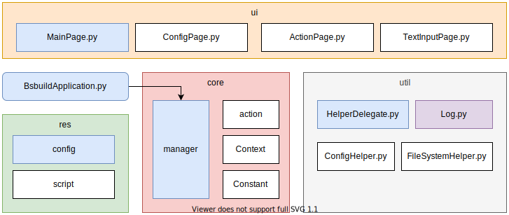

# bsbuild ver:0.9

自 SDM8250 项目开始，编译方法越来越繁琐，需要在正式开始编译前配置一系列的环境变量，因此导致开发者对编译方法的困惑。于此，推出了 bsbuild 0.1 版本，其目的在于为开发者提供集成化的编译环境，屏蔽一系列的预先配置，顺利完成想要的编译。

bsbuild 0.1 版本是纯shell脚本的，当新项目启动时，需要修改代码以适配各个项目，于是推出0.9版本，该版本从shell迁移到python，通过配置文件实现对不同项目的编译支持。同时提供 UI 操作界面，更易于操作。

## 实现原理

### 模块图

下图每个大模块对应到代码中的一个目录，主要分四个部分：

* core：核心模块，处理数据加载，页面调度，按键传达等事务
* ui：提供操作界面
* res：系统配置文件，为每个项目提供独立配置
* util：系统层面的库，功能的集合

<pre>

</pre>


### 主线时序图

下图描述了bsbuild 0.9的启动过程：

<pre>

</pre>

## 项目配置

### 新建项目

在 bsbuild\res\asset 目录下添加对应产品名的 xml 和 sh 文件，XML 用于菜单显示，sh 则匹配菜单中的定向调用，文件内容示例如下：

XML 配置文件

```xml
<?xml version="1.0" encoding="utf-8"?>
<product module="src.core.handler.handler_node_product">
    <product-config title="product" target="product" />

    <config title="variant" target="variant">
        <opt value="user" />
        <opt value="userdebug" />
        <opt value="eng" />
    </config>

    <config title="build thread" target="build_thread">
        <opt value="-j1" />
        <opt value="-j8" />
        <opt value="-j32" />
        <opt value="-j64" />
    </config>

    <config title="build log" target="build_log">
        <opt value="no" />
        <opt value="yes" />
    </config>

    <empty-line />

    <action title="envsetup" target="_bsbuild_envsetup" color-key="2" />

    <empty-line />

    <action value="build all" target="_bsbuild_build_all" color-key="1" />
    <action value="build otapackage" target="_bsbuild_build_otapackage" color-key="1" />
    <action value="bootimage" target="_bsbuild_build_bootimage" color-key="1" />
    <action value="systemimage" target="_bsbuild_build_systemimage" color-key="1" />
    <action value="vendorimage" target="_bsbuild_build_vendorimage" color-key="1" />

    <input title="build module" target="_bsbuild_build_module" color-key="1" />

    <action title="last build" handler="LastBuildActionNodeHandler" color-key="1" />
</product>
```

sh 脚本文件：aosp_crosshatch.sh

````bash
function _bsbuild_envsetup() {
    lunch ${product}-${variant}
}

function _bsbuild_build_all() {
    _bsbuild_envsetup
    _bsbuild_make
}

function _bsbuild_build_bootimage() {
    _bsbuild_envsetup
    _bsbuild_make bootimage
}

function _bsbuild_build_systemimage() {
    _bsbuild_envsetup
    _bsbuild_make systemimage
}

function _bsbuild_build_vendorimage() {
    _bsbuild_envsetup
    _bsbuild_make vendorimage
}

function _bsbuild_build_system_module() {
    local modules=$*
    if [ ! -n "${modules}" ]; then
        echo "modules is null, bsbuild stopped."
        return
    fi

    _bsbuild_envsetup
    _bsbuild_ninja -f out/combined-${product}.ninja ${modules}
}
````

## 运行界面

如下图所示：

<pre>

</pre>


## 附录：淘汰方案

### Bash Shell Scripting/Whiptail

https://en.wikibooks.org/wiki/Bash_Shell_Scripting/Whiptail

## Reference

* [python-curses-tut](https://github.com/nikhilkumarsingh/python-curses-tut)
* https://github.com/nikhilkumarsingh/python-curses-tut/blob/master/01.%20Getting%20Started.ipynb

