# Low Memory Killer (上)

从根本上来说，LMK的核心问题就是四个字：供需关系。系统内存总供给与系统总需求达到平衡，系统才能保持流畅地运行下去。从供给侧改革到需求侧管理，所有的操作都是为了维持供需的相对平衡。

为了系统流畅运行，系统需要快速响应用户操作。Android尽可能多的缓存进程，从而避免了开启进程这样的消耗。

## 工作模型

最新的Android R上，LMK机制的进程查杀部分从内核空间（参考附录说明）移动到了用户空间，有LMKD守护进程全权处理。

从宏观上来看，当前的LMKD的工作模型如下图所示：

<pre>

</pre>

上图中标注了5个流程，分别为：

*   P1：系统启动时，初始化 `lmkd` 的 `minfree`（查杀进程标准）规则。
*   P2：在使用过程中，动态新建或更新某个进程的 adj（查杀标准中的一个指标）值。
*   P3：当内核检测到内存紧张时，返回 PSI（系统内存紧张反馈）事件到lmkd，lmkd据此根据标准查杀进程。
*   P4：kill完进程后，LMKD返回上层 framework 被杀进程的PID和UID。
*   P5：当上层进程主动或异常退出时，告诉lmkd忽略该进程。

上述5个流程中，P4属于P3的扫尾工作，P5是一个单纯上报工作，所以重要的就是 P1 到 P3 的三个流程，下面具体描述他们。

## 流程说明

### P1：lmkd minfree 的初始化

初始化过程分两个部分：

*   在 system_server 进程中准备好初始化数据，通过 localsocket 连接守护进程，将数据传递给 lmkd
*   lmkd 收到数据后，根据内容初始化相关变量，完成lmkd的初始化工作

#### P1.Part1

下图流程描述了：

*   从 `SystemServer.main()` 方法开始，到连接 `lmkd` 守护进程，到发送 `LMK_TARGET` 命令给 lmkd 守护进程的代码流程

<pre>

</pre>


图中的两个标记解释如下：

**标记a**

客户端与 `lmkd` 服务端的沟通需要遵守规定的协议，每次通信都是一段连续的字节数组，其内容格式因不同命令字相互差异。当下，LMKD支持七个命令字：

*   LMK_TARGET \<minfree\> \<minkillprio\> ... (up to 6 pairs)
*   LMK_PROCPRIO \<pid\> \<uid\> \<prio\>
*   LMK_PROCREMOVE \<pid\>
*   LMK_PROCPURGE
*   LMK_GETKILLCNT
*   LMK_SUBSCRIBE
*   LMK_PROCKILL

此处使用的是 `LMK_TARGET <minfree> <minkillprio> ... (up to 6 pairs)` 根据上面的初始化 `ByteBuffer.allocate(4 * (2 * mOomAdj.length + 1))` 格式如下：

| 命令字段   | 参数1    | 参数2        | 参数3      | 参数4        | 参数5      | 参数6        | 参数7      | 参数8        | 参数9      | 参数10       | 参数11     | 参数12       |
| ---------- | -------- | ------------ | ---------- | ------------ | ---------- | ------------ | ---------- | ------------ | ---------- | ------------ | ---------- | ------------ |
| LMK_TARGET | minfree1 | minkillprio1 | minfree2   | minkillprio2 | minfree3   | minkillprio3 | minfree4   | minkillprio4 | minfree5   | minkillprio5 | minfree6   | minkillprio6 |
| 0-4 byte   | 5-8 byte | 9-12 byte    | 13-16 byte | 17-20 byte   | 21-24 byte | 24-28 byte   | 29-32 byte | 33-36 byte   | 37-40 byte | 41-44 byte   | 45-48 byte | 49-52 byte   |

系统将上面的数据内容传递给 lmkd 服务端。

**标记b**

lmkd是一个系统守护进程（daemon），系统启动时由 init 程序将其调起。lmkd采用localsocket与外界沟通，其访问地址是 “lmkd” ，客户端连接成功后，就可以按照lmkd的通信协议，与lmkd互动了。


#### P1.Part2

下图流程描述了：

*   lmkd启动时初始化localsocket的流程
    *   lmkd采用epoll事件监听localsocket两种事件：客户端断连事件和客户端数据传输事件。
*   收到localsocket客户端数据后，初始化lmkd的流程
    *   ctrl_data_handler() 方法是处理客户端数据传输的入口函数
    *   解析传入数据的命令（LMK_TARGET）和内容，初始化相关变量（eg. lowmem_adj[], lowmem_minfree[]）

<pre>

</pre>

**标记a**

lowmem_minfree[] 数组是lmkd查杀进程时的依据，当收到内核低内存触发事件后，根据系统内存在该数组中定位查杀进程的范围，即进程查杀对照表。

**标记b**

这是一个调试窗口，供开发者查看当前lmkd进程查杀标准配置，仅作为查看信息用途，设置该属性不会改写lmkd中的真实配置。其在 lmkd README文档中的描述为：

````bash
# http://androidxref.blackshark.com:8088/sm8250_r/xref/system/memory/lmkd/README.md#95

92lmkd will set the following Android properties according to current system
93configurations:
94
95  sys.lmk.minfree_levels:    minfree:oom_adj_score pairs, delimited by comma
````

### P2：动态更新各进程的ADJ值

下图流程描述了：

*   在系统使用过程中，不同系统事件触发动态更新进程的adj值
*   以启动 `android.ext.services` 为例，描述其 adj 的计算过程
*   将计算出来的adj同步到lmkd守护进程
*   lmkd接收到 LMK_PROCPRIO 命令后，更新相关变量和设置内核节点

<pre>

</pre>


**标记a**

用户在使用系统的过程中会使用不同的应用程序，应用程序在不同状态下对用户的重要性是不同的，比如前台的应用就比后台应用重要，如果lmkd肆意查杀，那就可能出现用户正在使用应用程序时闪退的情况。于是android系统会根据应用状态变更的事件，动态调整进程在系统中的重要性，这个重要性以 `adj` 来衡量。此处描述的是所有进程状态变更的触发事件类型。

**标记b**

计算进程adj的过程非常复杂，简单来说，就是根据系统状态，设置某个进程的 adj，进程状态，schedgroup等与进程相关的信息。这里不做全面介绍了，图中流程是设置 `android.ext.services` 进程状态时debug出来的流程。

**标记c**

计算完进程的adj值后，需要将其同步到lmkd中，当内核通知lmkd内存紧张时，通过该值查找适合查杀的进程。命令字为 `LMK_PROCPRIO ` 命令格式为 `LMK_PROCPRIO \<pid\> \<uid\> \<prio\>`。

**标记d**

lmkd会将进程当前状态下的adj同步到内核节点 `/proc/{pid}/oom_score_adj` 中，这也成为了一个调试信息窗口。

**标记e**

lmkd是通过 `procadjslock_list[]` 这个数组来管理进程的，即当lmkd选待杀进程时，通过这个数据结构来遍历所有进程。后面具体介绍该数据结构组成形式。

## 小结

本文描述了P1和P2两个流程，概要说明了如下两点：

1.  系统启动时如何将 minfree 数据同步到lmkd的过程
2.  进程动态调整其adj值的过程

下篇将描述lmkd如何kill进程的流程。