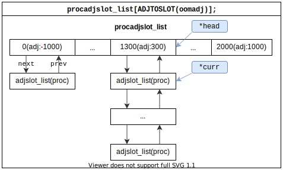

# Low Memory Killer 简介(下)

继LMK简介上篇，本篇描述P3，P4，P5三个流程。其中P3是整个lmk最核心的动作执行单元，lmk相关的调试都可以以该流程作为切入点。

## 流程说明

### P3.1：内核反馈PSI事件给lmkd

下图描述：

*   k1> lmkd启动时，init() 方法将 `mp_event_common()` 方法添加到epoll对象中。
*   k2> lmkd将内存紧张程度分成了四级，并将该配置同步到内核。
*   k3> lmkd进入主循环（mainloop），在主循环体中，通过 `epoll_wait()` 方法监听 epoll 事件。

关键点：

*   mp_event_common() ：psi回调处理入口。

<pre>

</pre>


上图流程相对简单，主要描述了 `mp_event_common()` 方法是如何初始化成内核 PSI 事件监听器的，这里主要的知识点是 PSI（一个用于反映内核繁忙程度的功能）。

**标记a**

PSI 配置信息，分了四个等级，不同等级查杀进程的重要程度也不同，该配置主要是告诉内核lmkd关心的几个点，当内核触发对应阈值时，告诉下lmkd，让lmkd可以做进一步处理。

关于PSI，下面展开说明一下。

### PSI简介

PSI是 Pressure Stall Information 的简写，Facebook 在 2018 年开源了一套解决重要计算集群管理问题的 Linux 内核组件和相关工具，以此为依据，将任务分配到空闲的计算机上，以此达到集群的负载均衡。这个工具集合中，PSI 是其中重要的资源度量工具，通过PSI可以了解到CPU，内存和IO三个方面的信息。

lmkd关心的是内存的紧张程度信息，可以通过`/proc/pressure/memory` 节点获取当前系统统计值，格式如下：

````bash
127|penrose:/ # cat /proc/pressure/memory
some avg10=0.00 avg60=0.00 avg300=0.00 total=1588043
full avg10=0.00 avg60=0.00 avg300=0.00 total=495184
````

avg10、avg60、avg300 分别代表 10s、60s、300s 的时间周期内的阻塞时间百分比。total 是总累计时间，以毫秒为单位。

some 这一行，代表至少有一个任务在某个资源上阻塞的时间占比，如下图所示：

<pre>

</pre>

full 这一行，代表所有的非idle任务同时被阻塞的时间占比，这期间 cpu 被完全浪费，会带来严重的性能问题。如下图所示：

<pre>

</pre>

some 和 full 都是在某一时间段内阻塞时间占比的总和，阻塞时间不一定连续，如下图所示：

<pre>

</pre>

PSI 技术的核心难点在于准确捕捉到任务状态的变化，并统计状态持续时间。这是通过系统埋点来实现统计的，在任务每次进出调度队列时，调用 [psi_task_change()](http://androidxref.blackshark.com:8088/sm8250_r/xref/kernel/msm-4.19/kernel/sched/psi.c#869) 函数实现准确信息统计。

回到Android，早先的版本的 lmk 是以驱动的形式在内核中实现的（参考附录：`PSI之前，内核空间LMK的实现` ），但这种方式并不为主线内核所接受。后来facebook给内核添加了 memory pressure event，这就为应用层实现 lmk 提供了可能性。应用通过配置内核，就可以监听触发配置条件时的 memory pressure 事件，以此维护内存的平衡。lmkd 中配置了四个等级的触发条件：

*   `VMPRESS_LEVEL_LOW`：在some类别上，1秒钟内有70ms的卡顿时，反馈对应的 PSI 事件。
*   `VMPRESS_LEVEL_MEDIUM`：在some类别上，1秒钟内有100ms的卡顿时，反馈对应的 PSI 事件。
*   `VMPRESS_LEVEL_CRITICAL`：在full类别上，1秒钟内有70ms的卡顿时，反馈对应的 PSI 事件。
*   `VMPRESS_LEVEL_SUPER_CRITICAL`：在full类别上，1秒钟内有80ms的卡顿时，反馈对应的 PSI 事件。

### P3.2：内核反馈PSI事件给lmkd

下图描述：

*   k1> 收到内核 psi 事件时，根据 `/proc/vmstat` 反映的系统状态，对系统内存紧张程度等级做一次调整。
*   k2> 收集 `/proc/meminfo` 和 `/proc/zoneinfo` 中反映的系统信息，为计算 `min_score_adj` 时提供依据。
*   k3> 计算出 `min_score_adj`  的值，进程adj大于该值的进程都将成为潜在被杀目标对象。

关键点：

*   min_score_adj：查杀进程的判定依据。

<pre>

</pre>


**标记a**

收集系统数据（"/proc/meminfo"和"/proc/zoneinfo"），为在 minfree 数组中定档 min_score_adj 提供依据。

**标记b**

这里主要是确定 `min_score_adj` 的值，其值计算步骤为：

1.  计算 `other_free = /proc/meminfo.MemFree - /proc/zoneinfo.pages.high`
2.  计算 `other_file = /proc/meminfo.Cached+/proc/meminfo.Buffers) - (/proc/meminfo.Shmem+/proc/meminfo.Unevictable)` 如果结果小于0，则 `other_file = 0`
3.  根据 `[sys.lmk.minfree_levels]: [18432:0,23040:100,27648:200,64512:250,165888:800,225792:950]` 的 minfree 配置，确定当前 `min_score_adj ` 所在档位
4.  定档标准是 `other_free < minfree && other_file < minfree`

### P3.3：lmkd查杀满足条件的进程

下图描述：

*   k1> 一般情况下，一个adj会匹配到多个进程，释放资源时，会倾向释放占用资源最多的那个进程，此处是统计某个进程占用资源的方法。
*   k2> 循环遍历某个adj对应的所有进程，找出占用资源最多的那个进程。
*   k3> kill 掉选出的占用资源最多的进程。
*   k4> 记录在某个 adj 上被kill进程的次数，可以在dumpsys中获取对应信息，以反映手机使用状态。
*   k5> 如果被杀进程的adj值小于600，说明当前被kill进程已经很重要了，需要将该进程的信息输出到logcat中。此处也展现了将 stdout 重定向到 logcat 输出的一个技巧。
*   k6> 进程被杀后，通过localsocket通知上层进程退出的原因，让上层感知因低内存导致的进程退出事件。

关键点：

*   LMK_PROCKILL：lmkd 向 system_server 进程反向输出命令，用于通知上层被kill进程事件和进程相关信息。

<pre>

</pre>


**标记a**

在 `proc_get_heaviest()` 函数中，lmkd将挑选出一个占用资源最多的进程，这就意味着lmkd可以通过一个数据结构检索到所有进程。该数据结构就是 `struct adjslot_list procadjslot_list[ADJTOSLOT_COUNT]` 数组，如下图所示：

<pre>

</pre>


procadjslot_list 采用数组加双向链表的数据结构，实现了对系统进程的分类和管理。检索时，先根据 adj 获取指定下标的 `struct adjslot_list` 结构，即所有属于该 adj 值的进程链表的头（*head）指针，然后用 *curr 指针从 head 开始完成顺序遍历。

**标记b**

连接到lmkd的客户端是长连接，当前，lmkd只支持 LMK_PROCKILL 命令的上报。

### P4：lmkd将被kill进程信息反馈给客户端

下图描述：

*   k1> lmkd 反馈消息在 `LmkdConnectionListener` 对象中处理，该 listener 在构造 LmkdConnection 对象连接 lmkd 时被传入。
*   k2> lmkd 上报命令是 `LMK_PROCKILL` ，其命令格式为 `LMK_PROCKILL <pid> <uid>`

关键点：

*   LMK_PROCKILL：lmkd 唯一支持的上报命令

<pre>

</pre>


**标记a**

system_server进程感知 lmkd 查杀进程事件的处理方法，同时这里也是感知所有应用进程被kill事件的聚集地，会根据被kill进程的状态信息给出被kill的原因。

### P5：客户端同步正常退出进程信息

下图描述：

*   k1> 上层通过 `LMK_PROCREMOVE` 命令通知 lmkd 该进程已经退出
*   k2> lmkd 收到命令后，将退出进程信息从 procadjslot_list 链表中删除

关键点：

*   `LMK_PROCREMOVE`  命令的格式为：`LMK_PROCREMOVE <pid>`

<pre>

</pre>


**标记a**

一般来说，AMS启动应用进程后会attach到新的进程，同时通过 AppDeathRecipient 监听应用进程退出事件，当进程因为自生原因退出或其他不涉及 lmkd 守护进程相关因素退出时，需要将该信息同步到 lmkd，防止lmkd在查杀进程时选出已经不存在的进程。

## DEBUG调试

查看当前 minfree 数组的配置，评估当前系统内存使用程度。

````bash
kaiser:/ # getprop | grep sys.lmk.minfree_levels
[sys.lmk.minfree_levels]: [18432:0,23040:100,27648:200,85000:250,191250:800,241920:950]
````

查看使用期间各 adj 上进程被杀次数，评估用户使用手机过程中，是否存在内存瓶颈

````bash
penrose:/ # dumpsys activity lmk
ACTIVITY MANAGER LMK KILLS (dumpsys activity lmk)
  Total number of kills: 71
    kills at or below oom_adj 999: 71
    kills at or below oom_adj 900: 0
    kills at or below oom_adj 800: 0
    kills at or below oom_adj 700: 0
    kills at or below oom_adj 600: 0
    kills at or below oom_adj 500: 0
    kills at or below oom_adj 400: 0
    kills at or below oom_adj 300: 0
    kills at or below oom_adj 250: 0
    kills at or below oom_adj 200: 0
    kills at or below oom_adj 100: 0
    kills at or below oom_adj 0: 0

````

查看某一个进程当前 adj 的值 ：`curRaw=100`

````bash
penrose:/ # dumpsys activity processes
ACTIVITY MANAGER RUNNING PROCESSES (dumpsys activity processes)
  All known processes:
  *APP* UID 1000 ProcessRecord{e3bd4bf 25359:com.miui.screenrecorder/1000}
    ...
    oom adj: max=1001 procState: max=20 curRaw=100 setRaw=100 cur=100 set=100
    ...
````

查看当前各个adj对应内存的大小，比如：`100: VISIBLE_APP_ADJ (   92,160K)` 为当内存小于 `92,160KB` 时，lmkd将查杀 adj 为 100 的进程。这里是minfree 数组的细化补充，更直观些。

````bash
kaiser:/ # dumpsys activity processes | grep "OOM levels:" -A 20
  OOM levels:
    -900: SYSTEM_ADJ (   73,728K)
    -800: PERSISTENT_PROC_ADJ (   73,728K)
    -700: PERSISTENT_SERVICE_ADJ (   73,728K)
      0: FOREGROUND_APP_ADJ (   73,728K)
     100: VISIBLE_APP_ADJ (   92,160K)
     200: PERCEPTIBLE_APP_ADJ (  110,592K)
     250: PERCEPTIBLE_LOW_APP_ADJ (  258,048K)
     300: BACKUP_APP_ADJ (  663,552K)
     400: HEAVY_WEIGHT_APP_ADJ (  663,552K)
     500: SERVICE_ADJ (  663,552K)
     600: HOME_APP_ADJ (  663,552K)
     700: PREVIOUS_APP_ADJ (  663,552K)
     800: SERVICE_B_ADJ (  663,552K)
     900: CACHED_APP_MIN_ADJ (  903,168K)
     999: CACHED_APP_MAX_ADJ (  903,168K)
````

## 总结

本文描述了 lmkd 的初始化，进程adj动态同步，以及lmkd查杀进程的过程，其目的是为了维护系统内存使用的平衡。

lmkd 进程查杀功能的实现模型为：

-   监听pressure_level：通过配置 `/proc/pressure/memory` 节点，实现四个级别的内存压力事件监听，最终在 `mp_event_common` 函数中统一处理
-   计算内存使用情况：`/proc/meminfo.MemFree - /proc/zoneinfo.pages.high` 反映当前系统可用内存
-   find_and_kill_process：查找符合条件的进程并将其kill掉，释放资源。find_and_kill_process只会杀一个进程，如果在kill掉一个进程后，内存还是不满足，则kernel会触发下一次事件继续释放资源，直到系统内存紧张得到缓解


## 附录：

各ADJ的含义（frameworks/base/services/core/java/com/android/server/am/ProcessList.java）

| type                     | value  | comment                                                      |
| ------------------------ | ------ | ------------------------------------------------------------ |
| INVALID_ADJ              | -10000 | Uninitialized value for any major or minor adj fields        |
| UNKNOWN_ADJ              | 1001   | Adjustment used in certain places where we don't know it yet. (Generally this is something that is going to be cached, but we don't know the exact value in the cached range to assign yet.) |
| CACHED_APP_MAX_ADJ       | 999    | This is a process only hosting activities that are not visible, so it can be killed without any disruption. |
| CACHED_APP_MIN_ADJ       | 900    | same as upper                                                |
| CACHED_APP_LMK_FIRST_ADJ | 950    | This is the oom_adj level that we allow to die first. This cannot be equal to CACHED_APP_MAX_ADJ unless processes are actively being assigned an oom_score_adj of CACHED_APP_MAX_ADJ. |
| SERVICE_B_ADJ            | 800    | The B list of SERVICE_ADJ -- these are the old and decrepit services that aren't as shiny and interesting as the ones in the A list. |
| PREVIOUS_APP_ADJ         | 700    | This is the process of the previous application that the user was in. This process is kept above other things, because it is very common to switch back to the previous app.  This is important both for recent task switch (toggling between the two top recent apps) as well as normal UI flow such as clicking on a URI in the e-mail app to view in the browser, and then pressing back to return to e-mail. |
| HOME_APP_ADJ             | 600    | This is a process holding the home application -- we want to try avoiding killing it, even if it would normally be in the background, because the user interacts with it so much. |
| SERVICE_ADJ              | 500    | This is a process holding an application service -- killing it will not have much of an impact as far as the user is concerned. |
| HEAVY_WEIGHT_APP_ADJ     | 400    | This is a process with a heavy-weight application.  It is in the background, but we want to try to avoid killing it.  Value set in system/rootdir/init.rc on startup. |
| BACKUP_APP_ADJ           | 300    | This is a process currently hosting a backup operation.  Killing it is not entirely fatal but is generally a bad idea. |
| PERCEPTIBLE_APP_ADJ      | 200    | This is a process only hosting components that are perceptible to the user, and we really want to avoid killing them, but they are not immediately visible. An example is background music playback. |
| VISIBLE_APP_ADJ          | 100    | This is a process only hosting activities that are visible to the user, so we'd prefer they don't disappear. |
| VISIBLE_APP_LAYER_MAX    | 99     | same as upper                                                |
| FOREGROUND_APP_ADJ       | 0      | This is the process running the current foreground app.  We'd really rather not kill it! |
| PERSISTENT_SERVICE_ADJ   | -700   | This is a process that the system or a persistent process has bound to, and indicated it is important. |
| PERSISTENT_PROC_ADJ      | -800   | This is a system persistent process, such as telephony.  Definitely don't want to kill it, but doing so is not completely fatal. |
| SYSTEM_ADJ               | -900   | The system process runs at the default adjustment.           |
| NATIVE_ADJ               | -1000  | Special code for native processes that are not being managed by the system (so don't have an oom adj assigned by the system). |

### PSI之前，内核空间LMK的实现

参考源码：https://android.googlesource.com/kernel/mediatek/+/android-mtk-3.18/drivers/staging/android/lowmemorykiller.c#77

LMK驱动通过注册shrinker来实现的，shrinker是linux kernel标准的回收内存page的机制，由内核线程kswapd负责监控。

````c
// lmk 中监听 lowmem_shrinker 的数据结构
static struct shrinker lowmem_shrinker = {
	.scan_objects = lowmem_scan,
	.count_objects = lowmem_count,
	.seeks = DEFAULT_SEEKS * 16
};

// 初始化时注册到 shrinker 打开监听
static int __init lowmem_init(void)
{
	register_shrinker(&lowmem_shrinker);
	return 0;
}
````

当内存不足时kswapd线程会遍历一张shrinker链表，并回调已注册的shrinker函数来回收内存page，此时会回调上面注册句柄中的 lowmem_scan 方法，其实现如下：

````c
static unsigned long lowmem_scan(struct shrinker *s, struct shrink_control *sc)
{
	selected_oom_score_adj = min_score_adj;
    // 遍历进程，筛选待杀进程
	for_each_process(tsk) {
		struct task_struct *p;
		p = find_lock_task_mm(tsk);			<-
		selected = p;
	}
	if (selected) {
        // kill 被选中的进程
        send_sig(SIGKILL, selected, 0); 	<-
		rem += selected_tasksize;
	}
	lowmem_print(4, "lowmem_scan %lu, %x, return %lu\n",
		     sc->nr_to_scan, sc->gfp_mask, rem);
	return rem;
}
````

## Reference

*   [memcg: understand memory usage](http://tjtech.me/understand-memcg-memory-usage.html)
*   [lmkd and memcg](https://www.programmersought.com/article/77505297725/)
*   [Chapter 2 Describing Physical Memory](https://www.kernel.org/doc/gorman/html/understand/understand005.html#:~:text=Each%20zone%20has%20three%20watermarks,pressure%20a%20zone%20is%20under.)
*   [纯干货，PSI 原理解析与应用](https://www.cnblogs.com/Linux-tech/p/12961296.html)
*   [psi: pressure stall information for CPU, memory, and IO v2](https://lwn.net/Articles/759658/)
*   [PSI - Pressure Stall Information](https://git.kernel.org/pub/scm/linux/kernel/git/torvalds/linux.git/tree/Documentation/accounting/psi.rst)
*   [Getting Started with PSI](https://facebookmicrosites.github.io/psi/docs/overview.html)
*   [Android Memory Overview [Part1] - Introduction to Low Memory Killer](https://strayinsights.blogspot.com/2020/05/android-memory-overview-part1.html)
*   [Android Memory Overview [Part2] - Android LMKD](https://strayinsights.blogspot.com/2020/05/android-memory-overview-part2-android.html)
*   [Android OOM Adjustments](https://developpaper.com/android-oom-adjustments/)
*   [Getting Started with PSI](https://facebookmicrosites.github.io/psi/docs/overview.html)
*   [Memory Resource Controller(Memcg) Implementation Memo](https://www.kernel.org/doc/html/latest/admin-guide/cgroup-v1/memcg_test.html)

