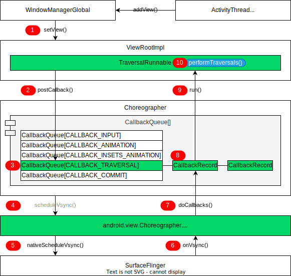
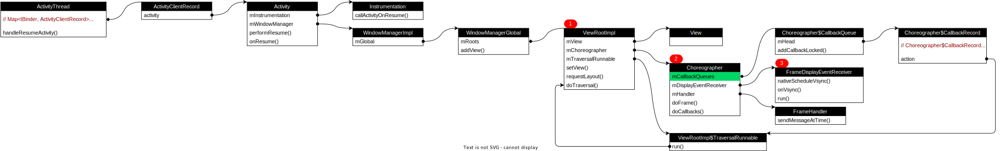

# UI 刷新的 VSync

## 内容简介

APP UI 是设备与用户频繁交互的一种途径，APP UI 的好与坏会直接影响用户体验，所以理解掌握 APP UI 的实现原理十分重要，对显示模块的优化将通过认识，实践，再认识，再实践的方式实现。

关于 APP UI 刷新机制，有如下两个固有工作模型：

1. APP 进程的 UI 更新不是同步更新，是先将 UI 更新动作保存到一个 callback 链表中，然后等待底层 SF 进程的垂直同步脉冲（VSync）信号，APP 进程收到 VSync 之后，回调 callback 并执行测量，布局，绘制操作。
2. VSync 信号由底层由硬件上报给 SF 进程，有些通过软件模拟上报。一般为每秒上报 60 次，即每秒刷新 60 帧，也就是我们常说的 16.6ms 内需要完成一帧的绘制，否则就会发生卡顿现象。

## 模块关系

当用户启动一个应用时，会在 Activity 的 onResume 阶段向 SurfaceFlinger 申请 VSync 回调。处理流程可以分为申请 VSync 阶段和 VSync 回调处理阶段两个阶段，具体执行如下图所示：

<pre>

</pre>

上图流程说明如下：

### 申请 VSync 阶段

* Framework 发起 APP 进程的 onResume 生命周期回调 handleResumeActivity()，在该方法中，先调用 Activity 的 onResume() 方法。
* 接着调用 WindowManagerGlobal.addView() 方法将 Activity 的 DecorView 设置到 ViewRootImpl 中。WindowManagerGlobal.addView() 方法有两个重要动作：
  * 首先创建 ViewRootImpl 对象，初始化时 创建出 ViewRootImpl.mTraversalRunnable 对象。
  * 然后将 Activity 的 DecorView 通过 ViewRootImpl.setView([记号1]) 方法设置到 ViewRootImpl.mView 中。
* 在 ViewRootImpl 拿到 Activity 的 DecorView 后便开始尝试申请 VSync 来刷新界面了。ViewRootImpl 接着调用 Choreographer.postCallback([记号2]) 方法将 mTraversalRunnable 对象封装成 CallbackRecord 对象加入到 Choreographer 的 mCallbackQueues[Choreographer.CALLBACK_TRAVERSAL] [记号3] 链表中，后续 APP 收到 SF 的 VSync 回调时会从链表中取出 callback 来执行。
* 存好 callback 后，Choreographer 就通过其成员 mDisplayEventReceiver 对象的 scheduleVsync([记号4]) 方法向 SF 申请 VSync 了。
* mDisplayEventReceiver 是 Choreographer.FrameDisplayEventReceiver 类的实例对象，其 nativeScheduleVsync([记号5]) 方法调用到 Native 层，继续向 SF 申请 VSync。

###  VSync 回调处理阶段

* SF 进程收到 APP 的请求后，内部会生成一个 VSync 信号，然后通过 socketpair 通知 APP 进程，到 APP 进程时会调用 FrameDisplayEventReceiver#onVsync([记号6]) 方法。由此可见 FrameDisplayEventReceiver 对象是 APP 进程与 SF 进程沟通的关键对象。
* FrameDisplayEventReceiver 本身实现了 Runnable 接口，在 onVsync() 方法中，通过 Handler 调用到 FrameDisplayEventReceiver.run() 方法，接着调用到 Choreographer.doCallbacks([记号7]) 方法，在该方法中将从 mCallbackQueues[Choreographer.CALLBACK_TRAVERSAL] 链表中取出之前加入的 CallbackRecord 对象。
* 接着从 CallbackRecord[记号8] 中剥出 mTraversalRunnable 对象并执行其 mTraversalRunnable.run([记号8]) 方法，在 run() 方法中调用 ViewRootImpl.doTraversal() 方法初始化 UI 界面。

至此，APP 第一个 VSync 请求流程基本描述完毕，图中绿色高亮的模块是核心工作模块，对他们的名称和所在类最好做到如数家珍。

## 类关系图

APP UI 刷新流程涉及很多类，这些类之间调用层级比较深，从承接 FWK 生命周期回调的 ActivityThread 类到与 SF 沟通的 FrameDisplayEventReceiver 类，各类之间的关系大致如下图所示：

<pre>

</pre>

上图中，几个比较重要的关系说明如下：

* ActivityThread 负责与 Framework 打交道并调用 Activity 各个阶段的生命周期。ActivityThread 通过 ActivityClientRecord 获取 Activity 对象，再通过 Activity 拿到 WindowManagerGlobal 对象并调用其 addView() 方法，在该方法中创建出 ViewRootImpl 对象。
* ViewRootImpl[记号1] 是所有 View 的根节点，是链接 WindowManager 和 DecorView 的纽带，负责 view 的绘制过程（measure、layout、draw），和向 DecorView 分发用户事件（按键，触屏）的动作。
* Choreographer[记号2] 像是 UI 渲染的现场指挥，根据底层 VSync 来安排 UI 界面的渲染时机，mCallbackQueues 是他的一个成员变量，里面保存了需要后续 VSync 触发的各种 Runnable 对象。

- FrameDisplayEventReceiver[记号3] 是 APP 进程与 SF 通信的管理对象，APP 请求和接收 VSync 信号都将通过该类实现。

对象关系图反应了当前工作系统的一个静态结构，在分析执行流程时，可以参考静态结构图来帮助理解各种调用关系。

## 执行流程

下面从代码层面分析一下执行细节，整个调用过程如下图所示：

<pre>

</pre>

上图反应了两个执行阶段：APP 请求 VSync 和 APP 收到 VSync 后的处理。流程要点描述如下：

* 整个过程都跑在 APP 的 main 线程，即 UI 线程。

* ActivityThread.handleResumeActivity([记号1]) 发起 Activity onResume 生命周期回调。调用路径：handleResumeActivity() -> performResumeActivity() -> Activity.performResume() -> Instrumentation.callActivityOnResume() -> Activity.onResume([记号2])。此处是为了强调 APP 的第一个 VSync 信号是在 Activity onResume 生命周期后向 SF 请求的。

* 回到 ActivityThread.handleResumeActivity([记号1])  方法中，下面开始向 SF 请求 VSync 的调用。首先通过 ActivityClientRecord 获取 APP 的 decorView 和 ViewManager 对象，调用 ViewManager 的 addView() 方法将 decorView 添加到 ViewManager 中，ViewManager 是一个接口类，WindowManagerImpl 对象实现了该接口。WindowManagerImpl 对象通过 WindowManagerGlobal 对象与 framework 的 WMS 通信，于是 ViewManager.addView() 方法最终执行到了 WindowManagerGlobal.addView() 方法中。

* WindowManagerGlobal.addView([记号3]) 方法中，先将 ViewRootImpl 对象创建出来，然后调用 ViewRootImpl.setView() 方法建立 ViewRootImpl 与 DecorView 的联系，接着调用 requestLayout([记号4]) 方法为处理 VSync 的做准备。

* scheduleTraversals() 方法主要完成两件事情，先将处理 VSync 回调的 Runnable 对象放到 Choreographer 的 mCallbackQueues[Choreographer.CALLBACK_TRAVERSAL] 链表中，然后向 SF 申请 VSync。在 scheduleTraversals() 方法中，调用到 Choreographer.postCallbackDelayedInternal() 方法，然后调用 mCallbackQueues[callbackType].addCallbackLocked([记号5]) 方法将 ViewRootImpl.mTraversalRunnable 封装成 CallbackRecord 对象添加到链表中。最后调用到 DisplayEventReceiver.nativeScheduleVsync([记号6])) 方法向 SF 申请 VSync。

  * Choreographer.mCallbackQueues[] 是一个数组，每个成员都是一个链表，一共5个成员，分别为：

| 名称                      | 说明                                                         |
| ------------------------- | ------------------------------------------------------------ |
| CALLBACK_INPUT            | public static final int CALLBACK_INPUT = 0 输入回调。会被最先运行的类型。 |
| CALLBACK_ANIMATION        | public static final int CALLBACK_ANIMATION = 1 动画回调。在 CALLBACK_INSETS_ANIMATION 之前运行。 |
| CALLBACK_INSETS_ANIMATION | public static final int CALLBACK_INSETS_ANIMATION = 2 处理嵌入更新的动画回调。 |
| CALLBACK_TRAVERSAL        | public static final int CALLBACK_TRAVERSAL = 3 遍历回调。处理布局和绘制。在处理完所有其他异步消息后运行。 |
| CALLBACK_COMMIT           | public static final int CALLBACK_COMMIT = 4 提交回调。处理每帧绘制后的操作。 |

* DisplayEventReceiver.nativeScheduleVsync([记号6])) 执行完后，APP 这边就开始等待 SF 的 VSync 回调了。当 SF 通过 socketpair 向 APP 上报 VSync 后，APP 的 FrameDisplayEventReceiver.onVsync([记号7]) 方法收到回调，在该方法中会向 FrameDisplayEventReceiver.mHandler 发送一个 Message，跳转执行到 FrameDisplayEventReceiver.run() 方法。
* 在 run() 方法中，调用到 Choreographer.doCallbacks() 方法，接着从 mCallbackQueues[Choreographer.CALLBACK_TRAVERSAL] 链表中取出封装了 ViewRootImpl.mTraversalRunnable 对象的 CallbackRecord，并执行其 TraversalRunnable.run([记号9]) 方法
* 最后，在 TraversalRunnable.run([记号9]) 方法中调用 ViewRootImpl.doTraversal() 方法实现对 View 的测量，布局，绘制工作。

## 小结

综上，所有的UI更新，最终都会调用到 ViewRootImpl 的 scheduleTraversals() 方法，一次 APP UI 更新的主要流程为：

1. 开启同步屏障，在 scheduleTraversals() 方法中开启。
2. 将UI的绘制请求post到一个 callback 链表中等待执行
3. Choreographer 中的 DisplayEventReceiver 在 UI 线程中通过 Handler 异步消息向 native 层请求一个 Vsync 信号回调（nativeScheduleVsync() 方法）
4. 在下一个 VSync 到来时，会回调 FrameDisplayEventReceiver 的 onVsync() 方法，并在 UI 线程中执行其 run() 方法
5. 调用 doFrame() 方法，先获取 callback 链表中计划执行时间小于当前时间的 callback 对象链表，然后遍历执行 callback 的 run() 方法
6. 在 run() 中，调用 doTraversal() 方法，先移除同步屏障，然后执行 performTraversals() 开始测量，布局，绘制流程

本流程没有涉及到对 FrameBuffer 的操作，待后续深入研究。