# VSync 基础知识

## VSync与帧缓冲

显示（即手机显示屏）是由称为“帧”的单个图片组成的。流畅的动画通常是每秒 60 帧。帧由像素组成，当显示器绘制帧时，像素会被逐行填充。显示器（LCD、AMOLED 等）从 GPU 获取每一帧图像，并开始逐行绘制。理想情况下，显示器在完成前一帧的绘制后再从 GPU 获取新一帧图像。如果在显示器绘图过程中 GPU 更新了被绘制的像素，那么就会出现图像撕裂现象。如下图所示：

<pre>
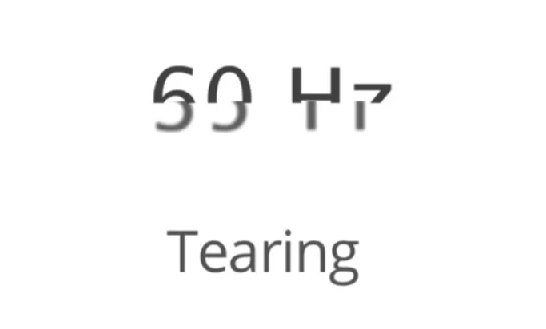
</pre>


VSync 会同步各种操作。它告诉 GPU 等屏幕完成逐行绘制后再加载下一帧。

本小节相关概念说明如下：

- 刷新率（Refresh Rate）：代表了屏幕在一秒内刷新屏幕的次数，这取决于硬件的固定参数，例如 60Hz。
- 帧率（Frame Rate）：代表了 GPU 在一秒内绘制操作的帧数，例如 30fps，60fps。

### 没有 Vsync 同步渲染的情况

大多数 Android 显示器以每秒 60 帧速度运行（60 Hz）。为了获得流畅的动画效果，必须每秒渲染 60 帧图像，这意味着每一帧要在 16 毫秒内处理完毕。如果花费的时间超过 16 毫秒，动画就会卡顿，我们所追求的黄油般丝滑的感觉就会消失。16 毫秒不是很多时间，所以你要充分利用它。下面是一个卡顿的例子：

<pre>
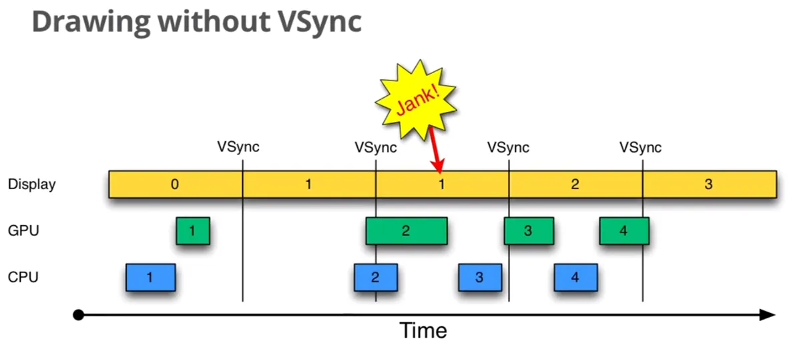
</pre>


图中有三个元素，Display 是显示屏幕，GPU 和 CPU 负责渲染帧数据，每个帧以方框表示，并以数字进行编号，如0、1、2等等。以时间的顺序来看下将会发生的过程：

1. Display 显示第 0 帧数据，在第 0 帧显示期间里， CPU 和 GPU 渲染第 1 帧画面，且在 Display 下一个 VSync 到来之前完成了渲染，这是理想情况。
2. Display 收到第 1 个 VSync 并读取 Frame buffer 数据，显示第 1 帧画面。
3. 在第 2 个 VSync 到来之前的时间内（通常是 16ms），因某种原因系统资源被占用，直到第 2 个 VSync 快到来时 CPU 和 GPU 才开始渲染第 2 帧画面。
4. 当第 2 个 VSync 到来时，第 2 帧数据还没有准备好，Display 被强制显示为第 1 帧画面。这种情况被 Android 开发组称为 “**Jank**”，即发生了**丢帧**，因为本应流畅的动画效果会因此而卡顿。
5. 当第 2 帧数据准备好时，并不会马上被显示，需要等到第 3 个 VSync 到来时才会显示出来。

总的来说，Display 平白无故地多显示了一次第 1 帧图像，原因是第 2 帧的 CPU/GPU 计算没能在两个 VSync 之间完成图像渲染，这就是渲染脱离 VSync 信号的糟糕结果。

### 使用 Vsync 同步渲染的情况

为解决上面丢帧问题，我们让帧图像的处理从一收到 VSync 就开始执行，以此最大限度的利用 16 毫秒的渲染时间。换言之，帧渲染动作从 “只要我们有时间就开始” 转变为严格安排、高度组织化的行动准则。下面示例中，所有处理都发生在 16 毫秒的时间限制内，所有帧都按时交付，我们将获得丝滑的体验。

<pre>
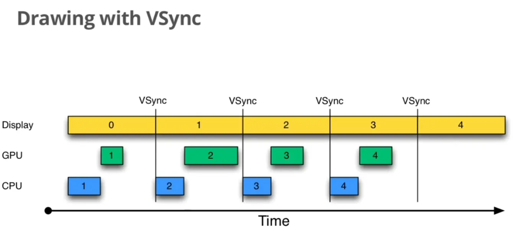
</pre>


上图中，CPU 和 GPU 在 16ms 内完成了渲染，也就是说 CPU 和 GPU 的帧率要高于 Display 的刷新率。由于 CPU/GPU 只在收到 VSYNC 时才开始数据处理，故它们的帧率被拉低到与 Display 相同。渲染帧率时大于刷新率时不会有丢帧现象，动画流程，但如果 CPU/GPU 的帧率小于了 Display 的刷新率，即下一个 VSync 信号到来时图像数据还没有准备好，那么还是会发生丢帧现象。为解决这种情况的丢帧，安卓引入了多重缓冲的方案。

### 双重缓冲

绘制图形界面时，先由 CPU 准备数据，然后通过驱动层把数据交给 GPU 来进行绘制。图形 API 不允许 CPU 和 GPU 直接通信，需要图形驱动（Graphics Driver）作为桥梁进行沟通。Graphics Driver 维护了一个显示序列（Display List），CPU 不断把需要显示的数据放进序列，GPU 不断的取出渲染并将数据输出到帧缓冲中。在 Linux 上，通常使用帧缓冲（FrameBuffer）来做显示输出，双重缓冲是指有两个帧缓冲区，一个 FrontBuffer 和一个 BackBuffer，顾名思义，FrontBuffer 是当前显示的页面，BackBuffer 是下一个要显示的画面。通过不断交换两个缓冲区达到持续更新屏幕图像效果。在上面的例子中加入帧缓冲的描述图如下：

<pre>
</pre>


上图中，Buffer 栏描述了帧缓冲在 VSync 之间的分配过程：

* 第 0 帧时，Display 读取 Buffer a 数据并更新界面，此时 Display 占用了 Buffer a，Buffer b 是空闲的，将 Buffer b 分配给 CPU/GPU 进行渲染第 1 帧，在第一个 VSync 到来之前，CPU/GPU 完成了渲染并将数据写回 Buffer b。
* 第一个 VSync 到来时，Display 读取 Buffer b 数据并显示第 1 帧，此时 Display 占用了 Buffer b，Buffer a 空闲下来，接着系统将 Buffer a 分配给 CPU/GPU 进行渲染第 2 帧，如此循环往复。

理想情况下，每个 VSync 都可以更新画面，运行流畅，但是当 CPU/GPU 渲染时长超过一帧时长时，会出现持续性的丢帧，如下图所示：

<pre>
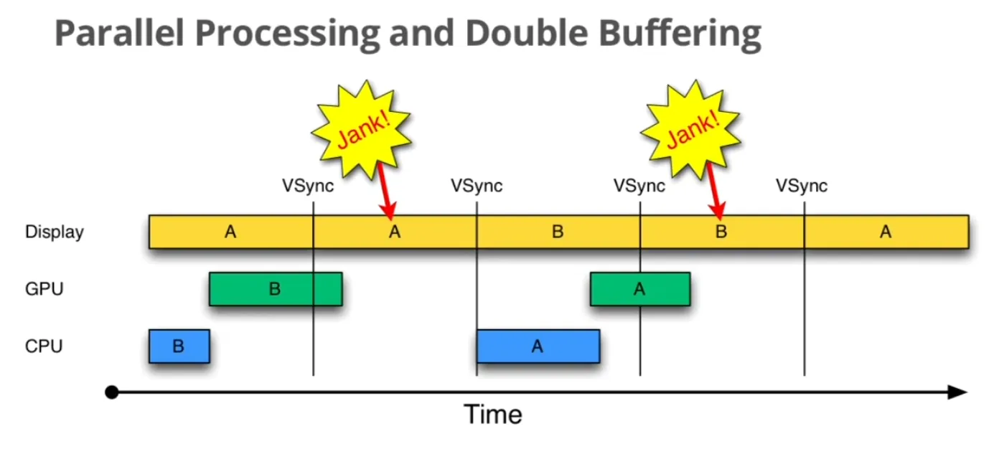
</pre>


上图是 Google IO PPT 的截图，我们加入 Buffer 的变化过程，如下图所示：

<pre>
</pre>


上图中处理过程如下：

*  第 0 帧时，Display 读取 Buffer a 数据并更新界面，Buffer b 分配给 CPU/GPU 进行渲染第 1 帧。
*  由于第 1 帧 GPU 占用时间过长，第 1 个 VSync 到来时发现数据没有准备好，所以 Display 继续显示第 0 帧，于是发生了丢帧（Jank）的现象。
*  在丢帧的那段时间里，Buffer a 被 Display 占用，Buffer b 被 CPU/GPU 第 1 帧的渲染占用，因为没有 Buffer 了，所以第 2 帧的渲染只能往后顺延一个 VSync。
*  当第 2 个 VSync 到来时，Display 显示 Buffer b 的内容，Buffer a 被释放出来。接着系统将 Buffer a 分配给 CPU/GPU 开始第 2 帧的渲染。
*  如果第 2 帧渲染也超时了，那么丢帧现象会像滚雪球一样一直持续下去。

为了解决这个问题，Android 引入了 Triple Buffer 机制。

### 三重缓冲

当系统只有两个 Buffer（Android 4.1之前）时，如果 BackBuffer 被占用了，它也只能等待 GPU 使用之后再次进行写入，但此时的 CPU 是空闲着的，这部分资源就浪费了。为改善这种情况，我们尝试增加 1 个 Buffer 缓存，看看 CPU 是不是就可以充分利用起来了？我们模拟一下三重缓冲（Triple Buffer）的处理过程，如下图所示：

<pre>
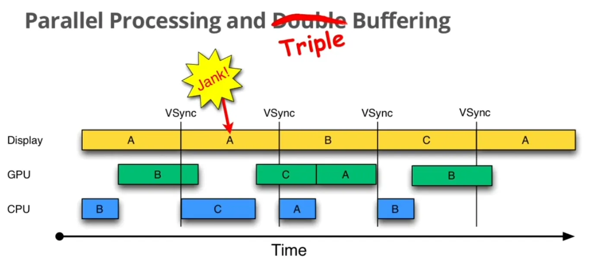
</pre>


加入 Buffer 的变化过程，如下图所示：

<pre>
</pre>


还是上面超时的情况，我们引入 Buffer c，每一帧的处理过程如下：

* 第 0 帧时，Display 读取 Buffer a 数据并更新界面，Buffer b 分配给 CPU/GPU 进行渲染第 1 帧。Buffer c 是空闲的。
* 第 1 个 VSync 到来时，因为第 1 帧数据还没有准备好，系统发生了丢帧现象。与双重缓冲不同的是，此时还有一个空闲的 Buffer c，它可以被分配给 CPU/GPU 继续渲染第 2 帧。
* 第 2 个 VSync 到来时，第 1 帧的数据已经准备完毕，Display 读取 Buffer b 的数据并显示第 1 帧内容，GPU 完成第 2 帧渲染，将数据写回 Buffer c。Buffer a 空闲下来，可以分配给 CPU 进行第 3 帧的数据处理。
* 第 3 个 VSync 到来时，Buffer a 被写回第 3 帧数据；Buffer b 被 Display 释放，空闲下来等待继续被分配出去；Buffer c 被 Display 占用，用于显示第 2 帧数据，如此循环往复。

从上面可以看出，增加一个帧缓存有效减少了丢帧现象。所以，Google 在 Android4.1 以后，引入了三重缓存机制：Tripple Buffer。Tripple Buffer 利用 CPU/GPU 的空闲等待时间提前准备好数据，三重缓存只在有需要的时候才会被使用。

## VSync 的工作机制

Android 使用 Vsync 来驱动系统的画面的更新，包括 APP view draw，surfaceflinger 画面的合成，display 把 surfaceflinger 合成的画面呈现在LCD上。在阅读代码之前，我们先了解一下 VSync 相关的基础概念。

### Vsync 的主要构成

<pre>
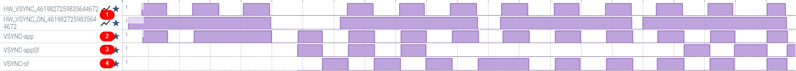
</pre>


我们先 dump 一个 Systrace 并在 https://ui.perfetto.dev/ 中打开 trace 文件，如上图所示。图中：

* HW_VSYNC_XXX 和 HW_VSYNC_ON_XXX 是来自 HWC 硬件的 VSync 信号（<font color=red>记号1</font>）
  * HW_VSYNC_XXX ：代表 display XXX 的 HWC VSync 发生时间点, XXX 代表 display 的编号。用来校准 Vsync-app 和 Vsync-appsf event 的输出。
  * HW_VSYNC_ON_XXX：代表 display XXX 的 VSync 被 enable 或 disable。当 SF 要求 HWComposer 将 Display 的 VSync 打开或关掉时，该 event 就会记录下来。
  * Vsync-app <font color=red>记号2</font>：App、SystemUI 和 systemserver 等 view draw 的触发器。
  * Vsync-appsf <font color=red>记号3</font>：未知，待确认。
  * Vsync-sf <font color=red>记号4</font>：不确定，可能是 Surfaceflinger 合成画面的触发器。

不难看出，各种类型的 VSync 信号不是固定不变的，仅在需要时才会产生相应的 VSync 信号，这样一方面节省了系统开销，同时还节约了系统功耗。

### 显示流程概要

为了避免画面撕裂（Tearing）, 画面更新（Flip）动作通常会在 VSync 开始的时候才做，因为在 VSync 开始到它结束前，Display 不会把 framebuffer 资料显示在 display 上，所以在这段时间做 Flip 可以避免使用者同时看到前后两个部份画面的现象。目前 user 看到画面呈现的过程是这样的，app 更新它的画面后，它需要透过 BufferQueue 通知 SF，SF 再将更新过的 app 画面与其它的 App 或 SystemUI 进行组合，最终显示在屏幕上。在这个过程中，涉及了 3 个部分, 分别是 App、SF 与 Display。AndroidM 上，这三个部分都是在 VSync 发生的时候才开始做事。可以将它们想成一个有 3 个 stage 的 pipeline，其时钟信号就是硬件 VSync 信号，即 HW_VSYNC_XXX。其绘制过程如下图所示：

<pre>
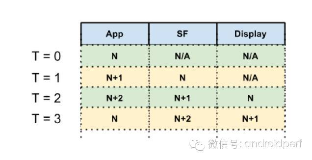
</pre>


图中：

* T = 0 时，App 正在画 N，SF 与 Display 都没内容可用

* T = 1 时，App 正在画 N+1，SF 组合 N，Display 没 Buffer 可显示

* T = 2 时，App 正在画 N+2，SF 组合 N+1，Display 显示 N 

* T = 3 时，App 正在画 N，SF 组合 N+2，Display 显示 N+1 

* ... 

按此步骤，当更新一个画面时，要等到 2 个 VSync 后才会显示出来，latency 大概是 33ms（2 个 frame 的时间）。 对于大部分的操作来说，app 加 SF 处理的时间能在一个 frame（16.6ms）中完成，因此如果我们从 HW_VSYNC_XXX 中再生产出两个  VSync 信号给 APP 和 SF使用，那么就能到达降低 jank 的发生概率的目的。在 Android 上，会有三个 VSync 信号：VSYNC-app 给 App 用；VSYNC-sf 给 SF 用；Display 则使用 HW_VSYNC_XXX。

根据图像显示的工作方式，APP 和 SF 是一个串行的处理过程，如果 APP 和 SF 同时收到 VSync 信号，即 VSync-app 和 VSync-app 没有时间差，那会出现 SF 没有 Buffer 数据来合成的情况，如下图所示：


<pre>
</pre>


为解决该问题，需要人为的干预将其协调好，Android 通过为 VSync-app 和 VSync-sf 设置不同的时间差（phase），使 App draw 和 SF 合成错开时间运行，从而使系统绘制的 pipeline 更加有效率。可以理解为：

````ini
VSYNC-app = HW_VSYNC_XXX + phase_app 
VSYNC-sf  = HW_VSYNC_XXX + phase_sf 
````

在理想状态下，在时间轴上的表现如下图所示：

<pre>
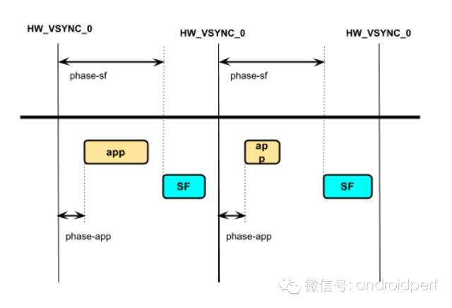
</pre>

理论上，如果 phase_app 与 phase_sf 设定合理，App+SF 可以在一个 frame 里完成，在下一个 HW_VSYNC_XXX 来的时，显示在 display 上。但实际上，不一定能在一个frame里面完成，可能因为CPU调度，GPU performance 不够等因素，导致 App 或 SF 没办法及时做完。即便如此，把 app、surfaceflinger 和 display 的 Vsyn 分开也比用一个 Vsyn 来触发 app draw、surfaceflinger 合成，在 LCD 上显示的性能要好很多（FPS 更高）。

那么是否我们收到 LCD 的 Vsync event 就会触发 Vsync-app 和 Vsync-SF 呢？如果是这样我们就不会看到本文开头的 Vsync-app 和 Vsync-sf 的节奏不一致的情况。事实上，在大多数情况下，APP 的画面并不需要一直更新。比如在使用阅读 APP 时，大部分时间的画面是维持一样的，如果在每个 LCD 的 VSYNC 到来时都触发 SF 或 APP， 就会浪费资源和功耗。但当我们玩游戏时，就需要持续触发 SF 和 App 的 Vsync event 来更新画面了。由此可知，Vsync 是根据当前内容按需生成的，HW_VSYNC_XXX，Vsync-sf 和 Vsync-app 都会按需出现。

HW_VSYNC_XXX 是根据是否需要校准 sf 和 app 的Vsync event 而出现，SF 和 App 则根据调用 requestNextVsync() 方法而出现。Android 根据 Software Vsync（Vsync-sf，Vsync-app）来更新画面，Software Vsync 则根据 HW Vsync 过去发生的时间，推测未来会发生的时间进行校准。

HW_VSYNC_XXX，Vsync-sf 和 Vsync-app 三者的关系如下图所示：

<pre>
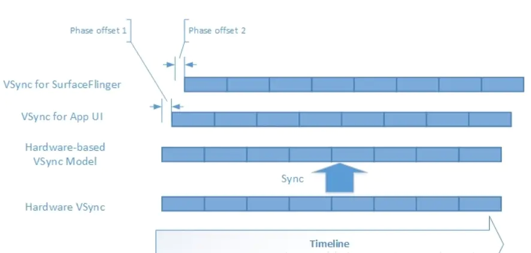
</pre>

### Vsync 的产生

下图是 Vsync event 产生的示意图：

<pre>
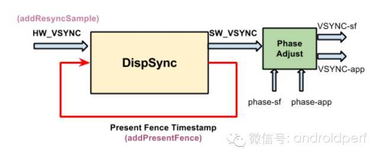
</pre>


图中，HW_VSYNC 为 HW_VSYNC_XXX。

当 SF 从 HWComposer 收到 VSYNC（HW_VSYNC_XXX）时，它会利用 DispSync::addResyncSample 将新的 VSYNC 时间交给 DispSync.addResyncSample 决定是否还需要 HW_VSYNC 的输入，如果不需要，就会将 HW_VSYNC 关掉。

````cpp
voidSurfaceFlinger::onVSyncReceived(int type, nsecs_t timestamp) {
    bool needsHwVsync = false;
    { // Scope for the lock
        Mutex::Autolock _l(mHWVsyncLock);
        if (type == 0 &&mPrimaryHWVsyncEnabled) {
            needsHwVsync =mPrimaryDispSync.addResyncSample(timestamp);
        }
    }
    if (needsHwVsync) {
        enableHardwareVsync();
    } else {
        disableHardwareVsync(false);
    }
}
````

在 sufaceflinge 合成图片后也会 check 是否需要开启 HW_VSYNC 来调整 SW_VSYNC。在 SurfaceFlinger::postComposition() 里，会将 PresentFence 的时间通过 addPresentFence 交给 DispSync 来检查 SW_VSYNC 是否需要校正，如果需要，就会将 HW_VSYNC 打开。

````cpp
voidSurfaceFlinger::postComposition()
 {
    const LayerVector&layers(mDrawingState.layersSortedByZ);
    const size_t count = layers.size();
    for (size_t i=0 ; i<count ; i++) {
        layers[i]->onPostComposition();
    }
    const HWComposer& hwc =getHwComposer();
    sp<Fence> presentFence =hwc.getDisplayFence(HWC_DISPLAY_PRIMARY);
    if (presentFence->isValid()) {
        if(mPrimaryDispSync.addPresentFence(presentFence)) {
            enableHardwareVsync();
        } else {
            disableHardwareVsync(false);
        }
    }
    const sp<const DisplayDevice>hw(getDefaultDisplayDevice());
    if (kIgnorePresentFences) {
        if (hw->isDisplayOn()) {
            enableHardwareVsync();
        }
    }
...
}
````

DispSync是利用HW_VSYNC和PresentFence来判断是否需要开启HW_VSYNC。HW_VSYNC 最少要3个， 最多是32个， 实际上要用几个则不一定，DispSync拿到3个HW_VSYNC后就会计算出SW_VSYNC，只要收到的PresentFence没有超过误差，则HW_VSYNC就会关掉，以便节省功耗。 不然会继续开启HW_VSYNC计算SW_VSYNC的值， 直到误差小于threshold。其计算的方法是DispSync::updateModelLocked()。

基本思想如下，

- 计算目前收到HW_VSYNC间隔，取平均值(AvgPeriod) HW_VSYNC
- 将每个收到的VSYNC时间与AvgPeriod算出误差。 (Delta = Time %AvgPeriod)
- 将Delta转换成角度(DeltaPhase)， 如果AvgPeriod是360度，DeltaPhase = 2*PI*Delta/AvgPeriod。
- 从DeltaPhase可以得到DeltaX与DeltaY (DeltaX =cos(DeltaPhase)， DeltaY = sin(DeltaPhase))
- 将每个收到的VSYNC的DeltaX与DeltaY取平均， 可以得到AvgX与AvgY
- 利用atan与AvgX， AvgY可以得到平圴的phase (AvgPhase)
- AvgPeriod + AvgPhase就是SW_VSYNC。

- 当DispSync收到addPresentFence时(最多记录8个sample)，每一个fence的时间算出(Time% AvgPeriod)的平方当作误差，将所有的Fence误差加总起来如果大于某个Threshold，就表示需要校正(DispSync::updateErrorLocked)。 校正的方法是呼叫DispSync::beginResync()将所有的HW_VSYNC清掉， 开启HW_VSYNC。等至少3个HW_VSYNC再重新计算。

<pre>
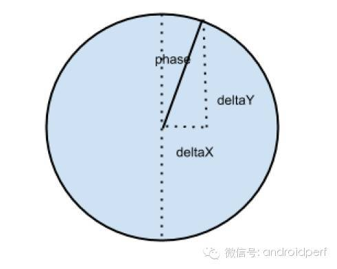
</pre>
