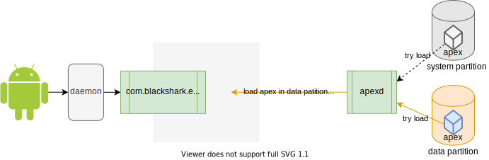
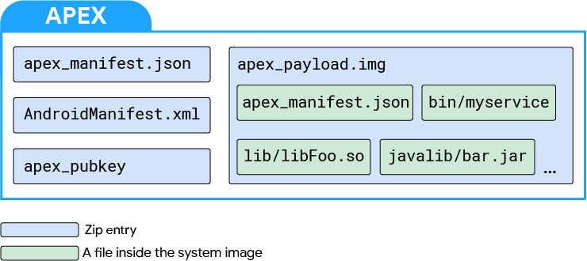

# ❈ APEX功能说明

Android是一个基于linux的操作系统，用户使用的每个应用都会对应到linux上的某个进程，进程是程序加载到内存后的运行实体，程序保存在存储介质上，已手机为例，就是手机上的某个分区，如：system/vendor/...

<pre>

</pre>


我们可以通过更新磁盘上的bin文件，来达到应用升级的目的。如通过某种方式将bin文件替换为bin_v2.0，然后kill掉之前的应用，重新加载bin_v2.0程序。

要替换bin文件有个前提条件，就是bin所在的分区需要是可读写的，在手机上就意味着只有data分区的下文件才能实现更新，比如apk，用户数据配置文件等待。

当前手机上只有apk程序是存放在data分区上的，系统分区的daemon程序，bin程序都无法被独立更新，需要通过OTA来实现升级。为了解决这个问题，google引入了一个新机制--APEX

<pre>

</pre>


Android Pony EXpress (APEX) 是 Android 10 中引入的一种容器格式，可以被底层系统模块调用。该文件可以单独更新。这样可以在OTA升级之外对如下模块进行独立升级：

*   原生服务和原生库
*   硬件抽象层 ([HAL](https://source.android.google.cn/devices/architecture/hal-types?hl=zh-cn))
*   运行时 ([ART](https://source.android.google.cn/devices/tech/dalvik?hl=zh-cn)) 以及类库
*   数据配置文件

## APEX示例

本示例通过更新apex，实现对framework，hal，数据配置文件的更新。

开机：

*   抓取HAL log：`Global::init done`
*   抓取framework log：`ExLightDebugger`
*   执行shell命令：`apex_updated`

结果如下：

````bash
C:\work\ezx\ezProject\devork.server>adb logcat | grep -e"ExLightDebugger" -e"Global::init done"
- waiting for device -
06-01 04:40:29.228   966   966 W exlight@HAL2.0: Global::init done, [product:skywalker chip:aw22xxx_led color:shadow_black]
05-25 21:22:53.407  1251  5910 D exlight@ExLightManager: ExLightDebugger 01
^C^C
C:\work\ezx\ezProject\devork.server>adb shell
klein:/ # apex_updated
/system/bin/sh: apex_updated: inaccessible or not found
127|klein:/ #
````

安装apex：

````bash
D:\20200526>adb install com.blackshark.exlight_apex.apex
Performing Streamed Install
Success

D:\20200526>adb reboot
````

再次抓取相同log和执行相同命令，结果如下：

````bash
D:\20200526>adb logcat | grep -e"ExLightDebugger" -e"Global::init done"
- waiting for device -
06-01 04:46:21.496   968   968 W exlight@HAL2.0: APEX_UPDATED Global::init done, [product:skywalker chip:aw22xxx_led color:shadow_black]
05-25 21:22:38.729  5579  5579 D exlight@ExLightManager: APEX_UPDATED ExLightDebugger 01
^C^C
D:\20200526>adb shell
klein:/ # apex_updated
total 192
dr-xr-xr-x  64 root   root       0 1970-06-01 04:46 acct
drwxr-xr-x  18 root   root     360 1970-06-01 04:46 apex
lrw-r--r--   1 root   root      11 2020-05-25 21:21 bin -> /system/bin
lrw-r--r--   1 root   root      50 2020-05-25 21:21 bugreports -> /data/user_de/0/com.android.shell/files/bugreports
lrw-r--r--   1 root   root      11 2020-05-25 21:21 cache -> /data/cache
lrw-r--r--   1 root   root      19 2020-05-25 21:21 charger -> /system/bin/charger
````

通过上述结果可以观察到，log中出现了 `APEX_UPDATED` 字符串，之前不支持的shell命令也可以被执行了。

### 结论：

通过`install apex`可以实现framework jar库，hal，配置文件的独立更新。

## APEX使能

APEX是Android Q中引入的新事物，我的切入点是先构建出实验平台，然后在实际操作中理解这个新机制的工作原理。于是，尝试在8250的平台上打开支持动态更新的功能。

### 内核要求

参考官方文档：https://source.android.google.cn/devices/tech/ota/apex?hl=zh-cn#kernel_requirements

#### 1 内核版本 4.9/4.14/4.19 ：[符合]

````bash
/kernel/msm-4.19
````

#### 2 配置选项：[符合]

````bash
(*) CONFIG_AIO=Y # AIO support (for direct I/O on loop devices)
CONFIG_BLK_DEV_LOOP=Y # for loop device support
CONFIG_BLK_DEV_LOOP_MIN_COUNT=16 # pre-create 16 loop devices
(*) CONFIG_CRYPTO_SHA1=Y # SHA1 hash for DM-verity
(*) CONFIG_CRYPTO_SHA256=Y # SHA256 hash for DM-verity
CONFIG_DM_VERITY=Y # DM-verity support
````

编译bootimage，完成后，config在 `out/target/product/klein/obj/kernel/msm-4.19` 目录下，可以通过编译log获取生成的位置：

````bash
# /device/qcom/kernelscripts/buildkernel.sh

======================
+ echo 'Building defconfig'
Building defconfig
+ set -x
+ cd kernel/msm-4.19
+ make O=/work/bobshen/sm8250_os/out/target/product/klein/obj/kernel/msm-4.19 REAL_CC=/work/bobshen/sm8250_os/vendor/qcom/proprietary/llvm-arm-toolchain-ship/8.0/bin/clang
CLANG_TRIPLE=aarch64-linux-gnu- DTC_EXT=/work/bobshen/sm8250_os/out/host/linux-x86/bin/dtc DTC_OVERLAY_TEST_EXT=/work/bobshen/sm8250_os/out/host/linux-x86/bin/ufdt_apply_overlay
CONFIG_BUILD_ARM64_DT_OVERLAY=y HOSTCC=/work/bobshen/sm8250_os/prebuilts/gcc/linux-x86/host/x86_64-linux-glibc2.17-4.8/bin/x86_64-linux-gcc 
HOSTAR=/work/bobshen/sm8250_os/prebuilts/gcc/linux-x86/host/x86_64-linux-glibc2.17-4.8/bin/x86_64-linux-ar 
HOSTLD=/work/bobshen/sm8250_os/prebuilts/gcc/linux-x86/host/x86_64-linux-glibc2.17-4.8/bin/x86_64-linux-ld 
'HOSTCFLAGS=-I/work/bobshen/sm8250_os/kernel/msm-4.19/include/uapi -I/usr/include -I/usr/include/x86_64-linux-gnu -L/usr/lib -L/usr/lib/x86_64-linux-gnu' 
'HOSTLDFLAGS=-L/usr/lib -L/usr/lib/x86_64-linux-gnu' 
ARCH=arm64 CROSS_COMPILE=/work/bobshen/sm8250_os/prebuilts/gcc/linux-x86/aarch64/aarch64-linux-android-4.9/bin/aarch64-linux-android- vendor/kona_defconfig
                                                                                                                                      ^^^^^^^^^^^^^^^^^^^^^
make[1]: Entering directory `/work/bobshen/sm8250_os/out/target/product/klein/obj/kernel/msm-4.19'
  GEN     ./Makefile
Kernel: Product Config: "klein"
.product_config:803:warning: override: reassigning to symbol FUNCTION_TRACER
.product_config:818:warning: override: reassigning to symbol NET_SCH_NETEM
.product_config:866:warning: override: reassigning to symbol USB_CONFIGFS_F_UVC
.product_config:867:warning: override: reassigning to symbol USB_CONFIGFS_SERIAL
.product_config:868:warning: override: reassigning to symbol TOUCHSCREEN_UVC_INPUT
#
# configuration written to .config
#
make[1]: Leaving directory `/work/bobshen/sm8250_os/out/target/product/klein/obj/kernel/msm-4.19'
````

查看 `out/target/product/klein/obj/kernel/msm-4.19\.config` 文件的内容，逐个对比编译要求。

#### 3 内核命令行参数：[符合]

*   不得设置 loop.max_loop
*   loop.max_part 必须小于等于 8

````bash
130|klein:/apex # cat /proc/cmdline
rcupdate.rcu_expedited=1 rcu_nocbs=0-7 console=ttyMSM0,115200n8 androidboot.hardware=qcom androidboot.console=ttyMSM0 androidboot.memcg=1 lpm_levels.sleep_disabled=1 
video=vfb:640x400,bpp=32,memsize=3072000 msm_rtb.filter=0x237 service_locator.enable=1 androidboot.usbcontroller=a600000.dwc3 swiotlb=2048 loop.max_part=7
                                                                                                                                           ^^^^^^^^^^^^^^^
cgroup.memory=nokmem,nosocket reboot=panic_warm buildvariant=userdebug androidboot.verifiedbootstate=orange androidboot.keymaster=1  androidboot.bootdevice=1d84000.ufshc 
androidboot.boot_devices=soc/1d84000.ufshc androidboot.ramdump=enable androidboot.bootreason=0-normal-hw_reset androidboot.factoryflag=F androidboot.rooted=T 
androidboot.fbeflag=T androidboot.country=GL androidboot.saleschannel=00 androidboot.carriertype=00 androidboot.target=00 androidboot.reserved= androidboot.chargergb= 
androidboot.serialno=66ae4b22 androidboot.cpuid=0x9906fd30 androidboot.socnumber=7b5a8a18 androidboot.factoryimg=false androidboot.selinux=permissive 
android.security.secureboot=enabled androidboot.dumpconfig=enable androidboot.baseband=mdm msm_drm.dsi_display0=qcom,mdss_dsi_ams667uu04_cmd_ss: androidboot.slot_suffix=_a 
rootwait ro init=/init androidboot.dtbo_idx=17 androidboot.dtb_idx=0 ewpdebug.config=0x5B8B ewpdebug.dumpenable=F ewpdebug.unbootableskip=F ewpdebug.diagenable=F 
ewpdebug.adbenable=T ewpdebug.consoleenable=T androidboot.hw_boardid=0x1001 androidboot.hw_boardname=Klein
````

### 编译选项

参考官方说明，做如下修改，然后编译。参考链接：[配置系统以支持 APEX 更新](https://source.android.google.cn/devices/tech/ota/apex?hl=zh-cn#configuring_system_to_support_apex_updates)

````makefile
# device\qcom\qssi\qssi.mk

$(call inherit-product, $(SRC_TARGET_DIR)/product/updatable_apex.mk)

# 正式编译时，这行不用加，这里为了将改属性编入system.img，刷机可以不用刷vendor.img
ADDITIONAL_BUILD_PROPERTIES += ro.apex.updatable=true
````

其中，updatable_apex.mk的定义如下：

````makefile
# /build/make/target/product/updatable_apex.mk
PRODUCT_PROPERTY_OVERRIDES := ro.apex.updatable=true
PRODUCT_PACKAGES := com.android.apex.cts.shim.v1_prebuilt
TARGET_FLATTEN_APEX := false
````


编译完成后，在 `out/target/product/qssi/system/apex` 目录下会生成apex文件来代替之前的文件夹，如下：

````bash
# 如需要单独更新，必现将apex进行非扁平化操作（即打包成apex文件），否则只能通过OTA升级
bob.shen@RMSH21:~/work/SM8250_Q_DEV_BSUI_20190923/out/target/product/qssi/system/apex$ ll
total 169856
drwxr-xr-x  2 bob.shen domain users      4096 May 19 19:34 ./
drwxr-xr-x 16 bob.shen domain users      4096 May 19 19:26 ../
-rw-r--r--  1 bob.shen domain users    314644 May 19 19:26 com.android.apex.cts.shim.apex
-rw-r--r--  1 bob.shen domain users   5454455 May 19 19:34 com.android.conscrypt.apex
-rw-r--r--  1 bob.shen domain users   6010603 May 19 19:34 com.android.media.apex
-rw-r--r--  1 bob.shen domain users  22665793 May 19 19:26 com.android.media.swcodec.apex
-rw-r--r--  1 bob.shen domain users   1819051 May 19 19:26 com.android.resolv.apex
-rw-r--r--  1 bob.shen domain users 136691205 May 19 19:34 com.android.runtime.debug.apex
-rw-r--r--  1 bob.shen domain users    955865 May 19 19:26 com.android.tzdata.apex
````

查看 `ro.apex.updatable=true` 是否生效：

````bash
# \out\target\product\qssi\system\build.prop

ro.apex.updatable=true
````

### 编译运行

编译阶段还算顺利，运行阶段出现了两个错误：

1.  Invalid file：因为编译残留，导致部分flatten的目录无法使用，也说明flatten和unflattering无法并存
2.  device doesn't support it： ro.apex.updatable属性没有被编译进去导致

<pre>

</pre>


解决上面两个问题后，正常进入系统。

## 现有模块转型

转换现有模块成apex只是一个打包过程，即将现有模块（如so库，jar库，etc配置文件等）打包到apex文件中，一般做法是在当前模块根目录下创建apex目录，将编译脚本和相关文件都放在该目录中，比如：

````bash
vendor/blackshark/proprietary/exlight/apex$ tree
.
├── Android.bp
├── AndroidManifest.xml
├── com.blackshark.exlight_apex.avbpubkey
├── com.blackshark.exlight_apex.pem
├── com.blackshark.exlight_apex.pk8
├── com.blackshark.exlight_apex.x509.pem
├── com.blackshark.exlight.hidl@2.0-service.rc
└── manifest.json
````

### so转换

定义模块

````bash
# vendor/blackshark/proprietary/exlight/apex/Android.bp
// Defaults shared between real and test versions of the APEX.
apex_defaults {
    name: "com.blackshark.exlight_apex-defaults",

    // Use a custom AndroidManifest.xml used for API targeting.
    androidManifest: ":com.blackshark.exlight_apex-androidManifest",

    // Explicit because the defaulting behavior only works for the real
    // module.
    file_contexts: "../../../vendor/blackshark/proprietary/exlight/apex/com.blackshark.exlight_apex",

    // Shared signing information.
    key: "apex.exlight.key",
    certificate: ":com.blackshark.exlight_apex.certificate",
}

apex {
    name: "com.blackshark.exlight_apex",
    defaults: ["com.blackshark.exlight_apex-defaults"],
    manifest: "manifest.json",
    compile_multilib: "first",
    binaries: [
        "com.blackshark.exlight.hidl@2.0-service",
    ],
}
````

去除原有模块引入apex模块：

````diff
# device/blackshark/common/bsui.mk

-PRODUCT_PACKAGES += com.blackshark.exlight.hidl@2.0-service
+PRODUCT_PACKAGES += com.blackshark.exlight_apex

# device/xiaomi/sm8250_common/sm8250_common.mk
-PRODUCT_PACKAGES += com.blackshark.exlight.hidl@2.0-service
````

selinux

````diff
# system/sepolicy/apex/com.blackshark.exlight_apex-file_contexts
+# for android.hardware.exlight.hidl@2.0-service
+(/.*)?                                                            u:object_r:system_file:s0
+/bin/hw/com\.blackshark\.exlight\.hidl@2\.0-service               u:object_r:exlight_hal_exec:s0
````

### java库转换

定义模块

````bash
# vendor/blackshark/proprietary/exlight/apex/Android.bp
apex {
    name: "com.blackshark.exlight_apex",
    defaults: ["com.blackshark.exlight_apex-defaults"],
    manifest: "manifest.json",
    compile_multilib: "first",
    java_libs: [
        "exlight_framework_apex"
    ],
}
````

在framework.jar中添加依赖

````diff
bob.shen@RMSH21:~/work/SM8250_Q_DEV_BSUI_20190923/frameworks/base$ git d
diff --git a/Android.bp b/Android.bp
index cca3333..cb6f31e 100755
--- a/Android.bp
+++ b/Android.bp
@@ -768,6 +768,7 @@ java_defaults {
     no_framework_libs: true,
     libs: [
         "ext",
+        "exlight_framework_apex",
         "updatable_media_stubs",
     ],
````

添加白名单

````diff
// frameworks/base/core/jni/fd_utils.cpp
diff --git a/core/jni/fd_utils.cpp b/core/jni/fd_utils.cpp
index 7bf12a9..75755ea 100755
--- a/core/jni/fd_utils.cpp
+++ b/core/jni/fd_utils.cpp
@@ -35,6 +35,7 @@
 static const char* kPathWhitelist[] = {
   "/apex/com.android.conscrypt/javalib/conscrypt.jar",
   "/apex/com.android.media/javalib/updatable-media.jar",
+  "/apex/com.blackshark.exlight_apex/javalib/exlight_framework_apex.jar",
   "/dev/null",
   "/dev/socket/zygote",
   "/dev/socket/zygote_secondary",
````

定义bootjar并设置路径

````diff
# device/qcom/qssi/qssi.mk
+PRODUCT_BOOT_JARS += exlight_framework_apex
+PRODUCT_UPDATABLE_BOOT_MODULES += exlight_framework_apex
+PRODUCT_UPDATABLE_BOOT_LOCATIONS += /apex/com.blackshark.exlight_apex/javalib/exlight_framework_apex.jar

````

### etc配置文件转换

定义模块

````bash
# vendor/blackshark/proprietary/exlight/apex/Android.bp

prebuilt_etc {
    name: "com.blackshark.exlight.hidl.rc",
    src: "com.blackshark.exlight.hidl@2.0-service.rc",
    filename: "init.rc",
    installable: false,
}

apex {
    name: "com.blackshark.exlight_apex",
    defaults: ["com.blackshark.exlight_apex-defaults"],
    manifest: "manifest.json",
    compile_multilib: "first",
    prebuilts: [
        "com.blackshark.exlight.hidl.rc",
    ],
}
````

### firmware转换

参考小米文档

## APEX 格式说明

<pre>

</pre>


APEX 文件中的 4 个文件如下所示：

**apex_manifest.json**

描述了APEX的包名和版本号，内容如下：

````ini
{
  "name": "com.blackshark.exlight_apex",
  "version": 290000002
}
````

**AndroidManifest.xml**

该文件赋予apex有APK的服务，PMS通过解析该文件提供APK相关的权限检查，版本校验等功能。同时，应用商店也可以把APEX当作APK来对待，实现网络更新。这里的版本和 `apex_manifest.json` 是有区别的， `apex_manifest.json` 中的版本是给 `apexd` 用的，用于判断是否需要mount新的apex文件，而此处是给PMS判断目标SDK版本的。

````ini
<manifest xmlns:android="http://schemas.android.com/apk/res/android"
  package="com.blackshark.exlight_apex">
  <!-- APEX does not have classes.dex -->
  <application android:hasCode="false" />
  <uses-sdk
      android:minSdkVersion="29"
      android:maxSdkVersion="29"
      android:targetSdkVersion="29"
  />
</manifest>
````

**apex_payload.img**

如图2所示的一个镜像文件，是由 dm-verity 支持的 ext2 文件系统镜像。该镜像通过loop设备在运行时挂载。

````bash
bob.shen@RMSH21:/work/bobshen/SM8250_Q_DEV_BSUI_20190923/out/target/product/qssi/system/apex$ file apex_payload.img 
apex_payload.img: Linux rev 1.0 ext2 filesystem data, UUID=7d1522e1-9dfa-5edb-a43e-98e3a4d20250 (extents) (large files) (huge files)
````

**apex_pubkey**

是用于为文件系统映像签名的公钥。在运行时，会将该密钥和系统中同名apex的密钥比较，以此验证一致性。

````bash
bob.shen@RMSH21:/work/bobshen/SM8250_Q_DEV_BSUI_20190923/out/target/product/qssi/system/apex$ file apex_pubkey 
apex_pubkey: data
````

该文件的存在也意味着如果系统没有预置同签名的apex模块，那么更新apex即便通过adb install安装成功，重启后也不会生效。

### APEX 管理器

APEX 管理器（或 `apexd`）是一个deamon程序，在/system/apex/apexd/apexd.rc中定义，该服务被init拉起来后，会扫描 `/system/apex` 和 `/product/apex` 下的apex文件，进而将其挂载到 `/apex/ 目录下`。

APEX 的更新序列使用 [PackageManager 类](https://developer.android.google.cn/reference/android/content/pm/PackageManager?hl=zh-cn)，如下所示。

1.  通过软件包安装程序应用、ADB 或其他来源下载 APEX 文件。
2.  软件包管理器启动安装过程。在识别出该文件是 APEX 文件后，软件包管理器会将控制权转交给 APEX 管理器。
3.  APEX 管理器验证 APEX 文件。
4.  如果 APEX 文件通过验证，则 APEX 管理器的内部数据库会进行更新，以反映 APEX 文件将在下次启动时激活。
5.  在成功验证软件包后，安装请求者接收广播。
6.  为了继续安装，系统会自动重新启动设备。
7.  重新启动时，APEX 管理器会启动、读取内部数据库，并为列出的每个 APEX 文件执行以下操作：
    1.  验证 APEX 文件。
    2.  从 APEX 文件创建loop device。
    3.  在loop device之上创建映射块设备。
    4.  将映射块设备装载到唯一路径（例如 `/apex/name@ver`）上。

根据上述流程，逐步来看处理流程

#### Step1~Step5

<pre>

</pre>


#### Step7

<pre>

</pre>


装载内部数据库中列出的所有 APEX 文件后，APEX 管理器为其他系统组件提供 Binder 服务，以查询有关已安装的 APEX 文件的信息。例如，其他系统组件可以查询设备中安装的 APEX 文件列表，也可以查询装载特定 APEX 的确切路径，以便可以访问这些文件。

````java
// /system/apex/apexd/aidl/android/apex/IApexService.aidl
// implemented by /system/apex/apexd/apexservice.cpp
23interface IApexService {
28   ApexSessionInfo[] getSessions();
29   ApexSessionInfo getStagedSessionInfo(int session_id);
30   ApexInfo[] getActivePackages();
31   ApexInfo[] getAllPackages();
````

### 扁平化 APEX

Google为了兼容老内核(例如没定义CONFIG_BLK_DEV_LOOP=Y)，提出了FLATTEN APEX的概念。当前8150-Q/8250-Q的代码里，apexd开机扫描FLATTEN APEX并直接mount到/apex目录下，然后直接退出。`apexd`的退出意味着无法通过adb install来安装apex文件，即不支持apex的独立更新了。下面展示了FLATTEN和UNFLATTEN APEX的目录区别：

FLATTEN APEX

````bash
skywalker:/system/apex # ll
total 16K
drwxr-xr-x  8 root root 4.0K 2009-01-01 08:00 .
drwxr-xr-x 16 root root 4.0K 2009-01-01 08:00 ..
drwxr-xr-x  5 root root 4.0K 2009-01-01 08:00 com.android.conscrypt
drwxr-xr-x  5 root root 4.0K 2009-01-01 08:00 com.android.media
drwxr-xr-x  5 root root 4.0K 2009-01-01 08:00 com.android.media.swcodec
drwxr-xr-x  3 root root 4.0K 2009-01-01 08:00 com.android.resolv
drwxr-xr-x  7 root root 4.0K 2009-01-01 08:00 com.android.runtime.release
drwxr-xr-x  3 root root 4.0K 2009-01-01 08:00 com.android.tzdata
````

UNFLATTEN APEX

````bash
klein:/system/apex # ll
total 173584
-rw-r--r-- 1 root root    314644 2020-05-25 19:53 com.android.apex.cts.shim.apex
-rw-r--r-- 1 root root   5454455 2020-05-25 20:01 com.android.conscrypt.apex
-rw-r--r-- 1 root root   6010603 2020-05-25 20:01 com.android.media.apex
-rw-r--r-- 1 root root  22665793 2020-05-25 19:53 com.android.media.swcodec.apex
-rw-r--r-- 1 root root   1819051 2020-05-25 19:53 com.android.resolv.apex
-rw-r--r-- 1 root root 136691205 2020-05-25 20:01 com.android.runtime.debug.apex
-rw-r--r-- 1 root root    955865 2020-05-25 19:53 com.android.tzdata.apex
-rw-r--r-- 1 root root   4327125 2020-05-26 13:58 com.blackshark.exlight_apex.apex
````

FLATTEN APEX 是默认配置。不支持在设备中混用 FLATTEN 和 UNFLATTEN  APEX。

### 编译 APEX

本部分介绍了如何使用 Android 编译系统编译 APEX。下面的示例展示了名为 `apex.test` 的 APEX 的 `Android.bp`。

```
apex {
    name: "apex.test",
    manifest: "apex_manifest.json",
    file_contexts: "file_contexts",
    // libc.so and libcutils.so are included in the apex
    native_shared_libs: ["libc", "libcutils"],
    binaries: ["vold"],
    java_libs: ["core-all"],
    prebuilts: ["my_prebuilt"],
    compile_multilib: "both",
    key: "apex.test.key",
    certificate: "platform",
}
```

转换现有模块章节已经对apex的编译做过叙述，此处只针对 `file_contexts` 进行说明，apex中文件的selinux属性定义会一起编译到apex文件中。file_contexts存放的位置是固定的，路径为：system/sepolicy/apex/，格式为：system/sepolicy/apex/{package name}-file_contexts，如果没有该文件，在编译时报如下错误：

````bash
ENABLE_MIUI_DEBUGGING: false
error: vendor/blackshark/proprietary/exlight/apex/Android.bp:34:1: module "com.blackshark.exlight-apex" variant "android_common_com.blackshark.exlight-apex": Cannot find file_contexts file: "system/sepolicy/apex/com.blackshark.exlight-file_contexts"
10:10:10 soong bootstrap failed with: exit status 1

````

查看编译code，原来路径是写死的，如下：

````go
// /build/soong/apex/apex.go

226	// Determines the file contexts file for setting security context to each file in this APEX bundle.
227	// Specifically, when this is set to <value>, /system/sepolicy/apex/<value>_file_contexts file is
228	// used.
229	// Default: <name_of_this_module>
230	File_contexts *string

934		fcName := proptools.StringDefault(a.properties.File_contexts, ctx.ModuleName())
935		fileContextsPath := "system/sepolicy/apex/" + fcName + "-file_contexts"
936		fileContextsOptionalPath := android.ExistentPathForSource(ctx, fileContextsPath)
937		if !fileContextsOptionalPath.Valid() {
938			ctx.ModuleErrorf("Cannot find file_contexts file: %q", fileContextsPath)
939			return
940		}
````

为了将file_context文件和模块放到一起，可以用相对路径来实现，比如：

````bash
apex {
    name: "apex.test",
    manifest: "apex_manifest.json",
    file_contexts: "../../../vendor/blackshark/proprietary/exlight/apex/com.blackshark.exlight_apex",
````

### APEX 中的文件类型及其位置

| 文件类型   | 在 APEX 中的位置                                             |
| :--------- | :----------------------------------------------------------- |
| 共享库     | `/lib` 和 `/lib64`（在 x86 中，翻译后的 ARM 的位置为 `/lib/arm`） |
| 可执行文件 | `/bin`                                                       |
| Java 库    | `/javalib`                                                   |
| 预编译文件 | `/etc`                                                       |

````bash
bob.shen@RMSH21:/work/bobshen/SM8250_Q_DEV_BSUI_20190923/out/target/product/qssi/apex/com.blackshark.exlight_apex$ tree
.
├── bin
│   └── com.blackshark.exlight.hidl@2.0-service
├── etc
│   ├── init.rc
│   └── mkshrc
├── javalib
│   └── exlight_framework_apex.jar
└── lib64
    ├── android.frameworks.bufferhub@1.0.so
    ├── android.hardware.graphics.allocator@2.0.so
    └── libutils.so
````

### 签名

可通过两种方式为 APEX 文件签名。第一种方式是使用密钥为 `apex_payload.img`（具体来说是附加到 `apex_payload.img` 的 vbmeta 描述符）文件签名。第二种方式是使用 [APK 签名方案 v3](https://source.android.google.cn/security/apksigning/v3?hl=zh-cn) 为整个 APEX 签名。在此过程中使用两个不同的密钥。

在设备端，安装了与用于为 vbmeta 描述符签名的私钥对应的公钥。APEX 管理器使用该公钥来验证请求安装的 APEX。必须使用不同的密钥为每个 APEX 签名，并在编译时和运行时强制执行此操作。

#### vbmeta 签名

使用不同的密钥为每个 APEX 签名。需要新密钥时，可创建公钥-私钥对并创建 `apex_key` 模块。使用 `key` 属性为使用该密钥的 APEX 签名。公钥自动包含在 APEX 中，名为 `avb_pubkey`。

```
# create an rsa key pair
openssl genrsa -out foo.pem 4096

# extract the public key from the key pair
avbtool extract_public_key --key foo.pem --output foo.avbpubkey

# in Android.bp
apex_key {
    name: "apex.test.key",
    public_key: "foo.avbpubkey",
    private_key: "foo.pem",
}
```

在上述示例中，公钥的名称 (`foo`) 成为密钥的 ID。用于为 APEX 签名的密钥 ID 采用 APEX 格式。在运行时，`apexd` 使用设备中具有相同 ID 的公钥验证 APEX。

#### ZIP 签名

使用为 APK 签名的方式为 APEX 签名。为 APEX 进行两次签名，一次针对迷你文件系统（`apex_payload.img` 文件），另一次针对整个文件。

要在文件级别为 APEX 签名，请按以下三种方式之一设置 `certificate` 属性：

-   未设置：如果未设置任何值，则使用位于 `PRODUCT_DEFAULT_DEV_CERTIFICATE` 的证书为 APEX 签名。如果未设置任何标记，则路径默认为 `build/target/product/security/testkey`。
-   \<name\>：使用 PRODUCT_DEFAULT_DEV_CERTIFICATE 所在目录中的\ <name\> 证书为 APEX 签名。
-   :\<name\>：使用由名为 \<name\> 的 Soong 模块定义的证书为 APEX 签名。该证书模块可定义如下。

```bash
android_app_certificate {
    name: "my_key_name",
    certificate: "dir/cert",
    // this will use dir/cert.x509.pem (the cert) and dir/cert.pk8 (the private key)
}
```

### 使用 APEX 更新服务

要使用 APEX 更新服务，请执行以下操作：

1. 将系统分区中的服务标记为可更新。将 `updatable` 选项添加到服务定义中。

   ```
   /system/etc/init/myservice.rc:
   
   service myservice /system/bin/myservice
       class core
       user system
       ...
       updatable
   ```

2. 为更新后的服务创建新的 `.rc` 文件。使用 `override` 选项重新定义现有服务。

   ```
   /apex/my.apex@1/etc/init.rc:
   
   service myservice /apex/my.apex@1/bin/myservice
       class core
       user system
       ...
       override
   ```

只能在 APEX 的 `.rc` 文件中定义服务定义。APEX 不支持操作触发器。

如果标记为可更新的服务在 APEX 激活之前启动，则启动会延迟，直到 APEX 的激活过程完成为止。

### 关于CTS

APEX CTS测试集中在安装、校验、回滚上，需要手机内置com.android.apex.cts.shim包。`FLATTEN APEX`不会做这些测试项，不修改APEXD和PackageManager的逻辑，且正确地配置了编译选项，理论上不会有CTS错误。

测试代码集中在如下java文件中：

````bash
ApexShimValidationTest.java
StagedInstallTest.java
RollbackManagerHostTest.java
PackageManagerTest.java
ApexTest.java(只在master分支)
````

## Debug

### dumpsys apexservice

````bash
# 安装一个apex文件
D:\20200526>adb install com.blackshark.exlight_apex.apex
Performing Streamed Install
Success

# STAGED状态
klein:/apex # dumpsys apexservice
ACTIVE PACKAGES:
Package: com.android.apex.cts.shim Version: 1 VersionName:  Path: /system/apex/com.android.apex.cts.shim.apex IsActive: true IsFactory: true
Package: com.android.conscrypt Version: 290000000 VersionName:  Path: /system/apex/com.android.conscrypt.apex IsActive: true IsFactory: true
Package: com.android.media Version: 290000000 VersionName:  Path: /system/apex/com.android.media.apex IsActive: true IsFactory: true
Package: com.android.media.swcodec Version: 290000000 VersionName:  Path: /system/apex/com.android.media.swcodec.apex IsActive: true IsFactory: true
Package: com.android.resolv Version: 290000000 VersionName:  Path: /system/apex/com.android.resolv.apex IsActive: true IsFactory: true
Package: com.android.runtime Version: 1 VersionName:  Path: /system/apex/com.android.runtime.debug.apex IsActive: true IsFactory: true
Package: com.android.tzdata Version: 290000000 VersionName:  Path: /system/apex/com.android.tzdata.apex IsActive: true IsFactory: true
Package: com.blackshark.exlight_apex Version: 290000001 VersionName:  Path: /data/apex/active/com.blackshark.exlight_apex@290000001.apex IsActive: true IsFactory: false
SESSIONS:
Session ID: 1803182753 State: STAGED
klein:/apex # reboot

# 重启后变成SUCCESS状态
D:\20200520>adb shell
klein:/ # dumpsys apexservice
ACTIVE PACKAGES:
Package: com.android.apex.cts.shim Version: 1 VersionName:  Path: /system/apex/com.android.apex.cts.shim.apex IsActive: true IsFactory: true
Package: com.android.conscrypt Version: 290000000 VersionName:  Path: /system/apex/com.android.conscrypt.apex IsActive: true IsFactory: true
Package: com.android.media Version: 290000000 VersionName:  Path: /system/apex/com.android.media.apex IsActive: true IsFactory: true
Package: com.android.media.swcodec Version: 290000000 VersionName:  Path: /system/apex/com.android.media.swcodec.apex IsActive: true IsFactory: true
Package: com.android.resolv Version: 290000000 VersionName:  Path: /system/apex/com.android.resolv.apex IsActive: true IsFactory: true
Package: com.android.runtime Version: 1 VersionName:  Path: /system/apex/com.android.runtime.debug.apex IsActive: true IsFactory: true
Package: com.android.tzdata Version: 290000000 VersionName:  Path: /system/apex/com.android.tzdata.apex IsActive: true IsFactory: true
Package: com.blackshark.exlight_apex Version: 290000001 VersionName:  Path: /data/apex/active/com.blackshark.exlight_apex@290000001.apex IsActive: true IsFactory: false
SESSIONS:
Session ID: 1803182753 State: SUCCESS
````

### /data/apex

````bash
klein:/data/apex # ll
total 9
drwxr-x--- 2 root system 3488 1970-06-01 05:58 active
drwx------ 2 root system 3488 1970-05-24 05:34 backup
drwx------ 3 root system 3488 2020-05-25 22:32 sessions
````

* active：激活的APEX 通过dumpsys里可以看到

* backup：为Rollback准备的。当激活失败，会尝试从backup尝试进行恢复。

* sessions：新安装的APEX会话，如果执行一次adb install后再次执行，会据此报错：

  ````bash
  D:\20200526>adb install com.blackshark.exlight_apex.apex
  Performing Streamed Install
  adb: failed to install com.blackshark.exlight_apex.apex: Failure [-119: There is already in-progress committed staged session 40133814]
  ````

### APEX debug拓展

*   debug开关apex化
*   功能扩展的apex化，比如动态使能debug功能，远程协助，事件注入等


### 文件log替代adblog

问题：apexd的onstat阶段的log没有打印。

````cpp
int file_log(const char *info){
#define FILENAME ("/storage/log.txt")
    FILE *fp = NULL;
    int write_length = 0;
    fp = fopen(FILENAME, "ab+");
    if (fp == NULL) {
        return 0;
    }
    write_length = fwrite(info, 1, strlen(info), fp);
    fclose(fp);
    fp = NULL;
    return 0;
}

// usage
    char info[1024];
    sprintf(info, "Scanning %s\n", kApexSessionsDir.c_str());
    file_log(info);
````

## Tips

### printk_ratelimit

````bash
[   27.539464] apexd: 9 output lines suppressed due to ratelimiting
````

 printk_ratelimit默认允许在5s内最多打印10条消息出来。可通过 `/proc/sys/kernel/printk_ratelimit` （多长时间）和 `/proc/sys/kernel/printk_ratelimit_burst` （在printk_ratelimit时间段内最多允许的消息数量）

### apex独立编译

````bash
time prebuilts/build-tools/linux-x86/bin/ninja -j 32 -f out/combined-qssi.ninja apexd
````

### 编译报错

#### 1 apex模块不能和现有模块重名

````bash
FAILED: out/soong/build.ninja
out/soong/.bootstrap/bin/soong_build -t -l out/.module_paths/Android.bp.list -b out/soong -n out -d out/soong/build.ninja.d -globFile out/soong/.bootstrap/build-globs.ninja -o out/soong/build.ninja Android.bp
Clang SA is not enabled
init start
nfc_hal_factory: init start
DEBUG: vibrator: init()
error: system/timezone/apex/Android.bp:36:1: module "apex.tzdata.key" already defined
       vendor/blackshark/proprietary/exlight/apex/Android.bp:22:1 <-- previous definition here
error: vendor/blackshark/proprietary/exlight/interfaces/Android.bp:1:1: module "com.blackshark.exlight" already defined
       vendor/blackshark/proprietary/exlight/apex/Android.bp:34:1 <-- previous definition here
10:05:17 soong bootstrap failed with: exit status 1

# FIX:
# 将apex模块名改为：com.blackshark.exlight_apex
````

#### 2 签名文件路径错误

````bash
FAILED: out/soong/build.ninja
out/soong/.bootstrap/bin/soong_build -t -l out/.module_paths/Android.bp.list -b out/soong -n out -d out/soong/build.ninja.d -globFile out/soong/.bootstrap/build-globs.ninja -o out/soong/build.ninja Android.bp
Clang SA is not enabled
init start
nfc_hal_factory: init start
DEBUG: vibrator: init()
TARGET_BUILD_VARIANT: false
FACTORY_BUILD :  0
FACTORY_BUILD: 0
sensorService = is Miui
FACTORY_BUILD: 0
DEBUG: []
FACTORY_BUILD: 0
ENABLE_MIUI_DEBUGGING: false
error: vendor/blackshark/proprietary/exlight/apex/Android.bp:28:1: module "com.blackshark.exlight.certificate": module source path "vendor/blackshark/proprietary/exlight/apex/com.blackshark.exlight.x509.pem" does not exist
error: vendor/blackshark/proprietary/exlight/apex/Android.bp:28:1: module "com.blackshark.exlight.certificate": module source path "vendor/blackshark/proprietary/exlight/apex/com.blackshark.exlight.pk8" does not exist
error: vendor/blackshark/proprietary/exlight/apex/Android.bp:22:1: module "apex.exlight.key" variant "android_common": module source path "vendor/blackshark/proprietary/exlight/apex/com.blackshark.exlight.avbpubkey" does not exist
error: vendor/blackshark/proprietary/exlight/apex/Android.bp:22:1: module "apex.exlight.key" variant "android_common": module source path "vendor/blackshark/proprietary/exlight/apex/com.blackshark.exlight.pem" does not exist
10:08:51 soong bootstrap failed with: exit status 1

# FIX:
# 将签名文件修改为错误中要求的文件名称
````

#### 3 Android.mk缺少Android.bp中的模块

````bash
[ 98% 763/771] //vendor/blackshark/proprietary/exlight/apex:com.blackshark.exlight-apex signapk [common]
FAILED: out/soong/.intermediates/vendor/blackshark/proprietary/exlight/apex/com.blackshark.exlight-apex/android_common_com.blackshark.exlight-apex/com.blackshark.exlight-apex.apex
echo "module com.blackshark.exlight-apex missing dependencies: com.blackshark.exlight.hidl@2.0-service" && false
module com.blackshark.exlight-apex missing dependencies: com.blackshark.exlight.hidl@2.0-service
[ 99% 764/771] error building out/soong/.intermediates/vendor/blackshark/proprietary/exlight/apex/com.blackshark.exlight-apex/android_common_com.blackshark.exlight-apex/apex_pubkey
FAILED: out/soong/.intermediates/vendor/blackshark/proprietary/exlight/apex/com.blackshark.exlight-apex/android_common_com.blackshark.exlight-apex/apex_pubkey
echo "module com.blackshark.exlight-apex missing dependencies: com.blackshark.exlight.hidl@2.0-service" && false
module com.blackshark.exlight-apex missing dependencies: com.blackshark.exlight.hidl@2.0-service
[ 99% 765/771] error building out/soong/.intermediates/vendor/blackshark/proprietary/exlight/apex/com.blackshark.exlight-apex/android_common_com.blackshark.exlight-apex/apex_manifest.json
FAILED: out/soong/.intermediates/vendor/blackshark/proprietary/exlight/apex/com.blackshark.exlight-apex/android_common_com.blackshark.exlight-apex/apex_manifest.json
echo "module com.blackshark.exlight-apex missing dependencies: com.blackshark.exlight.hidl@2.0-service" && false
module com.blackshark.exlight-apex missing dependencies: com.blackshark.exlight.hidl@2.0-service
10:28:07 ninja failed with: exit status 1

# FIX:
# 将Android.mk转换成Android.bp
````

#### 4 转换成Android.bp编译不过

````bash
sensorService = is Miui
error: vendor/blackshark/proprietary/exlight/apex/Android.bp:34:1: dependency "com.blackshark.exlight.hidl@2.0-service" of "com.blackshark.exlight-apex" missing variant:
  arch:android_arm64_armv8-a, image:core
available variants:
  arch:android_arm64_armv8-a, image:vendor, version:
10:59:40 soong bootstrap failed with: exit status 1

# FIX:
# vendor模块和system模块不匹配，image:core != image:vendor，删除”proprietary: true,“配置。
````

#### 5 包名不能包含"-"字符

````bash
aapt2 W 05-20 11:21:43 56312 56312 ApkAssets.cpp:138] resources.arsc in APK 'prebuilts/sdk/current/public/android.jar' is compressed.
/work/bobshen/SM8250_Q_DEV_BSUI_20190923/out/soong/.temp/tmpt6NxO6/AndroidManifest.xml:17: error: attribute 'package' in <manifest> tag is not a valid Android package name: 'com.blackshark.exlight-apex'.
Traceback (most recent call last):
  File "/work/bobshen/SM8250_Q_DEV_BSUI_20190923/out/soong/host/linux-x86/bin/apexer/internal/stdlib/runpy.py", line 174, in _run_module_as_main
  File "/work/bobshen/SM8250_Q_DEV_BSUI_20190923/out/soong/host/linux-x86/bin/apexer/internal/stdlib/runpy.py", line 72, in _run_code
  File "/work/bobshen/SM8250_Q_DEV_BSUI_20190923/out/soong/host/linux-x86/bin/apexer/__main__.py", line 12, in <module>
  File "/work/bobshen/SM8250_Q_DEV_BSUI_20190923/out/soong/host/linux-x86/bin/apexer/internal/stdlib/runpy.py", line 174, in _run_module_as_main
  File "/work/bobshen/SM8250_Q_DEV_BSUI_20190923/out/soong/host/linux-x86/bin/apexer/internal/stdlib/runpy.py", line 72, in _run_code
  File "/work/bobshen/SM8250_Q_DEV_BSUI_20190923/out/soong/host/linux-x86/bin/apexer/apexer.py", line 427, in <module>
  File "/work/bobshen/SM8250_Q_DEV_BSUI_20190923/out/soong/host/linux-x86/bin/apexer/apexer.py", line 420, in main
  File "/work/bobshen/SM8250_Q_DEV_BSUI_20190923/out/soong/host/linux-x86/bin/apexer/apexer.py", line 371, in CreateApex
  File "/work/bobshen/SM8250_Q_DEV_BSUI_20190923/out/soong/host/linux-x86/bin/apexer/apexer.py", line 107, in RunCommand
AssertionError: Failed to execute: out/soong/host/linux-x86/bin/aapt2 link --manifest /work/bobshen/SM8250_Q_DEV_BSUI_20190923/out/soong/.temp/tmpt6NxO6/AndroidManifest.xml --version-code 290000000 --target-sdk-version 29 -A out/soong/.intermediates/vendor/blackshark/proprietary/exlight/apex/com.blackshark.exlight-apex/android_common_com.blackshark.exlight-apex/NOTICE --min-sdk-version 29 -o /work/bobshen/SM8250_Q_DEV_BSUI_20190923/out/soong/.temp/tmpt6NxO6/apex.apk -I prebuilts/sdk/current/public/android.jar
11:21:43 ninja failed with: exit status 1

# FIX:
# 将 'com.blackshark.exlight-apex' 改为 'com.blackshark.exlight_apex'
````

#### 6 转换成Android.bp编译不过

````bash
DEBUG: []
error: vendor/blackshark/proprietary/exlight/apex/Android.bp:42:14: module "com.blackshark.exlight_apex" variant "android_common_com.blackshark.exlight_apex": java_libs: "exlight_framework_apex" is not configured to be compiled into dex
14:59:01 soong bootstrap failed with: exit status 1

# FIX:
# 转换成Android.bp后"com.blackshark.exlight.hidl@2.0-service"编译报错，在编apex时屏蔽了service模块的报错，单独编译service模块，解决之
````

