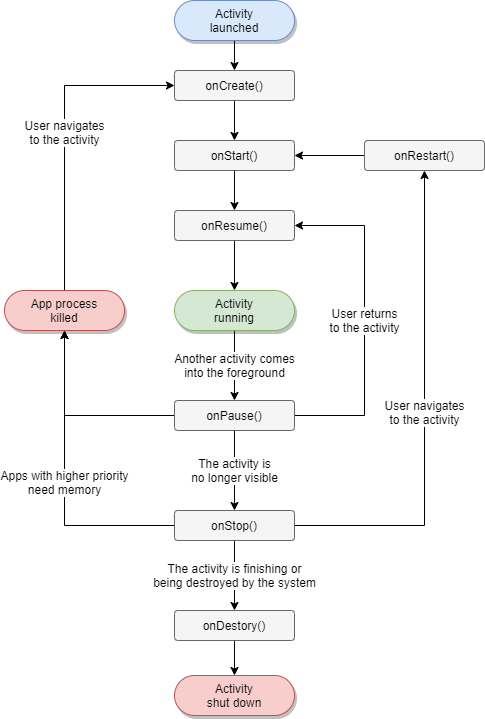

# 第8章 管理 Activity 和组件运行状态的系统进程 -- ActivityManagerService （AMS）

ActivityStack：用于记录和管理Activity（念经似的时时默念他）

## 8.1 功能概述

ActivityManagerService（AMS）是系统中所有Activity的管理程序，是与应用APK交互最频繁的一个服务。

### AMS初始化

* AMS 在启动过程中会向 ServiceManager 登记多种 BinderServer，如“activity”，“meminfo”，“cpuinfo” 等。
* AMS 在其 main() 方法中被初始化，创建并启动 AThread 线程对象。
* AMS 通过 setSystemProcess() 静态方法注册 binder 服务，名称为”activity“。

流程如下图所示：

<pre>

</pre>

AMS 提供的功能通过 IActivityManager（android-4.0.1_r1\frameworks\base\core\java\android\app\IActivityManager.java） 接口体现。分如下四个部分：

* 组件状态管理：如 startActivity()，activityPaused()，startService() ，broadcastIntent() ，removeContentProvider() 等
* 组件状态查询：getCallingActivity()，getServices() 等
* Task 相关：removeTask()，moveTaskBackwards() 等
* 其他：getMemoryInfo()，setDebugApp() 等

## 8.2 管理当前系统中 Activity 状态 -- ActivityStack

mMainStack 是 AMS 中的核心变量。这是记录和管理所有 Activity 的对象。

### 1, ActivityState

ActivityState 是 ActivityStack 中的一个枚举类型对象。描述一个 Activity 可能所处的状态

````java
    enum ActivityState {
        INITIALIZING,  // 正在初始化
        RESUMED,       // 恢复
        PAUSING,       // 正在暂停
        PAUSED,        // 已经暂停
        STOPPING,      // 正在停止
        STOPPED,       // 已经停止
        FINISHING,     // 正在完成
        DESTROYING,    // 正在销毁
        DESTROYED      // 已经销毁
    }
````

<pre>

</pre>


### 2, ActivityRecord 容器

ActivityStack 还有一些 `ArrayList<ActivityRecord>`  对象，负责记录系统中 Activity 的特殊状态。常用对象如下：

| 变量                    | 描述                                                         |
| ----------------------- | ------------------------------------------------------------ |
| mHistory                | 记录所有未被销毁的 Activity 信息                             |
| mLRUActivities          | 记录所有正在运行的 Activity 信息，以最近使用情况排序，即队首元素是最近使用最少的元素 |
| mStoppingActivities     | 记录可以被 stop 的 Activity 信息                             |
| mGoingToSleepActivities | 记录正在进入睡眠的 Activity 信息                             |
| mNoAnimActivities       | 记录不做状态迁移动画的 Activity 信息                         |
| mFinishingActivities    | 记录可以被 finish 的 Activity 信息                           |

### 3，记录特殊状态下的 Activity

| 变量                 | 描述                                    |
| -------------------- | --------------------------------------- |
| mPausingActivity     | 正在被暂停的 Activity                   |
| mLastPausedActivity  | 上一个被暂停的 Activity                 |
| mResumedActivity     | 当前被 resumed 的 Activity，可以为 null |
| mLastStartedActivity | 最近一次被启动的 Activity               |

上面三种类型的变量构成了 ActivityStack 的主框架。回到AMS，简单来说，AMS 的功能就是：

````java
// AMS 主要通过 ActivityStack 来记录，管理系统中的 Activity 状态的一个服务
//   * 支持对 Activity 的管理，记录，查询
//   * AMS 是系统进程的一部分
public final class ActivityManagerService extends ActivityManagerNative
        implements Watchdog.Monitor, BatteryStatsImpl.BatteryCallback {
````

## 8.3 startActivity 流程


