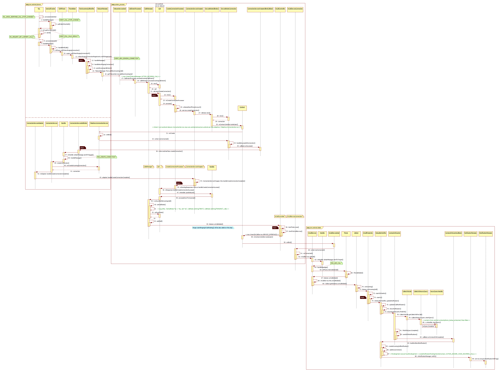

# 系统来电流程

Android系统上当有来电时，由Modem通过RIL通知Java，事件来到Java层，经过Telephony Framework，telephony service和call app，最终呈现来电界面给用户。
本文描述在Android模拟器上处理一个来电事件的全部过程。

## 1. 预览

为便于查找和唤醒记忆，这里直接贴出整个MT事件的时序图，如下：

## 2. 图中标记点说明

### 2.1

## 3. 工作模型

## 4. 来电小结

# 接电话流程

    "main@9398" prio=5 runnable
      java.lang.Thread.State: RUNNABLE
          at com.android.incallui.AnswerFragment.onAnswer(AnswerFragment.java:358)
          at com.android.incallui.GlowPadWrapper.onTrigger(GlowPadWrapper.java:116)
          at com.android.incallui.widget.multiwaveview.GlowPadView.dispatchTriggerEvent(GlowPadView.java:477)
          at com.android.incallui.widget.multiwaveview.GlowPadView.doFinish(GlowPadView.java:498)
          at com.android.incallui.widget.multiwaveview.GlowPadView.switchToState(GlowPadView.java:430)
          at com.android.incallui.widget.multiwaveview.GlowPadView.handleUp(GlowPadView.java:864)
          at com.android.incallui.widget.multiwaveview.GlowPadView.onTouchEvent(GlowPadView.java:823)

## 5. 附录：调试环境搭建

