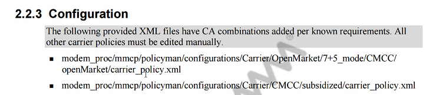
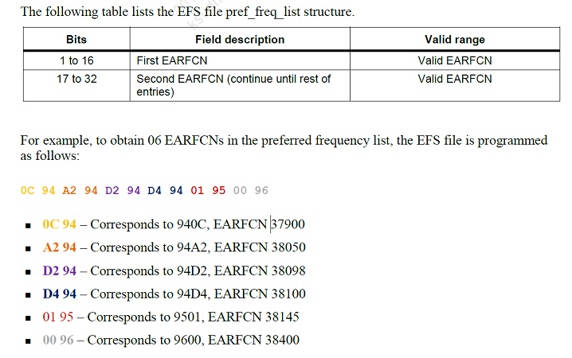

# CA configuration

## Document

    80-P2931-1 D

## content

1. policy file plmn write to EFS file (band info according to carrier)
2. QMI api to write to EFS file

# CA configuration

# Configure Preferred Frequency List in LTE

## Document

    80-P2177-1 D

[configure_preferred_frequency_list_in_lte.pdf](configure_preferred_frequency_list_in_lte.pdf)

## content

# CMAPI - Modem parameters

## Document

    80-NB626-1/80-N9218-1

<table class="MsoNormalTable" border="0" cellspacing="0" cellpadding="0" width="923" style="width:692.0pt;margin-left:-.75pt;border-collapse:collapse;mso-yfti-tbllook:
 1184;mso-padding-alt:0cm 0cm 0cm 0cm">
 <tbody><tr style="mso-yfti-irow:0;mso-yfti-firstrow:yes;height:17.25pt">
  <td width="64" nowrap="" style="width:48.0pt;border-top:solid windowtext 1.5pt;
  border-left:solid windowtext 1.5pt;border-bottom:none;border-right:solid windowtext 1.0pt;
  padding:0cm 5.4pt 0cm 5.4pt;height:17.25pt">
  
<b>&nbsp;<o:p></o:p></b>

  </td>
  <td width="375" style="width:281.0pt;border-top:solid windowtext 1.5pt;
  border-left:none;border-bottom:none;border-right:solid windowtext 1.0pt;
  background:yellow;padding:0cm 5.4pt 0cm 5.4pt;height:17.25pt">
  
<b>Topic<o:p></o:p></b>

  </td>
  <td width="223" nowrap="" style="width:167.0pt;border-top:solid windowtext 1.5pt;
  border-left:none;border-bottom:none;border-right:solid windowtext 1.0pt;
  background:yellow;padding:0cm 5.4pt 0cm 5.4pt;height:17.25pt">
  
<b>DCN<o:p></o:p></b>

  </td>
  <td width="75" nowrap="" style="width:56.0pt;border-top:solid windowtext 1.5pt;
  border-left:none;border-bottom:none;border-right:solid windowtext 1.0pt;
  background:yellow;padding:0cm 5.4pt 0cm 5.4pt;height:17.25pt">
  
<b>Date
  (NA)<o:p></o:p></b>

  </td>
  <td width="79" nowrap="" style="width:59.0pt;border-top:solid windowtext 1.5pt;
  border-left:none;border-bottom:none;border-right:solid windowtext 1.0pt;
  background:yellow;padding:0cm 5.4pt 0cm 5.4pt;height:17.25pt">
  
<b>Time
  (CST)<o:p></o:p></b>

  </td>
  <td width="108" nowrap="" style="width:81.0pt;border-top:solid windowtext 1.5pt;
  border-left:none;border-bottom:none;border-right:solid windowtext 1.5pt;
  background:yellow;padding:0cm 5.4pt 0cm 5.4pt;height:17.25pt">
  
<b>Presenter<o:p></o:p></b>

  </td>
 </tr>
 <tr style="mso-yfti-irow:1;height:16.5pt">
  <td width="64" nowrap="" style="width:48.0pt;border-top:1.5pt;border-left:1.5pt;
  border-bottom:1.0pt;border-right:1.0pt;border-color:windowtext;border-style:
  solid;background:#D6DCE4;padding:0cm 5.4pt 0cm 5.4pt;height:16.5pt">
  
<b>C2K<o:p></o:p></b>

  </td>
  <td width="375" style="width:281.0pt;border-top:solid windowtext 1.5pt;
  border-left:none;border-bottom:solid windowtext 1.0pt;border-right:solid windowtext 1.0pt;
  background:#D6DCE4;padding:0cm 5.4pt 0cm 5.4pt;height:16.5pt">
  
PLMN/RAT selection/ Registration failure<o:p></o:p>

  </td>
  <td width="223" nowrap="" style="width:167.0pt;border-top:solid windowtext 1.5pt;
  border-left:none;border-bottom:solid windowtext 1.0pt;border-right:solid windowtext 1.0pt;
  background:#D6DCE4;padding:0cm 5.4pt 0cm 5.4pt;height:16.5pt">
  
80-N9533-2<o:p></o:p>

  </td>
  <td width="75" nowrap="" rowspan="4" style="width:56.0pt;border-top:solid windowtext 1.5pt;
  border-left:none;border-bottom:solid black 1.5pt;border-right:solid windowtext 1.0pt;
  background:#D6DCE4;padding:0cm 5.4pt 0cm 5.4pt;height:16.5pt">
  
8/23/2016<o:p></o:p>

  </td>
  <td width="79" nowrap="" style="width:59.0pt;border-top:solid windowtext 1.5pt;
  border-left:none;border-bottom:solid windowtext 1.0pt;border-right:solid windowtext 1.0pt;
  background:#D6DCE4;padding:0cm 5.4pt 0cm 5.4pt;height:16.5pt">
  
9:15 AM<o:p></o:p>

  </td>
  <td width="108" nowrap="" style="width:81.0pt;border-top:solid windowtext 1.5pt;
  border-left:none;border-bottom:solid windowtext 1.0pt;border-right:solid windowtext 1.5pt;
  background:#D6DCE4;padding:0cm 5.4pt 0cm 5.4pt;height:16.5pt">
  
John<o:p></o:p>

  </td>
 </tr>
 <tr style="mso-yfti-irow:2;height:15.75pt">
  <td width="64" nowrap="" rowspan="3" style="width:48.0pt;border-top:none;border-left:
  solid windowtext 1.5pt;border-bottom:solid black 1.5pt;border-right:solid windowtext 1.0pt;
  background:#D6DCE4;padding:0cm 5.4pt 0cm 5.4pt;height:15.75pt">
  
<b>NAS<o:p></o:p></b>

  </td>
  <td width="375" style="width:281.0pt;border-top:none;border-left:none;
  border-bottom:solid windowtext 1.0pt;border-right:solid windowtext 1.0pt;
  background:#D6DCE4;padding:0cm 5.4pt 0cm 5.4pt;height:15.75pt">
  
Supplementary Service Debug<o:p></o:p>

  </td>
  <td width="223" nowrap="" style="width:167.0pt;border-top:none;border-left:none;
  border-bottom:solid windowtext 1.0pt;border-right:solid windowtext 1.0pt;
  background:#D6DCE4;padding:0cm 5.4pt 0cm 5.4pt;height:15.75pt">
  
80-NV772-2 <o:p></o:p>

  </td>
  <td width="79" nowrap="" style="width:59.0pt;border-top:none;border-left:none;
  border-bottom:solid windowtext 1.0pt;border-right:solid windowtext 1.0pt;
  background:#D6DCE4;padding:0cm 5.4pt 0cm 5.4pt;height:15.75pt">
  
10:00 AM<o:p></o:p>

  </td>
  <td width="108" nowrap="" style="width:81.0pt;border-top:none;border-left:none;
  border-bottom:solid windowtext 1.0pt;border-right:solid windowtext 1.5pt;
  background:#D6DCE4;padding:0cm 5.4pt 0cm 5.4pt;height:15.75pt">
  
Zhang Hao<o:p></o:p>

  </td>
 </tr>
 <tr style="mso-yfti-irow:3;height:15.75pt">
  <td width="375" style="width:281.0pt;border-top:none;border-left:none;
  border-bottom:solid windowtext 1.0pt;border-right:solid windowtext 1.0pt;
  background:#D6DCE4;padding:0cm 5.4pt 0cm 5.4pt;height:15.75pt">
  
Short Message Debug /CB Config<o:p></o:p>

  </td>
  <td width="223" nowrap="" style="width:167.0pt;border-top:none;border-left:none;
  border-bottom:solid windowtext 1.0pt;border-right:solid windowtext 1.0pt;
  background:#D6DCE4;padding:0cm 5.4pt 0cm 5.4pt;height:15.75pt">
  
80-P2102-1/Solution 00026182<o:p></o:p>

  </td>
  <td width="79" nowrap="" style="width:59.0pt;border-top:none;border-left:none;
  border-bottom:solid windowtext 1.0pt;border-right:solid windowtext 1.0pt;
  background:#D6DCE4;padding:0cm 5.4pt 0cm 5.4pt;height:15.75pt">
  
10:30 AM<o:p></o:p>

  </td>
  <td width="108" nowrap="" style="width:81.0pt;border-top:none;border-left:none;
  border-bottom:solid windowtext 1.0pt;border-right:solid windowtext 1.5pt;
  background:#D6DCE4;padding:0cm 5.4pt 0cm 5.4pt;height:15.75pt">
  
Zhang Hao<o:p></o:p>

  </td>
 </tr>
 <tr style="mso-yfti-irow:4;height:15.75pt">
  <td width="375" style="width:281.0pt;border-top:none;border-left:none;
  border-bottom:solid windowtext 1.5pt;border-right:solid windowtext 1.0pt;
  background:#D6DCE4;padding:0cm 5.4pt 0cm 5.4pt;height:15.75pt">
  
Call performance / Rxd / IRAT<o:p></o:p>

  </td>
  <td width="223" nowrap="" style="width:167.0pt;border-top:none;border-left:none;
  border-bottom:solid windowtext 1.5pt;border-right:solid windowtext 1.0pt;
  background:#D6DCE4;padding:0cm 5.4pt 0cm 5.4pt;height:15.75pt">
  
80-VP191-1/80-VR386-1/80-NA157-21<o:p></o:p>

  </td>
  <td width="79" nowrap="" style="width:59.0pt;border-top:none;border-left:none;
  border-bottom:solid windowtext 1.5pt;border-right:solid windowtext 1.0pt;
  background:#D6DCE4;padding:0cm 5.4pt 0cm 5.4pt;height:15.75pt">
  
11:00 AM<o:p></o:p>

  </td>
  <td width="108" nowrap="" style="width:81.0pt;border-top:none;border-left:none;
  border-bottom:solid windowtext 1.5pt;border-right:solid windowtext 1.5pt;
  background:#D6DCE4;padding:0cm 5.4pt 0cm 5.4pt;height:15.75pt">
  
Zhang Hao<o:p></o:p>

  </td>
 </tr>
 <tr style="mso-yfti-irow:5;height:16.5pt">
  <td width="64" nowrap="" rowspan="3" style="width:48.0pt;border-top:none;border-left:
  solid windowtext 1.5pt;border-bottom:solid black 1.5pt;border-right:solid windowtext 1.0pt;
  background:#DDEBF7;padding:0cm 5.4pt 0cm 5.4pt;height:16.5pt">
  
<b>DATA<o:p></o:p></b>

  </td>
  <td width="375" style="width:281.0pt;border-top:none;border-left:none;
  border-bottom:solid windowtext 1.0pt;border-right:solid windowtext 1.0pt;
  background:#DDEBF7;padding:0cm 5.4pt 0cm 5.4pt;height:16.5pt">
  
ePDG Feature overview<o:p></o:p>

  </td>
  <td width="223" nowrap="" style="width:167.0pt;border-top:none;border-left:none;
  border-bottom:solid windowtext 1.0pt;border-right:solid windowtext 1.0pt;
  background:#DDEBF7;padding:0cm 5.4pt 0cm 5.4pt;height:16.5pt">
  
80-NJ704-2<o:p></o:p>

  </td>
  <td width="75" nowrap="" rowspan="3" style="width:56.0pt;border-top:none;border-left:
  none;border-bottom:solid black 1.5pt;border-right:solid windowtext 1.0pt;
  background:#DDEBF7;padding:0cm 5.4pt 0cm 5.4pt;height:16.5pt">
  
8/24/2016<o:p></o:p>

  </td>
  <td width="79" nowrap="" style="width:59.0pt;border-top:none;border-left:none;
  border-bottom:solid windowtext 1.0pt;border-right:solid windowtext 1.0pt;
  background:#DDEBF7;padding:0cm 5.4pt 0cm 5.4pt;height:16.5pt">
  
9:15 AM<o:p></o:p>

  </td>
  <td width="108" nowrap="" style="width:81.0pt;border-top:none;border-left:none;
  border-bottom:solid windowtext 1.0pt;border-right:solid windowtext 1.5pt;
  background:#DDEBF7;padding:0cm 5.4pt 0cm 5.4pt;height:16.5pt">
  
Michael<o:p></o:p>

  </td>
 </tr>
 <tr style="mso-yfti-irow:6;height:15.75pt">
  <td width="375" style="width:281.0pt;border-top:none;border-left:none;
  border-bottom:solid windowtext 1.0pt;border-right:solid windowtext 1.0pt;
  background:#DDEBF7;padding:0cm 5.4pt 0cm 5.4pt;height:15.75pt">
  
IPv6<o:p></o:p>

  </td>
  <td width="223" nowrap="" style="width:167.0pt;border-top:none;border-left:none;
  border-bottom:solid windowtext 1.0pt;border-right:solid windowtext 1.0pt;
  background:#DDEBF7;padding:0cm 5.4pt 0cm 5.4pt;height:15.75pt">
  
80-NB441-1<o:p></o:p>

  </td>
  <td width="79" nowrap="" style="width:59.0pt;border-top:none;border-left:none;
  border-bottom:solid windowtext 1.0pt;border-right:solid windowtext 1.0pt;
  background:#DDEBF7;padding:0cm 5.4pt 0cm 5.4pt;height:15.75pt">
  
10:15 AM<o:p></o:p>

  </td>
  <td width="108" nowrap="" style="width:81.0pt;border-top:none;border-left:none;
  border-bottom:solid windowtext 1.0pt;border-right:solid windowtext 1.5pt;
  background:#DDEBF7;padding:0cm 5.4pt 0cm 5.4pt;height:15.75pt">
  
Siva Gude<o:p></o:p>

  </td>
 </tr>
 <tr style="mso-yfti-irow:7;height:15.75pt">
  <td width="375" style="width:281.0pt;border-top:none;border-left:none;
  border-bottom:solid windowtext 1.5pt;border-right:solid windowtext 1.0pt;
  background:#DDEBF7;padding:0cm 5.4pt 0cm 5.4pt;height:15.75pt">
  
ATCOP<o:p></o:p>

  </td>
  <td width="223" nowrap="" style="width:167.0pt;border-top:none;border-left:none;
  border-bottom:solid windowtext 1.5pt;border-right:solid windowtext 1.0pt;
  background:#DDEBF7;padding:0cm 5.4pt 0cm 5.4pt;height:15.75pt">
  
80-VR432-1&nbsp;<o:p></o:p>

  </td>
  <td width="79" nowrap="" style="width:59.0pt;border-top:none;border-left:none;
  border-bottom:solid windowtext 1.5pt;border-right:solid windowtext 1.0pt;
  background:#DDEBF7;padding:0cm 5.4pt 0cm 5.4pt;height:15.75pt">
  
11:15 AM<o:p></o:p>

  </td>
  <td width="108" nowrap="" style="width:81.0pt;border-top:none;border-left:none;
  border-bottom:solid windowtext 1.5pt;border-right:solid windowtext 1.5pt;
  background:#DDEBF7;padding:0cm 5.4pt 0cm 5.4pt;height:15.75pt">
  
Bhavik<o:p></o:p>

  </td>
 </tr>
 <tr style="mso-yfti-irow:8;height:16.5pt">
  <td width="64" nowrap="" rowspan="2" style="width:48.0pt;border-top:none;border-left:
  solid windowtext 1.5pt;border-bottom:solid black 1.0pt;border-right:solid windowtext 1.0pt;
  background:#FCE4D6;padding:0cm 5.4pt 0cm 5.4pt;height:16.5pt">
  
<b>DATA<o:p></o:p></b>

  </td>
  <td width="375" style="width:281.0pt;border-top:none;border-left:none;
  border-bottom:solid windowtext 1.0pt;border-right:solid windowtext 1.0pt;
  background:#FCE4D6;padding:0cm 5.4pt 0cm 5.4pt;height:16.5pt">
  
Soft AP<o:p></o:p>

  </td>
  <td width="223" nowrap="" style="width:167.0pt;border-top:none;border-left:none;
  border-bottom:solid windowtext 1.0pt;border-right:solid windowtext 1.0pt;
  background:#FCE4D6;padding:0cm 5.4pt 0cm 5.4pt;height:16.5pt">
  
80-P0711-39<o:p></o:p>

  </td>
  <td width="75" nowrap="" rowspan="4" style="width:56.0pt;border-top:none;border-left:
  none;border-bottom:solid black 1.5pt;border-right:solid windowtext 1.0pt;
  background:#FCE4D6;padding:0cm 5.4pt 0cm 5.4pt;height:16.5pt">
  
8/30/2016<o:p></o:p>

  </td>
  <td width="79" nowrap="" style="width:59.0pt;border-top:none;border-left:none;
  border-bottom:solid windowtext 1.0pt;border-right:solid windowtext 1.0pt;
  background:#FCE4D6;padding:0cm 5.4pt 0cm 5.4pt;height:16.5pt">
  
9:15 AM<o:p></o:p>

  </td>
  <td width="108" nowrap="" style="width:81.0pt;border-top:none;border-left:none;
  border-bottom:solid windowtext 1.0pt;border-right:solid windowtext 1.5pt;
  background:#FCE4D6;padding:0cm 5.4pt 0cm 5.4pt;height:16.5pt">
  
Ying<o:p></o:p>

  </td>
 </tr>
 <tr style="mso-yfti-irow:9;height:15.75pt">
  <td width="375" style="width:281.0pt;border-top:none;border-left:none;
  border-bottom:solid windowtext 1.0pt;border-right:solid windowtext 1.0pt;
  background:#FCE4D6;padding:0cm 5.4pt 0cm 5.4pt;height:15.75pt">
  
3GPP Data (APN/Profile/Multiple PDNs)<o:p></o:p>

  </td>
  <td width="223" nowrap="" style="width:167.0pt;border-top:none;border-left:none;
  border-bottom:solid windowtext 1.0pt;border-right:solid windowtext 1.0pt;
  background:#FCE4D6;padding:0cm 5.4pt 0cm 5.4pt;height:15.75pt">
  
80-VT387-1<o:p></o:p>

  </td>
  <td width="79" nowrap="" style="width:59.0pt;border-top:none;border-left:none;
  border-bottom:solid windowtext 1.0pt;border-right:solid windowtext 1.0pt;
  background:#FCE4D6;padding:0cm 5.4pt 0cm 5.4pt;height:15.75pt">
  
10:00 AM<o:p></o:p>

  </td>
  <td width="108" nowrap="" style="width:81.0pt;border-top:none;border-left:none;
  border-bottom:solid windowtext 1.0pt;border-right:solid windowtext 1.5pt;
  background:#FCE4D6;padding:0cm 5.4pt 0cm 5.4pt;height:15.75pt">
  
Bhavik/Alex<o:p></o:p>

  </td>
 </tr>
 <tr style="mso-yfti-irow:10;height:15.75pt">
  <td width="64" nowrap="" rowspan="2" style="width:48.0pt;border-top:none;border-left:
  solid windowtext 1.5pt;border-bottom:solid black 1.5pt;border-right:solid windowtext 1.0pt;
  background:#FCE4D6;padding:0cm 5.4pt 0cm 5.4pt;height:15.75pt">
  
<b>GERAN<o:p></o:p></b>

  </td>
  <td width="375" style="width:281.0pt;border-top:none;border-left:none;
  border-bottom:solid windowtext 1.0pt;border-right:solid windowtext 1.0pt;
  background:#FCE4D6;padding:0cm 5.4pt 0cm 5.4pt;height:15.75pt">
  
VAMOS and Rx Diversity<o:p></o:p>

  </td>
  <td width="223" nowrap="" style="width:167.0pt;border-top:none;border-left:none;
  border-bottom:solid windowtext 1.0pt;border-right:solid windowtext 1.0pt;
  background:#FCE4D6;padding:0cm 5.4pt 0cm 5.4pt;height:15.75pt">
  
80-NH874-1<o:p></o:p>

  </td>
  <td width="79" nowrap="" style="width:59.0pt;border-top:none;border-left:none;
  border-bottom:solid windowtext 1.0pt;border-right:solid windowtext 1.0pt;
  background:#FCE4D6;padding:0cm 5.4pt 0cm 5.4pt;height:15.75pt">
  
10:40 AM<o:p></o:p>

  </td>
  <td width="108" nowrap="" style="width:81.0pt;border-top:none;border-left:none;
  border-bottom:solid windowtext 1.0pt;border-right:solid windowtext 1.5pt;
  background:#FCE4D6;padding:0cm 5.4pt 0cm 5.4pt;height:15.75pt">
  
Qutub<o:p></o:p>

  </td>
 </tr>
 <tr style="mso-yfti-irow:11;height:15.75pt">
  <td width="375" style="width:281.0pt;border-top:none;border-left:none;
  border-bottom:solid windowtext 1.5pt;border-right:solid windowtext 1.0pt;
  background:#FCE4D6;padding:0cm 5.4pt 0cm 5.4pt;height:15.75pt">
  
GSM Rx Diversity Overview<o:p></o:p>

  </td>
  <td width="223" nowrap="" style="width:167.0pt;border-top:none;border-left:none;
  border-bottom:solid windowtext 1.5pt;border-right:solid windowtext 1.0pt;
  background:#FCE4D6;padding:0cm 5.4pt 0cm 5.4pt;height:15.75pt">
  
80-NM301-1<o:p></o:p>

  </td>
  <td width="79" nowrap="" style="width:59.0pt;border-top:none;border-left:none;
  border-bottom:solid windowtext 1.5pt;border-right:solid windowtext 1.0pt;
  background:#FCE4D6;padding:0cm 5.4pt 0cm 5.4pt;height:15.75pt">
  
11:15 AM<o:p></o:p>

  </td>
  <td width="108" nowrap="" style="width:81.0pt;border-top:none;border-left:none;
  border-bottom:solid windowtext 1.5pt;border-right:solid windowtext 1.5pt;
  background:#FCE4D6;padding:0cm 5.4pt 0cm 5.4pt;height:15.75pt">
  
Qutub<o:p></o:p>

  </td>
 </tr>
 <tr style="mso-yfti-irow:12;height:16.5pt">
  <td width="64" nowrap="" rowspan="3" style="width:48.0pt;border-top:none;border-left:
  solid windowtext 1.5pt;border-bottom:solid black 1.5pt;border-right:solid windowtext 1.0pt;
  background:#EDEDED;padding:0cm 5.4pt 0cm 5.4pt;height:16.5pt">
  
<b>QMI/RIL<o:p></o:p></b>

  </td>
  <td width="375" style="width:281.0pt;border-top:none;border-left:none;
  border-bottom:solid windowtext 1.0pt;border-right:solid windowtext 1.0pt;
  background:#EDEDED;padding:0cm 5.4pt 0cm 5.4pt;height:16.5pt">
  
QMI Service<o:p></o:p>

  </td>
  <td width="223" nowrap="" style="width:167.0pt;border-top:none;border-left:none;
  border-bottom:solid windowtext 1.0pt;border-right:solid windowtext 1.0pt;
  background:#EDEDED;padding:0cm 5.4pt 0cm 5.4pt;height:16.5pt">
  
80-N4863-1<o:p></o:p>

  </td>
  <td width="75" nowrap="" rowspan="3" style="width:56.0pt;border-top:none;border-left:
  none;border-bottom:solid black 1.5pt;border-right:solid windowtext 1.0pt;
  background:#EDEDED;padding:0cm 5.4pt 0cm 5.4pt;height:16.5pt">
  
8/31/2016<o:p></o:p>

  </td>
  <td width="79" nowrap="" style="width:59.0pt;border-top:none;border-left:none;
  border-bottom:solid windowtext 1.0pt;border-right:solid windowtext 1.0pt;
  background:#EDEDED;padding:0cm 5.4pt 0cm 5.4pt;height:16.5pt">
  
9:15 AM<o:p></o:p>

  </td>
  <td width="108" nowrap="" style="width:81.0pt;border-top:none;border-left:none;
  border-bottom:solid windowtext 1.0pt;border-right:solid windowtext 1.5pt;
  background:#EDEDED;padding:0cm 5.4pt 0cm 5.4pt;height:16.5pt">
  
Qutub<o:p></o:p>

  </td>
 </tr>
 <tr style="mso-yfti-irow:13;height:15.75pt">
  <td width="375" style="width:281.0pt;border-top:none;border-left:none;
  border-bottom:solid windowtext 1.0pt;border-right:solid windowtext 1.0pt;
  background:#EDEDED;padding:0cm 5.4pt 0cm 5.4pt;height:15.75pt">
  
Enable /Disable DPM features / Working with
  Android Doze mode<o:p></o:p>

  </td>
  <td width="223" nowrap="" style="width:167.0pt;border-top:none;border-left:none;
  border-bottom:solid windowtext 1.0pt;border-right:solid windowtext 1.0pt;
  background:#EDEDED;padding:0cm 5.4pt 0cm 5.4pt;height:15.75pt">
  
80-P2484-28<o:p></o:p>

  </td>
  <td width="79" nowrap="" style="width:59.0pt;border-top:none;border-left:none;
  border-bottom:solid windowtext 1.0pt;border-right:solid windowtext 1.0pt;
  background:#EDEDED;padding:0cm 5.4pt 0cm 5.4pt;height:15.75pt">
  
10:15 AM<o:p></o:p>

  </td>
  <td width="108" nowrap="" style="width:81.0pt;border-top:none;border-left:none;
  border-bottom:solid windowtext 1.0pt;border-right:solid windowtext 1.5pt;
  background:#EDEDED;padding:0cm 5.4pt 0cm 5.4pt;height:15.75pt">
  
Killampalli,
  Jatin<o:p></o:p>

  </td>
 </tr>
 <tr style="mso-yfti-irow:14;height:15.75pt">
  <td width="375" style="width:281.0pt;border-top:none;border-left:none;
  border-bottom:solid windowtext 1.5pt;border-right:solid windowtext 1.0pt;
  background:#EDEDED;padding:0cm 5.4pt 0cm 5.4pt;height:15.75pt">
  
Power saving mode (PSM)<o:p></o:p>

  </td>
  <td width="223" nowrap="" style="width:167.0pt;border-top:none;border-left:none;
  border-bottom:solid windowtext 1.5pt;border-right:solid windowtext 1.0pt;
  background:#EDEDED;padding:0cm 5.4pt 0cm 5.4pt;height:15.75pt">
  
80-P2200-44<o:p></o:p>

  </td>
  <td width="79" nowrap="" style="width:59.0pt;border-top:none;border-left:none;
  border-bottom:solid windowtext 1.5pt;border-right:solid windowtext 1.0pt;
  background:#EDEDED;padding:0cm 5.4pt 0cm 5.4pt;height:15.75pt">
  
11:15 AM<o:p></o:p>

  </td>
  <td width="108" nowrap="" style="width:81.0pt;border-top:none;border-left:none;
  border-bottom:solid windowtext 1.5pt;border-right:solid windowtext 1.5pt;
  background:#EDEDED;padding:0cm 5.4pt 0cm 5.4pt;height:15.75pt">
  
Lee, Youngrak<o:p></o:p>

  </td>
 </tr>
 <tr style="mso-yfti-irow:15;height:16.5pt">
  <td width="64" nowrap="" rowspan="4" style="width:48.0pt;border-top:none;border-left:
  solid windowtext 1.5pt;border-bottom:solid black 1.5pt;border-right:solid windowtext 1.0pt;
  background:#D9E1F2;padding:0cm 5.4pt 0cm 5.4pt;height:16.5pt">
  
<b>LTE<o:p></o:p></b>

  </td>
  <td width="375" style="width:281.0pt;border-top:none;border-left:none;
  border-bottom:solid windowtext 1.0pt;border-right:solid windowtext 1.0pt;
  background:#D9E1F2;padding:0cm 5.4pt 0cm 5.4pt;height:16.5pt">
  
CA configuration - 2DL/3DL config tips<o:p></o:p>

  </td>
  <td width="223" nowrap="" style="width:167.0pt;border-top:none;border-left:none;
  border-bottom:solid windowtext 1.0pt;border-right:solid windowtext 1.0pt;
  background:#D9E1F2;padding:0cm 5.4pt 0cm 5.4pt;height:16.5pt">
  
80-P2931-1<o:p></o:p>

  </td>
  <td width="75" nowrap="" rowspan="4" style="width:56.0pt;border-top:none;border-left:
  none;border-bottom:solid black 1.5pt;border-right:solid windowtext 1.0pt;
  background:#D9E1F2;padding:0cm 5.4pt 0cm 5.4pt;height:16.5pt">
  
9/7/2016<o:p></o:p>

  </td>
  <td width="79" nowrap="" style="width:59.0pt;border-top:none;border-left:none;
  border-bottom:solid windowtext 1.0pt;border-right:solid windowtext 1.0pt;
  background:#D9E1F2;padding:0cm 5.4pt 0cm 5.4pt;height:16.5pt">
  
9:15 AM<o:p></o:p>

  </td>
  <td width="108" nowrap="" style="width:81.0pt;border-top:none;border-left:none;
  border-bottom:solid windowtext 1.0pt;border-right:solid windowtext 1.5pt;
  background:#D9E1F2;padding:0cm 5.4pt 0cm 5.4pt;height:16.5pt">
  
Claire<o:p></o:p>

  </td>
 </tr>
 <tr style="mso-yfti-irow:16;height:15.75pt">
  <td width="375" style="width:281.0pt;border-top:none;border-left:none;
  border-bottom:solid windowtext 1.0pt;border-right:solid windowtext 1.0pt;
  background:#D9E1F2;padding:0cm 5.4pt 0cm 5.4pt;height:15.75pt">
  
Secondary Acq DB<o:p></o:p>

  </td>
  <td width="223" nowrap="" style="width:167.0pt;border-top:none;border-left:none;
  border-bottom:solid windowtext 1.0pt;border-right:solid windowtext 1.0pt;
  background:#D9E1F2;padding:0cm 5.4pt 0cm 5.4pt;height:15.75pt">
  
80-P2177-1<o:p></o:p>

  </td>
  <td width="79" nowrap="" style="width:59.0pt;border-top:none;border-left:none;
  border-bottom:solid windowtext 1.0pt;border-right:solid windowtext 1.0pt;
  background:#D9E1F2;padding:0cm 5.4pt 0cm 5.4pt;height:15.75pt">
  
10:00 AM<o:p></o:p>

  </td>
  <td width="108" nowrap="" style="width:81.0pt;border-top:none;border-left:none;
  border-bottom:solid windowtext 1.0pt;border-right:solid windowtext 1.5pt;
  background:#D9E1F2;padding:0cm 5.4pt 0cm 5.4pt;height:15.75pt">
  
Karthik<o:p></o:p>

  </td>
 </tr>
 <tr style="mso-yfti-irow:17;height:15.75pt">
  <td width="375" style="width:281.0pt;border-top:none;border-left:none;
  border-bottom:solid windowtext 1.0pt;border-right:solid windowtext 1.0pt;
  background:#D9E1F2;padding:0cm 5.4pt 0cm 5.4pt;height:15.75pt">
  
CMAPI - Modem parameters<o:p></o:p>

  </td>
  <td width="223" nowrap="" style="width:167.0pt;border-top:none;border-left:none;
  border-bottom:solid windowtext 1.0pt;border-right:solid windowtext 1.0pt;
  background:#D9E1F2;padding:0cm 5.4pt 0cm 5.4pt;height:15.75pt">
  
80-NB626-1/80-N9218-1<o:p></o:p>

  </td>
  <td width="79" nowrap="" style="width:59.0pt;border-top:none;border-left:none;
  border-bottom:solid windowtext 1.0pt;border-right:solid windowtext 1.0pt;
  background:#D9E1F2;padding:0cm 5.4pt 0cm 5.4pt;height:15.75pt">
  
10:30 AM<o:p></o:p>

  </td>
  <td width="108" nowrap="" style="width:81.0pt;border-top:none;border-left:none;
  border-bottom:solid windowtext 1.0pt;border-right:solid windowtext 1.5pt;
  background:#D9E1F2;padding:0cm 5.4pt 0cm 5.4pt;height:15.75pt">
  
Touseef<o:p></o:p>

  </td>
 </tr>
 <tr style="mso-yfti-irow:18;height:15.75pt">
  <td width="375" style="width:281.0pt;border-top:none;border-left:none;
  border-bottom:solid windowtext 1.5pt;border-right:solid windowtext 1.0pt;
  background:#D9E1F2;padding:0cm 5.4pt 0cm 5.4pt;height:15.75pt">
  
Uplink Data Compression (UDC)<o:p></o:p>

  </td>
  <td width="223" nowrap="" style="width:167.0pt;border-top:none;border-left:none;
  border-bottom:solid windowtext 1.5pt;border-right:solid windowtext 1.0pt;
  background:#D9E1F2;padding:0cm 5.4pt 0cm 5.4pt;height:15.75pt">
  
80-P7463-1<o:p></o:p>

  </td>
  <td width="79" nowrap="" style="width:59.0pt;border-top:none;border-left:none;
  border-bottom:solid windowtext 1.5pt;border-right:solid windowtext 1.0pt;
  background:#D9E1F2;padding:0cm 5.4pt 0cm 5.4pt;height:15.75pt">
  
11:15 AM<o:p></o:p>

  </td>
  <td width="108" nowrap="" style="width:81.0pt;border-top:none;border-left:none;
  border-bottom:solid windowtext 1.5pt;border-right:solid windowtext 1.5pt;
  background:#D9E1F2;padding:0cm 5.4pt 0cm 5.4pt;height:15.75pt">
  
Shane<o:p></o:p>

  </td>
 </tr>
 <tr style="mso-yfti-irow:19;height:16.5pt">
  <td width="64" nowrap="" style="width:48.0pt;border-top:none;border-left:solid windowtext 1.5pt;
  border-bottom:solid windowtext 1.0pt;border-right:solid windowtext 1.0pt;
  background:#E2EFDA;padding:0cm 5.4pt 0cm 5.4pt;height:16.5pt">
  
<b>LTE<o:p></o:p></b>

  </td>
  <td width="375" style="width:281.0pt;border-top:none;border-left:none;
  border-bottom:solid windowtext 1.0pt;border-right:solid windowtext 1.0pt;
  background:#E2EFDA;padding:0cm 5.4pt 0cm 5.4pt;height:16.5pt">
  
LTE CATM1 Overview<o:p></o:p>

  </td>
  <td width="223" nowrap="" style="width:167.0pt;border-top:none;border-left:none;
  border-bottom:solid windowtext 1.0pt;border-right:solid windowtext 1.0pt;
  background:#E2EFDA;padding:0cm 5.4pt 0cm 5.4pt;height:16.5pt">
  
80-P7616-1<o:p></o:p>

  </td>
  <td width="75" nowrap="" rowspan="3" style="width:56.0pt;border-top:none;border-left:
  none;border-bottom:solid black 1.5pt;border-right:solid windowtext 1.0pt;
  background:#E2EFDA;padding:0cm 5.4pt 0cm 5.4pt;height:16.5pt">
  
9/13/2016<o:p></o:p>

  </td>
  <td width="79" nowrap="" style="width:59.0pt;border-top:none;border-left:none;
  border-bottom:solid windowtext 1.0pt;border-right:solid windowtext 1.0pt;
  background:#E2EFDA;padding:0cm 5.4pt 0cm 5.4pt;height:16.5pt">
  
9:15 AM<o:p></o:p>

  </td>
  <td width="108" nowrap="" style="width:81.0pt;border-top:none;border-left:none;
  border-bottom:solid windowtext 1.0pt;border-right:solid windowtext 1.5pt;
  background:#E2EFDA;padding:0cm 5.4pt 0cm 5.4pt;height:16.5pt">
  
Siva<o:p></o:p>

  </td>
 </tr>
 <tr style="mso-yfti-irow:20;height:15.75pt">
  <td width="64" nowrap="" rowspan="2" style="width:48.0pt;border-top:none;border-left:
  solid windowtext 1.5pt;border-bottom:solid black 1.5pt;border-right:solid windowtext 1.0pt;
  background:#E2EFDA;padding:0cm 5.4pt 0cm 5.4pt;height:15.75pt">
  
<b>MMODE<o:p></o:p></b>

  </td>
  <td width="375" style="width:281.0pt;border-top:none;border-left:none;
  border-bottom:solid windowtext 1.0pt;border-right:solid windowtext 1.0pt;
  background:#E2EFDA;padding:0cm 5.4pt 0cm 5.4pt;height:15.75pt">
  
Policy manager Overview<o:p></o:p>

  </td>
  <td width="223" nowrap="" style="width:167.0pt;border-top:none;border-left:none;
  border-bottom:solid windowtext 1.0pt;border-right:solid windowtext 1.0pt;
  background:#E2EFDA;padding:0cm 5.4pt 0cm 5.4pt;height:15.75pt">
  
TBD<o:p></o:p>

  </td>
  <td width="79" nowrap="" style="width:59.0pt;border-top:none;border-left:none;
  border-bottom:solid windowtext 1.0pt;border-right:solid windowtext 1.0pt;
  background:#E2EFDA;padding:0cm 5.4pt 0cm 5.4pt;height:15.75pt">
  
10:15 AM<o:p></o:p>

  </td>
  <td width="108" nowrap="" style="width:81.0pt;border-top:none;border-left:none;
  border-bottom:solid windowtext 1.0pt;border-right:solid windowtext 1.5pt;
  background:#E2EFDA;padding:0cm 5.4pt 0cm 5.4pt;height:15.75pt">
  
Andres<o:p></o:p>

  </td>
 </tr>
 <tr style="mso-yfti-irow:21;height:15.75pt">
  <td width="375" style="width:281.0pt;border-top:none;border-left:none;
  border-bottom:solid windowtext 1.5pt;border-right:solid windowtext 1.0pt;
  background:#E2EFDA;padding:0cm 5.4pt 0cm 5.4pt;height:15.75pt">
  
Mmode overview<o:p></o:p>

  </td>
  <td width="223" nowrap="" style="width:167.0pt;border-top:none;border-left:none;
  border-bottom:solid windowtext 1.5pt;border-right:solid windowtext 1.0pt;
  background:#E2EFDA;padding:0cm 5.4pt 0cm 5.4pt;height:15.75pt">
  
TBD<o:p></o:p>

  </td>
  <td width="79" nowrap="" style="width:59.0pt;border-top:none;border-left:none;
  border-bottom:solid windowtext 1.5pt;border-right:solid windowtext 1.0pt;
  background:#E2EFDA;padding:0cm 5.4pt 0cm 5.4pt;height:15.75pt">
  
11:15 AM<o:p></o:p>

  </td>
  <td width="108" nowrap="" style="width:81.0pt;border-top:none;border-left:none;
  border-bottom:solid windowtext 1.5pt;border-right:solid windowtext 1.5pt;
  background:#E2EFDA;padding:0cm 5.4pt 0cm 5.4pt;height:15.75pt">
  
Arif<o:p></o:p>

  </td>
 </tr>
 <tr style="mso-yfti-irow:22;height:16.5pt">
  <td width="64" nowrap="" rowspan="2" style="width:48.0pt;border-top:none;border-left:
  solid windowtext 1.5pt;border-bottom:solid black 1.0pt;border-right:solid windowtext 1.0pt;
  background:#FFF2CC;padding:0cm 5.4pt 0cm 5.4pt;height:16.5pt">
  
<b>QMI/RIL<o:p></o:p></b>

  </td>
  <td width="375" style="width:281.0pt;border-top:none;border-left:none;
  border-bottom:solid windowtext 1.0pt;border-right:solid windowtext 1.0pt;
  background:#FFF2CC;padding:0cm 5.4pt 0cm 5.4pt;height:16.5pt">
  
Data throoughput parameter configuration in
  Android<o:p></o:p>

  </td>
  <td width="223" nowrap="" style="width:167.0pt;border-top:none;border-left:none;
  border-bottom:solid windowtext 1.0pt;border-right:solid windowtext 1.0pt;
  background:#FFF2CC;padding:0cm 5.4pt 0cm 5.4pt;height:16.5pt">
  
TBD<o:p></o:p>

  </td>
  <td width="75" nowrap="" rowspan="4" style="width:56.0pt;border-top:none;border-left:
  none;border-bottom:solid black 1.5pt;border-right:solid windowtext 1.0pt;
  background:#FFF2CC;padding:0cm 5.4pt 0cm 5.4pt;height:16.5pt">
  
9/14/2016<o:p></o:p>

  </td>
  <td width="79" nowrap="" style="width:59.0pt;border-top:none;border-left:none;
  border-bottom:solid windowtext 1.0pt;border-right:solid windowtext 1.0pt;
  background:#FFF2CC;padding:0cm 5.4pt 0cm 5.4pt;height:16.5pt">
  
9:15 AM<o:p></o:p>

  </td>
  <td width="108" nowrap="" style="width:81.0pt;border-top:none;border-left:none;
  border-bottom:solid windowtext 1.0pt;border-right:solid windowtext 1.5pt;
  background:#FFF2CC;padding:0cm 5.4pt 0cm 5.4pt;height:16.5pt">
  
Chou, William<o:p></o:p>

  </td>
 </tr>
 <tr style="mso-yfti-irow:23;height:15.75pt">
  <td width="375" style="width:281.0pt;border-top:none;border-left:none;
  border-bottom:solid windowtext 1.0pt;border-right:solid windowtext 1.0pt;
  background:#FFF2CC;padding:0cm 5.4pt 0cm 5.4pt;height:15.75pt">
  
IPA and supported products<o:p></o:p>

  </td>
  <td width="223" nowrap="" style="width:167.0pt;border-top:none;border-left:none;
  border-bottom:solid windowtext 1.0pt;border-right:solid windowtext 1.0pt;
  background:#FFF2CC;padding:0cm 5.4pt 0cm 5.4pt;height:15.75pt">
  
TBD<o:p></o:p>

  </td>
  <td width="79" nowrap="" style="width:59.0pt;border-top:none;border-left:none;
  border-bottom:solid windowtext 1.0pt;border-right:solid windowtext 1.0pt;
  background:#FFF2CC;padding:0cm 5.4pt 0cm 5.4pt;height:15.75pt">
  
10:00 AM<o:p></o:p>

  </td>
  <td width="108" nowrap="" style="width:81.0pt;border-top:none;border-left:none;
  border-bottom:solid windowtext 1.0pt;border-right:solid windowtext 1.5pt;
  background:#FFF2CC;padding:0cm 5.4pt 0cm 5.4pt;height:15.75pt">
  
Zhang, Jian
  (Terry)<o:p></o:p>

  </td>
 </tr>
 <tr style="mso-yfti-irow:24;height:15.75pt">
  <td width="64" nowrap="" rowspan="2" style="width:48.0pt;border-top:none;border-left:
  solid windowtext 1.5pt;border-bottom:solid black 1.5pt;border-right:solid windowtext 1.0pt;
  background:#FFF2CC;padding:0cm 5.4pt 0cm 5.4pt;height:15.75pt">
  
<b>LTE<o:p></o:p></b>

  </td>
  <td width="375" style="width:281.0pt;border-top:none;border-left:none;
  border-bottom:solid windowtext 1.0pt;border-right:solid windowtext 1.0pt;
  background:#FFF2CC;padding:0cm 5.4pt 0cm 5.4pt;height:15.75pt">
  
LTE release 11/12/13 mandatory features plan for
  each chipset <o:p></o:p>

  </td>
  <td width="223" nowrap="" style="width:167.0pt;border-top:none;border-left:none;
  border-bottom:solid windowtext 1.0pt;border-right:solid windowtext 1.0pt;
  background:#FFF2CC;padding:0cm 5.4pt 0cm 5.4pt;height:15.75pt">
  
80-N6479-2<o:p></o:p>

  </td>
  <td width="79" nowrap="" style="width:59.0pt;border-top:none;border-left:none;
  border-bottom:solid windowtext 1.0pt;border-right:solid windowtext 1.0pt;
  background:#FFF2CC;padding:0cm 5.4pt 0cm 5.4pt;height:15.75pt">
  
10:40 AM<o:p></o:p>

  </td>
  <td width="108" nowrap="" style="width:81.0pt;border-top:none;border-left:none;
  border-bottom:solid windowtext 1.0pt;border-right:solid windowtext 1.5pt;
  background:#FFF2CC;padding:0cm 5.4pt 0cm 5.4pt;height:15.75pt">
  
Shane<o:p></o:p>

  </td>
 </tr>
 <tr style="mso-yfti-irow:25;mso-yfti-lastrow:yes;height:15.75pt">
  <td width="375" style="width:281.0pt;border-top:none;border-left:none;
  border-bottom:solid windowtext 1.5pt;border-right:solid windowtext 1.0pt;
  background:#FFF2CC;padding:0cm 5.4pt 0cm 5.4pt;height:15.75pt">
  
LTE unlicensed Overview<o:p></o:p>

  </td>
  <td width="223" nowrap="" style="width:167.0pt;border-top:none;border-left:none;
  border-bottom:solid windowtext 1.5pt;border-right:solid windowtext 1.0pt;
  background:#FFF2CC;padding:0cm 5.4pt 0cm 5.4pt;height:15.75pt">
  
80-P2484-18<o:p></o:p>

  </td>
  <td width="79" nowrap="" style="width:59.0pt;border-top:none;border-left:none;
  border-bottom:solid windowtext 1.5pt;border-right:solid windowtext 1.0pt;
  background:#FFF2CC;padding:0cm 5.4pt 0cm 5.4pt;height:15.75pt">
  
11:15 AM<o:p></o:p>

  </td>
  <td width="108" nowrap="" style="width:81.0pt;border-top:none;border-left:none;
  border-bottom:solid windowtext 1.5pt;border-right:solid windowtext 1.5pt;
  background:#FFF2CC;padding:0cm 5.4pt 0cm 5.4pt;height:15.75pt">
  
Amit D<o:p></o:p>

  </td>
 </tr>
</tbody></table>

