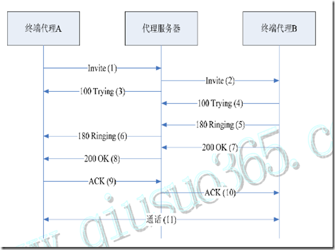
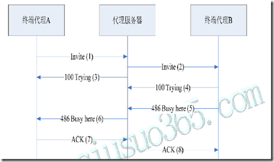
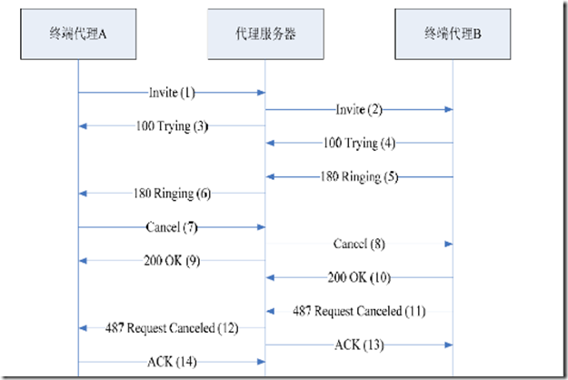
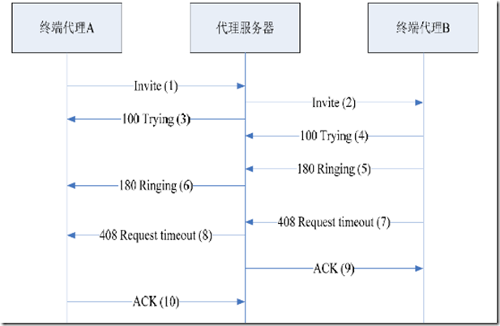
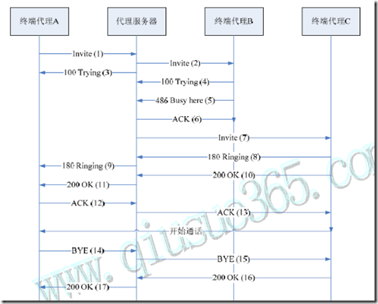
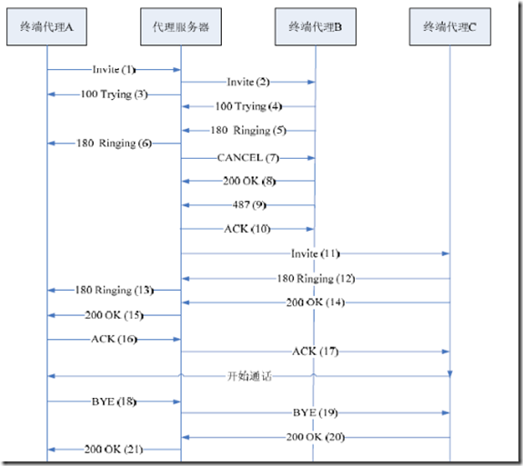
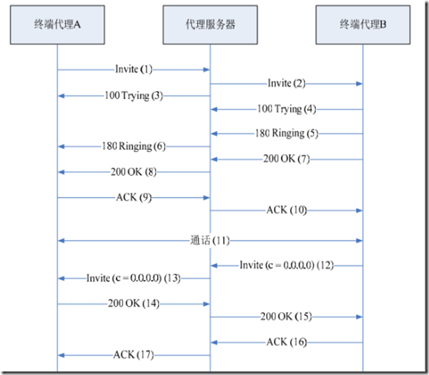
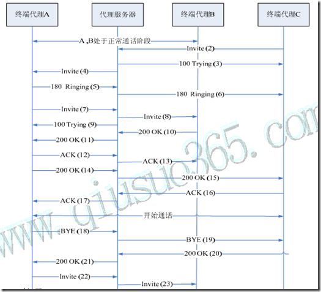
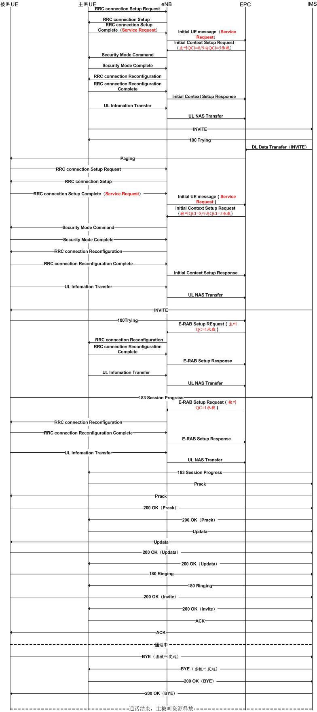

# SIP基本场景分析

##  注册流程：

1. 用户首次试呼时，终端代理A 向代理服务器发送REGISTER 注册请求；
2. 代理服务器通过后端认证/计费中心获知用户信息不在数据库中，便向终端代理回送401Unauthorized 质询信息，其中包含安全认证所需的令牌；
3. 终端代理提示用户输入其标识和密码后，根据安全认证令牌将其加密后，再次用REGISTER 消息报告给代理服务器；
4. 代理服务器将REGISTER 消息中的用户信息解密，通过认证/计费中心验证其合法后，将该用户信息登记到数据库中，并向终端代理A 返回成功响应消息200 OK。

##  注销流程：

1. 终端向代理服务器发送register消息注销，其头中expire字段设置为0。
2. 代理服务器在收到后送回200OK响应，并将数据库中的用户有关消息注销。

##  基本呼叫建立过程：

1. 用户摘机发起一路呼叫，终端代理A向该区域的代理服务器发起Invite请求；
2. 代理服务器通过认证/计费中心确认用户认证已通过后，检查请求消息中的Via头域中是否已包含其地址。若已包含，说明发生环回，返回指示错误的应答；若没有问题，代理服务器在请求消息的Via头域插入自身地址，并向Invite消息的To域所指示的被叫终端代理B传送Invite请求。
3. 代理服务器向终端代理A发送呼叫处理中的应答信息：100Trying。
4. 终端代理B向代理服务器送呼叫处理中的应答信息：100Trying。
5. 终端代理B指示被叫用户振铃，用户振铃后向代理服务器发送180Ringing振铃信息。
6. 代理服务器向终端代理A转发被叫用户振铃信息。
7. 被叫用户摘机，终端代理B向代理服务器返回表示连接成功的应答（200OK）
8. 代理服务器向终端代理A转发该成功指示（200OK）
9. 终端代理A收到信息后，向代理服务器发ACK信息进行确认
10. 代理服务器将ACK确认消息转发给终端代理B。
11. 主被叫用户之间建立通信连接，开始通话。

##  正常呼叫释放过程：

1.  正常呼叫
2.  用户通话结束后，被叫用户挂机，终端代理B向代理服务器发送Bye消息。
3.  代理服务器转发Bye消息至终端代理A，同时向认证、计费中心发送用户通话的详细信息，请求计费。
4.  主叫用户挂机后，终端代理A向代理服务器发送确认挂断响应信息200OK。
5.  代理服务器转发响应信息200OK。

##  会话更改流程：

1. 用户代理服务端和代理客户端正常通话。
2. 用户代理服务端向用户代理客户端发送Invite信息，带有新的SDP协商信息。
3. 用户处理客户端回复200OK，并将协商后的SDP信息带回。
4. 用户代理服务端发送ACK给用户代理客户端进行确认。

##  被叫忙呼叫释放：

1. 用户摘机发起一路呼叫，终端代理A向该区域代理服务器发起Invite请求；
2. 代理服务器向被叫终端代理B传送Invite请求。
3. 代理服务器向终端代理A发送呼叫处理中的应答信息：100Trying。
4. 终端代理B向代理服务器送呼叫处理中的应答信息：100Trying。
5. 呼叫请求送到被叫终端代理B后，被叫忙，终端代理B向代理服务器送486被叫忙响应。
6. 代理服务器向终端代理A转发该响应消息。
7. 终端代理A向代理服务器回送ACK确认消息。
8. 代理服务器向终端代理B送ACK确认信息。

##  被叫无应答流程一：

1. 用户摘机发起一路呼叫，终端代理A向该区域代理服务器发起Invite请求；
2. 代理服务器向被叫终端代理B传送Invite请求。
3. 代理服务器向终端代理A发送呼叫处理中的应答信息：100Trying。
4. 终端代理B向代理服务器送呼叫处理中的应答信息：100Trying。
5. 被叫用户振铃，终端代理B向代理服务器送180Ring响应。
6. 代理服务器向终端代理A转发该响应信息。
7. 被叫久振铃无应答，终端代理A判断超时后向代理服务器送Cancel消息放弃该呼叫。
8. 代理服务器收到Cancel消息后，向终端代理A回送200OK响应。
9. 代理服务器将Cancel消息转发给终端代理B。
10. 终端代理B向代理服务器回送200OK响应。
11. 终端代理B向代理服务器送487请求已撤销的响应信息。
12. 代理服务器收到后回送ACK确认。
13. 代理服务器向终端代理A送487请求已撤销消息。
14. 终端代理A向代理服务器回送ACK确认。
注：以上步骤中的10. 到12. 无严格顺序关系。

##  被叫无应答流程二：

1. 用户摘机发起一路呼叫，终端代理A向该区域代理服务器发起Invite请求；
2. 代理服务器向被叫终端代理B传送Invite请求。
3. 代理服务器向终端代理A发送呼叫处理中的应答信息：100Trying。
4. 终端代理B向代理服务器送呼叫处理中的应答信息：100Trying。
5. 被叫用户振铃，终端代理B向代理服务器送180Ring响应。
6. 代理服务器向终端代理A转发该响应信息。
7. 被叫久振铃无应答，终端代理B判断超时后向代理服务器送408Requesttimeout消息放弃该呼叫。
8. 代理服务器收到408Requesttimeout消息后，转发该消息给终端代理A。
9. 代理服务器回送ACK确认给终端代理B。
10. 终端代理A向代理服务器回送ACK确认。
注：以上步骤中的9. 到10. 无严格顺序关系。

##  遇忙呼叫前转：

1. 用户摘机发起一路呼叫，终端代理A向该区域代理服务器发起Invite请求；
2. 代理服务器向被叫终端代理B传送Invite请求。
3. 代理服务器向终端代理A发送呼叫处理中的应答信息：100Trying。
4. 终端代理B向代理服务器送呼叫处理中的应答信息：100Trying。
5. 终端代理B忙线中，B向代理服务器发送486Busy Here响应。
6. 代理服务器向终端代理B发送ACK确认消息。
7. 代理服务器对此呼叫进行前转，向代理服务器C发送Invite请求消息。
8. 代理终端C收到后指示用户振铃，同时向代理服务器发送180Ringing响应。
9. 代理服务器向A转发收到的180Ringing响应。
10. 被叫用户C摘机接听电话，终端代理C向代理服务器返回表示连接成功的应答（200OK）
11. 代理服务器向终端代理A转发该成功指示（200OK）
12. 终端代理A收到信息后，向代理服务器发ACK信息进行确认
13. 代理服务器将ACK确认消息转发给终端代理B。
建立通信连接，开始通话。
14. 主叫用户挂机，终端代理A向代理服务器发送Bye消息，请求挂机。
15. 代理服务器转发Bye消息至终端代理C，指示C挂机。
16. 终端代理C向代理服务器发送确认挂断响应信息200OK。
17. 代理服务器转发响应信息200OK至A。

##  无应答呼叫前转流程：

1. 用户A摘机发起一路呼叫，终端代理A向该区域代理服务器发起Invite请求；
2. 代理服务器向被叫终端代理B传送Invite请求。
3. 代理服务器向终端代理A发送呼叫处理中的应答信息：100Trying。
4. 终端代理B向代理服务器送呼叫处理中的应答信息：100Trying。
5. 被叫用户振铃，终端代理B向代理服务器送180Ring响应。
6. 代理服务器向终端代理A转发该响应信息。
7. 被叫久振铃无应答，代理服务器判断超时后向代理终端B送Cancel消息放弃该呼叫。
8. 代理终端B收到Cancel消息后，向代理服务器回送200OK响应。
9. 终端代理B向代理服务器送487请求已撤销的响应信息。
10. 代理服务器向终端代理B回送200OK响应。
11. 代理服务器对此呼叫进行前转，向代理服务器C发送Invite请求消息。
12. 代理终端C收到后指示用户振铃，同时向代理服务器发送180Ringing响应。
13. 代理服务器向A转发收到的180Ringing响应。
14. 被叫用户C摘机接听电话，终端代理C向代理服务器返回表示连接成功的应答（200OK）
15. 代理服务器向终端代理A转发该成功指示（200OK）
16. 终端代理A收到信息后，向代理服务器发ACK信息进行确认
17. 代理服务器将ACK确认消息转发给终端代理C。
建立通信连接，开始通话。
18. 主叫用户挂机，终端代理A向代理服务器发送Bye消息，请求挂机。
19. 代理服务器转发Bye消息至终端代理C，指示C挂机。
20. 终端代理C向代理服务器发送确认挂断响应信息200OK。
21. 代理服务器转发响应信息200OK至A。

##  呼叫保持：

1. 用户摘机发起一路呼叫，终端代理A向该区域的代理服务器发起Invite请求；
2. 代理服务器通过认证/计费中心确认用户认证已通过后，检查请求消息中的Via头域中是否已包含其地址。若已包含，说明发生环回，返回指示错误的应答；若没有问题，代理服务器在请求消息的Via头域插入自身地址，并向Invite消息的To域所指示的被叫终端代理B传送Invite请求。
3. 代理服务器向终端代理A发送呼叫处理中的应答信息：100Trying。
4. 终端代理B向代理服务器送呼叫处理中的应答信息：100Trying。
5. 终端代理B指示被叫用户振铃，用户振铃后向代理服务器发送180Ringing振铃信息。
6. 代理服务器向终端代理A转发被叫用户振铃信息。
7. 被叫用户摘机，终端代理B向代理服务器返回表示连接成功的应答（200OK）
8. 代理服务器向终端代理A转发该成功指示（200OK）
9. 终端代理A收到信息后，向代理服务器发ACK信息进行确认
10. 代理服务器将ACK确认消息转发给终端代理B。
11. 主被叫用户之间建立通信连接，开始通话。
12. 代理终端B向代理服务器发送Reinvite消息，SDP的c域等于0,0,0,0。
13. 代理服务器转发此信息给代理终端A。
14. 代理终端A收到Reinvite后回应200OK响应。表示接受会话更改，同事根据协商结果修改会话方式。
15. 代理服务器转发200OK给代理终端B。
16. 代理终端B收到消息后向代理服务器发送ACK消息进行确认。
17. 代理服务器将ACK确认消息转发到代理终端A。

##  呼叫等待：

1. AB正常通话。
2. 在AB通话的阶段，用户C向A发起呼叫，终端代理C发送Invite消息给代理服务器。
3. 代理服务器向终端C回送100Trying响应，表示呼叫已在处理中。
4. 代理服务器把Invite消息转发给A。
5. 用户A振铃，并且终端A向代理服务器发送180Ring响应。
6. 代理服务器向终端C转发该响应信息。
7. 用户A按下呼叫保持键，代理终端A向代理服务器发送Invite消息，请求与代理终端C呼叫保持。
8. 代理服务器转发此消息给终端代理B。
9. 代理服务器向终端A回送100Trying响应，表示呼叫已在处理中。
10. 终端B收到呼叫保持请求后，发送200OK给代理服务器，表示接受呼叫保持。
11. 代理服务器转发200OK响应给终端代理A。
12. 代理终端A收到消息后向代理服务器发送ACK消息进行确认。
13. 代理服务器将ACK确认消息转发到代理终端B。
14. 终端代理A发送200OK给代理服务器，表示接受C的呼叫。
15. 代理服务器转发200OK给终端代理C。
16. 终端代理C向代理服务器回送ACK确认。
17. 代理服务器向代理终端A转发收到的ACK确认。
A、C之间开始通话。
18. 用户A挂机，终端代理A向代理服务器发送Bye请求消息。
19. 代理服务器转发Bye消息给终端代理B。
20. 终端代理C发送200OK给代理服务器，表示接受请求。
21. 代理服务器转发200OK响应给终端代理A。
22. 终端代理C重新发送Invite请求给代理服务器，请求和终端代理B恢复通话。
23. 代理服务器向代理终端B转发收到的Invite请求。

##  volte MT/MO call呼叫流程：
