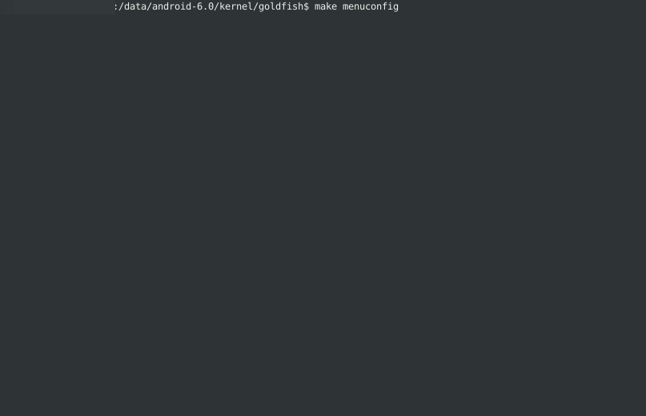

# Android系统Linux内核驱动程序

我们使用一个虚拟的硬件设备，这个设备只有一个4字节的寄存器，它可读可写。Android内核驱动程序和一般Linux内核驱动程序的编写方法是一样的，都是以Linux模块的形式实现的，具体可参考`Linux Device Drivers`一书。

## 准备编译环境

参考：[Android模拟器内核编译](../../build/build-kernel_goldfish.md)

## 修改文件预览

修改完本文所述示例后，其文件修改情况如下：[source code](goldfish)

    kernel/goldfish/
    |-- drivers
    |   |-- Kconfig             [modified]
    |   |-- Makefile            [modified]
    |   `-- helloworld          [new]
    |       |-- Kconfig         [new]
    |       |-- Makefile        [new]
    |       |-- hello.c         [new]
    |       `-- hello.h         [new]
    `-- include
        `-- linux
            `-- proc_fs.h       [modified]

其中`[modified]`表示原始代码树中已经存在，这里做了修改。`[new]`表示原始代码树中没有，是新增的内容

### [hello.h](goldfish/drivers/helloworld/hello.h)

```c
#define HELLO_DEVICE_NODE_NAME  "hello"
#define HELLO_DEVICE_FILE_NAME  "hello"
#define HELLO_DEVICE_PROC_NAME  "hello"
#define HELLO_DEVICE_CLASS_NAME "hello"

struct hello_android_dev {
    int val;
    struct semaphore sem;
    struct cdev dev;
};
```

这个头文件定义了一个字符设备结构体`hello_android_dev`，这个就是我们虚拟的硬件设备了，其中：
* `val`成员变量就代表设备里面的寄存器，其类型为int
* `sem`成员变量是一个信号量，用于同步访问寄存器val
* `dev`成员变量是一个内嵌的字符设备

这是Linux驱动程序自定义字符设备结构体的标准方法

### [hello.c](goldfish/drivers/helloworld/hello.c)

这是驱动程序的实现部分。驱动程序的功能主要是向上层提供访问设备的寄存器的值，包括`读`和`写`。这里，提供了三种访问设备寄存器的方法：

1. 通过`传统的设备文件`的方法来访问
2. 通过`devfs文件系统`来访问
3. 通过`proc文件系统`来访问

下面分段描述该驱动程序的实现。

#### 传统的设备文件
定义传统的设备文件访问方法，主要是定义hello_open、hello_release、hello_read和hello_write这四个打开、释放、读和写设备文件的方法：

```c
static int hello_open(struct inode* inode, struct file* filp);
static int hello_release(struct inode* inode, struct file* filp);
static ssize_t hello_read(struct file* filp, char __user *buf, size_t count, loff_t* f_pos);
static ssize_t hello_write(struct file* filp, const char __user *buf, size_t count, loff_t* f_pos);

/*设备文件操作方法表*/
static struct file_operations hello_fops = {
    .owner = THIS_MODULE,
    .open = hello_open,
    .release = hello_release,
    .read = hello_read,
    .write = hello_write,
};
```

#### devfs文件系统
定义通过devfs文件系统访问方法，这里把设备的寄存器val看成是设备的一个属性，通过读写这个属性来对设备进行访问，主要是实现hello_val_show和hello_val_store两个方法，同时定义了两个内部使用的访问val值的方法__hello_get_val和__hello_set_val：
```c
static ssize_t hello_val_show(struct device* dev, struct device_attribute* attr, char* buf);
static ssize_t hello_val_store(struct device* dev, struct device_attribute* attr, const char* buf, size_t count);

/*定义设备属性*/
static DEVICE_ATTR(val, S_IRUGO | S_IWUSR, hello_val_show, hello_val_store);
```

#### proc文件系统
定义通过proc文件系统访问方法，主要实现了hello_proc_read和hello_proc_write两个方法，同时定义了在proc文件系统创建和删除文件的方法`hello_create_proc`和`hello_remove_proc`(include/linux/proc_fs.h)：
```c
/*读取设备寄存器val的值，保存在page缓冲区中*/
static ssize_t hello_proc_read(char* page, char** start, off_t off, int count, int* eof, void* data);

/*把缓冲区的值buff保存到设备寄存器val中去*/
static ssize_t hello_proc_write(struct file* filp, const char __user *buff, unsigned long len, void* data);

/*创建/proc/hello文件*/
static void hello_create_proc(void) {
    struct proc_dir_entry* entry;

    entry = create_proc_entry(HELLO_DEVICE_PROC_NAME, 0, NULL);
    if (entry) {
        entry->owner = THIS_MODULE;
        entry->read_proc = hello_proc_read;
        entry->write_proc = hello_proc_write;
    }
}

/*删除/proc/hello文件*/
static void hello_remove_proc(void) {
    remove_proc_entry(HELLO_DEVICE_PROC_NAME, NULL);
}
```

## 编译运行
### 修改编译脚本
在hello目录中新增Kconfig和Makefile两个文件，其中Kconfig是在编译前执行配置命令make menuconfig时用到的，而Makefile是执行编译命令make是用到的。

#### [Kconfig](goldfish/drivers/helloworld/Kconfig)

    menuconfig HELLO
        tristate "First Android Driver"
        default n
        help
          This is the first android driver.

在Kconfig文件中，tristate表示编译选项HELLO支持在编译内核时，hello模块支持以模块、内建和不编译三种编译方法，默认是不编译，因此，在编译内核前，我们还需要执行make menuconfig命令来配置编译选项，使得hello可以以模块或者内建的方法进行编译。

#### [Makefile](goldfish/drivers/helloworld/Makefile)

    obj-$(CONFIG_HELLO) += hello.o

在Makefile文件中，根据选项HELLO的值，执行不同的编译方法。

#### [drivers/Kconfig](goldfish/drivers/Kconfig)
在menu "Device Drivers"和endmenu之间添加如下内容。这样，执行make menuconfig时，就可以配置hello模块的编译选项了。

```diff
diff --git a/drivers/Kconfig b/drivers/Kconfig
index a765f40..eab7172 100644
--- a/drivers/Kconfig
+++ b/drivers/Kconfig
@@ -142,4 +142,6 @@ source "drivers/virt/Kconfig"
 
 source "drivers/devfreq/Kconfig"
 
+source "drivers/helloworld/Kconfig"
+
 endmenu
```

#### [drivers/Makefile](goldfish/drivers/Makefile)

```diff
diff --git a/drivers/Makefile b/drivers/Makefile
index b5d2823..1f1c0df 100644
--- a/drivers/Makefile
+++ b/drivers/Makefile
@@ -135,3 +135,4 @@ obj-$(CONFIG_VIRT_DRIVERS)  += virt/
 obj-$(CONFIG_HYPERV)           += hv/
 
 obj-$(CONFIG_PM_DEVFREQ)       += devfreq/
+obj-$(CONFIG_HELLO) += helloworld/
\ No newline at end of file
```

### 配置编译选项

    USER-NAME@MACHINE-NAME:~/Android/kernel/common$ make menuconfig



### 执行编译命令

    $ ARCH=x86;CROSS_COMPILE=x86_64-linux-android-; make -j8
    ...
      BUILD   arch/x86/boot/bzImage
    Setup is 15028 bytes (padded to 15360 bytes).
    System is 3700 kB
    CRC efd2fb41
    Kernel: arch/x86/boot/bzImage is ready  (#9)

    #### make completed successfully (5 seconds) ####

### 运行

    $ emulator -kernel kernel/goldfish/arch/x86/boot/bzImage
    emulator: WARNING: system partition size adjusted to match image file (1280 MB > 200 MB)

    emulator: WARNING: data partition size adjusted to match image file (550 MB > 200 MB)

## 验证

首先确认下当前模拟器运行内核是否刚刚编译生成。
```shell
root@generic_x86:/ # cat /proc/version
Linux version 3.4.67+ (************) (gcc version 4.9 20140827 (prerelease) (GCC) ) #10 PREEMPT Wed Apr 20 17:37:28 CST 2016
```
查看/dev目录下的hello节点

    root@generic_x86:/ # ls /dev/hello
    /dev/hello

查看/proc目录下的hello文件，将`5`写如该文件

    root@generic_x86:/ # ls /proc/hello
    /proc/hello
    root@generic_x86:/ # cat /proc/hello
    0
    root@generic_x86:/ # echo 5 > /proc/hello
    root@generic_x86:/ # cat /proc/hello
    5

查看`/sys/class/hello/hello/`目录的val属性的值，为5。将val属性设置为10，通过/proc/hello查看其值变成了10。

    root@generic_x86:/ # ls /sys/class/hello/hello/
    dev
    power
    subsystem
    uevent
    val
    root@generic_x86:/ # cat /sys/class/hello/hello/val
    5
    root@generic_x86:/ # echo 10 > /sys/class/hello/hello/val
    root@generic_x86:/ # cat /sys/class/hello/hello/val
    10
    root@generic_x86:/ # cat /proc/hello
    10

在这个名为hello的Linux内核驱动程序中，创建了三个不同的文件节点来供用户空间访问，分别是：
1. 传统的设备文件/dev/hello
2. proc系统文件/proc/hello
3. devfs系统属性文件/sys/class/hello/hello/val


## 驱动测试程序
本节介绍通过编写C可执行程序来访问设备文件/dev/hello。

### 修改文件预览

修改完代码后，文件修改情况如下：

    external/helloworld/
    |-- Android.mk
    `-- hello.c

#### hello.c
在hello目录中新建hello.c文件：
```c
#include <stdio.h>
#include <stdlib.h>
#include <fcntl.h>
#define DEVICE_NAME "/dev/hello"
int main(int argc, char** argv)
{
    int fd = -1;
    int val = 0;
    fd = open(DEVICE_NAME, O_RDWR);
    if(fd == -1) {
        printf("Failed to open device %s.\n", DEVICE_NAME);
        return -1;
    }

    printf("Read original value:\n");
    read(fd, &val, sizeof(val));
    printf("%d.\n\n", val);
    val = 5;
    printf("Write value %d to %s.\n\n", val, DEVICE_NAME);
    write(fd, &val, sizeof(val));

    printf("Read the value again:\n");
    read(fd, &val, sizeof(val));
    printf("%d.\n\n", val);
    close(fd);
    return 0;
}
```
这个程序的作用中，打开`/dev/hello`文件，然后先读出`/dev/hello`文件中的值，接着写入值`5`到`/dev/hello`中去，最后再次读出`/dev/hello`文件中的值，看看是否是我们刚才写入的值`5`。从`/dev/hello`文件读写的值实际上就是我们虚拟的硬件的寄存器`val`的值。

### 编译脚本

在hello目录中新建`Android.mk`文件：
```makefile
LOCAL_PATH := $(call my-dir)
include $(CLEAR_VARS)
LOCAL_MODULE_TAGS := optional
LOCAL_MODULE := hello
LOCAL_SRC_FILES := $(call all-subdir-c-files)
include $(BUILD_EXECUTABLE)
```
`BUILD_EXECUTABLE`表示我们要编译的是可执行程序。

### 编译

    $ mmm -B external/helloworld/
    ...
    target Strip: hello (out/target/product/generic_x86/obj/EXECUTABLES/hello_intermediates/hello)
    Install: out/target/product/generic_x86/system/bin/hello
    make: Leaving directory `/data/android-6.0'

### 验证

运行模拟器将`hello`应用程序`push`到模拟器并运行。

    $ adb remount 
    remount succeeded
    $ adb push out/target/product/generic_x86/system/bin/hello /system/bin/
    128 KB/s (5492 bytes in 0.041s)
    $ adb shell
    root@generic_x86:/ # /system/bin/hello                                         
    Read original value:
    0.
    
    Write value 5 to /dev/hello.
    
    Read the value again:
    5.

至此，我们编写的C可执行程序可以访问我们编写的Linux内核驱动程序了。

## 附录A：相关宏

### THIS_MODULE
在module.h 中 THIS_MODULE的定义如下：
```c
extern struct module __this_module;
#define THIS_MODULE (&__this_module)
```
即保存了`__this_module`这个对象的地址，那这个`__this_module`在哪里定义呢？这就要从module的编译说起啦，如果编译过模块就会发现，会生成`*.mod.c`这样的一个文件，打开这个文件，就会发现，类似下面的定义：
```c
struct module __this_module
__attribute__((section(".java.gnu.linkonce.this_module"))) = {
 .name = KBUILD_MODNAME,
 .init = init_module,
#ifdef CONFIG_MODULE_UNLOAD
 .exit = cleanup_module,
#endif
};
```
这个文件是调用`modpost`生成的，`modpost`的`main`中有这样一段代码：
```c
for (mod = modules; mod; mod = mod->next) {
    if (mod->skip)
        continue;

    buf.pos = 0;

    add_header(&buf, mod);
    add_versions(&buf, mod);
    add_depends(&buf, mod, modules);
    add_moddevtable(&buf, mod);
    add_srcversion(&buf, mod);

    sprintf(fname, "%s.mod.c", mod->name);
    write_if_changed(&buf, fname);
}
```
其中的`add_header`就偷偷添加了`__this_module`的定义
```c
static void add_header(struct buffer *b, struct module *mod)
{
    buf_printf(b, "#include <linux/module.h>\n");
    buf_printf(b, "#include <linux/vermagic.h>\n");
    buf_printf(b, "#include <linux/compiler.h>\n");
    buf_printf(b, "\n");
    buf_printf(b, "MODULE_INFO(vermagic, VERMAGIC_STRING);\n");
    buf_printf(b, "\n");
    buf_printf(b, "struct module __this_module\n");
    buf_printf(b, "__attribute__((section(\".java.gnu.linkonce.this_module\"))) = {\n");
    buf_printf(b, " .name = KBUILD_MODNAME,\n");
    if (mod->has_init)
        buf_printf(b, " .init = init_module,\n");
    if (mod->has_cleanup)
        buf_printf(b, "#ifdef CONFIG_MODULE_UNLOAD\n"
                  " .exit = cleanup_module,\n"
                  "#endif\n");
    buf_printf(b, "};\n");
}
```

### Container_of
Container_of在Linux内核中是一个常用的宏，用于从包含在某个结构中的指针获得结构本身的指针，通俗地讲就是通过结构体变量中某个成员的首地址进而获得整个结构体变量的首地址。

Container_of的定义如下：
```c
#define container_of(ptr, type, member) ({      \
const typeof( ((type *)0)->member ) *__mptr = (ptr);    \
(type *)( (char *)__mptr - offsetof(type,member) );})
```

其实它的语法很简单，只是一些指针的灵活应用，它分两步：

1. 首先定义一个临时的数据类型（通过`typeof( ((type *)0)->member )`获得）与`ptr`相同的指针变量`__mptr`，然后用它来保存`ptr`的值。
2. 用`(char *)__mptr`减去`member`在结构体中的偏移量，得到的值就是整个结构体变量的首地址（整个宏的返回值就是这个首地址）。

## 附录B：FAQ
### Compile issues
#### error: 'struct proc_dir_entry' has no member named 'owner'

在编译Android驱动的时候，使用到了`proc_dir_entry`结构体中的owner成员，但是编译的时候，却出现了下面的错误：

    drivers/hello/hello.c:217: error: 'struct proc_dir_entry' has no member named 'owner'
    make[2]: *** [drivers/hello/hello.o] 错误 1
    make[1]: *** [drivers/hello] 错误 2
    make: *** [drivers] 错误 2

由错误信息可以看出`struct proc_dir_entry`结构体中没有找到`owner`的成员。

在`include/linux/proc_fs.h`头文件中发现`struct proc_dir_entry`结构体没有owner成员，在该结构体中添加以下代码：

    struct module *owner;

保存后，重新编译。

#### error: field 'dev' has incomplete type

说明变量`dev`未定义，引入相应的头文件即可。

    #include <linux/cdev.h>

#### error: implicit declaration of function 'init_MUTEX'

`init_MUTEX(&sem)`在新内核里被弃用了。用`sema_init(&sem,1)`进行替换。

#### warning: implicit declaration of function 'write'

缺少函数定义，引入头文件`<unistd.h>`即可。处理该类错误或警告可以查看手册，找到方法所在的头文件，引入当前代码，如：`write`函数所在的头文件为`<unistd.h>`